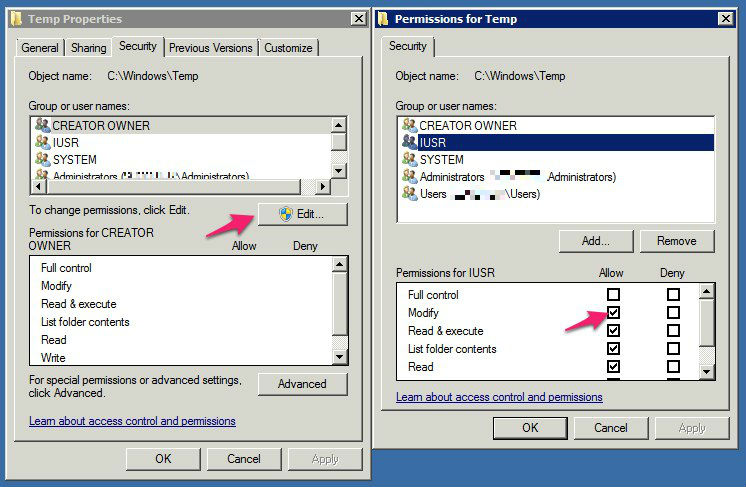

# Install SilverStripe manually on Windows using IIS 7

This guide will step you through installing SilverStripe on Windows using IIS 7.x as the web server and SQL Server 2008 R2 as the database.

You can use this guide to install SilverStripe on the following:

  * Windows Server 2008 or Windows Vista with Service Pack 2 installed
  * Windows Server 2008 R2 or Windows 7

These versions of Windows will **NOT** work with this guide:

  * Windows Server 2003
  * Windows XP

**IMPORTANT**: Windows Server 2003 users should [follow this guide](http://doc.silverstripe.org/installation-on-windows-server-2003-iis-6) to installing SilverStripe.

The goal is to get a good working web server platform so that one or more SilverStripe projects can be easily deployed onto the server using SVN/GIT.

We'll also install SQL Server 2008 R2, and support for connecting to it in PHP.

## Requirements

  * Windows Server 2008 or Windows Vista with Service Pack 2 installed
  * Windows Server 2008 R2 or Windows 7

## Software to install

  * Internet Information Services (IIS) 7.x
  * SQL Server 2008 R2
  * PHP 5.4 (PHP 5.3.2+ also works, but we'll install with the latest PHP stable)
  * SilverStripe 3
  * [Microsoft URL Rewrite Module 2.0](http://www.iis.net/download/URLRewrite)
  * [IIS 7 Administration Pack](http://www.iis.net/download/AdministrationPack) (ONLY required for Windows Vista or Server 2008)
  * [PHP Manager](http://phpmanager.codeplex.com/releases/view/69115)
  * [Microsoft Drivers for PHP for SQL Server 3.0](http://www.microsoft.com/downloads/en/details.aspx?FamilyID=80E44913-24B4-4113-8807-CAAE6CF2CA05&displaylang=en)
  * [Microsoft SQL Server Native Client](http://www.microsoft.com/en-nz/download/details.aspx?id=29065) (ONLY if connecting to SQL Server from PHP)

## Install IIS

IIS 7.x comes with Windows. However, it needs to be installed. Follow these steps:

  * Go to Start > Control Panel > Programs and Features
  * Click **Turn Windows features on or off**. You'll find this under Tasks as a quick link
  * Click **Add Roles** under the Roles Summary section when Server Manager opens
  * Click Next >
  * Check **Web Server (IIS)** (if a popup appears, confirm you want to proceed with the change)
  * Click Next >
  * Check CGI in the list - you'll find find it under Application Development
  * Scroll down and check **IIS Management Scripts and Tools**
  * OPTIONAL: For remote management capability, check **Management Service**

**NOTE**: These instructions are slightly different for Windows Vista and Windows 7. Instead of a Server Manager popup, you'll just get a list of features to enable. Do the same as above except click the **Internet Information Services** checkbox when the Windows Features popup appears and then expand this node and select **CGI** under World Wide Web Services > Application Development Features.

Once the installation is finished, browse to http://localhost in your browser. If an image pops up, then IIS has been installed correctly.

## IIS URL Rewrite Module

  * Go to http://www.iis.net/extensions/URLRewrite
  * Choose x86 or x64, depending on whether you installed a x86 or x64 version of Windows
  * Run the downloaded file to install and enable the URL Rewrite Module

## IIS Administration Pack

**NOTE**: Windows Server 2008 R2 or Windows 7 (IIS 7.5) users can skip this step, as it's already installed!

  * [Download IIS Administration Pack](http://www.iis.net/extensions/AdministrationPack)
  * Run the downloaded file to enable the IIS Administration Pack (make sure it's x86 or x64 depending on your Windows version)

## SQL Server Native Client

This is only required if you're connecting to a SQL Server database.

  * Go to http://www.microsoft.com/en-nz/download/details.aspx?id=29065
  * Scroll down to "Native Client"
  * Choose x86 or x64 depending on whether you installed a x86 or x64 version of Windows
  * Run the downloaded file to install and enable the SQL Server Native Client

## Install SQL Server 2008 R2

SQL Server doesn't come with Windows. It must be separately installed.

You can use any version of SQL Server 2008 R2 or SQL Server 2008 with the latest service pack.

If you don't have a license, there's always [SQL Server 2008 R2 Express](http://www.microsoft.com/express/database/) which is feature complete, but restricted to 10GB per database.

Ensure these features are installed with your copy of SQL Server.

  * SQL Server Replication
  * Full-Text Search
  * Management Tools

Installing SQL Server should be relatively straightforward. Keep a note of the password you create for the "sa" user. We'll need this for later when we connect to the database server via PHP to test connectivity.

### Install PHP

 * Install PHP Manager from http://phpmanager.codeplex.com/releases/view/69115 (choose x86 or x64 depending on your Windows architecture)
 * Download the latest stable PHP 5.4 (VC9, x86) zip from http://windows.php.net/download
 * Extract zip contents to **C:\php**
 * Open PHP Manager in IIS and register **C:\php\php-cgi.exe** to enable PHP for IIS

### Install SQL Server drivers for PHP

This is the PHP extension allowing it to connect to SQL Server databases.

 * Download 3.0 executable from http://www.microsoft.com/download/en/details.aspx?displaylang=en&id=20098
 * Extract contents to a temporary location, such as C:\sqlsrv
 * Copy **php_sqlsrv_54_nts_vc9.dll** to C:\php\ext
 * Rename the file to **php_sqlsrv.dll**
 * Open PHP Manager and go to **Enable or disable an extension**
 * Right click **php_sqlsrv.dll** and hit **Enable**

### Install wincache extension for PHP

This is an op-code cacher which speeds up PHP execution on Windows.

 * Download the latest wincache (for PHP 5.4, x86) from http://www.iis.net/download/wincacheforphp
 * Extract zip contents to a temporary location, such as C:\wincache
 * Copy php_wincache.dll to C:\php\ext
 * Open PHP Manager and go to **Eanble or disable an extension**
 * Right click **php_wincache.dll** and hit **Enable*

### Configuring PHP

 * First of all, restart IIS to apply all changes
 * Go to **Check phpinfo()** PHP Manager
 * Ensure that **wincache** and **sqlsrv** details can be found in the information
 * Go to **Enable or disable an extension** and disable everything, except for these:

	php_curl.dll
	php_gd2.dll
	php_mbstring.dll
	php_sqlsrv.dll
	php_wincache.dll
	php_tidy.dll

 * Go to **Configure error reporting** and check **Development machine**
 * Go to **Manage all settings** and set the following:

	date.timezone = "Pacific/Auckland" (or choose from the list here: http://nz.php.net/manual/en/timezones.php)
	post_max_size = 64M
	memory_limit = 256M
	upload_max_filesize = 64M

Tweak the above values as necessary if your requirements differ.

## Folder permissions for PHP

Now we need to set up folder permissions for PHP. Open the php.ini and find the paths for sessions and file uploads. They will look like this:

	upload_tmp_dir="C:\Windows\Temp"
	session.save_path="C:\Windows\Temp"

Two other important folders to set the permissions on are `assets` and `silverstripe-cache` (if used) in your web root.

You will need to give **Modify** permission to **IUSR** user. To do it right click the folder and choose **Properties**. Then open the security tab, press **Edit** and add the **IUSR** user to the list by clicking the **Add** button. Afterwards tick **Modify** under **Allow** for that user. Repeat these steps for each folder.

## Install SilverStripe

Now that we've got the backend server software sorted out, it's time to install the SilverStripe CMS/framework.

Create a new file called **_ss_environment.php** in **C:\inetpub\wwwroot**

This file tells SilverStripe projects installed on this machine which database server and credentials, as well as anything environment specific.

Inside the newly created _ss_environment.php file, insert the following code:

	<?php
	/* What kind of environment is this: development, test, or live (ie, production)? */
	define('SS_ENVIRONMENT_TYPE', 'dev');
	/* Database connection */
	define('SS_DATABASE_SERVER', 'localhost');
	define('SS_DATABASE_USERNAME', 'sa');
	define('SS_DATABASE_PASSWORD', '');
	/* Configure a default username and password to access the CMS on all sites in this environment */
	define('SS_DEFAULT_ADMIN_USERNAME', 'username');
	define('SS_DEFAULT_ADMIN_PASSWORD', 'password');

Insert the password you created for SQL Server earlier into the **SS_DATABASE_PASSWORD** field that is currently empty.

  * Grab the latest stable version from here: http://www.silverstripe.org/stable-download
  * Extract contents to **C:\inetpub\wwwroot\ss**

After gettng the code installed, make sure you set the folder permissions properly (see *Folder permissions for PHP* above).

## Install the SilverStripe SQL Server module ("mssql")

  * Grab the latest stable version from here: http://www.silverstripe.org/microsoft-sql-server-database/
  * Extract contents to **C:\inetpub\wwwroot\ss\mssql**

## Start SilverStripe installer

Open a browser and point it to http://localhost/ss

If an installation screen shows up, congratulations! We're very close now.

Fill out the details correctly and press "Install SilverStripe".

If all goes to plan, you're done, and you should see a basic template with a few sample pages.

## Configuring PHP and IIS for production environments

**TODO**: Describe turning off PHP errors, and setting up static 404 and 500 error pages instead of giving detailed errors. Finally setting up a specific database user that isn't sa with restricted permissions.

## Troubleshooting

**Q: How do I debug the IIS 500 Server error "The FastCGI process exited unexpectedly"?**

**A:** This is a very annoying error - basically it means PHP has caused a segmentation fault, probably through itself or one of it's extensions. It's very hard to track down exactly why these errors occur, but there's a few things you can do.

Most of the time, it's caused by a loaded PHP extension that is broken.

  * Have you set up the MSSQL database details correctly in _ss_environment.php?
  * Have you made IIS expose errors? (see "How do I make IIS expose errors..." below)
  * Are you running non-standard PHP extensions? If so, try unloading them one by one
  * Make sure you're using the latest [[http://www.microsoft.com/downloads/en/details.aspx?FamilyID=80E44913-24B4-4113-8807-CAAE6CF2CA05&displaylang=en/|Microsoft Drivers for PHP for SQL Server]]

**Q: I get the error "HTTP Error 500.0 - Internal Server Error - C:\Program Files (x86)\PHP\php-cgi.exe - The FastCGI process exceeded configured request timeout"**

**A:** A script has been running for a long time, such as a unit test. To fix this, you'll need to increase the request timeout to a higher value in both IIS and PHP. Refer to the IIS FastCGI configuration documentation and PHP configuration parts of this document for where to change the appropriate values.

**Q: I cannot access SQL Server from a remote server, such as a development environment**

**A:** This is because the firewall settings on the server hosting SQL Server 2008 are too strict - you need to tweak the firewall to accept incoming connections.

Do the following to open a firewall port:

  * In Control Panel, open Windows Firewall
  * Click Allow a program through Windows Firewall
  * Click the Exceptions tab, and then click Add Port
  * In the Add a Port dialog box, in the Name field, enter SQL Server
  * In the Port number box, type the port number of the instance of the Database Engine, such as 1433 for the default instance
  * Verify that **TCP** is selected, and then click OK

To open the port to expose the SQL Server Browser service, click Add Port, type SQL Server Browser in the Name text box, type **1434** in the Port Number text box, select **UDP**, and then click OK

And then verify TCP/IP access is enabled:

  * Open SQL Server Configuration Manager
  * In the node "Protocols for MSSQLSERVER" (or for your instance name) verify TCP/IP is **Enabled**
  * Restart SQL Server if protocol changes were made

**Q: When I try running the unit tests, I get this error: "Uncaught Zend_Cache_Exception: cache_dir is not writable"**

**A:** Sometimes you can't access the TEMP folder because the current user doesn't have permission.

The solution is to create a **silverstripe-cache** directory in your project directory. For example, inside **C:\inetpub\wwwroot\silverstripe**. Do the following:

  * Create a **silverstripe-cache** directory in the directory where you installed SilverStripe
  * Right click the newly created directory, and select the Security tab
  * Click the Edit button
  * Click the Users item in the list, and then click the Modify checkbox
  * Click Apply - accept the warning that is given
  * Click OK

NOTE: When **fastcgi.impersonate = 1** is set in php.ini, the current user logged in on the domain will be the user the web server runs PHP scripts under e.g "sharvey" if Windows Authentication is enabled. If nobody is logged in, and someone accesses the site anonymously, the web server will run under the "IUSR" credentials.

To find out who the current user is, try echoing the result of get_current_user() inside a test php script.

**Q: When I try to access my SilverStripe site for the first time, I get a 404 error**

**A:** Try accessing dev/build?username=admin&password=password at the end of the URL you requested. For example, http://localhost/ss/dev/build?username=admin&password=password. This will ensure the database is built properly

**Q: How do I make IIS expose errors instead of giving a generic 500 or 404 page?**

**A:** In IIS manager, double click Error Pages for the top level server node on the left. You'll be presented with a list of status codes, and a path to the error page. To show detailed errors remotely AND locally, click Edit Feature Settings on the right panel under Actions. From the dialog box that pops up, select Detailed errors. Restart IIS for the changes to take effect. This also means that from now on, the custom error pages SilverStripe generate will be used instead of the default IIS one.

Also, make sure that display_errors, display_startup_errors and html_errors in are set to On in php.ini.

**Q: I get a 500 server error when trying to access the SilverStripe site. e.g. http://localhost/ss**

**A:** One of the reasons why this could be happening is the web.config file inside the ss directory has XML that is not well formed. Make sure there are NO spaces before the starting <?xml> tag, and make sure that everything is tabbed out correctly.

One other thing you can do is make sure Show friendly HTTP error messages is unchecked in Internet Explorer. You can find this in Tools > Internet Options > Advanced.

Make sure errors are exposed by following the troubleshooting question above "How do I make IIS expose errors..."

If this still doesn't help, enable Failed Request Tracing in IIS. You could also try using DebugView, a useful debugging tool for Windows.

**Q: I get an error about SQL Server Driver for PHP requiring "SQL Server 2008 Native Client ODBC Driver (SP1 or later)"**

**A:** If you're accessing a SQL Server database that's on another server, you need to install SQL Server 2008 Native Client on the client web server that accesses the external database server.

**Q: When I try to load the CMS, the SilverStripe logo stays there and the CMS doesn't load.**

**A:** Make sure the assets directory exists, and is writable by the web server. This happens on test/live mode because SilverStripe will try to combine the javascript files, and put them in the assets directory. If it's not writable, or doesn't exist, then the CMS will fail to load.

**Q: Performance of SilverStripe is slow on Windows.**

**A:** A non-thread safe of PHP is recommended for use with IIS. Thread safety checks are not required, and you'll get a performance boost by not using a thread safe version. If possible, use a version compiled in VC9 instead of VC6. VC9 versions require you to have the [Microsoft 2008 C++ Runtime (x86)](http://www.microsoft.com/downloads/details.aspx?FamilyID=9B2DA534-3E03-4391-8A4D-074B9F2BC1BF) or the [Microsoft 2008 C++ Runtime (x64)](http://www.microsoft.com/downloads/details.aspx?familyid=bd2a6171-e2d6-4230-b809-9a8d7548c1b6&displaylang=en) installed

You should also ensure you are using the latest version of the [Microsoft Drivers for PHP for SQL Server](http://www.microsoft.com/downloads/en/details.aspx?FamilyID=80E44913-24B4-4113-8807-CAAE6CF2CA05&displaylang=en) driver.
If possible, you should also use PHP 5.4 which provides performance improvements over 5.2 and 5.3.

Try increasing the IIS **MaxInstances** in IIS Manager > FastCGI from 4 to a higher value. For quad core CPUs, a higher value such as **32** should prove to provide a performance enhancement.

You can also [install wincache](http://learn.iis.net/page.aspx/678/use-the-windows-cache-extension-for-php/), to improve performance on live sites.

You can also try installing and enabling static content compression for IIS on live sites. Do this in IIS Manager > Compression.

Doing all of the above should provide a significant performance boost to your site.

**Q: I can upload files, but I get server error when downloading them.**

**Q: I get a lot of stale session files - garbage collector seems not running.**

**A:** This is because of the permissions being incorrectly configured on the temporary upload or session storage folders that the PHP uses. See *Folder permissions for PHP* section for how to configure this correctly.
