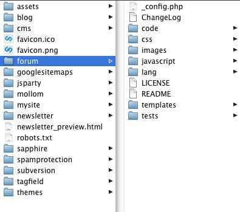

# Directory Structure

## Introduction

The directory-structure in SilverStripe it built on "convention over configuration", so the placement of some files and
directories is meaningful to its logic.
 
## Core Structure

Directory   | Description
---------   | -----------
`assets/`   | Contains images and other files uploaded via the SilverStripe CMS. You can also place your own content inside it, and link to it from within the content area of the CMS.
`cms/`      | Contains all the files that form the CMS area of your site. It’s structure is similar to the mysite/ directory, so if you find something interesting, it should be easy enough to look inside and see how it was built. 
`framework/` | The framework that builds both your own site and as the CMS that powers it. You’ll be utilising files in this directory often, both directly and indirectly.

## Custom Code Structure

We're using `<mysite>` as an example - arbitrary directory-names are allowed, as long as they don't collide with
existing modules or the directories lists in "Core Structure".

 | Directory           | Description                                                         | 
 | ---------           | -----------                                                         | 
 | `<mysite>/`           | This directory contains all of your code that defines your website. | 
 | `<mysite>/_config`    | YAML configuration specific to  your application                    | 
 | `<mysite>/code`       | PHP code for model and controller (subdirectories are optional)     | 
 | `<mysite>/templates`  | HTML [templates](/developer_guides/templates) with *.ss-extension                     | 
 | `<mysite>/css `       | CSS files                                                           | 
 | `<mysite>/images `    | Images used in the HTML templates                                   | 
 | `<mysite>/javascript` | Javascript and other script files 

## Themes Structure

 | `themes/simple/`      | Standard "simple" theme                                         |
 | ------------------        | ---------------------------                                         | 
 | `themes/yourtheme/`       | The themes folder can contain more than one theme - here's your own |

See [themes](/developer_guides/templates/themes)

## Module Structure		{#module_structure}

Modules are currently top-level folders that have a `_config.php` file or a `_config/` directory present.
They should follow the same conventions as posed in "Custom Site Structure"

Example Forum:

 | Directory  | Description                                                         | 
 | ---------  | -----------                                                         | 
 | `forum/`     | This directory contains all of your code that defines your website. | 
 | `forum/code` | PHP code for model and controller (subdirectories are optional)     | 
 | ...        | ...                                                                 | 

### Module documentation

Module developers can bundle developer documentation with their code by producing
plain text files inside a 'docs' folder located in the module folder. These files
can be written with the Markdown syntax (See [Contributing Documentation](/contributing/documentation))
and include media such as images or videos.

Inside the docs folder, developers should organise the markdown files into each 
separate language they wish to write documentation for (usually just `en`). Inside 
each languages' subfolder, developers then have freedom to create whatever structure 
they wish for organising the documentation they wish.

Example Forum Documentation:

 | Directory  | Description                                                         | 
 | ---------  | -----------                                                         | 
 | `forum/docs` | The docs folder will be picked up by the documentation viewer. | 
 | `forum/docs/_manifest_exclude` | Empty file to signify that SilverStripe does not need to load classes from this folder |
 | `forum/docs/en/`       | English documentation  | 
 | `forum/docs/en/index.md`	| Documentation homepage. Should provide an introduction and links to remaining docs |
 | `forum/docs/en/Getting_Started.md` | Documentation page. Naming convention is Uppercase and underscores. |
 | `forum/docs/en//_images/` | Folder to store any images or media |
 | `forum/docs/en/Some_Topic/` | You can organise documentation into nested folders. Naming convention is Uppercase and underscores. |
|`forum/docs/en/04_Some_Topic/00_Getting_Started.md`|Structure is created by use of numbered prefixes. This applies to nested folders and documentations pages, index.md should not have a prefix.|

## Autoloading

SilverStripe recursively detects classes in PHP files by building up a manifest used for autoloading,
as well as respecting Composer's built-in autoloading for libraries. This means
in most cases, you don't need to worry about include paths or `require()` calls
in your own code - after adding a new class, simply regenerate the manifest
by using a `flush=1` query parameter. See the ["Manifests" documentation](/developer_guides/execution_pipeline/manifests) for details.

## Best Practices

### Making /assets readonly
See [Secure coding](/developer_guides/security/secure_coding#filesystem)
