title: Extending a basic site
summary: Building on tutorial 1, a look at storing data in SilverStripe and creating a latest news feed.

# Tutorial 2 - Extending a basic site

## Overview

In the [first tutorial (Building a basic site)](/tutorials/building_a_basic_site) we learnt how to create a basic site using SilverStripe. This tutorial will build on that, and explore extending SilverStripe by creating our own page types. After doing this we should have a better understanding of how SilverStripe works.

## What are we working towards?

We are going to work on adding two new sections to the site we built in the first tutorial. 

The first of these new sections will be *News*, with a recent news listing on the homepage and an RSS feed: 

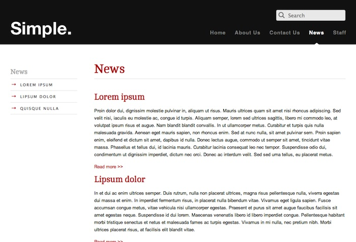

The second will be a *Staff* section, to demonstrate more complex database structures (such as associating an image with each staff member):

## The SilverStripe data model

A large part of designing complex SilverStripe sites is the creation of our own page types. Before we progress any further, it is important to understand what a page type is and how the SilverStripe data model works.

SilverStripe is based on the **"Model-View-Controller"** design pattern. This means that SilverStripe attempts to separate data, logic and presentation as much as possible. Every page has three separate parts which are combined to give you the
final page. Lets look at each one individually:

### Model

All content on our site is stored in a database. Each class that is a child of the `[api:DataObject]` class will have its own table in our database. 

Every object of such a class will correspond to a row in that table -
this is our "data object", the **"model"** of Model-View-Controller. A page type has a data object that represents all the data for our page. Rather than inheriting 
directly from `[api:DataObject]`, it inherits from `[api:SiteTree]`.  We generally create a "Page" data object, and subclass this for all other page types. This allows us to define behavior that is consistent across all pages in our site.

### View

The **"view"** is the presentation of our site. As we have already seen, the templates SilverStripe uses to render a page are dependent on the page type. Using templates and css, we are able to have full control over the
presentation of our website.

### Controller

Each page type also has a **"controller"**. The controller contains all the code used to manipulate our data before it is rendered. For example, suppose we were making an auction site, and we only wanted to display the auctions closing in the next ten minutes. We would implement this logic in the controller. The controller for a page should inherit from `[api:ContentController]`. Just as we create a "Page" data object and subclass it for the rest of the site, we also create a "Page_Controller" that is subclassed.

Creating a new page type requires creating each of these three elements. We will then have full control over presentation, the database, and editable CMS fields. 

A more in-depth introduction of Model-View-Controller can be found
[here](http://www.slash7.com/articles/2005/02/22/mvc-the-most-vexing-conundrum).

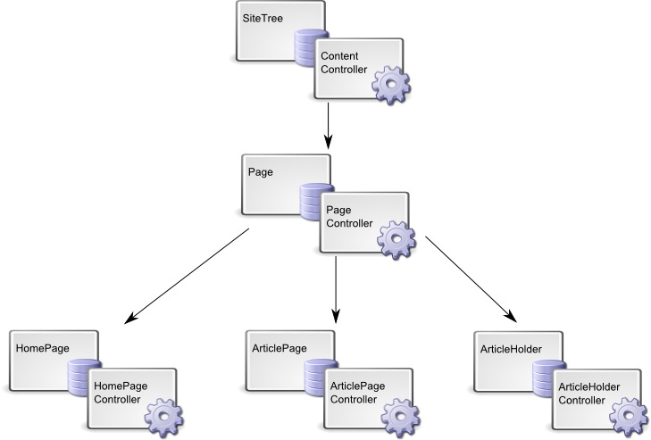

## Creating the news section page types

To create a News section we'll need two new page types. The first one is obvious: we need an *ArticlePage* page type. The second is a little less obvious: we need an *ArticleHolder* page type to contain our article pages.

We'll start with the *ArticlePage* page type. First we create the model, a class called "ArticlePage". We put the *ArticlePage* class into a file called "ArticlePage.php" inside *mysite/code*. All other classes relating to *ArticlePage* should be placed within "ArticlePage.php", this includes our controller (*ArticlePage_Controller*). 

**mysite/code/ArticlePage.php**

	:::php
	<?php
	class ArticlePage extends Page {
	}
	class ArticlePage_Controller extends Page_Controller {
	}
	 

Here we've created our data object/controller pair, but we haven't extended them at all. SilverStripe will use the template for the *Page* page type as explained in the first tutorial, so we don't need
to specifically create the view for this page type.

Let's create the *ArticleHolder* page type.

**mysite/code/ArticleHolder.php**

	:::php
	<?php
	class ArticleHolder extends Page {
		private static $allowed_children = array('ArticlePage');
	}
	class ArticleHolder_Controller extends Page_Controller {
	}

Here we have done something interesting: the *$allowed_children* field. This is one of a number of static fields we can define to change the properties of a page type. The *$allowed_children* field is an array of page types that are allowed
to be children of the page in the site tree. As we only want **news articles** in the news section, we only want pages of the type *ArticlePage* as children. We can enforce this in the CMS by setting the *$allowed_children* field within this class.

We will be introduced to other fields like this as we progress; there is a full list in the documentation for `[api:SiteTree]`.

Now that we have created our page types, we need to let SilverStripe rebuild the database: [http://localhost/your_site_name/dev/build](http://localhost/your_site_name/dev/build). SilverStripe should detect that there are two new page types, and add them to the list of page types in the database.

It is SilverStripe convention to suffix general page types with "Page", and page types that hold other page types with
"Holder". This is to ensure that we don't have URLs with the same name as a page type; if we named our *ArticleHolder*
page type "News", it would conflict with the page name also called "News".

## Adding date and author fields

Now that we have an *ArticlePage* page type, let's make it a little more useful. We can use
the $db array to add extra fields to the database. It would be nice to know when each article was posted, and who posted
it. Add a *$db* property definition in the *ArticlePage* class:

	:::php
	<?php
	class ArticlePage extends Page {
		private static $db = array(
			'Date' => 'Date',
			'Author' => 'Text'
		);
	
		// .....
	}

Every entry in the array is a *key => value* pair. The **key** is the name of the field, and the **value** is the type. See ["data types and casting"](/developer_guides/model/data_types_and_casting) for a complete list of types.

The names chosen for the fields you add must not already be used. Be careful using field names such as Title,
Content etc. as these may already be defined in the page types your new page is extending from.

When we rebuild the database, we will see that the *ArticlePage* table has been created. Even though we had an *ArticlePage* page type before, a table was not created because there were no fields unique to the article page type. There are now extra fields in the database, but still no way of changing them. 

To add our new fields to the CMS we have to override the *getCMSFields()* method, which is called by the CMS when it creates the form to edit a page. Add the method to the *ArticlePage* class.

	:::php
	<?php
	class ArticlePage extends Page {
		// ...
		
		public function getCMSFields() {
			$fields = parent::getCMSFields();
			
			$dateField = new DateField('Date');
			$dateField->setConfig('showcalendar', true);
			$fields->addFieldToTab('Root.Main', $dateField, 'Content');
			$fields->addFieldToTab('Root.Main', new TextField('Author'), 'Content');
			
			return $fields;
		}
	}
	
	// ...

Let's walk through this method.

	:::php
	$fields = parent::getCMSFields();

Firstly, we get the fields from the parent class; we want to add fields, not replace them. The *$fields* variable
returned is a `[api:FieldList]` object.

	:::php
	$fields->addFieldToTab('Root.Main', new TextField('Author'), 'Content');
	$fields->addFieldToTab('Root.Main', new DateField('Date'), 'Content');

We can then add our new fields with *addFieldToTab*. The first argument is the tab on which we want to add the field to:
"Root.Main" is the tab which the content editor is on. The second argument is the field to add; this is not a database field, but a `[api:FormField]` - see the documentation for more details. 

Note: By default, the CMS only has one tab. Creating new tabs is much like adding to existing tabs. For instance: `$fields->addFieldToTab('Root.NewTab', new TextField('Author'));`
would create a new tab called "New Tab", and a single "Author" textfield inside.

We have added two fields: A simple `[api:TextField]` and a `[api:DateField]`.   
There are many more fields available in the default installation, listed in ["form field types"](/developer_guides/forms/fields/common_subclasses).

	:::php
	return $fields;

Finally, we return the fields to the CMS. If we flush the cache (by adding ?flush=1 at the end of the URL), we will be able to edit the fields in the CMS.

Now that we have created our page types, let's add some content. Go into the CMS and create an *ArticleHolder* page named "News", then create a few *ArticlePage*'s within it.

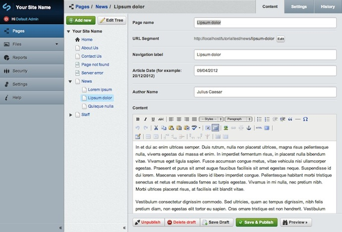

##  Modifying the date field

At the moment, your date field will look just like a text field. 
This makes it confusing and doesn't give the user much help when adding a date. 

To make the date field a bit more user friendly, you can add a dropdown calendar, set the date format and add a better title. By default,
the date field will have the date format defined by your locale.

	:::php
	<?php
	class ArticlePage extends Page {
	
	// .....
	
	public function getCMSFields() {
		$fields = parent::getCMSFields();
		
		$dateField = new DateField('Date', 'Article Date (for example: 20/12/2010)');
		$dateField->setConfig('showcalendar', true);
		$dateField->setConfig('dateformat', 'dd/MM/YYYY');
        	
		$fields->addFieldToTab('Root.Main', $dateField, 'Content');
		$fields->addFieldToTab('Root.Main', new TextField('Author', 'Author Name'), 'Content');

		return $fields;
	}

Let's walk through these changes.

	:::php
	$dateField = new DateField('Date', 'Article Date (for example: 20/12/2010)');

*$dateField* is declared in order to change the configuration of the DateField.

	:::php
	$dateField->setConfig('showcalendar', true);

By enabling *showCalendar* you show a calendar overlay when clicking on the field. 

	:::php
	$dateField->setConfig('dateformat', 'dd/MM/YYYY');

*dateFormat* allows you to specify how you wish the date to be entered and displayed in the CMS field.  See the `[api:DateField]` documentation for more configuration options.

	:::php
	$fields->addFieldToTab('Root.Main', new TextField('Author', 'Author Name'), 'Content');

By default the field name *'Date'* or *'Author'* is shown as the title, however this might not be that helpful so to change the title, add the new title as the second argument.

##  Creating the templates

Because our new pages inherit their templates from *Page*, we can view anything entered in the content area when navigating to these pages on our site. However, as there is no reference to the date or author fields in the *Page* template this data is not being displayed.

To fix this we will create a template for each of our new page types. We'll put these in *themes/simple/templates/Layout* so we only have to define the page specific parts: SilverStripe will use *themes/simple/templates/Page.ss* for the basic
page layout.

### ArticlePage Template
First, the template for displaying a single article:

**themes/simple/templates/Layout/ArticlePage.ss**

	:::ss
	<% include SideBar %>
	

		<article>
			<h1>$Title</h1>
			

				
Posted on $Date.Nice by $Author

			

			
$Content

		</article>
			$Form
	

Most of the code is just like the regular Page.ss, we include an informational div with the date and the author of the Article.

To access the new fields, we use *$Date* and *$Author*. In fact, all template variables and page controls come from either the data object or the controller for the page being displayed. The *$Title* variable comes from the *Title* field of the `[api:SiteTree]` class. *$Date* and *$Author* come from the *ArticlePage* table through your custom Page. *$Content* comes from the *SiteTree* table through the same data object. The data for your page is
spread across several tables in the database matched by id - e.g. *Content* is in the *SiteTree* table, and *Date* and
*Author* are in the *ArticlePage* table. SilverStripe matches this data, and collates it into a single data object.

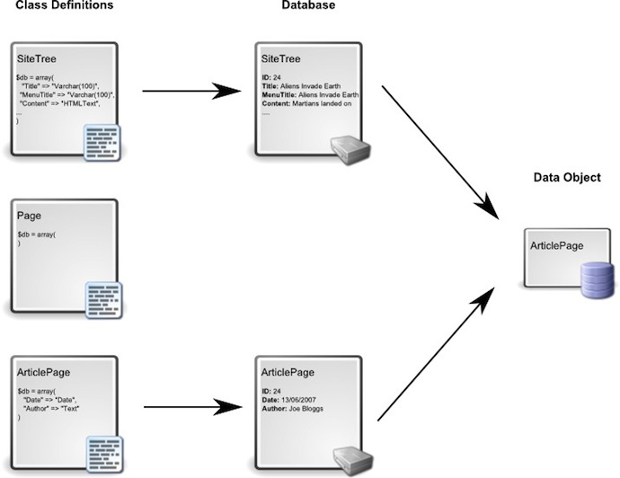

Rather than using *$Date* directly, we use *$Date.Nice*. If we look in the `[api:Date]` documentation, we can see
that the *Nice* function returns the date in *dd/mm/yyyy* format, rather than the *yyyy-mm-dd* format stored in the
database.

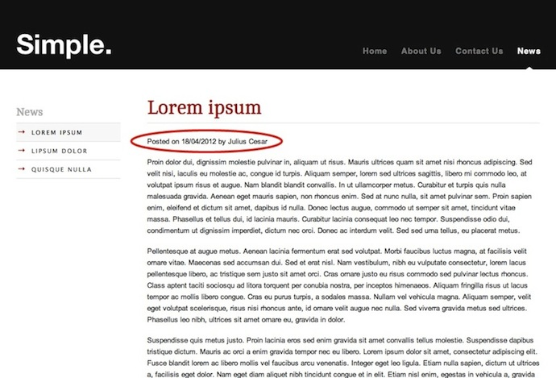

###ArticleHolder Template
We'll now create a template for the article holder. We want our news section to show a list of news items, each with a summary and a link to the main article (our Article Page).

**themes/simple/templates/Layout/ArticleHolder.ss**

	:::ss
	<% include SideBar %>
	
  
		<article>
			<h1>$Title</h1>
			$Content        
			
$Content

		</article>
		<% loop $Children %>
			<article>
				<h2><a href="$Link" title="Read more on &quot;{$Title}&quot;">$Title</a></h2>
				
$Content.FirstParagraph

				<a href="$Link" title="Read more on &quot;{$Title}&quot;">Read more &gt;&gt;</a>
			</article>
		<% end_loop %>
			$Form
	

Here we use the page control *Children*. As the name suggests, this control allows you to iterate over the children of a page. In this case, the children are our news articles. The *$Link* variable will give the address of the article which we can use to create a link, and the *FirstParagraph* function of the `[api:HTMLText]` field gives us a nice summary of the article. The function strips all tags from the paragraph extracted.

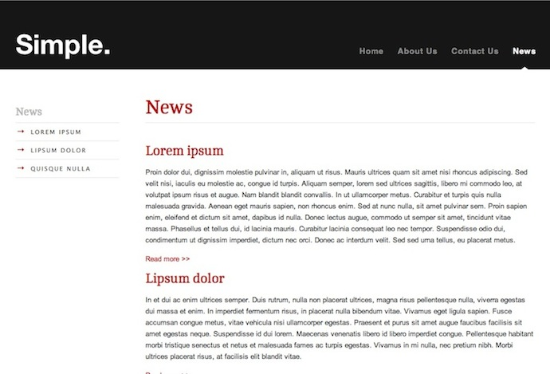

### Using include files in templates

We can make our templates more modular and easier to maintain by separating commonly-used components in to *include files*.  We are already familiar with the `<% include Sidebar %>` line from looking at the menu in the [first tutorial (Building a basic site)](../tutorials/building_a_basic_site).

We'll separate the display of linked articles as we want to reuse this code later on.

Cut the code between "loop Children" in *ArticleHolder.ss** and replace it with an include statement:

**themes/simple/templates/Layout/ArticleHolder.ss**

	:::ss
	...
	<% loop $Children %>
		<% include ArticleTeaser %>
	<% end_loop %>
	...

Paste the code that was in ArticleHolder into a new include file called ArticleTeaser.ss:

**themes/simple/templates/Includes/ArticleTeaser.ss**

	:::ss
	<article>
		<h2><a href="$Link" title="Read more on &quot;{$Title}&quot;">$Title</a></h2>
		
$Content.FirstParagraph

		<a href="$Link" title="Read more on &quot;{$Title}&quot;">Read more &gt;&gt;</a>
	</article>
		
### Changing the icons of pages in the CMS

Now let's make a purely cosmetic change that nevertheless helps to make the information presented in the CMS clearer.
Add the following field to the *ArticleHolder* and *ArticlePage* classes:

	:::php
	private static $icon = "cms/images/treeicons/news-file.gif";

And this one to the *HomePage* class:

	:::php
	private static $icon = "cms/images/treeicons/home-file.png";

This will change the icons for the pages in the CMS. 

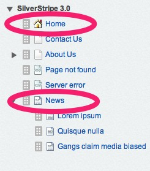

Note: The `news-file` icon may not exist in a default SilverStripe installation. Try adding your own image or choosing a different one from the `treeicons` collection.

## Showing the latest news on the homepage

It would be nice to greet page visitors with a summary of the latest news when they visit the homepage. This requires a little more code though - the news articles are not direct children of the homepage, so we can't use the *Children* control. We can get the data for news articles by implementing our own function in *HomePage_Controller*.

**mysite/code/HomePage.php**

	:::php
	// ...
	public function LatestNews($num=5) {
		$holder = ArticleHolder::get()->First();
		return ($holder) ? ArticlePage::get()->filter('ParentID', $holder->ID)->sort('Date DESC')->limit($num) : false;
	}

This function simply runs a database query that gets the latest news articles from the database. By default, this is five, but you can change it by passing a number to the function. See the [Data Model and ORM](/developer_guides/model/data_model_and_orm) documentation for details. We can reference this function as a page control in our *HomePage* template:

**themes/simple/templates/Layout/Homepage.ss**

	:::ss
	<!-- ... -->
	
$Content

	</article>
	<% loop $LatestNews %>
		<% include ArticleTeaser %>
	<% end_loop %>

When SilverStripe comes across a variable or page control it doesn't recognize, it first passes control to the controller. If the controller doesn't have a function for the variable or page control, it then passes control to the data object. If it has no matching functions, it then searches its database fields. Failing that it will return nothing.

The controller for a page is only created when page is actually visited, while the data object is available when the page is referenced in other pages, e.g. by page controls. A good rule of thumb is to put all functions specific to the page currently being viewed in the controller; only if a function needs to be used in another page should you put it in the data object.

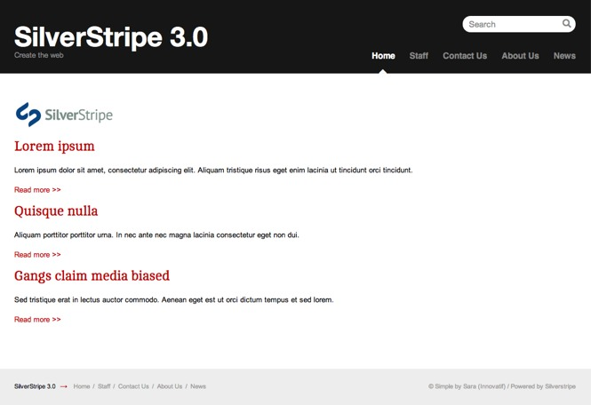

## Creating a RSS feed

An RSS feed is something that no news section should be without. SilverStripe makes it easy to create RSS feeds by providing an `[api:RSSFeed]` class to do all the hard work for us. Add the following in the *ArticleHolder_Controller* class:

**mysite/code/ArticleHolder.php**

	:::php
	private static $allowed_actions = array( 
		'rss' 
	);

	public function rss() {
		$rss = new RSSFeed($this->Children(), $this->Link(), "The coolest news around");
		return $rss->outputToBrowser();
	}

Ensure that when you have input the code to implement an RSS feed; flush the webpage afterwards
(add ?flush=all on the end of your URL). This is because allowed_actions has changed.

This function creates an RSS feed of all the news articles, and outputs it to the browser. If we go to [http://localhost/your_site_name/news/rss](http://localhost/your_site_name/news/rss) we should see our RSS feed. When there is more to a URL after a page's base URL, "rss" in this case, SilverStripe will call the function with that name on the controller if it exists.

Depending on your browser, you should see something like the picture below. If your browser doesn't support RSS, you will most likely see the XML output instead. For more on RSS, see `[api:RSSFeed]`

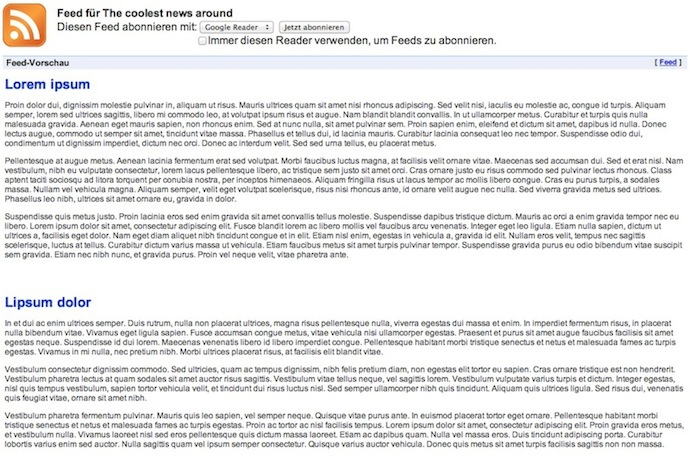

Now all we need is to let the user know that our RSS feed exists. Add this function to *ArticleHolder_Controller*:

**mysite/code/ArticleHolder.php**

	:::php
	public function init() {
		RSSFeed::linkToFeed($this->Link() . "rss");	
		parent::init();
	}

This automatically generates a link-tag in the header of our template. The *init* function is then called on the parent class to ensure any initialization the parent would have done if we hadn't overridden the *init* function is still called. Depending on your browser, you can see the RSS feed link in the address bar.

## Adding a staff section

Now that we have a complete news section, let's take a look at the staff section. We need to create *StaffHolder* and *StaffPage* page types, for an overview on all staff members and a detail-view for a single member. First let's start with the *StaffHolder* page type.

**mysite/code/StaffHolder.php**

	:::php
	<?php
	
	class StaffHolder extends Page {
		private static $db = array();
		private static $has_one = array();
		private static $allowed_children = array('StaffPage');
	}
	
	class StaffHolder_Controller extends Page_Controller {
		
	}

Nothing here should be new. The *StaffPage* page type is more interesting though. Each staff member has a portrait image. We want to make a permanent connection between this image and the specific *StaffPage* (otherwise we could simply insert an image in the *$Content* field).

**mysite/code/StaffPage.php**

	:::php
	<?php
	class StaffPage extends Page {
		private static $db = array(
		);
		private static $has_one = array(
			'Photo' => 'Image'
		);
		
		public function getCMSFields() {
			$fields = parent::getCMSFields();
			
			$fields->addFieldToTab("Root.Images", new UploadField('Photo'));
			
			return $fields;
		}
	}
	
	class StaffPage_Controller extends Page_Controller {
	}

Instead of adding our *Image* as a field in *$db*, we have used the *$has_one* array. This is because an *Image* is not a simple database field like all the fields we have seen so far, but has its own database table. By using the *$has_one* array, we create a relationship between the *StaffPage* table and the *Image* table by storing the id of the respective *Image* in the *StaffPage* table.

We then add an `[api:UploadField]` in the *getCMSFields* function to the tab "Root.Images". Since this tab doesn't exist,
the *addFieldToTab* function will create it for us. The *UploadField* allows us to select an image or upload a new one in
the CMS.

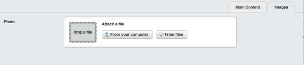

Rebuild the database ([http://localhost/your_site_name/dev/build](http://localhost/your_site_name/dev/build)) and open the CMS. Create
a new *StaffHolder* called "Staff", and create some *StaffPage*s in it.

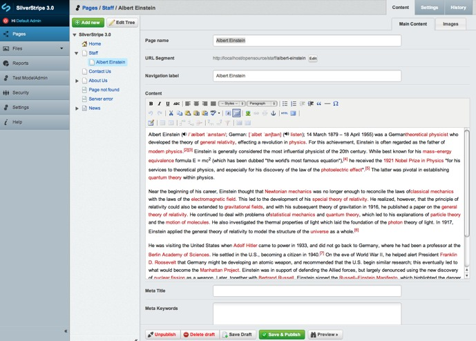

### Creating the staff section templates

The staff section templates aren't too difficult to create, thanks to the utility methods provided by the `[api:Image]` class.

**themes/simple/templates/Layout/StaffHolder.ss**

	:::ss
	<% include SideBar %>
	

		<article>
			<h1>$Title</h1>
			$Content        
			
$Content

		</article>
		<% loop $Children %>
			<article>
				<h2><a href="$Link" title="Read more on &quot;{$Title}&quot;">$Title</a></h2>
				$Photo.SetWidth(150)
				
$Content.FirstParagraph

				<a href="$Link" title="Read more on &quot;{$Title}&quot;">Read more &gt;&gt;</a>
			</article>
		<% end_loop %>
			$Form
	

This template is very similar to the *ArticleHolder* template. The *SetWidth* method of the `[api:Image]` class
will resize the image before sending it to the browser. The resized image is cached, so the server doesn't have to
resize the image every time the page is viewed.

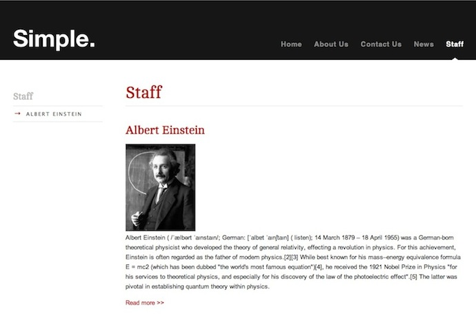

The *StaffPage* template is also very straight forward.

**themes/simple/templates/Layout/StaffPage.ss**

	:::ss
	<% include SideBar %>
	

		<article>
			<h1>$Title</h1>
			

				$Photo.SetWidth(433)
				$Content

		</article>
			$Form
	

Here we use the *SetWidth* method to get a different sized image from the same source image. You should now have
a complete staff section.

## Summary

In this tutorial we have explored the concept of page types. In the process of creating and extending page types we have covered many of the concepts required to build a site with SilverStripe.

[Next Tutorial >>](/tutorials/forms)
