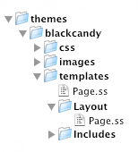

title: Themes
summary: What makes up a SilverStripe Theme. How to install one or write your own theme. 

# Themes

Themes can be used to kick start your SilverStripe projects, can be stored outside of your application code and your
application can provide multiple unique themes (i.e a mobile theme).

## Downloading

Head to the [ Themes ](http://www.silverstripe.org/themes) area of the website to check out the range of themes the 
community has built. Each theme has a page with links you can use to preview and download it. The theme is provided
as a .tar.gz file.

## Installation

### Manually

Unpack the contents of the zip file you download into the `themes` directory in your SilverStripe installation. The
theme should be accessible at `themes/theme_name`.

### Via Composer

If a theme has `composer` support you can require it directly through `composer`.

	:::bash
	composer require "author/theme_name" "dev/master"

As you've added new files to your SilverStripe installation, make sure you clear the SilverStripe cache by appending
`?flush=1` to your website URL (e.g http://yoursite.com/?flush=1).

After installing the files through either method, update the current theme in SilverStripe. This can be done by 
either altering the `SSViewer.theme` setting in a [config.yml](../configuration) or by changing the current theme in 
the Site Configuration panel (http://yoursite.com/admin/settings)

**mysite/_config/app.yml**
	:::yml
	SSViewer:
	  theme: theme_name

## Developing your own theme

A `theme` within SilverStripe is simply a collection of templates and other front end assets such as javascript and css.
located within the `themes` directory. 

## Submitting your theme to SilverStripe

If you want to submit your theme to the SilverStripe directory then check

* You should ensure your templates are well structured, modular and commented so it's easy for other people to customize 
*  Templates should not contain text inside images and all images provided must be open source and not break any 
copyright or license laws. This includes any icons your template uses.
*  A theme does not include any PHP files. Only CSS, HTML, Images and javascript.

Your theme file must be in a .tar.gz format. A useful tool for this is - [7 Zip](http://www.7-zip.org/). Using 7Zip you
must select the your_theme folder and Add to archive, select TAR and create. Then after you have the TAR file right
click it -> Add to Archive (again) -> Then use the archive format GZIP.

## Links

 * [Themes Listing on silverstripe.org](http://silverstripe.org/themes)
 * [Themes Forum on silverstripe.org](http://www.silverstripe.org/themes-2/)
 * [Themes repository on github.com](http://github.com/silverstripe-themes)
