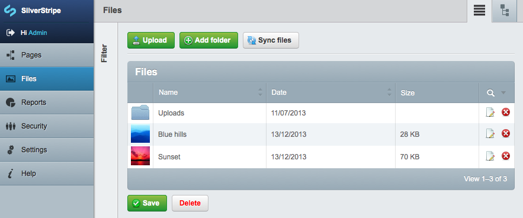
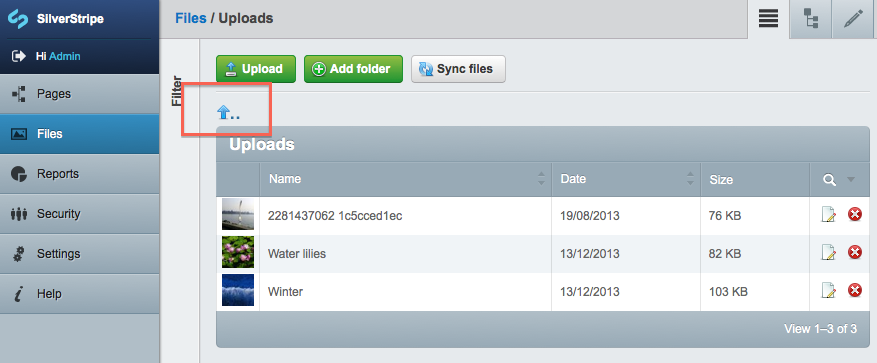
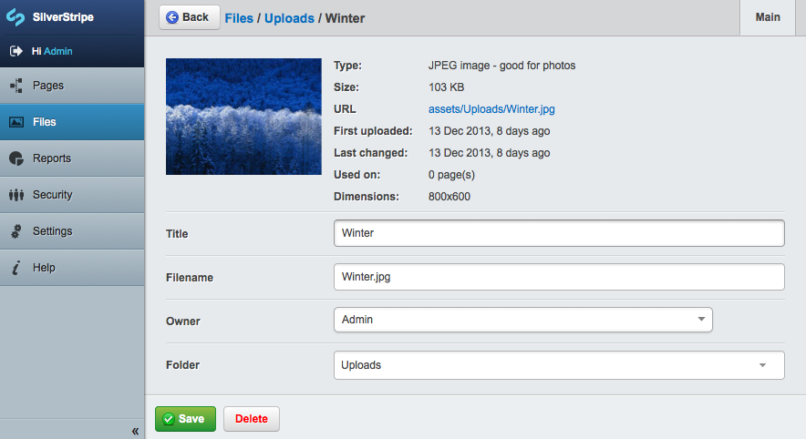
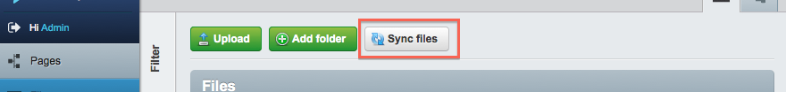

summary: Learn how to work with File and Image records

# File Management

## Storage via database columns

Asset storage is provided out of the box via a [Flysystem](http://flysystem.thephpleague.com/) backed store.
However, any class that implements the `AssetStore` interface could be substituted to provide storage backends
via other mechanisms.

Internally, files are stored as `[api:DBFile]` records on the rows of parent objects. These records are composite fields
which contain sufficient information useful to the configured asset backend in order to store, manage, and 
publish files. By default this composite field behind this field stores the following details:

| Field name     | Description |
| ----------     | -----------   
| `Hash`         | The sha1 of the file content, useful for versioning (if supported by the backend) |
| `Filename`     | The internal identifier for this file, which may contain a directory path (not including assets). Multiple versions of the same file will have the same filename. |
| `Variant`      | The variant for this file. If a file has multiple derived versions (such as resized files or reformatted documents) then you can point to one of the variants here. |

Note that the `Hash` and `Filename` always point to the original file, if a `Variant` is specified. It is up to the
storage backend to determine how variants are managed.

Note that the storage backend used will not be automatically synchronised with the database. Only files which
are loaded into the backend through the asset API will be available for use within a site.

## Compatibility with 3.x filename paths

If upgrading to 4.0 from earlier versions when using the default asset store, it's important to consider
how existing files will be migrated.

Because the filesystem now uses the sha1 of file contents in order to version multiple versions under the same
filename, the default storage paths in 4.0 will not be the same as in 3.

In order to retain existing file paths in line with framework version 3 you should set the
`\SilverStripe\Filesystem\Flysystem\FlysystemAssetStore.legacy_paths` config to true.
Note that this will not allow you to utilise certain file versioning features in 4.0.

	:::yaml
	\SilverStripe\Filesystem\Flysystem\FlysystemAssetStore:
		legacy_paths: true

## Loading content into `DBFile`

A file can be written to the backend from a file which exists on the local filesystem (but not necessarily
within the assets folder).

For example, to load a temporary file into a DataObject you could use the below:

	:::php
	<?
	class Banner extends DataObject {
		private static $db = array(
			'Image' => 'DBFile'
		);
	}

	// Image could be assigned in other parts of the code using the below
	$banner = new Banner();
	$banner->Image->setFromLocalFile($tempfile['path'], 'uploads/banner-file.jpg');

When uploading a file it's normally necessary to give the file a useful name and directory, otherwise the
asset storage backend will choose one for you.

Alternatively, content can be loaded using one of the below methods:

| Method                     | Description                             |
| -------------------------- | --------------------------------------- |
| `DBFile::setFromLocalFile` | Load a local file into the asset store  |
| `DBFile::setFromStream`    | Will store content from a stream        |
| `DBFile::setFromString`    | Will store content from a binary string |

The result of these methods will be an array of data (tuple) which contains the values of the above fields
(Filename, Hash, and Variant).

## Conflict resolution

When storing files, it's possible to determine the mechanism the backend should use when it encounters
an existing file pattern. The conflict resolution to use can be passed into the third parameter of the
above methods (after content and filename). The available constants are:

| Constant                            | If an existing file is found then:  |
| ----------------------------------- | ----------------------------------- |
| `AssetStore::CONFLICT_EXCEPTION`    | An exception will be thrown         |
| `AssetStore::CONFLICT_OVERWRITE`    | The existing file will be replaced  |
| `AssetStore::CONFLICT_RENAME`       | The backend will choose a new name. |
| `AssetStore::CONFLICT_USE_EXISTING` | The existing file will be used      |

If no conflict resolution scheme is chosen, or an unsupported one is requested, then the backend will choose one.
The default asset store supports each of these.

## Getting content from a `DBFile`

When placed into a template (e.g. `$MyFileField`) then `[api:DBFile]` will automatically generate the appropriate
template for the file mime type. For images, this will embed an image tag. For documents a download link will be presented.

As with storage, there are also different ways of loading the content (or properties) of the file:

| Method                   | Description                                                |
| ------------------------ | ---------------------------------------------------------- |
| `DBFile::getStream`      | Will get an output stream of the file content              |
| `DBFile::getString`      | Gets the binary content                                    |
| `DBFile::getURL`         | Gets the url for this resource. May or may not be absolute |
| `DBFile::getAbsoluteURL` | Gets the absolute URL to this resource                     |
| `DBFile::getMimeType`    | Get the mime type of this file                             |
| `DBFile::getMetaData`    | Gets other metadata from the file as an array              |

As with other db field types, `DBField` can also be subclassed or extended to add additional properties
(such as SEO related fields).

## Storage via `File` DataObject

Other than files stored exclusively via DBFile, files can also exist as subclasses of the `File` DataObject.

Each record has the following database fields:

| Field name     | Description																																			|
| ----------     | -----------																																			|
| `ClassName`    | The class name of the file (e.g. File, Image or Folder).																								|
| `Name`         | The 'basename' of the file, or the folder name. For example 'my-image.jpg', or 'images' for a folder.												|
| `Title`        | The optional, human-readable title of the file for display only (doesn't apply to folders).															|
| `File`         | The `[api:DBFile]` field (see above) which stores the underlying asset content.																		|
| `ShowInSearch` | Whether the file should be shown in search results, defaults to '1'. See ["Tutorial 4 - Site Search"](/tutorials/site_search) for enabling search.	|
| `ParentID`     | The ID of the parent Folder that this File/Folder is in. A ParentID of '0' indicates that this is a top level record.								|
| `OwnerID`      | The ID of the Member that 'owns' the File/Folder (not related to filesystem permissions).															|

## Management through the "Files" section of the CMS

If you have the CMS module installed, you can manage files, folders and images in the "Files" section of the CMS. Inside this section, you will see a list of files and folders like below:

You can click on any file to edit it, or click on any folder to open it. To delete a file or a folder, simply click the red 'X' symbol next to it. If you click to open a folder, you can go back up one level by clicking the 'up' arrow above the folder name (highlighted below):

Once you click to edit a file, you will see a form similar to the one below, in which you can edit the file's title, filename, owner, or even change which folder the file is located in:

You may also notice the 'Sync files' button (highlighted below). This button allows CMS users to 'synchronise' the database (remember, all files/folders are stored as database records) with the filesystem. This is particularly useful if someone has uploaded or removed files/folders via FTP, for example.

## Upload

Files can be managed through a `FileField` or an `UploadField`. The `[api:FileField]` class provides a simple HTML input with a type of "file", whereas an `[api:UploadField]` provides a much more feature-rich field (including AJAX-based uploads, previews, relationship management and file data management). See [`Reference - UploadField`](/developer_guides/forms/field_types/uploadfield) for more information about how to use the `UploadField` class.
