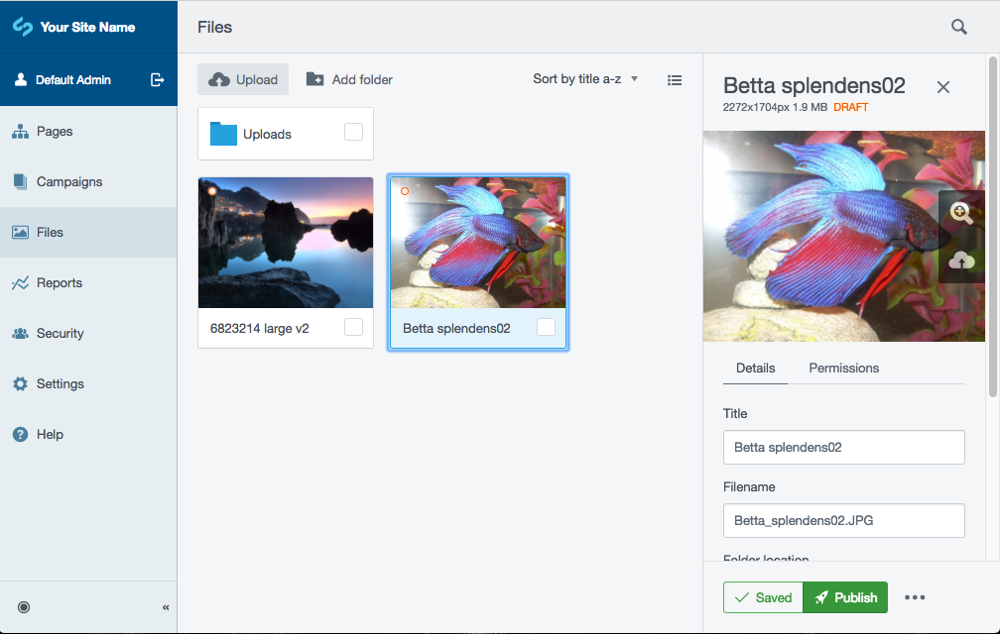
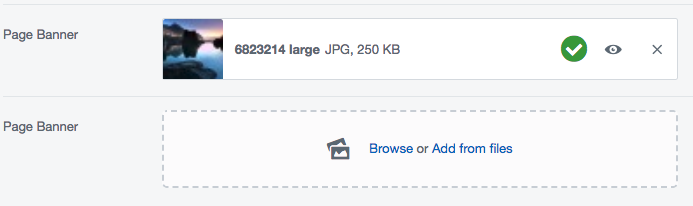

title: File management
summary: Learn how to work with File and Image records

# File management

## Asset admin

Management of files within the CMS is provided via the [silverstripe/asset-admin](https://github.com/silverstripe/silverstripe-asset-admin)
module. This is a rich and user friendly interface supporting most basic file operations, as well as
control over the publishing and security of files.



## UploadField

If you have the [silverstripe/asset-admin](https://github.com/silverstripe/silverstripe-asset-admin)
module installed then this provides a powerful component [api:SilverStripe\AssetAdmin\Forms\UploadField].



You can add it to a page as below:

```php
<?php

use SilverStripe\AssetAdmin\Forms\UploadField;
use SilverStripe\Assets\Image;
use SilverStripe\CMS\Model\SiteTree;

class Page extends SiteTree
{
    private static $has_one = [
        'Banner' => Image::class,
    ];

    public function getCMSFields()
    {
        $fields = parent::getCMSFields();
        $fields->addFieldToTab('Root.Main', UploadField::create('Banner', 'Page Banner'), 'Content');
        return $fields;
    }
}
```

UploadField options include:

 - setIsMultiUpload() - Set to allow many files per field, or one only.
 - setAllowedExtensions() - Set list of extensionse this field can accept.
 - setAllowedFileCategories() - Alternatively specify allowed extensions via category instead.
 - setFolderName() - Name of folder to upload into
 - getValidator() - Get instance of validator to specify custom validation rules

## File visibility

In order to ensure that assets are made public you should check the following:

 - The "Who can view this file?" option is set to "Anyone" or "Inherit" in the asset-admin. This can be checked
   via `File::canView()` or `File::$CanViewType` property.
 - The file is published, or is owned by a published record. This can be checked via `File::isPublished()`
 - The file exists on disk, and has not been removed. This can be checked by `File::exists()`

## File shortcodes

Shortcodes represent an embeded asset within a block of HTML text. For instance, this is the content
of a page with a shortcode image:

```html
<p>Welcome to SilverStripe! This is the default homepage.</p>
<p>[image src="/assets/e43fb87dc0/12824172.jpeg" id="27" width="400" height="400" class="leftAlone ss-htmleditorfield-file image" title="My Image"]</p>
```

File shortcodes have the following properties:

 - canView() will not be checked for the file itself: Instead this will be inherited from the parent record
   this is embedded within.
 - The file is automatically "owned", meaning that publishing the page will also publish the embedded file.

Within the CMS shortcodes can be added via either the "Insert Media" modal, or the "Link to a file"
buttons provided via the [silverstripe/asset-admin](https://github.com/silverstripe/silverstripe-asset-admin)
module.

## Creating files in PHP

When working with files in PHP you can upload a file into a [api:SilverStripe\Assets\File] dataobject
using one of the below methods:


| Method                     | Description                             |
| -------------------------- | --------------------------------------- |
| `File::setFromLocalFile`   | Load a local file into the asset store  |
| `File::setFromStream`      | Will store content from a stream        |
| `File::setFromString`      | Will store content from a binary string |


### Upload conflict resolution

When storing files, it's possible to determine the mechanism the backend should use when it encounters
an existing file pattern. The conflict resolution to use can be passed into the third parameter of the
above methods (after content and filename). The available constants are:

| Constant                            | If an existing file is found then:  |
| ----------------------------------- | ----------------------------------- |
| `AssetStore::CONFLICT_EXCEPTION`    | An exception will be thrown         |
| `AssetStore::CONFLICT_OVERWRITE`    | The existing file will be replaced  |
| `AssetStore::CONFLICT_RENAME`       | The backend will choose a new name. |
| `AssetStore::CONFLICT_USE_EXISTING` | The existing file will be used      |

If no conflict resolution scheme is chosen, or an unsupported one is requested, then the backend will choose one.
The default asset store supports each of these.

## Accessing files via PHP

As with storage, there are also different ways of loading the content (or properties) of the file:

| Method                   | Description                                                |
| ------------------------ | ---------------------------------------------------------- |
| `File::getStream`        | Will get an output stream of the file content              |
| `File::getString`        | Gets the binary content                                    |
| `File::getURL`           | Gets the url for this resource. May or may not be absolute |
| `File::getAbsoluteURL`   | Gets the absolute URL to this resource                     |
| `File::getMimeType`      | Get the mime type of this file                             |
| `File::getMetaData`      | Gets other metadata from the file as an array              |
| `File::getFileType`      | Return the type of file for the given extension            |

### Additional file types

There may be some file extensions not recognised by the framework, which will return "unknown" on `File::getFileType`.

You can add your own file extensions and it's description with the following configuration.

```yml
SilverStripe\Assets\File:
  file_types:
    ai: 'Adobe Illustrator'
    psd: 'Adobe Photoshop File'
```

## Modifying files

In order to move or rename a file you can simply update the Name property, or assign the ParentID to a new
folder. Please note that these modifications are made simply on the draft stage, and will not be copied
to live until a publish is made (either on this object, or cascading from a parent).

When files are renamed using the ORM, all file variants are automatically renamed at the same time.

```php
use SilverStripe\Assets\File;

$file = File::get()->filter('Name', 'oldname.jpg')->first();
if ($file) {
  // The below will move 'oldname.jpg' and 'oldname__variant.jpg'
  // to 'newname.jpg' and 'newname__variant.jpg' respectively
  $file->Name = 'newname.jpg';
  $file->write();
}
```

## Adding custom fields to files and images

As with any customisation of a core class, adding fields to the `File` and `Image` classes 
is a two-phased approach. First, you have to update the model (i.e. the `$db` array) to include
your new custom field. Second, you need to update the editform to provide a way of editing
that field in the CMS. For most core classes, this can be done in a single extension, with an
update to the `$db` array and definition of an `updateCMSFields` function, but for files 
and images, it works a bit differently. The edit form is generated by another class --
`FileFormFactory`. You will therefore need two separate extensions.

In this example, we'll add a `description` field to the `File` object and give it an editable
field in the CMS.

*app/_config/app.yml*
```yml
SilverStripe\Assets\File:
  extensions:
    - MyProject\MyFileExtension
SilverStripe\AssetAdmin\Forms\FileFormFactory:
  extensions:
    - MyProject\MyFormFactoryExtension
```

*app/src/MyFileExtension.php*
```php
namespace MyProject;

use SilverStripe\ORM\DataExtension;

class MyFileExtension extends DataExtension
{
    private static $db = [
        'Description' => 'Text',
    ];
}
```

*app/src/MyFormFactoryExtension.php*
```php
namespace MyProject;

use SilverStripe\Core\Extension;
use SilverStripe\Forms\FieldList;
use SilverStripe\Forms\TextareaField;

class MyFormFactoryExtension extends Extension
{
    public function updateFormFields(FieldList $fields)
    {
        $fields->insertAfter(
            'Title',
            TextareaField::create('Description', 'Description')
        );
    }
}
```


## File versioning

File versioning is extended with the [silverstripe/versioned](https://github.com/silverstripe/silverstripe-versioned/)
module, which provides not only a separate draft and live stages for any file, but also allows a complete file
history of modifications to be tracked.

To support this feature the [api:SilverStripe\Assets\AssetControlExtension] provides support for tracking
references to physical files, ensuring published assets are accessible, protecting non-published assets,
and archiving / deleting assets after the final reference has been deleted.

### Configuring file ownership

When working with files attached to other versioned dataobjects it is necessary to configure ownership
of these assets from the parent record. This ensures that whenever a Page (or other record type)
is published, all assets that are used by this record are published with it.

For example:

```php
<?php

use SilverStripe\Assets\Image;
use SilverStripe\CMS\Model\SiteTree;

class Page extends SiteTree
{
    private static $has_one = [
        'Banner' => Image::class,
    ];
    private static $owns = ['Banner'];
}
```

### Avoid exclusive relationships

Due to the shared nature of assets, it is not recommended to assign any 1-to-many (or exclusive 1-to-1) relationship
between any objects and a File. E.g. a Page has_many File, or Page belongs_to File.


Instead it is recommended to use either a Page has_one File for many-to-1 (or 1-to-1) relationships, or
Page many_many File for many-to-many relationships.

### Unpublishing assets

Assets can be unpublished on a case by case basis via the asset admin section. Please note that
when unpublishing an asset, this will remove this asset from all live pages which currently link to
or embed those images.

### Configuring file archiving

By default files which do not exist on either the live or draft stage (but do have a version history)
are removed from the filesystem.

In order to permanantly keep a record of all past physical files you can set the `File.keep_archived_assets`
config option to true. This will ensure that historic files can always be restored, albeit at a cost to disk
storage.

```yaml
SilverStripe\Assets\File:
  keep_archived_assets: true
```

## Related Lessons
* [Working with files and images](https://www.silverstripe.org/learn/lessons/v4/working-with-files-and-images-1)
