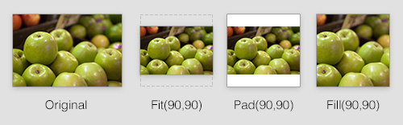

summary: Learn how to crop and resize images in templates and PHP code

# Image

Represents an image object through the `[api:Image]` class, inheriting all base functionality from the `[api:File]` class with extra functionality including resizing.

## Usage

### Managing images through form fields

Images can be uploaded like any other file, through `[api:FileField]`.
More advanced usage is possible through `[api:UploadField]`,
which provides thumbnails, a detail view of the image properties,
and management of relationships to other DataObject instances.
Allows upload of images through limiting file extensions with `setAllowedExtensions()`.

### Inserting images into the WYSIWYG editor

See [Topics: Rich Text Editing](/topics/rich-text-editing).

### Manipulating images in Templates

You can manipulate images directly from templates to create images that are
resized and cropped to suit your needs.  This doesn't affect the original
image or clutter the CMS with any additional files, and any images you create
in this way are cached for later use. In most cases the pixel aspect ratios of
images are preserved (meaning images are not stretched).

Here are some examples, assuming the `$Image` object has dimensions of 200x100px:

	:::ss
	// Scaling functions
	$Image.ScaleWidth(150) // Returns a 150x75px image
	$Image.ScaleMaxWidth(100) // Returns a 100x50px image (like ScaleWidth but prevents up-sampling)
	$Image.ScaleHeight(150) // Returns a 300x150px image (up-sampled. Try to avoid doing this)
	$Image.ScaleMaxHeight(150) // Returns a 200x100px image (like ScaleHeight but prevents up-sampling)
	$Image.Fit(300,300) // Returns an image that fits within a 300x300px boundary, resulting in a 300x150px image (up-sampled)
	$Image.FitMax(300,300) // Returns a 200x100px image (like Fit but prevents up-sampling)
	
	// Cropping functions
	$Image.Fill(150,150) // Returns a 150x150px image resized and cropped to fill specified dimensions (up-sampled)
	$Image.FillMax(150,150) // Returns a 100x100px image (like Fill but prevents up-sampling)
	$Image.CropWidth(150) // Returns a 150x100px image (trims excess pixels off the x axis from the center)
	$Image.CropHeight(50) // Returns a 200x50px image (trims excess pixels off the y axis from the center)
	
	// Padding functions (add space around an image)
	$Image.Pad(100,100) // Returns a 100x100px padded image, with white bars added at the top and bottom
	$Image.Pad(100, 100, CCCCCC) // Same as above but with a grey background
	
	// Metadata
	$Image.Width // Returns width of image
	$Image.Height // Returns height of image
	$Image.Orientation // Returns Orientation
	$Image.Title // Returns the friendly file name
	$Image.Name // Returns the actual file name
	$Image.FileName // Returns the actual file name including directory path from web root
	$Image.Link // Returns relative URL path to image
	$Image.AbsoluteLink // Returns absolute URL path to image

Image methods are chainable. Example:

	:::ss
	<body style="background-image:url($Image.ScaleWidth(800).CropHeight(800).Link)">

### Manipulating images in PHP

The image manipulation functions can be used in your code with the same names, example: `$image->Fill(150,150)`.

Some of the MetaData functions need to be prefixed with 'get', example `getHeight()`, `getOrientation()` etc.

Please refer to the `[api:Image]` API documentation for specific functions.

### Creating custom image functions

You can also create your own functions by extending the image class, for example

	:::php
	class MyImage extends DataExtension {
		
		public function Landscape()	{
			return $this->owner->getWidth() > $this->owner->getHeight();
		}
		
		public function Portrait() {
			return $this->owner->getWidth() < $this->owner->getHeight();
		}
		
		public function PerfectSquare()	{
			return $this->owner->getFormattedImage('PerfectSquare');
		}
		
		public function generatePerfectSquare(Image_Backend $backend)	{
			return $backend->croppedResize(100,100);
		}
		
		public function Exif(){
			//http://www.v-nessa.net/2010/08/02/using-php-to-extract-image-exif-data
			$image = $this->owner->AbsoluteLink();
			$d=new ArrayList();	
			$exif = exif_read_data($image, 0, true);
			foreach ($exif as $key => $section) {
				$a=new ArrayList();	
				foreach ($section as $name => $val)
					$a->push(new ArrayData(array("Title"=>$name,"Content"=>$val)));
				$d->push(new ArrayData(array("Title"=>strtolower($key),"Content"=>$a)));
			}
			return $d;
		}
	}

	:::yml
	Image:
	  extensions:
	    - MyImage

### Form Upload

For usage on a website form, see `[api:FileField]`.
If you want to upload images within the CMS, see `[api:UploadField]`.

### Image Quality

To adjust the quality of the generated images when they are resized add the
following to your mysite/config/config.yml file:

	:::yml
	GDBackend:
	  default_quality: 90
	# or
	ImagickBackend:
	  default_quality: 90

The default value is 75.

By default SilverStripe image functions will not resample an image if no
cropping or resizing is taking place. You can tell SilverStripe to always to
always produce resampled output by adding this to your
mysite/config/config.yml file:

	:::yml
	Image:
	  force_resample: true

If you are intending to resample images with SilverStripe it is good practice
to upload high quality (minimal compression) images as these will produce
better results when resampled. Very high resolution images may cause GD to
crash so a good size for website images is around 2000px on the longest edge.

### Clearing Thumbnail Cache

Images are (like all other Files) synchronized with the SilverStripe database.
This syncing happens whenever you load the "Files & Images" interface,
and whenever you upload or modify an Image through SilverStripe.

If you encounter problems with images not appearing, or have mysteriously 
disappeared, you can try manually flushing the image cache.

	http://localhost/dev/tasks/FlushGeneratedImagesTask

## API Documentation
`[api:Image]`
