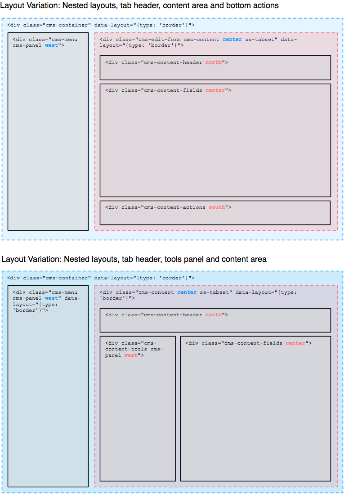

title: Admin Layout

# CMS layout

The CMS markup is structured into "panels", which are the base units containing interface components (or other panels),
as declared by the class `cms-panel`. Panels can be made collapsible, and get the ability to be resized and aligned with
a layout manager, in our case [jLayout](http://www.bramstein.com/projects/jlayout/). This layout manager applies CSS
declarations (mostly dimensions and positioning) via JavaScript.

We've established a convention for a `redraw` method on each panel and UI component that need to update their content as
a result of changes to their position, size or visibility. This method would usually be invoked by the parent container.

The layout manager does not dynamically track changes to panel sizes - we have to trigger laying out manually each time
we need an update to happen (for example from `window::onresize` event, or panel toggling). It then cascades through the
children setting sizes and positions, which in turn requires redrawing of some of the elements.

The easiest way to update the layout of the CMS is to call `redraw` on the top-level `.cms-container` element.

	:::js
	$('.cms-container').redraw();

This causes the framework to:

* reset the _threeColumnCompressor_ algorithm with the current layout options (that can be set via
`updateLayoutOptions`)
* trigger `layout` which cascades into all children resizing and positioning subordinate elements (this is internal
to the layout manager)
* trigger `redraw` on children which also cascades deeper into the hierarchy (this is framework activity)

Caveat: `layout` is also triggered when a DOM element is replaced with AJAX in `LeftAndMain::handleAjaxResponse`. In
this case it is triggered on the parent of the element being replaced so jLayout has a chance to rebuild its algorithms.
Calling the top level `layout` is not enough as it will wrongly descend down the detached element's hierarchy.

Caveat: invocation order of the `redraws` is crucial here, generally going from innermost to outermost elements.  For
example, the tab panels have be applied in the CMS form before the form itself is layouted with its sibling panels to
avoid incorrect dimensions.

## Layout API

### redraw

Define `redraw` methods on panels that need to adjust themselves after their sizes, positions or visibility have been
changed.

Call `redraw` on `.cms-container` to re-layout the CMS.

### data-layout-type attribute

Layout manager will automatically apply algorithms to the children of `.cms-container` by inspecting the
`data-layout-type` attribute. Let's take the content toolbar as an example of a second-level layout application:

	:::html
	

		<%-- content utilising border's north, south, east, west and center classes --%>
	

For detailed discussion on available algorithms refer to
[jLayout algorithms](https://github.com/bramstein/jlayout#layout-algorithms).

Our [Howto: Extend the CMS Interface](../howto/extend-cms-interface) has a practical example on how to add a bottom
panel to the CMS UI.

### Methods

The following methods are available as an interface to underlying _threeColumnCompressor_ algorithm on the
`.cms-container` entwine:

* **getLayoutOptions**: get currently used _threeColumnCompressor_ options.
* **updateLayoutOptions**: change specified options and trigger the laying out:
`$('.cms-container').updateLayoutOptions({mode: 'split'});`
* **splitViewMode**: enable side by side editing.
* **contentViewMode**: only menu and content areas are shown.
* **previewMode**: only menu and preview areas are shown.

### CSS classes

If as a result of alogorithm's calculations the column becomes hidden, `column-hidden` class is added to it.

## ThreeColumnCompressor

You might have noticed that the top-level `.cms-container` has the `data-layout-type` set to `custom`. We use an inhouse
_threeColumnCompressor_ algorithm for the layout of the menu, content and preview columns of the CMS. The annotated code
for this algorithm can be found in `LeftAndMain.Layout.js`.

Since the layout-type for the element is set to `custom` and will be ignored by the layout manager, we apply the
_threeColumnCompressor_ explicitly `LeftAndMain::redraw`. This way we also get a chance to provide options expected
by the algorithm that are initially taken from the `LeftAndMain::LayoutOptions` entwine variable.

### Factory method

Use provided factory method to generate algorithm instances.

	:::js
	jLayout.threeColumnCompressor(<column-spec-object>, <options-object>);

The parameters are as follows:

* **column-spec-object**: object providing the _menu_, _content_ and _preview_ elements (all fields mandatory)
* **options-object**: object providing the configuration (all fields mandatory, see options below)

### Layout options

* _minContentWidth_: minimum size for the content display as long as the preview is visible
* _minPreviewWidth_: preview will not be displayed below this size
* _mode_: one of "split", "content" (content-only), "preview" (preview-only)

## Related

 * [Reference: CMS Architecture](../reference/cms-architecture)
 * [Reference: Preview](../reference/preview)
 * [Howto: Extend the CMS Interface](../howto/extend-cms-interface)
