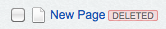
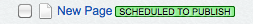

# How to customize the CMS tree

## Overview

The CMS tree for viewing hierarchical structures (mostly pages) is powered
by the [jstree](http://jstree.com) library. It is configured through
`framework/admin/javascript/LeftAndMain.Tree.js`, as well as some
HTML5 metadata generated on its container (see the `data-hints` attribute).

The tree is rendered through `[api:LeftAndMain->getSiteTreeFor()]`,
which recursively collects all nodes based on various filtering criteria.
The node strictly just has to implement the `[api:Hierarchy]` extension,
but in the CMS usually is a `[api:SiteTree]` object.

## Add status lozenges to tree nodes

A tree node in CMS could be rendered with lot of extra information but a node title, such as a
link that wraps around the node title, a node's id which is given as id attribute of the node
&lt;li&gt; tag, a extra checkbox beside the tree title, tree icon class or extra &lt;span&gt;
tags showing the node status, etc. SilverStripe tree node will be typically rendered into html
code like this:

	:::ss
	...
	<ul>
		...
		<li id="record-15" class="class-Page closed jstree-leaf jstree-unchecked" data-id="15">
		<ins class="jstree-icon">&nbsp;</ins>
			<a class="" title="Page type: Page" href="admin/page/edit/show/15">
				<ins class="jstree-checkbox">&nbsp;</ins>
				<ins class="jstree-icon">&nbsp;</ins>
				
					
					New Page
					Deleted
				
			</a>
		</li>
		...
	</ul>
	...

By applying the proper style sheet, the snippet html above could produce the look of:

SiteTree is a `[api:DataObject]` which is versioned by `[api:Versioned]` extension.
Each node can optionally have publication status flags, e.g. "Removed from draft".
Each flag has a unique identifier, which is also used as a CSS class for easier styling.

Developers can easily add a new flag, delete or alter an existing flag on how it is looked
or changing the flag label. The customization of these lozenges could be done either through
inherited subclass or `[api:DataExtension]`. It is just really about how we change the return
value of function `SiteTree->getTreeTitle()` by two easily extendable methods
`SiteTree->getStatusClass()` and `SiteTree->getStatusFlags()`.

Note: Though the flag is not necessarily tie to its status of __publication__ and it could
be used for flagging anything you like, we should keep this lozenge to show version-related
status, while let `SiteTree->CMSTreeClasses()` to deal with other customised classes, which
will be used for the class attribute of &lt;li&gt; tag of the tree node.

### Add new flag
__Example: using a subclass__

	:::php
	class Page extends SiteTree {
		public function getScheduledToPublish(){
			// return either true or false
		}

		public function getStatusFlags($cached = true) {
			$flags = parent::getStatusFlags($cached);
			$flags['scheduledtopublish'] = "Scheduled To Publish";
			return $flags;
		}
	}

The above subclass of `[api:SiteTree]` will add a new flag for indicating its
__'Scheduled To Publish'__ status. The look of the page node will be changed
from  to . The getStatusFlags has an `updateStatusFlags()`
extension point, so the flags can be modified through `DataExtension` rather than
inheritance as well. Deleting existing flags works by simply unsetting the array key.
