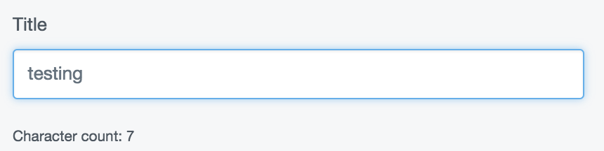
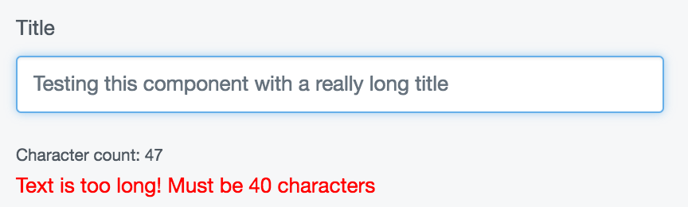
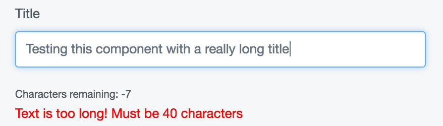

# Customising React Components

In this tutorial, we'll customise some form elements rendered with React to have some new features.

## An enhanced TextField

Let's add a character count to the `TextField` component. `TextField` is a built-in component in the admin area. Because the `TextField` component is fetched 
through Injector, we can override it and augment it with our own functionality.

First, let's create our [higher order component](../07_ReactJS_Redux_and_GraphQL.md#customising-react-components-with-injector).

__my-module/js/components/CharacterCounter.js__
```js
import React from 'react';

const CharacterCounter = (TextField) => (props) => {
    return (
        <div>
            <TextField {...props} />
            <small>Character count: {props.value.length}</small>
        </div>
    );
}

export default CharacterCounter;
```

Now let's add this higher order component to []Injector](../07_ReactJS_Redux_and_GraphQL.md#the-injector-api). 

__my-module/js/main.js__
```js
import Injector from 'lib/Injector';
import CharacterCounter from './components/CharacterCounter';

Injector.transform('character-count-transform', (update) => {
  update.component('TextField', CharacterCounter);
});
```

The last thing we'll have to do is [transpile our code](../06_Javascript_Development.md#es6-and-build-tools) and load the resulting bundle file
into the admin page.

__my-module/\_config/config.yml__

```yaml
    ---
    Name: my-module
    ---
    SilverStripe\Admin\LeftAndMain:
      extra_requirements_javascript:
        # The name of this file will depend on how you've configured your build process
        - 'my-module/js/dist/main.bundle.js'
```
Now that the customisation is applied, our text fields look like this:



### More enhancements

Let's add another customisation to TextField. If the text goes beyond a specified
length, let's throw a warning in the UI.

__my-module/js/components/TextLengthChecker.js__
```js
const TextLengthCheker = (TextField) => (props) => {  
  const {limit, value } = props;
  const invalid = limit !== undefined && value.length > limit;

  return (
    <div>
      <TextField {...props} />
      {invalid &&
        <span style={{color: 'red'}}>
          {`Text is too long! Must be ${limit} characters`}
        </span>
      }
    </div>
  );
}

export default TextLengthChecker;
```

We'll apply this one to the injector as well, but let's do it under a different name.
For the purposes of demonstration, let's imagine this customisation comes from another
module.

__my-module/js/main.js__
```js
import Injector from 'lib/Injector';
import TextLengthChecker from './components/TextLengthChecker';

Injector.transform('text-length-transform', (update) => {
  update.component('TextField', TextLengthChecker);
});
```

Now, both components have applied themselves to the textfield.




### Getting the customisations to work together

Both these enhancements are nice, but what would be even better is if they could
work together collaboratively so that the character count only appeared when the user
input got within a certain range of the limit. In order to do that, we'll need to be
sure that the `TextLengthChecker` customisation is loaded ahead of the `CharacterCounter` customisation. 

First let's update the character counter to show characters _remaining_, which is
much more useful. We'll also update the API to allow a `warningBuffer` prop. This is
the amount of characters the input can be within the `limit` before the warning shows.

__my-module/js/components/CharacterCounter.js__
```js
import React from 'react';

const CharacterCounter = (TextField) => (props) => {
    const { warningBuffer, limit, value: { length } } = props;
    const remainingChars = limit - length;
    const showWarning = length + warningBuffer >= limit;
    return (
        <div>
            <TextField {...props} />
            {showWarning &&
            	<small>Characters remaining: {remainingChars}</small>
            }
        </div>
    );
}

export default CharacterCounter;
```

Now, when we apply this customisation, we need to be sure it loads _after_ the length
checker in the middleware chain, as it relies on the prop `limit`.

For this example, we'll imagine these two enhancements come from different modules.

__module-a/js/main.js__
```js
import Injector from 'lib/Injector';
import CharacterCounter from './components/CharacterCounter';
Injector.transform(
  'my-transformation', 
  (update) => update.component('TextField', CharacterCounter),
  { after: 'my-other-transformation' }
);
```

__module-b/js/main.js__
```js
import Injector from 'lib/Injector';
import TextLengthChecker from './components/TextLengthChecker';

Injector.transform(
  'my-other-transformation', 
  (update) => update.component('TextField', TextLengthChecker),
  { before: 'my-transformation' }
);
```

Now, both components, coming from different modules, play together nicely, in the correct order.



### Adding context

 We've successfully changed the behaviour and UI of our `TextField` component using two
 different two separate higher order components. By default, these are *global changes*. That is,
 every text field rendered by React will receive the enhancements we've put into the injector. Though
 this may sometimes be useful, more often than not, we only want to add our enhancements in certain
 contexts. You may, for instance, only want your character counter to display on one specific field
 in one specific form.
 


 Let's apply our transformation to just the file edit form in AssetAdmin.
 
 __my-module/js/main.js__
 ```js
 import Injector from 'lib/Injector';
 import TextLengthChecker from './components/TextLengthChecker';
 
 Injector.transform('my-other-transformation', (update) => {
   update('TextField.AssetAdmin.FileEditForm', TextLengthChecker);
 });
 ```


## A better form action: dealing with events

Let's make a new customisation that customises the behaviour of a button. We'll have
all form actions throw a `window.confirm()` message before executing their action. Further,
we'll apply some new style to the button if it is in a loading state.

__my-module/js/components/ConfirmingFormButton.js__
```js
import React from 'react';

export default (FormAction) => (props) => {
  const newProps = {
    ...props,
    data: {
      ...props.data,
      buttonStyle: props.loading ? 'danger' : props.data.buttonStyle
    },
    handleClick(e) {
      if(window.confirm('Did you really mean to click this?')) {
        props.handleClick(e);
      }
    }
  }

  return <FormAction {...newProps} />
}
```

__my-module/js/main.js__
```js
import ConfirmingFormButton from './components/ConfirmingFormButton';

Injector.transform('my-transformation', (update) => {
  update.component('FormAction', ConfirmingFormButton, 'ConfirmingFormButton');
});
```

Now, when you click on any form action, it will throw a confirm window before firing its given click handler.
