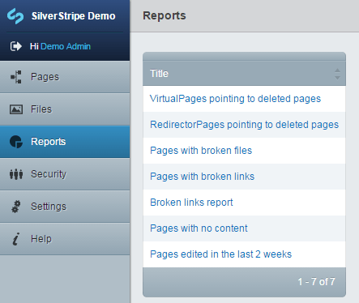

title: Customise site reports
summary: Creating your own custom data or content reports.
# Customise site reports

## Introduction
Reports are a useful feature in the CMS designed to provide a view of your data or content. You can access
the site reports by clicking *Reports* in the left hand side bar and selecting the report you wish to view.

 

## Default reports

By default the CMS ships with several basic reports:

*  VirtualPages pointing to deleted pages
*  RedirectorPages pointing to deleted pages
*  Pages with broken files
*  Pages with broken links
*  Broken links report
*  Pages with no content
*  Pages edited in the last 2 weeks

Modules may come with their own additional reports.

## Creating custom reports

Custom reports can be created quickly and easily. A general knowledge of SilverStripe's
[datamodel and ORM](../../model/data_model_and_orm) is useful before creating a custom report. 

Inside the *mysite/code* folder create a file called *CustomSideReport.php*. Inside this file we can add our site reports. 

The following example will create a report to list every page on the current site.

###CustomSideReport.php 

	:::php
	class CustomSideReport_NameOfReport extends SS_Report {
		
		// the name of the report
		public function title() {
			return 'All Pages';
		}
		
		// what we want the report to return
		public function sourceRecords($params = null) {
			return Page::get()->sort('Title');
		}
		
		// which fields on that object we want to show
		public function columns() {
			$fields = array(
				'Title' => 'Title'
			);
			
			return $fields;
		}
	}
	
More useful reports can be created by changing the `DataList` returned in the `sourceRecords` function.

## Notes

*  `CustomSideReport_ReportName` must extend `SS_Report`
*  It is recommended to place all custom reports in the 1 file.
  * Create a *CustomSideReport.php* file and add classes as you need them inside for each report

## TODO

*  How to format and make advanced reports.
*  More examples

## API documentation
`[api:ReportAdmin]`
