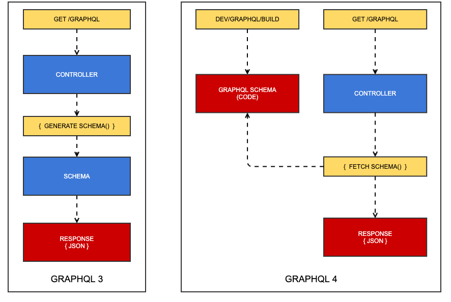
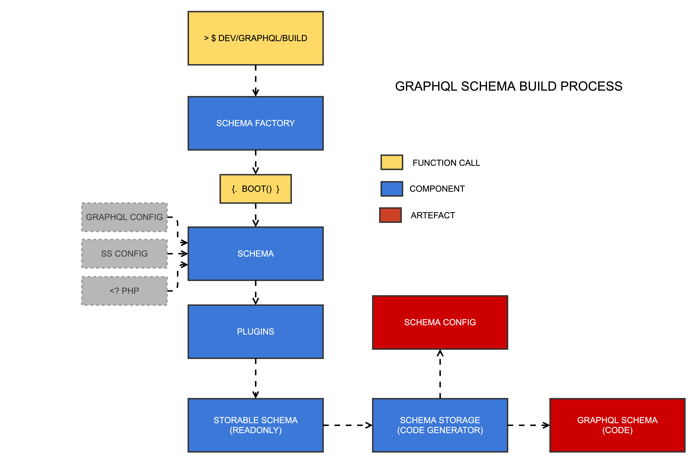
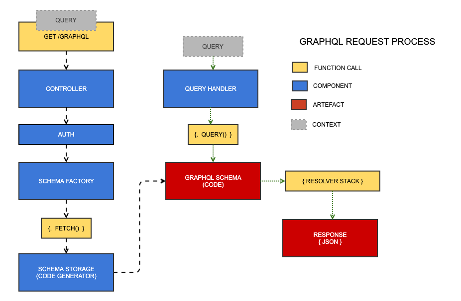
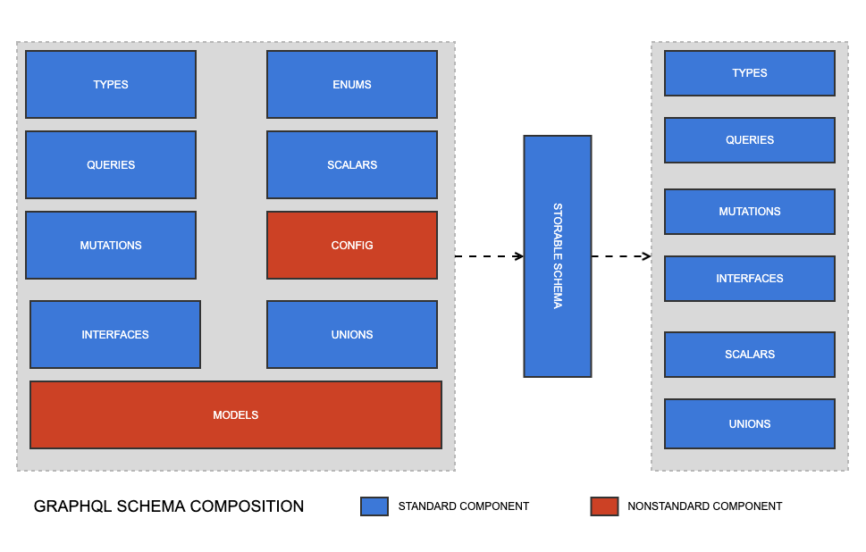
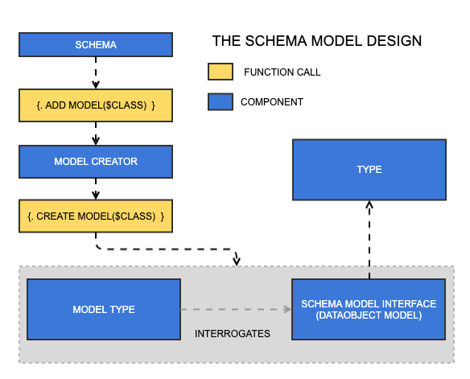
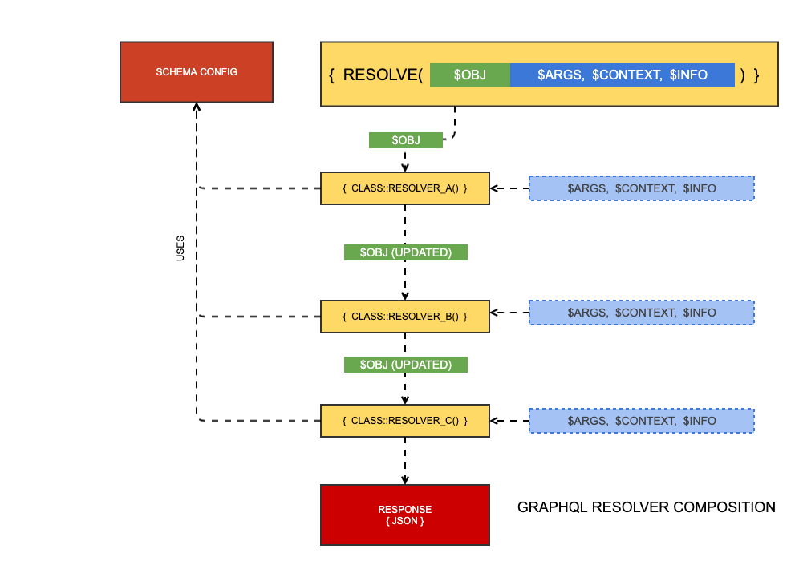
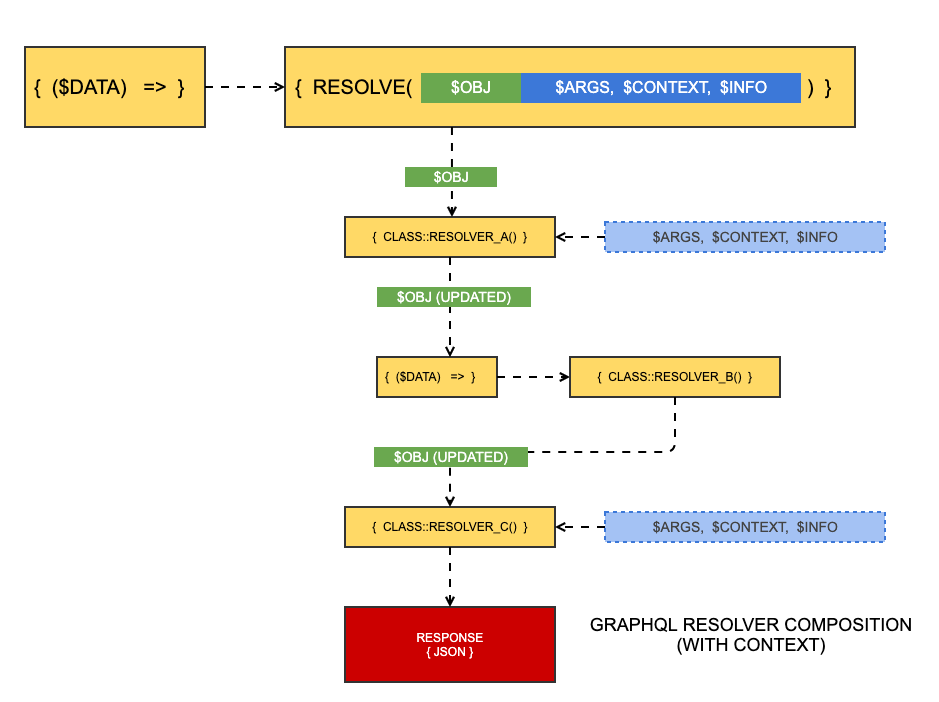

## GraphQL 3 vs GraphQL 4



In GraphQL 3, the schema is built at request time, adding significant overhead to every API request. As the schema grows, this "Generate Schema" process becomes slower, making scalability a real problem.

In GraphQL 4, the schema is generated in a separate task, which generates code generation artefacts. These artefacts are executed at request time, meaning the schema itself imposes no penalty on the response time.

[info]
A useful analog to these two different approaches is a dynamic website versus a static website. In the case of the former, the PHP process is doing work on every single request. In the case of the latter, it does a lot of work once, in a separate context, in exchange for doing zero work on every page request.
[/info]

## The build process



* **dev/graphql/build**: This is the task that builds the schema. It also runs as a side effect of `dev/build` as a fallback. It accepts a `schema` parameter if you only want to build one schema.

* **Schema Factory**: This class is responsible for rebuilding a schema or fetching an existing one (i.e. as cached generated code)

* **Schema**: The most central class that governs the composition of your GraphQL schema and all of the connected services. It is largely a value object hydrated by config files and executable PHP code.

* **Plugins**: Plugins are the primary input for mutating the schema through thirdparty code. They can also be used in app code to augment core features, e.g. default resolvers for dataobjects.

* **Storable Schema**: A value object that is agnostic of domain-specific entities like plugins and models, and just contains the finalised set of types, queries, mutations, interfaces, unions, and scalars. It cannot be mutated once created.

* **Schema Storage**: By default, there is only one implementation of the schema storage service -- the code generator. It produces two artefacts that are accessed at request time: the schema config (a giant multi-dimensional array), and the schema code (a massive bank of classes that implement the `webonyx/graphql-php` library)

## The request process



There are two key processes that happen at request time. Although they're run in serial, they rely on state, so they're depicted above as separate paths.

The controller receives the query as a request parameter and persists it as state. It then fetches the schema from the schema storage service (generated code). Then, the query is passed to a query handler service that runs the query through the generated schema code, into a stack of resolvers that execute in serial, much like a stack of middlewares, until finally the response is generated and sent down the wire.

[info]
The concept of the "resolver stack" is illustrated later in this document.
[/info]

## Schema composition



The `Schema` class is largely a value object that serves as the air traffic controller for the creation of a storable schema (i.e. generated code). Most of what it contains will be familiar to anyone with a basic understanding of GraphQL -- types, mutations, queries, etc. The magic, however, is in its nonstandard components: models and config.

Models are the layers of abstraction that create plain types and queries based on dataobjects. Imagine these few lines of config:

```yaml
App\Models\MyModel:
  fields:
    '*': true
  operations:
    read: true
```

It is the model's job to interpret what `*` or "all fields" means in that context (e.g. looking at `$db`, `$has_one`, etc). It also can create a read query for that dataobject with the simple `read: true` directive, and adding something `query readMyDataObjects` to the schema for you. Models are described in more detail below. There is also a lot more to learn about the model layer in the [Working with DataObjects](../working_with_dataobjects) section.

The nonstandard "config" component here contains arbitrary directives, most of which influence the behaviour of models -- for instance, adding plugins, and influencing how resolvers operate.

The primary role of the `Schema` class is to create a "storable schema" -- a readonly object that contains only standard GraphQL components. That is, all models have been transformed into plain types, queries, mutations, interfaces, etc., and the schema is ready to encode.

## Models and model types



Model types are created by providing a class name to the schema. From there, it asks the `Model Creator` service to create a model for that class name. This may seem like an unnessary layer of abstraction, but in theory, models could be based on classes that are not dataobjects, and in such a case a new model creator would be required.

The model type composes itself by interrogating the model, an implementation of `SchemaModelInterface`. This will almost always be `DataObjectModel`. The model is responsible for solving domain-specific problems pertaining to a Silverstripe project, including:

* What type should be used for this field?
* Create an operation for this class, e.g. "read", "update"
* Add all the fields for this class
* How do I resolve this field?

All model types eventually become plain GraphQL types when the `Schema` class creates a `StorableSchema` instance.

## Plugins


The plugin layer is likely to be refactored before stablisation, but the current architecture is presented above.

## Resolver composition



Injecting behvaiour into resolvers is one of the main ways the schema can be customised. For instance, if you add a new argument to a query, the standard dataobject resolver will not know about it, so you'll want to write your own code to handle that argument. You could overwrite the entire resolver, but then you would lose key functionality from other plugins, like pagination, sort, and filtering.

To this end, resolvers are a product of composition. Each bit of functionality is just another resolver in the "stack." The stack passes the result of the previous resolver to the next resolver, while the other three parameters, `$args, $context, $info` are immutable.

This pattern allows, for instance, filter plugin to run `$obj = $obj->filter(...)` and pass this result to the next resolver. If that next resolver is responsible for pagination, it is not working with a filtered set of results and can get an accurate total count on the result set.

### Resolver context



Sometimes, a resolver needs to be used in multiple contexts, for instance, a generic "read" resolver for a dataobject that simply runs `DataList::create($className)`. That `$className` parameter needs to come from somewhere. Normally we would use some kind of state on an instance, but because resolver methods must be static, we don't have that option. This gets really tricky.

To solve this problem, we can use "resolver context".

[info]
The word "context" is a bit overloaded here. This section has nothing to do with the `$context` parameter that is passed to all resolvers.
[/info]

When resolvers have context, they must be factories, or functions that return functions, using the following pattern:

```php
public static function resolve(array $resolverContext)
{
    $someInfo = $resolverContext['foo'];
    return function ($obj, $args, $context, $info) use ($someInfo)
    {
        //... 
    };
}
```

As illustrated above, some resolvers in the stack can be provided context, while others may not.


