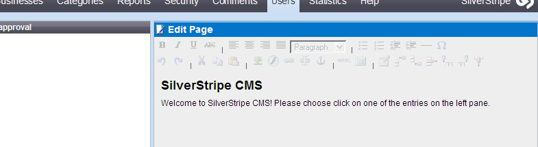

#  2.2.0 (2007-11-28)

SiverStripe 2.2.0 was released on '''28 November 2007''' and had the following changes:

## Upgrading

### Login Form

Check that you have a Layout/Page.ss file for your site, or alternately have a Security_login.ss template.
Your template file needs a $Form variable for it to work. This is where the login form gets included. Without either of
these, the Security/login form will be blank.

### Form Actions HTML/CSS

Check css/js and subclassed templates of Form.ss for changed markup. A global search for "p.Actions" should cover both
js/css changes.

	:::ss
	// before
	

	// after
	

See http://open.silverstripe.com/changeset/43562

### Form Security Token

There has been a hidden 'SecurityID' field added to SilverStripe generated forms by default, with the purpose to stop
CRSF attacks. If you wish your form not to be tied to a specific session, and able to be able to be executed by URL
without the SecurityID, you can disable it on your form with

	:::php
	$form->disableSecurityToken();

The other issue to be aware of is constructing the URL to execute the form manually, as is done in javascript sometimes.
If the security token is enabled, you need to add its value to the URL, eg:

	:::js
	updateURL += ($('SecurityID') ? '&SecurityID=' + $('SecurityID').value : '');

### Custom Section in CMS

Special attention will need to be given to custom sections on a case-by-case basis.

As we have changed the design of the CMS, the top bar for your custom sections is no longer needed. We've moved the
buttons that it once held down to the bottom.

### Classes added to 2.2 that may conflict

Sitemap.php

## Features

   * New look for CMS
   * Support for authentification by OpenID (auth_openid module included with installer)
   * Google Sitemaps support
   * Internationalisation support
       * German translation
       * Dutch translation
       * Chinese (simplified) translation
       * Spanish translation
       * French translation
       * Croatian translation
       * Polish translation
       * Portuguese (Portugal) translation
   * Support for multilingual content
   * Added a Statistics area showing the following reports
       * Page views
       * User activity
       * Trends
       * Operating Systems
       * Browsers
   * Added an image editor, allowing a user to rotate, crop and resize an image from within the CMS
   * Added profile popup in CMS
   * Added a 'Sent Status Report' tab to Newsletters with the following reports
       * Sending to the following recipients failed
       * Sending to the following recipients bounced
       * The newsletter has never been sent to following subscribers
       * Sending to the following recipients was successful
       * Sending to the following recipients did not occur because they are blackListed
   * Add 'Send to only people not previously sent to' option for sending newsletters
   * Added SWFUpload library as default method of uploading files
   * Added photo upload in from the Site Content section
   * Added the ability to search the Site Content tree
   * Added the ability to publish selected pages
   * Added a list of unused assets in the Files & Images section, and the ability to delete unused thumbnails 
   * Usability improvements
       * Move action buttons to bottom right of screen
       * Moved insert image/flash/link to pane on right
       * Removed right frame headers as the buttons have been moved and they only contain redundant information
       * Use a javascript dialog box for confirming unsaved changes instead of the slow loading model one
       * Reworked the tabs in the Newsletter section to be less confusing
       * Cancel button added to Send Newsletter window
       * External logo link opens in a new window
       * Left sections in Site Content 'Site Tree', 'History' and 'Reports' now use expandable sections rather than tabs
       * Relabeled 'Site Tree' to 'Site Content & Structure', 'History' to 'Page Version History' and 'Reports' to 'Site Reports' in left sections of Site Content
       * Relabeled 'Files & Images' left frame to 'Folders' 
       * Added tooltips to site content tree, showing the page type
       * In the 'Page Version History', use a checkbox lable 'Compare mode (click 2 below)' instead of a dropdown
       * Renamed 'Save draft' button to 'Save'
       * The 'Save' button text changes to 'Saving...', and the 'Publish' button text changes to 'Publishing...' when they are clicked
       * Added save indicator to all 'Save' buttons, the 'Save & Publish' button and the 'Unpublish' button while they are being submitted
       * Added a go button to the 'Site Reports' dropdown
       * Relabeled 'Name' field to 'Folder Name' in Files & Images section
       * Renamed the 'Save' button to 'Save folder name' in Files & Images section
       * Relabeled 'Send newsletters from' field to 'From email address' in Newsletter section
       * Removed the 'Move Files' button from Files & Images section, implemented multi-file drag & drop moving
       * Add 'Newsletter Settings' tab to Newsletter type edit form for consistency with other forms
       * Make the status message shown after sending a newsletter always include the # of emails sent
       * Added delete confirmation for items in Newsletter left tree
       * Added delete confirmation for items in Security left tree
       * Make 'Add new draft' the default action for 'Create...' in the Newsletter section
       * Replace the 'reorganise' button with 'Allowing drag & drog reordering' checkbox
       * Delete and Unpublish buttons turn red on hover
       * Added the ability to align images 'left on their own'

## Enhancements

  * New classes
      * Authenticator, allowing multiple authentification methods
      * ConfirmPasswordField
      * DropdownTimeField
      * i18n, for internationalisation
      * LanguageDropdownField
      * LoginForm, base class for login forms for each authentification method
      * MemberAuthenticator, providing username/password authentification
      * MemberLoginForm, refactored from old LoginForm form
      * PopupDateTimeField
      * ToggleField
      * OpenIDAuthenticatedRole, which is an extension to Member that adds OpenID authentification columns
      * OpenIDAuthenticator, providing OpenID authentification
      * OpenIDLoginForm, providing OpenID sign in
      * PageView, which saves the details of each page view for statistics
      * Statistics, which provides static methods for statistics
      * Translatable, for multilingual content
  * New third party libraries
      * PHP OpenID (http://openidenabled.com/php-openid/)
      * Browscap (http://garetjax.info/projects/browscap/)
      * Plotr (http://www.solutoire.com/plotr/)
      * SWFUpload (http://profandesign.se/swfupload/)
  * Improved classes
      * CalendarDateField
          * Refactored part of Field() into HTMLField() so it can be used in PopupDateTimeField
      * ComplexTableField
          * Improved pagination in popup
          * Better transformation of save-button (replaced indicator with "saving..." label) 
      * CompositeField
          * Added SmallFieldHolder() to properly render fields in a FieldGroup
          * Added insertBeforeRecursive()
          * Allow empty children
          * Added Field()
          * Added linebreaks for HTML
      * ConfirmedFormAction
          * Respect $extraClass
      * ContentController
          * Save statistics on page views
          * Added LangAttributes(), for use in XML header
          * Draft/Archived content can only be viewed by users with permission to access the CMS
      * Core
         * Added _t() for internationalisation
         * Check if TEMP_FOLDER is already defined before defining it, allowing the user to set the temporary folder themself
      * DataObject
         * Added merge()
      * Director
          * Added extend_site(), which allows modules to register a function that will be run on every page load
          * redirectBack() now redirects to the base URL if neither the referrer nor the _REDIRECT_BACK_URL is set
          * Added support for translatable URLs
          * Added is_cli()
          * Added set_status_code() and get_status_code()
      * Email
          * Define 'EMAIL_BOUNCEHANDLER_KEY' in sapphire/_config.php and require its value to be sent as 'Key' $_GET var in pings to /Email_BounceHandler to prevent fake email bounce pings
          * Display an error on duplicate bounce logs instead of a blank screen
          * If the contents of the X-SilverStripeMessageID header is sent to /Email_BounceHandler in the 'SilverStripeMessageID' _GET variable, then it will be logged in the Newsletter_SentRecipient table so that the bounce report will show up on the 'Sent Status Report' tab of the Newsletter
          * Bounced newsletter recipient emails and blacklisted by default
      * FieldSet
          * Added insertBeforeRecursive()
      * FileSystem
          * Added $file_create_mask and $folder_create_mask, which are used whenever creating new files/folders in sapphire
      * Form
          * All Forms now have a hidden SecurityID field to prevent CSRF attacks
          * Added disableSecurityToken() to disable the SecurityID field
          * Added securityTokenEnabled()
          * Changed `
` to `
`
          * Renamed PureName() to Name()
      * GD
          * Added rotate()
          * Added rotatePixelByPixel(), allowing rotation where the imagerotate function is unavailable
          * Added crop()
          * Added getWidth()
          * Added getHeight()
      * Hierarchy
          * Versioned now automatically add suffixes, so Hierarchy no longer needs to
      * HTTP
          * Added register_modification_timestamp()
          * Added register_etag()
      * ImageField
          * Improved layout
      * Int
          * Added support for default value
      * ManifestBuilder
          * Refactored getClassManifest() for clearer ignore rules
          * Ignore i18n language files
          * Ignore folders that have a '_manifest_exclude' file
      * Member
          * Automatically login user if the 'remember login' cookie is set
          * Added createNewPassword(), which generates a random password, optionally using a word list
          * Added support for password encryption
          * Added Locale field to store user preferred language
          * Added the ability for Member decorators to augment MemberFormFields()
      * MemberLoginForm (refactored from old LoginForm)
          * Save the email address in the session to reuse when the login fails
      * ModelAsController
          * Added support for translatable URLs
      * Object
          * Added require_developer_login(), which allows you to check if the user has permission to use URL debugging tools
          * ?debugmethods=1 now requires developer login
      * PageComment
          * Added the ability to have BBCode in comments (disabled by default)
      * PasswordField
          * Always show five stars in performReadonlyTransformation(), so it is impossible to use the information of the password length for brute-force attacks
      * Permission
         * Added declare_permissions()
         * Added get_declared_permissions_list()
         * Added traverse_declared_permissions()
         * Added Permission_Group class, used to group permissions together for showing on an interface
         * Added $admin_implies_all, if this is false then the 'ADMIN' permission doesn't imply all permissions
         * Refactored Permission::checkMember(), should be faster now because the non-strict checking is now only executed if the user doesn't has the permission
         * Added deny(), giving the ability to define 'deny permissions'
      * RecipientImportField
          * Added default 'GenericEmail.ss' template
      * RestfulService
          * Added caching
      * RSSFeed
          * Added support for conditional GETs
      * Security
          * Added support for password encryption
          * Added set_word_list() and get_word_list(), to set the location of the word list used in Member::generateNewPassword()
      * Session
          * Added save(), which copies the current controllers session to $_SESSION
      * SiteTree
          * Changed references to 'stage site' to 'draft site' in TreeTitle()
          * Use Translatable interface by default
          * Add content language in MetaTags()
          * Add delete class to unpublish and rollback buttons
      * SSViewer
          * Added support for internationalisation in templates, using `<% _t() %>`
          * Added $Iteration in templates, which keeps track of the number of iterations in a control block
      * TableListField
          * Prevent onclick event in td.markingcheckbox from showing the popup
      * TabSet
          * Remove tabset div to reduce wasted space on tabs
          * Added insertBeforeRecursive()
      * ToggleCompositeField
          * Refactored from TogglePanel
          * Added icons and used 'cursor: pointer' to make it obvious that it is clickable
      * Versioned
          * Added the ability to versionise suffixed tables that have names that are not DataObject descendants
          * Added canBeVersioned()
          * Added extendWithSuffix()
          * Added hasVersionField()

## Bugfixes

  * Sapphire
      * E_NOTICE fixes
      * Fixed incorrect deprecated message in Convert::raw2xml()
      * Don't show and error message and quit the script when @ is used to suppress the error
      * Changed width of HTMLEditorFields to prevent horizontal scrollbars in IE7
      * Added checks in DataObjectSet::First() and DataObjectSet::Last() to prevent errors on an empty $items array
      * Fixed incorrect treatment of Member::logout() as a static method in Security::logout()
      * Ensure Priority is set in SiteTree::onBeforeWrite(), otherwise an invalid SQL statement will be generated when the page is published
      * Only highlight broken links in HTMLEditorFields once, to prevent execution timeouts when there are lots of identical broken links
      * Fixed bug "Fatal error: Access to undeclared static property: Controller::$db in ../sapphire/core/Object.php(282) : eval()'d code on line 1"
      * Fixed DataObjectDecorators not supporting indexes and defaults
      * Fixed ReportField generating invalid HTML
      * In Member::setBlacklistedEmail() call this->write() so that the BlacklistedEmail field state will be saved to the Member database table
      * Fix Email_BlackList::isBlocked() to check the BlockedEmail field instead of non-existant Email field so that it will actaully return true when an email is blocked
      * Fix layout problems with search box in IE by only generating a label tag if TItle is set in FormField::FieldHolder()
      * Fixed Permission::check() not p[assing $strict to Permission::checkMember()
      * Fixed HTTP::gmt_date()
      * Fix validation of Member extensions
      * Removed DriversLicense references from LoginForm (project specific clutter)
      * Added check for existence of #sitetree in RelationComplexTableField.js
      * Fixed VirtualPage creation
      * Fixed lighttpd flushing bug
      * Fixed CustomRequiredFields
      * Fix bugs with ComplexTableField when it is used outside of the CMS
      * Fixed error saving when value is undefined in HasOneComplexTableField and HasManyComplexTableField
      * Fixed saving error in FileIFrameField
      * Added a security fix for Security::check_default_admin()
      * Fixed caching in DataObject::getManyManyComponents() to take into account different SQL parameters
      * Geop::ip2country() now throws an E_USER_NOTICE instead of an error when it cannot run geoiplookup
      * Added if() check around a foreach loop that was causing errors when there were no entries in an RSS feed
      * Fix inheritance in ManyManyComplexTableField
      * Fixed FormField::setRightTitle() not showing because of a typo
      * Create assets folder if doesn't eixts on ErrorPage publish
      * Fixed submission of ImageField when no file was selected
      * Catch errors in ContentController::deleteinstallfiles()
      * Fix generation of group codes on creation of a Group
      * Fix title on LabelledLiteralField
      * Fix ImageField deleting the Image instead of unlinking it from the page
      * Set TimeField value to null when a bad value is passed
      * Don't return a span when the Title doesn't exist in DropdownField
      * Fix bug where NumericField couldn't have 0 as a default value
      * Call Page_Controller->init() when rendering Security/changepassword etc to respect any Requirements called in there
      * Fixed an error when a CheckboxSetField is submitted with no checkboxes ticked
      * Fixed exporting of TableListField to use commas for CSV files
      * ?previewwrite no longer works on live sites
      * Fixed incorrect CSS in TableListField.css
      * Fixed incorrect namespacing in TableListField::BaseLink()
      * If a CreditCardField is completely blank, then it's not invalid. Required-fields should be used to check for values.
  * CMS
      * E_NOTICE fixes
      * New pages are created in the database straight away, which solves a number of issues
      * Fixed Email link not working in page history
      * Unsaved changes detection now works in Security section member tables
      * Fix typo in LeftAndMain::addTreeNodeJS() by renaming 'select' parameter to 'selected' because 'selected' is what is used in the method body
      * Delete image thumbnails after deleting an image
      * Use 'html>body' instead of just 'html>' so that #sitetree correctly gets assigned width:auto on Mozilla browsers (prevents Folders being selected from 500px away on file drag and drop)
      * Display a useful error message if getCMSFields() returns null
      * When 'Duplicate this page' is clicked, first silently (without confirmation) save the page, then duplicate it so the new page is identical to the other page
      * Fix errors when importing recipients to newsletter mailing list
      * Fixed blocking during resize in IE6
      * Don't show a 'No template selected' error when sending a test Newsletter if no template has been selected since templates for Emails are optional
      * Fixed bug 'for newly created newsletter drafts, content of newsletter sent is not what is shown on screen'
      * Don't save new Newsletter drafts as soon as they are created to prevent TinyMCE Javascript errors in IE
      * Add if((typeof tinyMCE != 'undefined')) statement around call to tinyMCE.init() to prevent "Error: 'tinyMCE' is undefined" error in IE7 on Newsletter Recipient import
      * Don't allow a deleted draft to be edited in the Newsletter section
      * Fix a bug where newsletter drafts will be added, but not show up in the left tree (because of a Javascript error), if no selection has been made
      * If there are no newsletter types, and 'Add new draft' is chosen, create a newsletter type to prevent errors
      * Fix changed icon only showing after Save button is clicked twice
      * Fixed VirtualPage creation
      * Fix 'Sort subpages' not working correctly
      * Use classes instead of the align tag to align images
