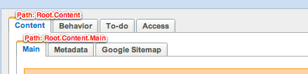
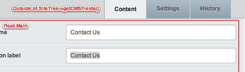
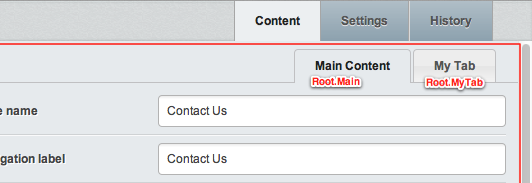

# 3.0.0 (Released 28 June 2012) #

## Overview ##

### CMS

 * New CMS interface design more geared towards complex content solutions
  * List view for pages (sortable and filterable)
  * More powerful media and link insertion (including auto-embedding of external sources)
  * Batch actions on site tree moved to an "Edit Tree" view
  * "Add pages" shows a dedicated interface with more info about the page type
 * CMS JavaScript moved to [jQuery.entwine](https://github.com/hafriedlander/jquery.entwine)
 * CMS stylesheets are generated by SCSS to provide more flexible and robust styling

### Framework

 * Renaming of "sapphire" to SilverStripe "framework"
 * Allow usage of SilverStripe framework without the "cms" module
 * New template engine with more powerful syntax
 * New ORM layer with expressive and fluent syntax
 * New GridField component to replace ComplexTableField
 * FormField classes now have their own HTML templates
 * Moved functionality to modules: Widget, RestfulServer, SapphireSoapServer, Translatable, IPRestrictions, PageComment, HomepageForDomain

## Detailed change logs ##

The detailed change logs are broken down by pre-release:

 * [3.0.0-rc3](/changelogs/rc/3.0.0-rc3) - 27 June 2012
 * [3.0.0-rc2](changelogs/rc/3.0.0-rc2) - 26 June 2012
 * [3.0.0-rc1](/changelogs/rc/3.0.0-rc1) - 18 June 2012
 * [3.0.0-beta3](/changelogs)/beta/3.0.0-beta3) - 28 May 2012
 * [3.0.0-beta2](/changelogs/beta/3.0.0-beta2) - 20 April 2012
 * [3.0.0-beta1](/changelogs/beta/3.0.0-beta1) - 12 March 2012
 * [3.0.0-alpha2](/changelogs/alpha/3.0.0-alpha2) - 12 January 2012
 * [3.0.0-alpha1](/changelogs/alpha/3.0.0-alpha1) - 1 November 2011
 * [3.0.0-pr1](/changelogs/pr/3.0.0-pr1) - 2 May 2011

## Upgrading ##

### Common Upgrade Tasks

 * Rename foder from `sapphire/`to `framework/`, replace own paths with `FRAMEWORK_DIR` (in PHP) or `$ModulePath(framework)` (in templates). Update paths in `.htaccess` or `web.config` ([more](#sapphire-rename))
 * Replace `<% control %>` in your templates with `<% loop %>` and `<% with %>` ([more](/reference/templates-upgrading-guide#control))
 * Replace `DataObjectSet` with `DataList` or `ArrayList` ([more](#deprecated-classes))
 * Rewrite `ComplexTableField` and `DataObjectManager` instances to `GridField`
 * Rewrite `Director::redirect()` and `Director::redirectBack()` calls ([more] (#director-static-functions-deprecated-director-redirect-and-director-redirectback-in-particular)
 * Use `<MyModel>::get()` rather than `DataObject::get()` ([more](#new-orm-datalist))
 * Use new syntax for `DataObjectDecorator::extraStatics` ([more](#extensions))
 * Change CMS tab paths from `Root.Content.Main` to `Root.Main`, move some field changes to new `SiteTree->getSettingsFields()` method ([more](#tab-paths))
 * Add new modules if using specific core features like Widget, RestfulServer, PageComment or Translatable

### sapphire renamed to framework {#sapphire-rename}

The `sapphire` module has been renamed to `framework`. Please ensure the framework now resides in the new folder when upgrading. Here's a list of steps to check:

 * Remove your existing `sapphire` directory, and replace with `framework` from the new SilverStripe 3.0 package
 * Rename references of `sapphire` to `framework` in `.htaccess`, `web.config` and `/usr/bin/sake` (the last is only necessary if you use `sake`)
 * Find and replace any references to `sapphire` in your custom code to `framework`. In your PHP code, you can use the constant `FRAMEWORK_DIR`,
which points to the framework directory, and in the templates you can use `$ModulePath(framework)`

### GridField: Replacement for TableListField and ComplexTableField [gridfield]###

We have a new component for managing lists of objects: The `[GridField](/topics/grid-field)`.
It's a substantial rewrite of the features previously captured by `TableListField`,
`ComplexTableField`, `HasManyComplexTableField` and `ManyManyComplexTableField`.

The legacy fields remain operational for now, although a switch to `GridField` is strongly encouraged,
for stability, interface and performance reasons. The `HasManyComplexTableField` and `ManyManyComplexTableField`
are no longer maintained, for those you do have to make the switch.
The `TableField` class will be deprecated soon, but we don't have an adequate replacement for it yet.

Upgrade example: Record listing

	:::php
	// before
	$field = new TableListField('Companies', 'Company');
	$field->setPageSize(20);
	// after
	$field = new GridField('Companies', null, Company::get());
	$field->getConfig()->getComponentByType('GridFieldPaginator')->setItemsPerPage(20);

Upgrade example: Record listing with view/edit interface

	:::php
	// before
	$field = new ComplexTableField($myController, 'Companies', 'Company');
	// after
	$field = new GridField('Companies', null, Company::get(), GridFieldConfig_RecordEditor::create());

Upgrade example: Relationship editing

	:::php
	// before
	$field = new HasManyComplexTableField($myController, 'MyRelation', 'MyRelationObject');
	// after
	$field = new GridField('MyRelation', null, $myRecord->MyRelation(), GridFieldConfig_RelationEditor::create());

More information is available in the [GridField documentation](/topics/grid-field).

### Object static functions replaced with new Config class {#new-config}
Static functions for getting a static variable on the `Object` class have been deprecated,
in favour of using the new `Config` class instead.

 * `Object::set_static('MyClass', 'myvar')` becomes `Config::inst()->update('MyClass', 'myvar', 'myval')` instead.
 * `Object::addStaticVars('MyClass', array('myvar' => 'myval'))` should be replaced with individual calls to `Config::inst()->update()` instead.
 * `Object::add_static_var('MyClass', 'myvar', 'myval')` becomes `Config::inst()->update('MyClass', 'myvar', 'myval')` instead.
 * `Object::set_uninherited('MyClass', 'myvar', 'myval')` becomes `Config::inst()->update('MyClass', 'myvar', 'myval')` instead.

Any arrays you pass as values to `update()` will be automatically merged. To replace the variable, call `remove()` first, then call `update()`.

 * `Object::get_static('MyClass', 'myvar')` becomes `Config::inst()->get('MyClass', 'myvar', Config::FIRST_SET)`
 * `Object::uninherited_static('MyClass', 'myvar')` becomes `Config::inst()->get('MyClass', 'myvar', Config::UNINHERITED)`
 * `Object::combined_static('MyClass', 'myvar')` becomes `Config::inst()->get('MyClass', 'myvar')` (no option as third argument)

Note the different options for the third parameter of `get()`:

 * `Config::INHERITED` will only get the configuration set for the specific class, not any of it's parents.
 * `Config::FIRST_SET` will inherit configuration from parents, but stop on the first class that actually provides a value.
 * `Config::EXCLUDE_EXTRA_SOURCES` will not use additional static sources (such as those defined on extensions)

If you don't set an option, it will get all the values for the static, including inherited ones.
This was previously known as `Object::combined_static()`.

### Director static functions deprecated (e.g. redirect() and redirectBack())

`Director::redirect()` and `Director::redirectBack()` are now marked as deprecated. If you have a `Controller` instance and need to redirect, call `redirect()` or `redirectBack()` on the instance
instead, e.g. `$controller->redirect()` or `$controller->redirectBack()`. Most of the time, form action handler methods on a controller need only call `$this->redirect()` or `$this->redirectBack()`.

Use `Controller::curr()->redirect()` and `Controller::curr()->redirectBack()` if you need to redirect in contexts where a controller might not be immediately available.

### DataExtension and deprecated extraStatics on extension classes {#extensions}

`DataObjectDecorator` has been renamed to `DataExtension`. Please extend this class in case you
have written your own extensions.

`extraStatics()` on extensions is now deprecated.

Instead of using `extraStatics()`, you can simply define static variables on your extension directly.

If you need custom logic, e.g. checking for a class before applying the statics on the extension,
you can use `add_to_class()` as a replacement to `extraStatics()`.

	:::php
	class MyExtension extends Extension {
		
		// before
		function extraStatics($class, $extensionClass) {
			if($class == 'MyClass') {
				return array(
					'db' => array(
						'Title' => 'Varchar'
					);
				);
			}
		}

		// after
		static $db = array(
			'Title' => 'Varchar'
		);

		// advanced syntax
		static function add_to_class($class, $extensionClass, $args = null) {
			if($class == 'MyClass') {
				Config::inst()->update($class, 'db', array(
					'Title' => 'Varchar'
				));
			}
			parent::add_to_class($class, $extensionClass, $args);
		}	
	}

### New ORM: More flexible and expressive querying via `DataList` {#new-orm-datalist}

The new "fluent" syntax to retrieve ORM records allows for a more
expressive notation (instead of unnamed arguments). 

	:::php
	// before
	DataObject::get('Member', '"FirstName" = \'Sam'\', '"Surname" ASC");
	// after
	Member::get()->filter(array('FirstName' => 'Sam'))->sort('Surname');
	
The underlying record retrieval and management is rewritten from scratch, and features
lazy loading which fetches only the records it needs, as late as possible.
In order to retrieve all ORM records manually (as the previous ORM would've done),
please use `DataList->toArray()`.

The old getters (`DataObject::get()`, `DataObject:;get_one()`, `DataObject::get_by_id()`)
are now deprecated, but continue to operate. Instead of a `DataObjectSet`, they'll
now return a `DataList`.

	:::php
	// before
	DataObject::get_one('Member', '"Email" = \'someone@example.com\'');
	// after
	Member::get()->filter('Email', 'someone@example.com')->First();

	:::php
	// before
	DataObject::get_by_id('Member', 5);
	// after
	Member::get()->byID(5);

Note that they will return a `DataList` even if they're empty, so if you want to check 
for the presence of records, please call the count() method on the `DataList`:

	:::php
	// before
	if(!DataObject::get('SiteTree', '"ParentID" = 5')) echo "Page 5 has no children";
	// after
	if(!DataObject::get('SiteTree', '"ParentID" = 5')->count()) echo "Page 5 has no children";

Beware that `DataList->remove()` will delete an entry from the database.
See the ["datamodel" documentation](../../topics/datamodel) for more details.

### New ORM: Changes to manipulation of SQL queries {#new-orm-sql-queries}

In the 2.4 ORM it was sometimes necessary to bypass the ORM for performance reasons.  For example,
this command would have been intolerably slow:

	:::php
	SiteTree::get()->count();
	
The 3.0 ORM is more intelligent gives you tools you need to create high-performance code without
bypassing the ORM:

	:::php
	// before
	echo DB::query("SELECT COUNT(*) FROM \"SiteTree\"")->value();
	// after
	echo SiteTree::get()->count()

Both `extendedSQL()` and `buildSQL()` have been deprecated.  There is not currently any way of 
overriding the query generation code equivalent to overriding `buildSQL()` in 2.4, but this facility
was error prone.  If you need to access the `SQLQuery` object, you can call `->dataQuery()->query()`
on any DataList.  Note that modifications to this query will **not** be passed back into the DataList.

	:::php
	// before
	$query = singleton('SiteTree')->extendedSQL('ParentID = 5');
	// after
	$query = SiteTree::get()->filter('ParentID', 5)->dataQuery()->query();

We advise that you keep this kind of code to a minimum and that you use the DataList wherever possible.
If you find yourself needing to bypass the ORM in SilverStripe 3, we suggest you raise this
as a discussion topic on silverstripe-dev@groups.google.com, as we may want to add more tools to
the ORM to help you.

### New ORM: Better encapsulation of relationship queries with `RelationList` ###

The abstract `RelationList` class and its implementations `ManyManyList` and `HasManyList`
are replacing the `ComponentSet` API, which is only relevant if you have instanciated these manually.
Relations are retrieved through the same way (e.g. `$myMember->Groups()`).

### `SQLQuery` changes ###

`SQLQuery` has been changed so direct access to internal properties `$from`, `$select`, `$orderby` is
now deprecated. Instead, there are now methods you can call which allow you to get and set SQL clauses instead.

 * `$from` getter is `getFrom()` and setters `setFrom()` and `addFrom()`
 * `$select` getter is `getSelect()` and setters `setSelect()` and `addSelect()`
 * `$where` getter is `getWhere()` and setter `setWhere()` and `addWhere()`
 * `$orderby` getter is `getOrderBy()` and setter `setOrderBy()` and `addOrderBy()`
 * `$groupby` getter is `getGroupBy()` and setter `getGroupBy()` and `addGroupBy()`
 * `$having` getter is `getHaving()` and setter `setHaving()` and `addHaving()`
 * `$limit` getter is `getLimit()` and setter `setLimit()`
 * `$distinct` getter is `getDistinct()` and setter `setDistinct()`
 * `$delete` getter is `getDelete()` and setter `setDelete()`
 * `$connective` getter is `getConnective()` and settter `setConnective()`
 * `innerJoin()` has been renamed to `addInnerJoin()`
 * `leftJoin()` has been renamed to `addLeftJoin()`

### Aggregate changes for partial caching in templates ###

`DataObject::Aggregate()` and `DataObject::RelationshipAggregate()` are now deprecated. To replace your deprecated aggregate calls
in PHP code, you should query with something like `Member::get()->max('LastEdited')`, that is, calling the aggregate on the `DataList` directly.
The same concept applies for replacing `RelationshipAggregate()`, just call the aggregate method on the relationship instead,
so something like `Member::get()->Groups()->max('LastEdited')`.

For partial caching in templates, the syntax `<% cached Aggregate(Page).Max(LastEdited) %>` has been deprecated. The new syntax is similar,
except you use `List()` instead of `Aggregate()`, and the aggregate call `Max()` is now lowercase, as in `max()`.
An example of the new syntax is `<% cached List(Page).max(LastEdited) %>`. Check `DataList` class for more aggregate methods to use.

### InnoDB driver for existing and new tables on MySQL (instead of MyISAM) [innodb]###

SilverStripe has traditionally created all MySQL tables with the MyISAM storage driver,
mainly to ensure a fulltext search based on MySQL works out of the box.
Since then, the framework has gained many alternatives for fulltext search
([sphinx](https://github.com/silverstripe/silverstripe-sphinx), [solr](https://github.com/nyeholt/silverstripe-solr), etc.), and relies more on database transactions and other features not available in MyISAM.

This change convert tables on existing databases when `dev/build` is called,
unless the `FullTextSearch` feature is enabled. In order to disable this behaviour,
you have to add the following code to your `_config.php` BEFORE running a `dev/build`:

	:::php
	DataObject::$create_table_options['MySQLDatabase'] = 'ENGINE=MyISAM';

As with any SilverStripe upgrade, we recommend database backups before calling `dev/build`.
See [mysql.com](http://dev.mysql.com/doc/refman/5.5/en/converting-tables-to-innodb.html) for details on the conversion.
Note: MySQL has made InnoDB the default engine in its [5.5 release](http://dev.mysql.com/doc/refman/5.5/en/innodb-storage-engine.html).

### Convert::json2array() changes [raw2json]###

Convert JSON functions have been changed to use built-in json PHP functions `json_decode()` and `json_encode()`.
Because `json_decode()` will convert nested JSON structures to arrays as well, this has changed the way it worked,
as before nested structures would be converted to an object instead. So, given the following JSON input to `Convert::json2array()`:

	{"Joe":"Bloggs","Tom":"Jones","My":{"Complicated":"Structure"}}

Here's the output from SilverStripe 2.4, with nested JSON as objects:

	array(
		'Joe' => 'Bloggs'
		'Tom' => 'Jones',
		'My' => stdObject(
			Complicated => 'Structure' // property on object
		)
	)

Now in SilverStripe 3.x, nested structures are arrays:

	array(
		'Joe' => 'Bloggs',
		'Tom' => 'Jones',
		'My' => array(
			'Complicated' => 'Structure' // key value on nested array
		)
	)

### New template engine [templates]###

The template engine has been completely rewritten, and although it is generally backward compatible, there are new features
and some features have been deprecated. See the [template upgrading guide](/reference/templates-upgrading-guide) and the
[template reference](/reference/templates) for more information.

### Removed view-specific accessors from ViewableData ####

Several methods in ViewableData that were originally added to expose values to the template language were moved,
in order to stop polluting the namespace. These were sometimes called by project-specific PHP code too, and that code
will need re-working.

See the [template upgrading guide](/reference/templates-upgrading-guide) for a list of methods and their replacements.

### New user interface for CMS [ui]###

Most aspects of the interface have been redesigned, which necessitated a substantial
redevelopment of the underlying logic and presentation. 
If you have customized the admin interface in any way, please review
the detailed changelog for this release. Many interface components have changed completely,
unfortunately there is no clear upgrade path for every interface detail.
As a starting point, have a look at the new templates in `cms/templates`
and `framework/admin/templates`, as well as the new [jQuery.entwine](https://github.com/hafriedlander/jquery.entwine) 
based JavaScript logic. Have a look at the new ["Extending the CMS" guide](../howto/extending-the-cms),
["CSS" guide](../topics/css), ["JavaScript" guide](../topics/javascript) and
["CMS Architecture" guide](/reference/cms-architecture) to get you started.

### New tree library [tree]###

The page tree moved from a bespoke tree library to [JSTree](http://jstree.com),
which required changes to markup of the tree and its JavaScript architecture.
This includes changes to `TreeDropdownField` and `TreeMultiSelectField`.

### TinyMCE upgraded to 3.5 ###

TinyMCE has been upgraded to version 3.5.

This change should be transparent to most people upgrading, but if you're using custom plugins for TinyMCE,
please ensure they are still working correctly with the new version.

If you're upgrading from an SS 3.0 beta, TinyMCE HTML source editor and other popups might be blank.
This is caused by the TinyMCE compressor leaving stale cache files in the system temp folder from an earlier
version. To resolve this problem, simply delete the `{hash}.gz` files within your temp location (defined by `sys_get_temp_dir()` in PHP.)
These cache files will be regenerated next time the CMS is opened.

### Settings-related fields move from SiteTree->getCMSFields() to new SiteTree->getSettingsFields() [getcmsfields]###

The fields and tabs are now split into two separate forms, which required a structural
change to the underlying class logic. In case you have added or removed fields
in the "Behaviour" or "Access" tab, please move these customizations to a new `getSettingsFields()` method.
In case of SiteTree extension through `updateCMSFields()` and a decorator/extension,
please use the new `updateSettingsFields()` instead.

We've also removed the `$params` attribute on `DataObject->getCMSFields()`
which could be used as a shortcut for customizations to `FormScaffolder`,
in order to achieve E_STRICT compliance. Please use `FormScaffolder` directly.

### Changed tab paths in SiteTree->getCMSFields() {#tab-paths}

In order to simplify the interface, the `SiteTree->getCMSFields`
method now only has one rather than two levels of tabs.
This changes the tab paths, affecting any fields you might have added.
We have also moved all fields from the "Metadata" tab into the "Main Content" tab. 

	:::php
	// 2.4
	$fields->addFieldToTab('Root.Content.Main', $myField);
	$fields->addFieldToTab('Root.Content.Metadata', $myOtherField);
	// 3.0
	$fields->addFieldToTab('Root.Main', $myField);
	$fields->addFieldToTab('Root.Main', $myOtherField);

The old paths are rewritten automatically, but will be deprecated in the next point release.
If you are working with tab objects directly in your `FieldSet`, you'll need to update
the tab names manually:

	:::php
	// 2.4
	$fields->fieldByName('Root')->fieldByName('Content')->fieldByName('Main')->push($myField);
	// 3.0
	$fields->fieldByName('Root')->fieldByName('Main')->push($myField);

If only a single tab is found in any CMS tabset, it is hidden by default
to reduce UI clutter. You still need to address it through the usual tabset methods,
as the underlying object structure doesn't change. Once you add more tabs,
e.g. to the "Root.Main" tab in `SiteTree`, the tab bar automatically shows.

### New `SiteTree::$description` field to describe purpose of a page type [sitetree-description]###

Please use this static property to describe the purpose of your page types,
which will help users understand the new "Add page" dialog.
For example, a `TeamPage` type could be described as "Lists all team members, linking to their profiles".
Note: This property is optional (defaults to an empty string), but its usage is highly encouraged.

### New ModelAdmin interface, removed sub-controllers [modeladmin]

ModelAdmin has been substanially rewritten to natively support the `[api:GridField]` API
for more flexible data presentation (replacing `[api:ComplexTableField]`),
and the `[api:DataList]` API for more expressive querying.

If you have overwritten any methods in the class, customized templates,
or implemented your own `$collection_controller_class`/`$record_controller_class` controllers,
please refer to the new [ModelAdmin documentation](/reference/modeladmin)
on details for how to achieve the same goals in the new class.

### Stylesheet preprocessing via SCSS and the "compass" module [scss]###

CSS files in the `cms` and `framework/admin` modules are now generated through
the ["compass" SilverStripe module](http://silverstripe.org/compass-module), which uses
the ["Compass" framework](http://compass-style.org/) and the ["SCSS" language](http://sass-lang.com/).
This allows us to build more flexible and expressive stylesheets as a foundation for any
extensions to the CMS interface. 

The "compass" module is only required if core stylesheets are modified,
not when simply using the CMS or developing other CMS functionality.
If you want to extend the CMS stylesheets for your own projects without SCSS,
please create a new CSS file and link it into the CMS via `[api:LeftAndMain::require_css()]`.

### Built-in Javascript validation removed {#js-validation}

Built-in client-side form validation using `Validator.js` and `behaviour.js` has been removed, and is no longer supported.
Server-side validation remains. Developers are encouraged to use custom Javascript validation on their
forms if requiring client-side validation.
You don't need to explicitly disable JS validation through `Validator::set_javascript_validation_handler()`
any longer (the method is deprecated).

### FormField consistently adds classes to HTML elements [formfield-classes]###

The [api:FormField] API has been refactored to use SilverStripe templates
for constructing the field HTML, as well as new accessors for HTML attributes.
This change makes the HTML a bit more predictable, but it also means that
you need to check any code (CSS, JavaScript, etc) relying on the old inconsistencies.
Particularly, CSS class names applied through [api:FormField->addExtraClass()]
and the "type" class are now consistently added to the container `
`
as well as the HTML form element itself.

	:::html
	Before (abbreviated):
	

		<input type="checkbox".../>
	

	After (abbreviated):
	

		<input type="checkbox" class="checkbox extraClass".../>
	

### FormField constructor argument changes [formfield-constructor]###

In order to enforce a consistent parameter order in core [api:FormField] subclasses,
its no longer possible to set the following optional attributes via constructor arguments:
`$form`, `$maxLength`, `$rightTitle`, `$rows`/`$cols` (for `TextareaField` and `HtmlEditorField`)
and `$folderName` (for `FileField` and `SimpleImageField`).
Please use the appropriate setters on the form field instance instead.

### EmailField now uses type "email" instead of type "text" {#email-form-field}

EmailField now uses "email" for the `type` attribute, which integrates better with HTML5 features like
form validation in the browser. If you want to change this back to "text", use `setAttribute()` when constructing the field:

	:::php
	$field = new EmailField('Email');
	$field->setAttribute('type', 'text');

### Restructured files and folders [file-restructure]###

In order to make the SilverStripe framework useable without the `cms` module,
we've moved some files around. 
CMS base functionality which is not directly related to content pages (`SiteTree`) 
has been moved from the `cms` module into a new "sub-module" located in `framework/admin`. 
This includes generic management interfaces like "Files & Images" (`AssetAdmin`),
"Security" (`SecurityAdmin`) and the `ModelAdmin` class.
On the other hand, `SiteTree` related features were moved from `framework` to the `cms` module.

Due to the built-in PHP class autoloader,
this usually won't have any effect on your own code (unless you're including direct file paths).
For any other files (CSS files, templates, images, JavaScript) which might
be referenced by their path, please doublecheck that their path is still valid.

### Removed prototype.js and and behaviour.js dependencies from most core components [prototype-behaviour]

This will only affect you if you used either of those libraries,
or by extension on the globals set in `prototype_improvements.js` and `jquery_improvements.js`.
The `$$()` shorthand for `document.getElementsBySelector()` is no longer globally bound,
but rather just defined when used through other components. The `$()` shorthand
had two meanings, based on context: Either `document.getElementsById()` through prototype.js,
or as an alias for the `jQuery()` method. In general, we recommend not to rely on
the `$()` global in SilverStripe, as we unset it via `[jQuery.noConflict()](http://api.jquery.com/jQuery.noConflict/)`.
Use a [custom alias via function scope](http://api.jquery.com/jQuery.noConflict/#example-1) if possible.

### Moved `Widget` API into new 'widgets' module [widgets]###

See [module on github](https://github.com/silverstripe/silverstripe-widgets).

### Moved `RestfulServer` and `SapphireSoapServer` API into new modules###

See ["restfulserver"](https://github.com/silverstripe/silverstripe-restfulserver) 
and ["soapserver"](https://github.com/silverstripe/silverstripe-soapserver) modules on github.

### Moved `Translatable` extension into new 'translatable' module ###

If you are translating your `SiteTree` or `DataObject` classes with the `Translatable`
extension, please install the new module from `http://silverstripe.org/translatable-module`.
The following settings can be removed from your own `_config.php`, as they're automatically
included through `translatable/_config.php`:

	Object::add_extension('SiteTree', 'Translatable');
	Object::add_extension('SiteConfig', 'Translatable');

### Moved Group->IPRestrictions into a new 'securityextras' [securityextras]module

IP restrictions for group memberships in the "Security" section were a rarely used feature,
and cluttered up the interface. We've decided to move it to a separate module
called [securityextras](https://github.com/silverstripe-labs/silverstripe-securityextras).
To continue using these restrictions, just install the module - no data migration required.

### Moved comments system into new 'comments' module [comments]###

This affects websites which have comments enabled, through the `$Comments`
placeholder and the `PageComment` class. See the ['comments' module](https://github.com/silverstripe/silverstripe-comments). To continue using comments, simply install the module - no data migration required.

### Moved SiteTree->HomepageForDomain into a new 'homepagefordomain' module [homepagefordomain]

The setting determines difference homepages at arbitrary locations in the page tree,
and was rarely used in practice - so we moved it to a "[homepagefordomain](https://github.com/silverstripe-labs/silverstripe-homepagefordomain)" module.

### New syntax for translatable _t functions [i18n-t]###

You can now call the `_t()` function in both templates and code with a namespace and string to translate, as well as a comment and injection array. 

The new syntax supports injecting variables into the translation. For example:

	:::php
    _t(
    	'i18nTestModule.INJECTIONS2', 
    	"Hello {name} {greeting}", 
    	array("name"=>"Paul", "greeting"=>"good you are here")
    );

We've written the injection logic in a way that keeps backwards compatible with
existing translations. This means that you can migrate from `sprintf()` to the new injection
API incrementally. The following to "mixed usage" examples still work, although they
don't get the advantage of flexible ordering in substitutions.

	:::php
	_t(
		'i18nTestModule.INJECTIONS2', 
		"Hello {name} {greeting}", 
		array("Paul", "good you are here")
	);
	_t(
		'i18nTestModule.INJECTIONS2', 
		"Hello %s, %s", 
		array("name"=>"Paul", "greeting"=>"good you are here")
	);

Of course, you can keep using `sprintf()` for variable substitution in your own code.

### Default translation source in YML instead of PHP $lang array, using Zend_Translate {#zend-translate}

This allows for a more flexible handling of translation sources in various formats.
Your own translations can be converted automatically via the ["i18n_yml_converter" module](https://github.com/chillu/i18n_yml_converter). Any modifications
to the `$lang` global variable need to be re-applied via YML, or directly to the new translation adapters.

	:::php
	i18n::get_translator('core')->getAdapater()->addTranslation(array(
		'content' => array('My.Entity' => 'My Translation'),
		'locale' => 'en_US',
		'usetranslateadapter' => true
	));

In order to keep backwards compatibility for PHP-based translations
(from modules or your own code) without conversion, please add the following to your `_config.php`.
Note that its just necessary if SilverStripe is used in a language other than the default (`en_US`).

	:::php
	i18n::register_translator(
		new Zend_Translate(array(
			'adapter' => 'i18nSSLegacyAdapter',
			'locale' => i18n::default_locale(),
			'disableNotices' => true,
		)),
		'legacy',
		9 // priority lower than standard translator
	);

### Removed the need to register SS_Reports

The SS_Report::register() method is deprecated. You no longer need to explicitly register reports. The CMS now
automatically picks up and adds all Report classes to the list of reports in ReportAdmin. You can choose to exclude
certain reports by using the SS_Report::add_excluded_reports() method.

### Removed the ability use a SQLQuery object in a SS_Report

You can no longer create reports that using the deprecated DataObject->buildSQL and DataObject->extendedSQL
methods to build raw SQL queries. Instead please use the DataList::create function to create your query and modify it
using the filter() function on the DataList object.

### Removed "auto-merging" of member records from `Member->onBeforeWrite()` [member-merging]

Due to security reasons. Please use `DataObject->merge()` explicitly if this is desired behaviour.

### Unit tests require definition of used `DataObject` and `Extension` classes [tests]###

This change was necessary in order to improve performance of the test framework,
and avoid rebuilding the database where no database access is required.
It also won't build any `DataObject` subclasses implementing the `TestOnly` interface,
unless these are explicitly noted.

 * `SapphireTest->extraDataObjects`: List all `TestOnly` classes relevant to your test class here.
 * `SapphireTest->requiredExtensions`: Maps `DataObject` classes to an array of required extensions.
   Example: `array("MyTreeDataObject" => array("Versioned", "Hierarchy"))`
 * `SapphireTest->illegalExtensions`: Does the reverse of `requiredExtensions`: Removes already applied extensions.

Alternatively, you can enforce database usage by setting `SapphireTest->usesDatabase` to `TRUE` in your test class.

### Breadcrumbs [breadcrumbs]###

Breadcrumbs have been altered to be their own template. In the process of this, the common static
SiteTree::$breadcrumbs_delimiter has been removed. To customise breadcrumbs now, create a template
BreadcrumbsTemplate.ss from cms/template to your theme or application.

### Deprecation API {#deprecation}

There is a new deprecation API that generates deprecation notices.  Calls to Deprecated methods
will only produce errors if the API was deprecated in the release equal to or earlier than the
"notification version".

`framework/_config.php` currently contains a call to throw notices calls to all methods deprecated 
in 3.0.

	Deprecation::notification_version('3.0.0');
	
If you change the notification version to 3.0.0-dev, then only methods deprecated in older versions
(e.g. 2.4) will trigger notices, and the other methods will silently pass.  This can be useful if
you don't yet have time to remove all calls to deprecated methods.

	Deprecation::notification_version('3.0.0-dev');

### Deprecated Classes ###

 * `ComplexTableField`: Use `GridField` instead
 * `DataObjectDecorator`: Use `DataExtension` instead
 * `DataObjectSet`: Use `DataList` instead
 * `FileIframeField`: Use `UploadField`
 * `HasManyComplexTableField`: Use `GridField` instead
 * `ImageField`: Use `UploadField` with `$myField->allowedExtensions = array('jpg', 'gif', 'png')`
 * `ManyManyComplexTableField`: Use `GridField` instead
 * `SimpleImageField`: Use `FileField` or `UploadField` with `setAllowedExtensions()`
 * `TableListField`: Use `GridField` instead 

### Renamed Classes ###

 * `CMSMainMarkingFilter`: Use `CMSSiteTreeFilter_Search` instead * 
 * `DataObjectDecorator`: Use `DataExtension` instead (the class doesn't implement the [GOF "Decorator" pattern](http://en.wikipedia.org/wiki/Decorator_pattern))
 * `MySQLFulltextSearchable`: Use `FulltextSearchable` instead

### Removed Classes ###

 * `AdvancedSearchForm`: Use `SearchForm` and extend to get similar functionality.
 * `Archive`, `TarballArchive`: If you make use of these, copy the classes from 2.4 into your project.
 * `AssetTableField`: Use `GridField` with `GridFieldConfig_RelationEditor` instead
 * `ComponentSet`: Use `ManyManyList` or `HasManyList`
 * `CustomRequiredFields`: Use `RequiredFields`
 * `DataObjectLog`: There is no replacement for this.
 * `DataObjectSet`: Use `ArrayList` or `DataList` instead
 * `FieldSet`: Use `FieldList` instead
 * `GeoIP`: Moved to separate ["geoip" module](https://github.com/silverstripe-labs/silverstripe-geoip)
 * `MemberTableField`: Use `GridField` with `GridFieldConfig_RelationEditor` instead
 * `Notifications`: If you make use of this, copy the classes from 2.4 into your project.
 * `NZGovtPasswordValidator`: Moved to ["securityextras" module](https://github.com/silverstripe-labs/silverstripe-securityextras)
 * `QueuedEmail`, `QueuedEmailDispatchTask`: If you make use of these, copy the classes from 2.4 into your project.
 * `RestrictedTextField`, `UniqueTextField`, `UniqueRestrictedTextField`, `AutocompleteTextField`, `ConfirmedFormAction`: Use custom fields instead
 * `SQLMap`: Use `SS_Map` instead
 * `TreeSelectorField`: Use `TreeDropdownField` instead.
 * `XML`: Use PHP's built-in SimpleXML instead
