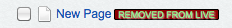

# How to customize CMS Tree Node #

## Introduction ##

A tree node in CMS could be rendered with lot of extra information but a node title, such as a
link that wraps around the node title, a node's id which is given as id attribute of the node
&lt;li&gt; tag, a extra checkbox beside the tree title, tree icon class or extra &lt;span&gt;
tags showing the node status, etc. SilverStripe tree node will be typically rendered into html
code like this:

	:::ss
	...
	<ul>
		...
		<li id="record-15" class="class-Page closed jstree-leaf jstree-unchecked" data-id="15">
		<ins class="jstree-icon">&nbsp;</ins>
			<a class="" title="Page type: Page" href="admin/page/edit/show/15">
				<ins class="jstree-checkbox">&nbsp;</ins>
				<ins class="jstree-icon">&nbsp;</ins>
				
					
					New Page
					Deleted
				
			</a>
		</li>
		...
	</ul>
	...
	
By applying the proper style sheet, the snippet html above could produce the look of:

	
## How to customize a tree node with publication status ##

SiteTree is a `[api:DataObject]` which is versioned by `[api:Versioned]` extension. It
defaulted to have either one of the four publication status flags or have no flag in the
most common case, the four common flags are in the format of mapping. i.e.

	:::php
	array(
		"removedfromdraft" => 'Removed from draft',
		"deletedonlive" => 'Deleted',
		"addedtodraft" => 'New',
		"modified" => 'Modified',
	);
Depending on the publication status, a site tree node will eventually pick up one of the
four or end up without any flag.

Developers can easily add a new flag, delete or alter an existing flag on how it is looked
or changing the flag label. The customization of these lozenges could be done either through
inherited subclass or `[api:DataExtension]`. It is just really about how we change the return
value of function `SiteTree->getTreeTitle()` by two easily extendable methods
`SiteTree->getStatusClass()` and `SiteTree->getStatusFlags()`.

Note: Though the flag is not necessarily tie to its status of __publication__ and it could
be used for flagging anything you like, we should keep this lozenge to show version-related
status, while let `SiteTree->CMSTreeClasses()` to deal with other customised classes, which
will be used for the class attribute of &lt;li&gt; tag of the tree node.

### Add new flag ###
__Example: using a subclass__

	:::php
	class Page extends SiteTree {
		function getScheduledToPublish(){
			// return either true or false
		}

		function getStatusClass(){
			if($this->getScheduledToPublish()){
				return 'scheduledtopublish';
			}else{
				return parent::getStatusClass();
			}
		}

		function getStatusFlags(){
			$flags = parent::getStatusFlags();
			$flags['scheduledtopublish'] = "Scheduled To Publish";
			return $flags;
		}
	}

The above subclass of `[api:SiteTree]` will add a new flag for indicating its
__'Scheduled To Publish'__ status.

__Example: using a decorator__

	:::php
	class SiteTreeDecorator extends DataExtension {
		function getScheduledToPublish(){
			// return either ture or false
		}

		function updateStatusClass(&$statusClass){
			if($this->getScheduledToPublish()){
				$statusClass ='scheduledtopublish':'';
			}
		}

		function updateStatusFlags(&$flags){
			$flags['scheduledtopublish'] = "Scheduled To Publish";
		}
	}

	Object::add_extension("SiteTree", "SiteTreeDecorator");

Both the above subclass and the decorator will produce same HTML code for `getTreeTitle()` if
the page is scheduled to publish:

	:::ss
	
	New Page
	Scheduled To Publish

The look of the page node will be changed

from  to 

### Delete an existing flag ###
Assuming you want to show one of the existing flags presented by the mapping
__"deletedonlive" => 'Deleted'__ by some reason, it can be done:

__Example: using a subclass__

	:::php
	class Page extends SiteTree {
		function getStatusClass(){
			$statusClass = parent::getStatusClass();
			if($statusClass !== 'deletedonlive'){
				return $statusClass;
			}
		}

		function getStatusFlags(){
			$flags = parent::getStatusFlags();
			unset($flags['scheduledtopublish']);
			return $flags;
		}
	}

__Example: using a decorator__

	:::php
	class SiteTreeDecorator extends DataExtension {
		function updateStatusClass(&$statusClass){
			if($statusClass === 'deletedonlive'){
				$statusClass = '';
			}
		}

		function updateStatusFlags(&$flags){
			unset($flags['scheduledtopublish']);
		}
	}

	Object::add_extension("SiteTree", "SiteTreeDecorator");

Both the above subclass and the decorator will produce same HTML code for `getTreeTitle()` if
the page is __'Deleted on live', i.e. no flag at all:

	:::ss
	New Page

The look of the page node will be changed

from  to 

### Alter an existing flag ###
Assuming you want to alter one of the existing flags presented by the mapping
__"deletedonlive" => 'Deleted'__ by some reason, it can be done:

__Example: using a subclass__

	:::php
	class Page extends SiteTree {
		function getStatusClass(){
			$statusClass = parent::getStatusClass();
			if($statusClass === 'deletedonlive'){
				return 'removedonlive';
			}
		}

		function getStatusFlags(){
			$flags = parent::getStatusFlags();
			unset($flags['scheduledtopublish']);
			$flags['removedonlive'] = 'Removed from live site';
			return $flags;
		}
	}

__Example: using a decorator__

	:::php
	class SiteTreeDecorator extends DataExtension {
		function updateStatusClass(&$statusClass){
			if($statusClass === 'deletedonlive'){
				$statusClass = 'removedonlive';
			}
		}

		function updateStatusFlags(&$flags){
			unset($flags['scheduledtopublish']);
			$flags['removedonlive'] = 'Removed from live site';
		}
	}

	Object::add_extension("SiteTree", "SiteTreeDecorator");

Both the above subclass and the decorator will produce same HTML code for `getTreeTitle()` if
the page is previously __'Deleted on live'__:

	:::ss
	
	New Page
	Removed from live site

The look of the page node will be changed

from  to 

## How to customize a tree node icon ##
__yet to add__

