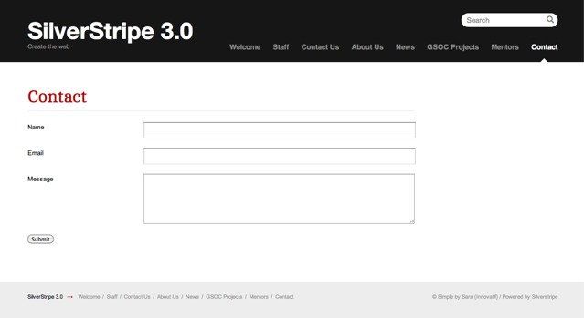

# How to make a simple contact form

In this how-to, we'll explain how to set up a specific page type
holding a contact form, which submits a message via email.
Let's start by defining a new `ContactPage` page type:

	:::php
	<?php
	class ContactPage extends Page {
	}
	class ContactPage_Controller extends Page_Controller {
		function Form() { 
			$fields = new FieldList( 
				new TextField('Name'), 
				new EmailField('Email'), 
				new TextareaField('Message')
			); 
			$actions = new FieldList( 
				new FormAction('submit', 'Submit') 
			); 
			return new Form($this, 'Form', $fields, $actions); 
		}
	}

To create a form, we instanciate a `Form` object on a function on our page controller. We'll call this function `Form()`. You're free to choose this name, but it's standard practice to name the function `Form()` if there's only a single form on the page.

There's quite a bit in this function, so we'll step through one piece at a time.

	:::php
	$fields = new FieldList(
		new TextField('Name'),
		new EmailField('Email'),
		new TextareaField('Message')
	);

First we create all the fields we want in the contact form, and put them inside a FieldList. You can find a list of form fields available on the `[api:FormField]` page.   

	:::php
	$actions = FieldList(
		new FormAction('submit', 'Submit')
	);

We then create a `[api:FieldList]` of the form actions, or the buttons that submit the form. Here we add a single form action, with the name 'submit', and the label 'Submit'. We'll use the name of the form action later.

	:::php
	return new Form('Form', $this, $fields, $actions);

Finally we create the `Form` object and return it. The first argument is the name of the form – this has to be the same as the name of the function that creates the form, so we've used 'Form'. The second argument is the controller that the form is on – this is almost always $this. The third and fourth arguments are the fields and actions we created earlier.

To show the form on the page, we need to render it in our template. We do this by appending $ to the name of the form – so for the form we just created we need to add $Form. Add $Form to the themes/currenttheme/Layout/Page.ss template, below $Content.

The reason it's standard practice to name the form function 'Form' is so that we don't have to create a separate template for each page with a form. By adding $Form to the generic Page.ss template, all pages with a form named 'Form' will have their forms shown.

If you now create a ContactPage in the CMS (making sure you have rebuilt the database and flushed the templates /dev/build?flush=all) and visit the page, you will now see a contact form.

Now that we have a contact form, we need some way of collecting the data submitted. We do this by creating a function on the controller with the same name as the form action. In this case, we create the function 'submit' on the ContactPage_Controller class.

	:::php
	class ContactPage_Controller extends Page_Controller {
		function Form() {
			// ...
		}
		function submit($data, $form) { 
			$email = new Email(); 
			 
			$email->setTo('siteowner@mysite.com'); 
			$email->setFrom($data['Email']); 
			$email->setSubject("Contact Message from {$data["Name"]}"); 
			 
			$messageBody = " 
				
<strong>Name:</strong> {$data['Name']}
 
				
<strong>Website:</strong> {$data['Website']}
 
				
<strong>Message:</strong> {$data['Message']}
 
			"; 
			$email->setBody($messageBody); 
			$email->send(); 
			return array(
				'Content' => '
Thank you for your feedback.
',
				'Form' => ''
			);
		}
	}

	Caution: This form is prone to abuse by spammers,
	since it doesn't enforce a rate limitation, or checks for bots.
	We recommend to use a validation service like the ["recaptcha" module](http://www.silverstripe.org/recaptcha-module/)
	for better security.

Any function that receives a form submission takes two arguments: the data passed to the form as an indexed array, and the form itself. In order to extract the data, you can either use functions on the form object to get the fields and query their values, or just use the raw data in the array. In the example above, we used the array, as it's the easiest way to get data without requiring the form fields to perform any special transformations.

This data is used to create an email, which you then send to the address you choose.

The final thing we do is return a 'thank you for your feedback' message to the user. To do this we override some of the methods called in the template by returning an array. We return the HTML content we want rendered instead of the usual CMS-entered content, and we return false for Form, as we don't want the form to render.

##How to add form validation

All forms have some basic validation built in – email fields will only let the user enter email addresses, number fields will only accept numbers, and so on. Sometimes you need more complicated validation, so you can define your own validation by extending the Validator class.

The framework comes with a predefined validator called `[api:RequiredFields]`, which performs the common task of making sure particular fields are filled out. Below is the code to add validation to a contact form:

	function Form() { 
		// ...
		$validator = new RequiredFields('Name', 'Message');
		return new Form($this, 'Form', $fields, $actions, $validator); 
	}

We've created a RequiredFields object, passing the name of the fields we want to be required. The validator we have created is then passed as the fifth argument of the form constructor. If we now try to submit the form without filling out the required fields, JavaScript validation will kick in, and the user will be presented with a message about the missing fields. If the user has JavaScript disabled, PHP validation will kick in when the form is submitted, and the user will be redirected back to the Form with messages about their missing fields.

