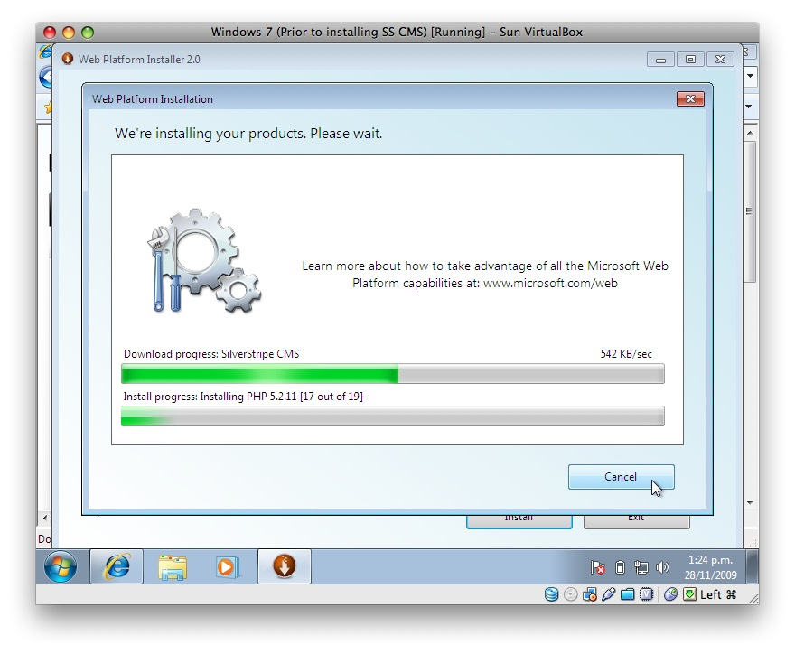
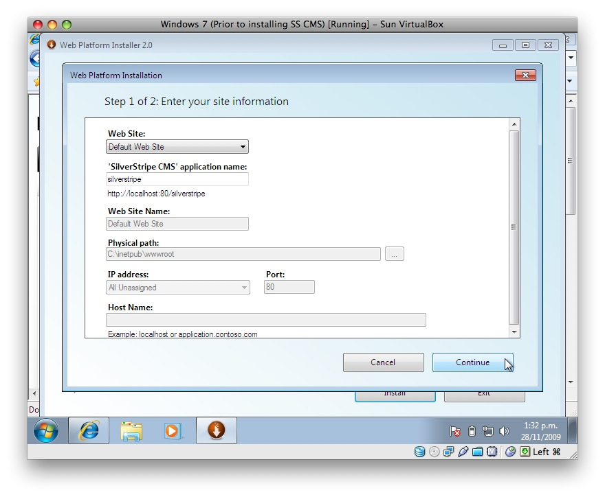
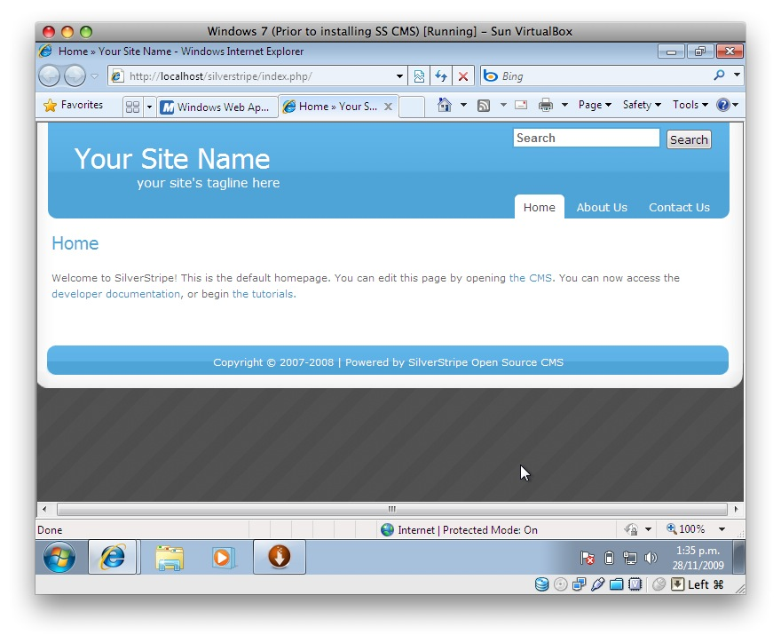
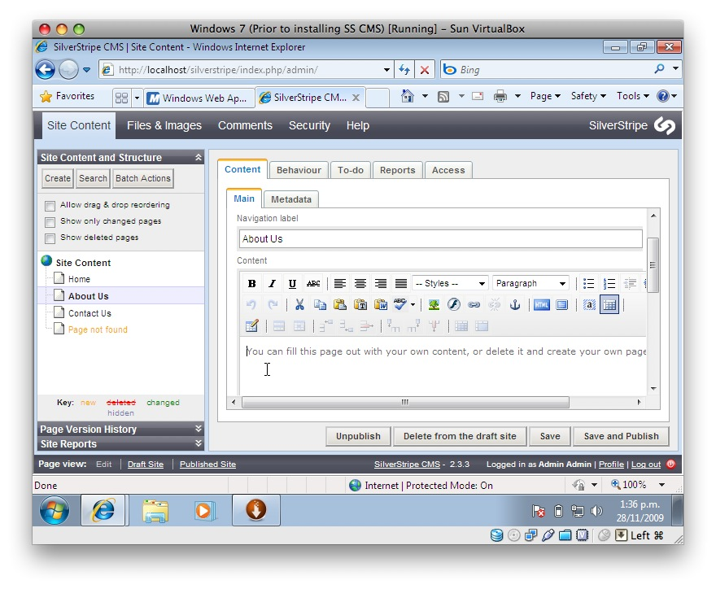

# Windows with Web Platform Installer (WebPI)

(Windows XP, 2003, 2008, Vista and 7)

## Installing SilverStripe

*  Download and run Microsoft Web Platform Installer (WebPI):

*  In WebPI, select 'SilverStripe' from the 'Content Management System' link
*  Select install. It will install dependancies like MySQL and PHP if you don't have these installed already.
*  Type in the questions it asks you, such as the username/password you set in the above MySQL installation:
*  Everything should be installed, with you seeing the initial webpage
*  And you can log-in to the CMS

## Important: Installation issue on XP

After you've installed SilverStripe on XP using WebPI. You'll need to make a configuration change to get it working.

Specifically, you need to configure XP not to check that a script file exists before executing the script.  This is
necessary for URLs of the form http://localhost/silverstripe/index.php/about-us/ to work.

*  Open IIS Administrator
*  Expand the local computer tree node
*  Expand the Web Sites tree node
*  Right click on "Default Web Site" and select "Properties"
*  Select the "Home Directory" Tab.
*  Click the "Configuration Button towards the bottom on the right
*  Select the "Mappings" Tab
*  Find the .php mapping, select it and click the "Edit" button
*  Make sure the check box "Check that file exists" is cleared.
*  Hit OK's all the way back up and restart IIS

## Support

*  http://www.silverstripe.org/installing-on-windows-now-easier-thanks-to-microsoft-web-platform-installer/  (This shows
a beta version of the software)
*  Microsoft Forum: http://forums.iis.net/1155.aspx
*  SilverStripe Installation Issues Forum: http://silverstripe.org/installing-silverstripe/

## Screenshots

