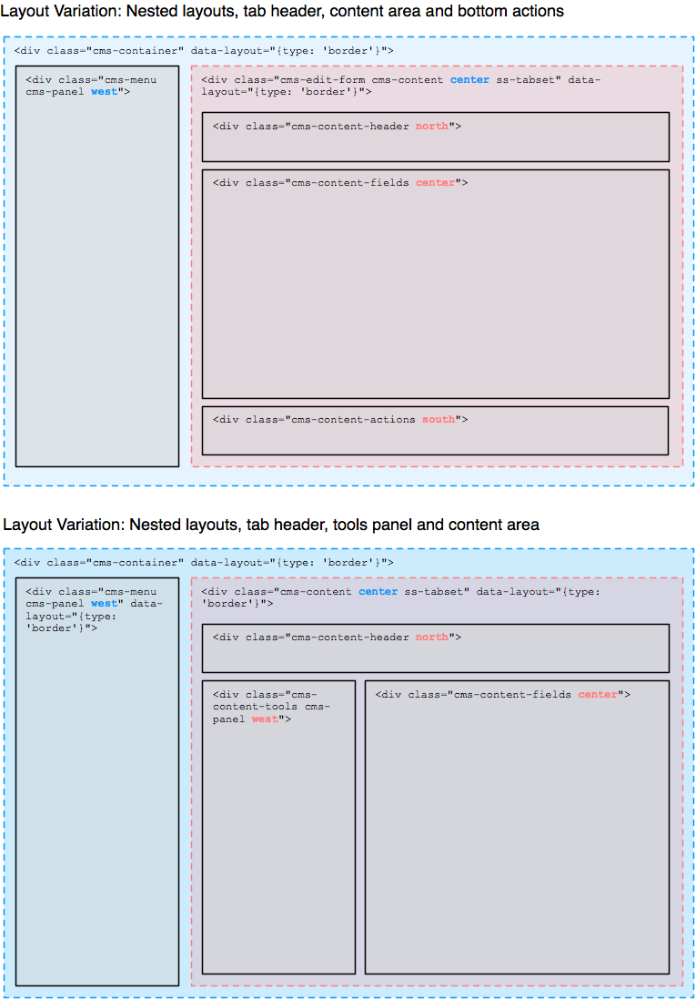

# CMS architecture

## Introduction

A lot can be achieved in SilverStripe by adding properties and form fields 
to your own page types (via `[api:SiteTree->getCMSFields()]`), as well as creating
your own data management interfaces through `[api:ModelAdmin]`. But sometimes
you'll want to go deeper and tailor the underlying interface to your needs as well.
For example, to build a personalized CMS dashboard, or content "slots" where authors
can drag their content into. At its core, SilverStripe is a web application
built on open standards and common libraries, so lots of the techniques should
feel familiar to you. This is just a quick run down to get you started
with some special conventions.

For a more practical-oriented approach to CMS customizations, refer to the
[Howto: Extend the CMS Interface](../howto/extend-cms-interface) which builds

## Markup and Style Conventions

While SilverStripe is intended to work with JavaScript only,
we're following the principles of "[Progressive Enhancement](http://en.wikipedia.org/wiki/Progressive_enhancement)"
where feasible, relying on a comparatively light layer of JavaScript to enhance
forms and markup generated on the server. This allows seamless customization of
aspects like form fields. We're explaining this philosophy in more detail 
on our [blog](http://www.silverstripe.org/the-3-0-ui-a-better-framework-for-your-ideas/)).

All CSS in the CMS UI is written in the [SCSS language extensions](http://sass-lang.com/)
and the [Compass framework](http://compass-style.org/), which helps
us maintain expressive and concise style declarations. The files are located in `framework/admin/scss`
(and if you have the `cms` module installed, in `cms/scss`), and are compiled to a `css` folder on the
same directory path. Changes to the SCSS files can be automatically converted by installing
the ["compass" module](http://www.silverstripe.org/compass-module/) for SilverStripe, 
although [installing the compass framework](http://compass-style.org/install/) directly works as well.
Each file describes its purpose at the top of the declarations. Note that you can write
plain CSS without SCSS for your custom CMS interfaces as well, we just mandate SCSS for core usage.

As there's a whole lot of CSS driving the CMS, we have certain best practives around writing it:

 * Use dashed lowercase naming for both `id` and `class` attributes (`my-class-name`), instead of camel case (`myClassName`)
 * Use the `id` attribute sparingly. Remember that it "closes off" the structure to code reuse, as HTML elements
   require unique `id` attributes. Code reuse can happen both in CSS and JavaScript behaviour.
 * Separate presentation from structure in class names, e.g. `left-menu` is encoding the component position
   (which might change later on). A more structural name could be `cms-menu` (or `cms-tools-menu` for a more specific version)
 * Class naming: Use the `cms-` class prefix for major components in the cms interface,
   and the `ss-ui-` prefix for extensions to jQuery UI. Don't use the `ui-` class prefix, its reserved for jQuery UI built-in styles.
 * Use jQuery UI's built-in styles where possible, e.g. `ui-widget` for a generic container, or `ui-state-highlight` 
   to highlight a specific component. See the [jQuery UI Theming API](http://jqueryui.com/docs/Theming/API) for a full list.

See our [system requirements](../installation/server-requirements) for a list of supported browsers.

## Templates and Controllers

The CMS backend is handled through the `[api:LeftAndMain]` controller class,
which contains base functionality like displaying and saving a record.
This is extended through various subclasses, e.g. to add a group hierarchy (`[api:SecurityAdmin]`),
a search interface (`[api:ModelAdmin]`) or an "Add Page" form (`[api:CMSPageAddController]`).

The controller structure is too complex to document here, a good starting point
for following the execution path in code are `[api:LeftAndMain->getRecord()]` and `[api:LeftAndMain->getEditForm()]`.
If you have the `cms` module installed, have a look at `[api:CMSMain->getEditForm()]` for a good
example on how to extend the base functionality (e.g. by adding page versioning hints to the form).

CMS templates are inherited based on their controllers, similar to subclasses of
the common `Page` object (a new PHP class `MyPage` will look for a `MyPage.ss` template).
We can use this to create a different base template with `LeftAndMain.ss`
(which corresponds to the `LeftAndMain` PHP controller class).
In case you want to retain the main CMS structure (which is recommended),
just create your own "Content" template (e.g. `MyCMSController_Content.ss`),
which is in charge of rendering the main content area apart from the CMS menu. 

Depending on the complexity of your layout, you'll also need to overload the
"EditForm" template (e.g. `MyCMSController_EditForm.ss`), e.g. to implement
a tabbed form which only scrolls the main tab areas, while keeping the buttons at the bottom of the frame.
This requires manual assignment of the template to your form instance, see `[api:CMSMain->getEditForm()]` for details.

Often its useful to have a "tools" panel in between the menu and your content,
usually occupied by a search form or navigational helper.
In this case, you can either overload the full base template as described above.
To avoid duplicating all this template code, you can also use the special `[api:LeftAndMain->Tools()]` and 
`[api:LeftAndMain->EditFormTools()]` methods available in `LeftAndMain`.
These placeholders are populated by auto-detected templates, 
with the naming convention of "<controller classname>_Tools.ss" and "<controller classname>_EditFormTools.ss".
So to add or "subclass" a tools panel, simply create this file and it's automatically picked up.

## Layout and Panels

The CMS markup is structured into "panels", which are the base units containing
interface components (or other panels), as declared by the class `cms-panel`. Panels can be made collapsible, and
get the ability to be resized and aligned with a layout manager, in our case [jLayout](http://www.bramstein.com/projects/jlayout/).
This layout manager applies CSS declarations (mostly dimensions and positioning) via JavaScript,
by extracting additional metadata from the markup in the form of HTML5 data attributes.
We're using a "border layout" which separates the panels into five areas: north, south, east, west and center (all of which are optional).
As layouts can be nested, this allows for some powerful combinations. Our 
[Howto: Extend the CMS Interface](../howto/extend-cms-interface) has a practical example on
how to add a bottom panel to the CMS UI. 

The various panels and UI components within them are not tightly coupled
to the layout engine, so any changes in dimension which impact the overall layout
need to be handled manually. In SilverStripe, we've established a convention for a `redraw()`
method on each panel and UI component for this purpose, which is usually invoked
through its parent container. Invocation order is crucial here, generally going from
innermost to outermost elements. For example, the tab panels have be applied in the CMS form
before the form itself is layouted with its sibling panels to avoid incorrect dimensions.

## Forms

SilverStripe constructs forms and its fields within PHP,
mainly through the `[getCMSFields()](api:DataObject->getCMSFields())` method.
This in turn means that the CMS loads these forms as HTML via Ajax calls,
e.g. after saving a record (which requires a form refresh), or switching the section in the CMS>

## JavaScript through jQuery.entwine

[jQuery.entwine](https://github.com/hafriedlander/jquery.entwine) is a thirdparty library
which allows us to attach behaviour to DOM elements in a flexible and structured mannger. 
It replaces the `behaviour.js` library used in previous versions of the CMS interface.
See [Topics: JavaScript](../topics/javascript) for more information on how to use it.
In the CMS interface, all entwine rules should be placed in the "ss" entwine namespace.
If you want to call methods defined within these rules outside of entwine logic,
you have to use this namespace, e.g. `$('.cms-menu').entwine('ss').collapse()`.

Note that only functionality that is custom to the CMS application needs to be built
in jQuery.entwine, we're trying to reuse library code wherever possible. 
The most prominent example of this is the usage of [jQuery UI](http://jqueryui.com) for
dialogs and buttons.

The CMS includes the jQuery.entwine inspector. Press Ctrl+` to bring down the inspector.
You can then click on any element in the CMS to see which entwine methods are bound to
any particular element.

## JavaScript and CSS dependencies via Requirements and Ajax

The JavaScript logic powering the CMS is divided into many files,
which typically are included via the `[api:Requirements]` class, by adding
them to `[api:LeftAndMain->init()]` and its subclassed methods.
This class also takes care of minification and combination of the files,
which is crucial for the CMS performance (see `[api:Requirements::combine_files()]`).

Due to the procedural and selector-driven style of UI programming in jQuery.entwine,
it can be difficult to find the piece of code responsible for a certain behaviour.
Therefore it is important to adhere to file naming conventions.
E.g. a feature only applicable to `ModelAdmin` should be placed in
`framework/admin/javascript/ModelAdmin.js`, while something modifying all forms (including ModelAdmin forms)
would be better suited in `framework/admin/javascript/LeftAndMain.EditForm.js`.
Selectors used in these files should mirrow the "scope" set by its filename,
so don't place a rule applying to all form buttons inside `ModelAdmin.js`.

The CMS relies heavily on Ajax-loading of interfaces, so each interface and the JavaScript
driving it have to assume its underlying DOM structure is appended via an Ajax callback
rather than being available when the browser window first loads. 
jQuery.entwine is effectively an advanced version of [jQuery.live](http://api.jquery.com/live/)
and [jQuery.delegate](http://api.jquery.com/delegate/), so takes care of dynamic event binding.

Most interfaces will require their own JavaScript and CSS files, so the Ajax loading has
to ensure they're loaded unless already present. A custom-built library called 
`jQuery.ondemand` (located in `framework/thirdparty`) takes care of this transparently -
so as a developer just declare your dependencies through the `[api:Requirements]` API.

## Ajax Loading and Browser History 

SilverStripe uses the HTML5 browser history to modify the URL without a complete window refresh,
and load its UI via Ajax by hooking into browser navigation events (through the 
[history.js](https://github.com/balupton/History.js/) wrapper library).
This technique has an impact on how any Ajax load needs to happen:
In order to support browser history (and change the URL state), 
a CMS developer needs to fire a navigation event rather than invoking the Ajax call directly. 

The main point of contact here is `$('.cms-container').loadPanel(<url>, <title>, <data>)`
in `LeftAndMain.js`. The `data` object can contain additional state which is required
in case the same navigation event is fired again (e.g. when the user pressed the back button).

No callbacks are allowed in this style of Ajax loading, as all state needs
to be "repeatable". Any logic required to be exected after the Ajax call
should be placed in jQuery.entinwe `onmatch()` rules which apply to the newly created DOM structures.
See `$('.cms-container').handleStateChange()` in `LeftAndMain.js` for details.

Alternatively, form-related Ajax calls can be invoked through their own wrappers,
which don't cause history events and hence allow callbacks: `$('.cms-container').submitForm()`.

## PJAX: Partial template replacement through Ajax

Many user interactions can change more than one area in the CMS.
For example, editing a page title in the CMS form changes it in the page tree
as well as the breadcrumbs. In order to avoid unnecessary processing,
we often want to update these sections independently from their neighbouring content.

In order for this to work, the CMS templates declare certain sections as "PJAX fragments"
through a `data-pjax-fragment` attribute. These names correlate to specific
rendering logic in the PHP controllers, through the `[api:PjaxResponseNegotiator]` class.

Through a custom `X-Pjax` HTTP header, the client can declare which view he's expecting,
through identifiers like `CurrentForm` or `Content` (see `[api:LeftAndMain->getResponseNegotiator()]`).
These identifiers are passed to `loadPanel()` via the `pjax` data option.
The HTTP response is a JSON object literal, with template replacements keyed by their Pjax fragment.
Through PHP callbacks, we ensure that only the required template parts are actually executed and rendered.
When the same URL is loaded without Ajax (and hence without `X-Pjax` headers),
it should behave like a normal full page template, but using the same controller logic.

Example: Create a bare-bones CMS subclass which shows breadcrumbs (a built-in method),
as well as info on the current record. A single link updates both sections independently
in a single Ajax request.

	:::php
	// mysite/code/MyAdmin.php
	class MyAdmin extends LeftAndMain {
		static $url_segment = 'myadmin';
		public function getResponseNegotiator() {
			$negotiator = parent::getResponseNegotiator();
			$controller = $this;
			// Register a new callback
			$negotiator->setCallback('MyRecordInfo', function() use(&$controller) {
				return $controller->MyRecordInfo();
			});
			return $negotiator;
		}
		public function MyRecordInfo() {
			return $this->renderWith('MyRecordInfo');
		}
	}

	:::js
	// MyAdmin.ss
	<% include CMSBreadcrumbs %>
	
Static content (not affected by update)

	<% include MyRecordInfo %>
	<a href="admin/myadmin" class="cms-panel-link" data-pjax-target="MyRecordInfo,Breadcrumbs">
		Update record info
	</a>

	:::ss
	// MyRecordInfo.ss
	

		Current Record: $currentPage.Title
	

A click on the link will cause the following (abbreviated) ajax HTTP request:

	GET /admin/myadmin HTTP/1.1
	X-Pjax:MyRecordInfo,Breadcrumbs
	X-Requested-With:XMLHttpRequest

... and result in the following response:

	{"MyRecordInfo": "<div...", "CMSBreadcrumbs": "<div..."}

Keep in mind that the returned view isn't always decided upon when the Ajax request
is fired, so the server might decide to change it based on its own logic,
sending back different `X-Pjax` headers and content.

## Ajax Redirects

Sometimes, a server response represents a new URL state, e.g. when submitting an "add record" form,
the resulting view will be the edit form of the new record. On non-ajax submissions, that's easily
handled through a HTTP redirection. On ajax submissions, browsers handle these redirects
transparently, so the CMS JavaScript doesn't know about them (or the new URL).
To work around this, we're using a custom `X-ControllerURL` HTTP response header
which can declare a new URL. If this header is set, the CMS JavaScript will
push the URL to its history stack, causing the logic to fetch it in a subsequent ajax request.
Note: To avoid double processing, the first response body is usually empty.

## State through HTTP response metadata

By loading mostly HTML responses, we don't have an easy way to communicate
information which can't be directly contained in the produced HTML.
For example, the currently used controller class might've changed due to a "redirect", 
which affects the currently active menu entry. We're using HTTP response headers to contain this data
without affecting the response body.

	:::php
	class MyController extends LeftAndMain {
		class myaction() {
			// ...
			$this->response->addHeader('X-Controller', 'MyOtherController');
			return $html;
		}
	}

Built-in headers are:

	* `X-Controller`: PHP class name matching a menu entry, which is marked active
	* `X-ControllerURL`: Alternative URL to record in the HTML5 browser history
	* `X-Status`: Extended status information, used for an information popover.

## Special Links

Some links should do more than load a new page in the browser window.
To avoid repetition, we've written some helpers for various use cases:

 * Load into a PJAX panel: `<a href="..." class="cms-panel-link" data-pjax-target="Content">`
 * Load URL as an iframe into a popup/dialog: `<a href="..." class="ss-ui-dialog-link">`

## Buttons

SilverStripe automatically applies a [jQuery UI button style](http://jqueryui.com/demos/button/)
to all elements with the class `.ss-ui-button`. We've extended the jQuery UI widget a bit
to support defining icons via HTML5 data attributes (see `ssui.core.js`).
These icon identifiers relate to icon files in `framework/admin/images/btn-icons`,
and are sprited into a single file through SCSS and the Compass framework 
(see [tutorial](http://compass-style.org/help/tutorials/spriting/)).
Compass also creates the correct CSS classes to show those sprites via background images
(see `framework/admin/scss/_sprites.scss`).

Input: `<a href="..." class="ss-ui-button" data-icon="add" />Button text</a>`

Output: `<a href="..." data-icon="add" class="ss-ui-button ss-ui-action-constructive ui-button ui-widget ui-state-default ui-corner-all ui-button-text-icon-primary" role="button">Button text</a>`

Note that you can create buttons from pretty much any element, although
when using an input of type button, submit or reset, support is limited to plain text labels with no icons.

## Menu

The navigation menu in the CMS is created through the `[api:CMSMenu]` API,
which auto-detects all subclasses of `LeftAndMain`. This means that your custom
`ModelAdmin` subclasses will already appear in there without any explicit definition.
To modify existing menu entries or create new ones, see `[api:CMSMenu::add_menu_item()]`
and `[api:CMSMenu::remove_menu_item()]`.

New content panels are typically loaded via Ajax, which might change
the current menu context. For example, a link to edit a file might be clicked
within a page edit form, which should change the currently active menu entry
from "Page" to "Files & Images". To communicate this state change, a controller
response has the option to pass along a special HTTP response header,
which is picked up by the menu:

	:::php
	public function mycontrollermethod() {
		// .. logic here
		$this->getResponse()->addHeader('X-Controller', 'AssetAdmin');
		return 'my response';
	}

This is usually handled by the existing `[api:LeftAndMain]` logic,
so you don't need to worry about it. The same concept applies for
'X-Title' (change the window title) and 'X-ControllerURL' (change the URL recorded in browser history).
Note: You can see any additional HTTP headers through the web developer tools in your browser of choice.

## Tree

The CMS tree for viewing hierarchical structures (mostly pages) is powered
by the [jstree](http://jstree.com) library. It is configured through
`sapphire/admin/javascript/LeftAndMain.Tree.js`, as well as some
HTML5 metadata generated on its container (see the `data-hints` attribute).
For more information, see the [Howto: Customize the CMS tree](../howto/customize-cms-tree).

Note that a similar tree logic is also used for the 
form fields to select one or more entries from those hierarchies
(`[api:TreeDropdownField]` and `[api:TreeMultiselectField]`).

## Related

 * [Howto: Extend the CMS Interface](../howto/extend-cms-interface)
 * [Howto: Customize the CMS tree](../howto/customize-cms-tree)
 * [Reference: ModelAdmin](../reference/modeladmin)
 * [Topics: Rich Text Editing](../topics/rich-text-editing)
