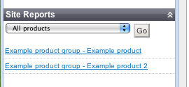

# Site Reports

## Introduction
A report is a little bit of functionally in the CMS designed to provide a report of your data or content. You can access
the site reports by clicking "Site Reports" in the left hand side bar and selecting the report you wish to view.

 

By default the CMS ships with a couple of basic reports -

## Default Reports

*  "Empty Pages" which will generate a list of pages without content 
*  "Pages edited in the last 2 weeks" which will list all the pages edited in the last 2 weeks in order of most recently
edited.
*  "To Do" which displays all the ToDo notes you have added to each page and a link to the page. Note: This is in 2.2.2 and
later
*  Also the Ecommerce module provides 2 or 3 reports out of box. Such as All Products, Orders...

## Creating Custom Reports

You can create reports for you own data quickly and easily. A general knowledge of SilverStripe's
[Datamodel](/topics/datamodel) would help before you attempt this. 

Inside the Mysite/Code folder - your projects code, create a file called `CustomSideReport` or `MyProjectSiteReport` and
inside this file we can add our site reports.

CustomSideReport.php 

	:::php
	<?php
	class CustomSideReport_NameOfReport extends SideReport {
		public function title() {
	            // the name of our report
		}
		public function records() {
	            // what we want the report to return and what order
		}
		public function fieldsToShow() {
	            // which fields on that object do we want to show? Title, Author?
		}
	}
	?>

Now this won't do anything! You will just get a blank report that doesn't work! So for this to do something we have to
fill in these 3 methods title() records() and fieldsToShow() till we have something like this. For example if you want
to list every Page on your site!

CustomSideReport.php

	:::php
	<?php
	/** 
	
	 * This report lists all the pages in the CMS
	 * of type Page. Sorted by title.
	 */
	class CustomSideReport_AllPages extends SideReport {
		public function title() {
	        // this is the title of the report
			return "All Pages";
		}
		
		public function records() {
	        // the data the report returns all the dataobjects of type Page and sorted by title. See datamodel for more info
			return Page::get()->sort("Title");
		}
		
		public function fieldsToShow() {
	        // fields you want to display. This will display a list of titles which link to the page in the cms. Handy!
			return array(
				"Title" => array("NestedTitle", array("2")),
			);
		}	
	}
	?>

Reload the CMS and test it out for your self! You should be able to select the report and view all the pages.

## Notes

*  Your CustomSideReport_ReportName must extend SideReport!
*  You can have more then 1 report in the 1 file. Actually its recommended!. You should create 1 CustomSideReport.php
file and add class's as you need them inside that for each report.

## TODO

*  How to format and make nicer reports. 
*  More examples.

## API Documentation
`[api:ReportAdmin]`