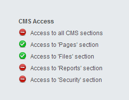

# Access Control and Page Security

There is a fairly comprehensive security mechanism in place for SilverStripe.
Beyond simply just having user accounts, users can be granted permissions for all kinds of actions within the CMS.
This can range from allowing users to view draft content,
to letting them upload files, to even letting them manage the security settings themselves.

This page provides info for developers wanting to extend their site and make use of these permissions features,
and add restrictions on who can make use of this extended functionality.
For a basic overview of the way permissions work in SilverStripe see the
[Userhelp page on permissions](http://userhelp.silverstripe.org/framework/en/3.1/for-website-administrators/managing-roles-and-permissions).

## Implementing PermissionProvider

`[api:PermissionProvider]` is an interface in SilverStripe that lets you create a method to define permissions for your class.
The name of this method is `providePermissions` and it should return an array of permissions, with each array key
representing the permission's code and the key's value as the description of the permission:

    :::php
    public function providePermissions() {
        return array(
            "VIEW_SITE" => "Access the site"
        );
    }

The key's value can also be an array of options relating to the permission,
which can include the category it belongs to, it's sort order in menus, as well as the description itself.
More information on `PermissionProvider` can be found [here](http://doc.silverstripe.org/framework/en/reference/permission)

## Permission checking

SilverStripe provides a security mechanism via the `Permission::checkMember` method,
we can see this in action in `[LeftAndMain's](api:LeftAndMain)` `canView` method:

    :::php
    class LeftAndMain extends Controller implements PermissionProvider {

        public function canView($member = null) {
            if(!$member && $member !== FALSE) $member = Member::currentUser();

            // cms menus only for logged-in members
            if(!$member) return false;

            ...

            // Check for "CMS admin" permission
            if(Permission::checkMember($member, "CMS_ACCESS_LeftAndMain")) return true;

            // Check for LeftAndMain sub-class permissions
            $codes = array();
            $extraCodes = $this->stat('required_permission_codes');
            if($extraCodes !== false) { // allow explicit FALSE to disable subclass check
                if($extraCodes) $codes = array_merge($codes, (array)$extraCodes);
                else $codes[] = "CMS_ACCESS_$this->class";
            }
            foreach($codes as $code) if(!Permission::checkMember($member, $code)) return false;

            return true;
        }
    }

These checks make sure that the user trying to access a `LeftAndMain` controller (i.e. any of the CMS sections),
has been granted permission to do so.
It helps to get some context on how the `CMS_ACCESS` permissions work from the options in the security
section of the CMS:

Here we can see the permissions for `CMS_ACCESS`. In order, they are `CMS_ACCESS_LeftAndMain`, `CMS_ACCESS_CMSMain`,
`CMS_ACCESS_AssetAdmin`, `CMS_ACCESS_ReportAdmin` and `CMS_ACCESS_SecurityAdmin`.
Each option provides access to a certain section, with an override to allow access to all the CMS sections.
This override is the first of our five options, `CMS_ACCESS_LeftAndMain`,
and it originates from LeftAndMain's `providePermissions` method as seen here:

    :::php
    class LeftAndMain extends Controller implements PermissionProvider {

        public function providePermissions() {
            $perms = array(
                "CMS_ACCESS_LeftAndMain" => array(
                    'name' => _t('CMSMain.ACCESSALLINTERFACES', 'Access to all CMS sections'),
                    'category' => _t('Permission.CMS_ACCESS_CATEGORY', 'CMS Access'),
                    'help' => _t('CMSMain.ACCESSALLINTERFACESHELP', 'Overrules more specific access settings.'),
                    'sort' => -100
                )
            );

            ...

            return $perms;
        }
    }

Looking at the array that gets returned, we can see that this is how the security menu gets its information
about `CMS_ACCESS_LeftAndMain`.
`name` populates the label to explain what the permission
and `category` assigns this option to the category `CMS Access`.

So returning to the `canView` method example, we can now begin to better understand what's going on here.
As the `CMS_ACCESS_LeftAndMain` permission needs to act as an override to allow access to any `LeftAndMain` controller,
`Permission::checkMember` is used to first check the `CMS_ACCESS_LeftAndMain` permission.
If this returns true, then we stop checking and let this user use this controller
(as this permission means they can use any `LeftAndMain` controller).

If the user doesn't have this permission, we need to carry on and check other permissions related to this controller.
`$this->stat('required_permission_codes')` grabs any extra codes that need checking and checks them, if any of them
fail when `Permission::checkMember` checks them, the method returns false.
If all the permission checks pass, it returns true, and the user is allowed to use this controller.

In the case of `LeftAndMain`, a user without permission to this controller wont see an option for it
in the menu to the left side of the CMS.

## Securing Site Pages

We can use what we've learnt from `LeftAndMain` and apply it to a page on our front end.
We can use the `Members` class in SilverStripe on the front end, in the same way we would use it on the back end,
by implementing `PermissionProvider`.

    :::php
    class SecurePage_Controller extends Page_Controller implements PermissionProvider {

        public function Index(){

            if(!Permission::checkMember(Member::currentUser(), "SITE_ACCESS_SecurePage")) {
                return Security::permissionFailure($this);
            }

            return $this;
        }

        public function providePermissions() {
            return array(
                "SITE_ACCESS_SecurePage" => array(
                    'name' => 'Access to secured site pages',
                    'category' => 'Site Access'
                )
            );
        }
    }

Be sure to add a SecurePage class and template like you would for any other page type.

This gives you a page type that has it's own access settings in the CMS's security section.
All from adding two short methods to a page controller, simple!

Pages of this type will only ever show if the visitor of the page is logged in,
and that user has permission for visiting this page.
Otherwise the visitor is greeted with a login form if they weren't logged in to begin with.
If they're logged in but lack the right permissions, they get an option to log out and log back in as someone else.
This message is generated by the `permissionFailure` method, which can take a second parameter as a custom message:

     :::php
     public function Index(){

        if(!Permission::checkMember(Member::currentUser(), "SITE_ACCESS_SecurePage")) {
            return Security::permissionFailure($this, "Unable to access this secure area of the site, you do not have sufficient permissions");
        }

        return $this;
     }
