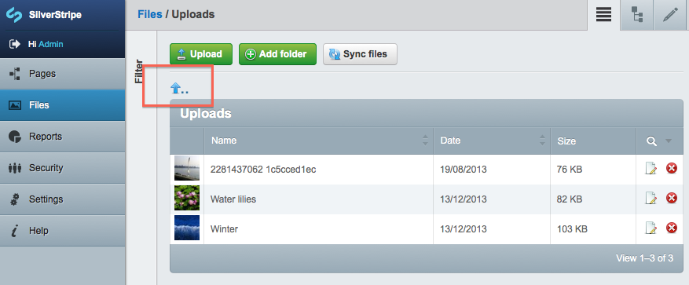

# Files, Images and Folders

## Files, Images and Folders as database records

All files, images and folders in the 'assets' directory are stored in the database. Each record has the following database fields:

| Field name     | Description                                                                                                                                          |
| ----------     | -----------                                                                                                                                          |
| `ClassName`    | The class name of the file (e.g. File, Image or Folder).                                                                                             |
| `Name`         | The 'basename' of the file, or the folder name. For example 'my-image.jpg', or 'images' for a folder.                                                |
| `Title`        | The optional, human-readable title of the file for display only (doesn't apply to folders).                                                          |
| `Filename`     | The path to the file/folder, relative to the webroot. For example 'assets/images/my-image.jpg', or 'assets/images/' for a folder.                    |
| `Content`      | Typically unused, but handy for a textual representation of files. For example for fulltext indexing of PDF documents.                               |
| `ShowInSearch` | Whether the file should be shown in search results, defaults to '1'. See ["Tutorial 4 - Site Search"](/tutorials/4-site-search) for enabling search. |
| `ParentID`     | The ID of the parent Folder that this File/Folder is in. A ParentID of '0' indicates that the File/Folder is in the 'assets' directory.              |
| `OwnerID`      | The ID of the Member that 'owns' the File/Folder (not related to filesystem permissions).                                                            |

## Management through the "Files" section of the CMS

If you have the CMS module installed, you can manage files, folders and images in the "Files" section of the CMS. Inside this section, you will see a list of files and folders like below:

You can click on any file to edit it, or click on any folder to open it. To delete a file or a folder, simply click the red 'X' symbol next to it. If you click to open a folder, you can go back up one level by clicking the 'up' arrow above the folder name (highlighted below):

Once you click to edit a file, you will see a form similar to the one below, in which you can edit the file's title, filename, owner, or even change which folder the file is located in:

You may also notice the 'Sync files' button (highlighted below). This button allows CMS users to 'synchronise' the database (remember, all files/folders are stored as database records) with the filesystem. This is particularly useful if someone has uploaded or removed files/folders via FTP, for example.

## Upload

Files can be managed through a `FileField` or an `UploadField`. The `[api:FileField]` class provides a simple HTML input with a type of "file", whereas an `[api:UploadField]` provides a much more feature-rich field (including AJAX-based uploads, previews, relationship management and file data management). See [`Reference - UploadField`](/reference/uploadfield) for more information about how to use the `UploadField` class.

## Static content domains and alternate asset hosts

You can configure an alternate server name for your uploaded files using the `File#alternate_base_url` config or the `SS_ALTERNATE_ASSETS_BASE_URL` constant in your `_ss_environment.php` file. This can be used to create a cookie-less domain to enhance request speed, for CDN services that require you to serve assets on a subdomain, or for serving content that you synchronise with a static hosting service such as Amazon S3 for load-balancing purposes.

**\_ss\_environment.php (per-server setting)**
    :::php
    define('SS_ALTERNATE_ASSETS_BASE_URL', '//files.example.com/')

**config.yml**
    :::yml
    ---
    Name: my-cdn
    ---
    Only:
      Environment: 'live'
    ---
    File:
      alternate_base_url: '//files.example.com/'

With this option configured, all images will be prepended with your configured alternate base url.

**Source**
    :::ss
    $SiteConfig.Logo                          <%-- A hypothetical Image field on SiteConfig --%>
    <a href="$Menu.URL">Download our menu</a> <%-- A hypothetical File field on the current page --%>

**Before**
    :::html
    
    <a href="assets/Uploads/menu.pdf">Download our menu</a>

**After**
    :::html
    
    <a href="//files.example.com/assets/Uploads/menu.pdf">Download our menu</a>

Note that this does not change hard-coded URLs in your templates; it only affects links and URLs generated by the `File#Link`, `File#getURL` and `File#getAbsoluteURL` functions. As the 'assets' folder is hard-coded into the database, you will need to ensure that your host or domain serves the files within a folder called 'assets'.
