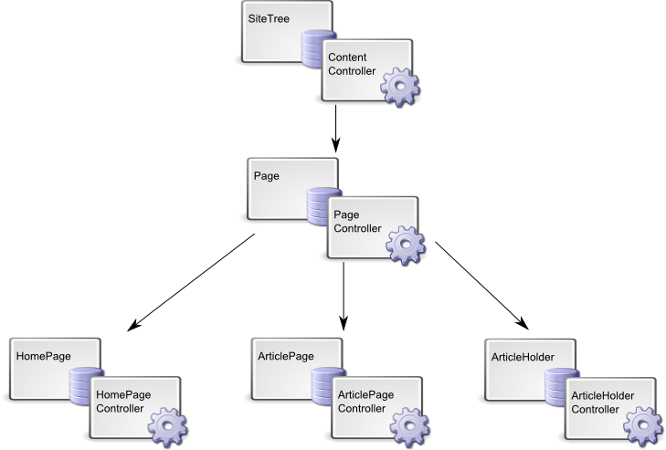

# Page Types

## Introduction

Page Types are the basic building blocks of any SilverStripe website. A page type can define:

*  Templates being used to display content
*  Form fields available to edit content in the CMS
*  Behaviour specific to a page type. For example a contact form on a ‘Contact Us’ page type, sending an email when the form is submitted

All the pages on the base installation are of the page type called "Page". See
[tutorial:2-extending-a-basic-site](/tutorials/2-extending-a-basic-site) for a good introduction to page-types.

## Class and Template Inheritance

Each page type on your website is a sub-class of the `SiteTree` class. Usually, you’ll define a class called `Page`
and use this template to lay out the basic design elements that don’t change. 

Each page type is represented by two classes: a data object and a controller. In the diagrams above and below, the data
objects are black and the controllers are blue. The page controllers are only used when the page type is actually
visited on the website. In our example above, the search form would become a method on the ‘Page_Controller’ class.
Any methods put on the data object will be available wherever we use this page. For example, we put any customizations
we want to do to the CMS for this page type in here.

We put the `Page` class into a file called `Page.php` inside `mysite/code`. 
As a convention, we also put the `Page_Controller` class in the same file.

Why do we sub-class `Page` for everything? The easiest way to explain this is to use the example of a search form. If we
create a search form on the `Page` class, then any other sub-class can also use it in their templates. This saves us
re-defining commonly used forms or controls in every class we use.

## Templates

Page type templates work much the same as other [templates](/reference/templates) in SilverStripe
(see ). There's some specialized controls and placeholders, as well as built-in inheritance.
This is explained in a more in-depth topic at [Page Type Templates](/topics/page-type-templates).

## Adding Database Fields

Adding database fields is a simple process. You define them in an array of the static variable `$db`, this array is
added on the object class. For example, Page or StaffPage. Every time you run db/build to recompile the manifest, it
checks if any new entries are added to the `$db` array and adds any fields to the database that are missing.

For example, you may want an additional field on a `StaffPage` class which extends `Page`, called `Author`. `Author` is a
standard text field, and can be [casted](/topics/datamodel) as a variable character object in php (`VARCHAR` in SQL). In the
following example, our `Author` field is casted as a variable character object with maximum characters of 50. This is
especially useful if you know how long your source data needs to be.

	:::php
	class StaffPage extends Page {
	   static $db = array(
	      'Author' => 'Varchar(50)'
	   );
	}
	class StaffPage_Controller extends Page_Controller {
	}

See [datamodel](/topics/datamodel) for a more detailed explanation on adding database fields, and how the SilverStripe data
model works.

## Adding Form Fields and Tabs

See [form](/topics/forms) and [tutorial:2-extending-a-basic-site](/tutorials/2-extending-a-basic-site).
Note: To modify fields in the "Settings" tab, you need to use `updateSettingsFields()` instead.

## Removing inherited form fields and tabs

### removeFieldFromTab()

Overloading `getCMSFields()` you can call `removeFieldFromTab()` on a `[api:FieldList]` object. For example, if you don't
want the MenuTitle field to show on your page, which is inherited from `[api:SiteTree]`.

	:::php
	class StaffPage extends Page {
	
	   public function getCMSFields() {
	      $fields = parent::getCMSFields();
	      $fields->removeFieldFromTab('Root.Content', 'MenuTitle');
	      return $fields;
	   }
	
	}
	class StaffPage_Controller extends Page_Controller {
	
	}

### removeByName()
 `removeByName()` for normal form fields is useful for breaking inheritance where you know a field in your form isn't
required on a certain page-type.

	:::php
	class MyForm extends Form {
	
	   public function __construct($controller, $name) {
	      // add a default FieldList of form fields
	      $member = singleton('Member');
	
	      $fields = $member->formFields();
	
	      // We don't want the Country field from our default set of fields, so we remove it.
	      $fields->removeByName('Country');
	
	      $actions = new FieldList(
	         new FormAction('submit', 'Submit')
	      );
	
	      parent::__construct($controller, $name, $fields, $actions);
	   }
	
	}

This will also work if you want to remove a whole tab e.g. $fields->removeByName('Metadata'); will remove the whole
Metadata tab.

For more information on forms, see [form](/topics/forms), [tutorial:2-extending-a-basic-site](/tutorials/2-extending-a-basic-site)
and [tutorial:3-forms](/tutorials/3-forms).