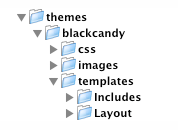

# Developing Themes

## Introduction

[Tutorial 1](/tutorials/1-building-a-basic-site#templates) shows you how to create page templates. This guide will help
you create your own SilverStripe website theme.

Developing your own theme in SilverStripe is a piece of cake thanks to a very straight forward and clean templating
language.  

## What is a Theme?

A theme is a set of HTML/CSS/Javascript and images that can be used to provide a skin for a site. A theme does not
include any PHP: instead it should be separate from the code which allows the portability of a design. After all, this
is an MVC framework!

## Getting started - Folder Structure

To start your theme you first need to create the basic folder structure for the theme. Check out the image below for the
layout of your folders. First you need to create a folder in the themes directory called the name of your theme (we're
using "simple"). Please note that underscores in the theme name are reserved to denote "sub-themes" (e.g.
"blackcandy_blog").

Inside your theme, you need the css, images and templates folders. Each of these folders contain parts of your theme and
keeping a good folder structure is super important. Now we have this structure we can put our CSS in the css folder,
Images in the images folder and all our HTML in the templates folder. This keeps our workspace clean and easy to use.

After you have created the templates folder you need to create 2 more folders within - Includes and Layout (Note the
uppercase initial letters). These are 2 different types of templates you will use in your theme - Includes contain
snippets of HTML that you want to break out and share between templates (for example the Header can be an include,
Footer, Navigation etc) whereas Layout templates are the base page templates. So you can have several includes in a
Layout template. 

## Getting started - Core Files

### HTML Templates

Once you have created your folders you need to start to fill it out with a couple 'Core' files. First and most
importantly is we need a HTML template for our design. Read the [Tutorial 1](/tutorials/1-building-a-basic-site#templates)
and the HTML pages for more in-depth discussion about the HTML templates and how they work. At the very least
we need a Page.ss file (note the .ss extenstion - Don't worry its just HTML and any text editor will still read it). So
go ahead and create 2 Page.ss files. One in templates, the other in Layout.

Whats with the 2 Page.ss files? Well we have 2 so when the user visits a page they get redirected to the top level
Page.ss then, depending on what page they are on, we can have a custom template for that page in the Layout folder. If
you dont get it now, you will hopefully pick it up over the rest of this.

So you have 2 blank Page.ss files. What are we going to do with them? How bout we put some HTML in them so we can see
our theme in action. The code for mine is below.

** yourtheme/templates/Page.ss **

	:::ss
	<!DOCTYPE html>
	<html lang="en">
	<head>
	  <% base_tag %>
	  $MetaTags(false)
	  <title>Bob's Chicken Shack | $Title</title>
	</head>
	 
	<body>
	

	  

	    <h1>Bob's Chicken Shack</h1>
	  

	 
	  

	    <% if Menu(1) %>
	    <ul>
	      <% loop Menu(1) %>	  
	        <li><a href="$Link" title="Go to the $Title page" class="$LinkingMode">$MenuTitle</a></li>
	      <% end_loop %>
	    </ul>
	   <% end_if %>
	  

	 
	  

	    $Layout
	  

	 
	  

	    
Copyright $Now.Year - Bob's Chicken Shack.

	  

	

	</body>
	</html>

** yourtheme/templates/Layout/Page.ss **

	:::ss
	<h1>$Title</h1>
	$Content
	$Form

All you have to do now is tell your site to use your new theme - This is defined in the **mysite/_config.php** file

	:::php
	SSViewer::set_theme('mythemename');

Go to yoursite.com/?flush=1 and check it out. You should be using your new theme! Not really that awesome or amazing is
it? Next we need to add some CSS Magic!

See [Templates](/reference/themes) for more information about templates.

### CSS Files

By standard SilverStripe uses 3 CSS Files for your site - 

*  **layout.css** contains the layout and design of the site 
*  **typography.css** contains the styling for the text/fonts/links (used in both front and back ends)
*  **form.css** styling for forms.

You can add more stylesheets using the template tag `<% require themedCSS(filename) %>`, which will load filename.css from
your css directory.

Note: If you're using a default install of Silverstripe and notice that you're getting layout.css, typography.css and
forms.css included without asking for them, they may be being called on lines 21-23 in mysite/code/Page.php. Remove
these three Requirements::themedCSS lines, and you will be free to add your own styles.

## Dividing your site the correct way!

Most Web page designers 10 years ago used a table-based layout to achieve a consistent look. Now, (Thankfully) there's a
different way to achieve the same look.

Using CSS and tags (including `DIV`s) reduces markup code, speeds up page downloads, separates content from
its visual presentation, and brings your code closer to web standards compliance--all while making your website more
appealing to search engine spiders.

For layout we tend to use `DIV` tags as the `DIV` tag defines a division/section in a document.

Let's have a look at part of a Page.ss for the main layout elements defining a 2 column layout.

	:::ss
	

	 

	   <!-- Header -->
	 

	
	 

	   <!-- The Main Site Nav -->
	 

	
	 

	   <!-- The whole site content has to sit inside here! Anything you want to sub template (eg each page will be different, needs to be contained in $Layout. This calls the file /Layout/Page.ss or anyother sub page template -->
	   $Layout
	 

	
	 

	 

	

As you can see we normally wrap the site in a container. For this we use the ID 'Container'. Then we divide the main
template into sections.

	:::ss
	
<!-- markup goes here -->

We have the Header section which includes things like any banner images/ mastheads/ logos or any stuff that belongs at
the top of the page, This might vary on the design of the page

	:::ss
	
<!-- markup goes here -->

Next is a division for the main navigation. This may contain something like:

	:::ss
	

	  <% if Menu(1) %>
	  <ul>
	    <% loop Menu(1) %>	  
	      <li><a href="$Link" title="Go to the $Title page" class="$LinkingMode">$MenuTitle</a></li>
	    <% end_loop %>
	 </ul>
	 <% end_if %>
	

This is the standard for creating the main Navigation. As you can see it outputs the Menu 1 in a unordered list.

Before stepping into a loop it's good practise to check if it exists first. This is not only
important in manipulating SilverStripe templates, but in any programming language!

	:::ss
	<% if MyFunction %>
	  <% loop MyFunction %>
	    $Title
	  <% end_loop %>
	<% end_if %>

Last and probably least is the Footer division. Here is where you put all the Footer related stuff for your website.
Maybe even a nice link saying Website Powered by SilverStripe to show your support.

	:::ss
	

	<!-- markup goes here -->
	

## Resources

A bunch of resources feel free to use to make your template awesome

*  [http://kuler.adobe.com](http://kuler.adobe.com) - Kuler is a great color scheming tool
*  [http://blog.html.it/layoutgala/](http://blog.html.it/layoutgala/) - 40 super cool CSS layouts for you to use
*  [http://designmeltdown.com](http://designmeltdown.com) - Great gallery of websites. Browse through and get inspired. 
*  [http://validator.w3.org/](http://validator.w3.org/) - Your template must pass 'or get near' validation. 
*  [http://famfamfam.com/lab/icons/](http://famfamfam.com/lab/icons/) - free, beautiful icons.
*  [http://cssremix.com](http://cssremix.com) - Another CSS site gallery for inspiration. 
*  [http://www.maxdesign.com.au/presentation/process/](http://www.maxdesign.com.au/presentation/process/) - a good process for creating a design

## Reference

### Overriding

The templating system will search for the appropriate files in the following order:

1. mysite (or other name given to site folder)
2. themes
3. module (eg blog)

So if, for example, you had a typography.css file for a module in the module folder (eg blog/css/), in the theme module
directory (eg themes/simple/css/), and in your site folder (eg mysite/css/), the system would use the file
mysite/css/typography.css

Note: This only applies for CSS and template files. PHP files **do not** get overridden!

### Requirements

The `[api:Requirements::themedCSS()]` function will
do the search specified above. This avoids the need to type a full path to the css file, and also provides better
ambiguity for themes.

### Subthemes

If you have a theme called mytheme_forum, it is considered to be a 'subtheme' of the mytheme theme. This lets module
developers release extensions to popular themes that will let their module work with that theme. 

A subtheme overrides the files in the module. So for instance, if you have the forum setup instead of editing the files
within the forum/ module you would create a themes/yourtheme_forum/ folder.

### ThemeDir

If you want to refer to an image or other file asset in a .ss template, use $ThemeDir. For example:

	:::ss
	

If your image is in a subtheme, you can refer to that with an argument to ThemeDir. For example, if your image was in
mytheme_forum, you could use the following code:

	:::ss
	

## Conventions, standards and guidelines

Following some set standards and conventions makes life easy for you and I.

Some conventions for SilverStripe websites, which we suggest following. Take a look at each:

*  [Coding-Conventions](/misc/coding-conventions)
*  [Typography](/reference/typography)

We also suggest following various [industry standards](http://www.w3.org/) and conventions.
