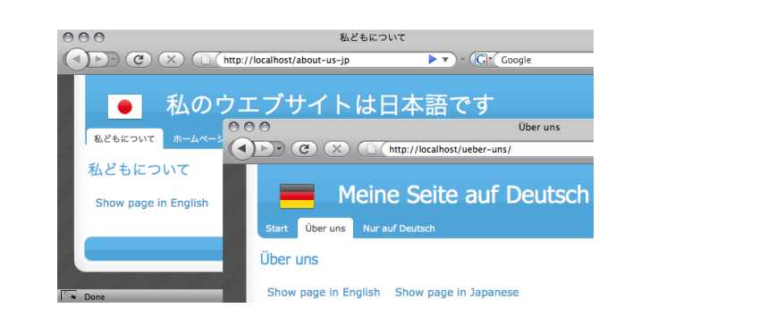
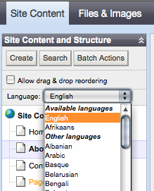
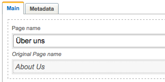
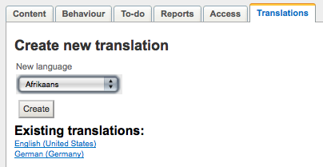

# Translation

## Introduction

This page introduces developers to using the CMS for creating content in multiple languages.

Please see [i18n](/topics/i18n) for a internationalization, globalization and localization support of built-in datatypes as well
as translating templates and PHP code.

Translations can be enabled for all subclasses of `[api:DataObject]`, so it can easily be implemented into existing code
with minimal interference.

Warning: If you're upgrading from a SilverStripe version prior to 2.3.2, please migrate your datamodel before using the
extension (see below).

## Requirements

*SilverStripe 2.3.2*

## Screenshots

*Translated website*

*CMS: Language dropdown*

*CMS: Translatable field with original value*

*CMS: Create a new translation*

## Usage

### Configuration

#### ThroughObject::add_extension()

Enabling Translatable through *Object::add_extension()* in your *mysite/_config.php*:

	:::php
	Object::add_extension('SiteTree', 'Translatable');
	Object::add_extension('SiteConfig', 'Translatable'); // 2.4 or newer only

#### Through $extensions

	:::php
	class Page extends SiteTree {
	  static $extensions = array(
	    "Translatable"
	  );
	}

Make sure to rebuild the database through /dev/build after enabling `[api:Translatable]`.
Use the correct set_default_locale() before building the database
for the first time, as this locale will be written on all new records.

#### Setting the default locale

**Important:** If the "default language" of your site is not english (en_US), please ensure to set the appropriate default
language for your content before building the database with Translatable enabled

Example:

	:::php
	Translatable::set_default_locale(<locale>);
	// Important: Call add_extension() after setting the default locale
	Object::add_extension('SiteTree', 'Translatable');

For the Translatable class, a "locale" consists of a language code plus a region code separated by an underscore, 
for example "de_AT" for German language ("de") in the region Austria ("AT").
See http://www.w3.org/International/articles/language-tags/ for a detailed description.

To ensure that your template declares the correct content language, please see [i18n](i18n#declaring_the_content_language_in_html).

### Usage

Getting a translation for an existing instance: 

	:::php
	$translatedObj = Translatable::get_one_by_locale('MyObject', 'de_DE');

Getting a translation for an existing instance: 

	:::php
	$obj = DataObject::get_by_id('MyObject', 99); // original language
	$translatedObj = $obj->getTranslation('de_DE');

Getting translations through Translatable::set_reading_locale().
This is *not* a recommended approach, but sometimes unavoidable (e.g. for `[api:Versioned]` methods).

	:::php
	$origLocale = Translatable::get_reading_locale();
	Translatable::set_reading_locale('de_DE');
	$obj = Versioned::get_one_by_stage('MyObject', "ID = 99");
	Translatable::set_reading_locale($origLocale);

Creating a translation: 

	:::php
	$obj = new MyObject();
	$translatedObj = $obj->createTranslation('de_DE');

### Usage for SiteTree

`[api:Translatable]` can be used for subclasses of SiteTree as well. 
If a child page translation is requested without the parent
page already having a translation in this language, the extension
will recursively create translations up the tree.
Caution: The "URLSegment" property is enforced to be unique across
languages by auto-appending the language code at the end.
You'll need to ensure that the appropriate "reading language" is set
before showing links to other pages on a website through $_GET['locale'].
Pages in different languages can have different publication states
through the `[api:Versioned]` extension.

Note: You can't get Children() for a parent page in a different language
through set_reading_locale(). Get the translated parent first.

	:::php
	// wrong
	Translatable::set_reading_lang('de_DE');
	$englishParent->Children(); 
	// right
	$germanParent = $englishParent->getTranslation('de_DE');
	$germanParent->Children();

### Translating custom properties

Keep in mind that the `[api:Translatable]` extension currently doesn't support the exclusion of properties from being
translated - all custom properties will automatically be fetched from their translated record on the database. This means
you don't have to explicitly mark any custom properties as being translatable.

The `[api:Translatable]` decorator applies only to the getCMSFields() method on DataObject or SiteTree, not to any fields 
added in overloaded getCMSFields() implementations. See Translatable->updateCMSFields() for details. By default, custom 
fields in the CMS won't show an original readonly value on a translated record, although they will save correctly. You can
attach this behaviour to custom fields by using Translatable_Transformation as shown below.

	:::php
	class Page extends SiteTree {
		
		public static $db = array(
			'AdditionalProperty' => 'Text', 
		);
		
		function getCMSFields() {
			$fields = parent::getCMSFields();
	
			// Add fields as usual
			$additionalField = new TextField('AdditionalProperty');
			$fields->addFieldToTab('Root.Content.Main', $additionalField);
			
			// If a translation exists, exchange them with 
			// original/translation field pairs
			$translation = $this->getTranslation(Translatable::default_locale());
			if($translation && $this->Locale != Translatable::default_locale()) {
				$transformation = new Translatable_Transformation($translation);
				$fields->replaceField(
					'AdditionalProperty',
					$transformation->transformFormField($additionalField)
				);
			}
	
			return $fields;
		}
		
	}

### Translating theHomepage

Every homepage has a distinct URL, the default language is /home, a German translation by default would be /home-de_DE.
They can be accessed like any other translated page. If you want to access different homepages from the "root" without a
URL, add a "locale" GET parameter. The German homepage would also be accessible through /?locale=de_DE. 

For this to work, please ensure that the translated homepage is a direct translation of the default homepage, and not a
new page created through "Create page...".

### Translation groups

Each translation can have an associated "master" object in another language which it is based on,
as defined by the "MasterTranslationID" property. This relation is optional, meaning you can
create translations which have no representation in the "default language".
This "original" doesn't have to be in a default language, meaning
a french translation can have a german original, without either of them having a representation
in the default english language tree.
Caution: There is no versioning for translation groups,
meaning associating an object with a group will affect both stage and live records.

SiteTree database table (abbreviated)
 | ID | URLSegment | Title     | Locale | 
 | -- | ---------- | -----     | ------ | 
 | 1  | about-us   | About us  | en_US  | 
 | 2  | ueber-uns  | Über uns | de_DE  | 
 | 3  | contact    | Contact   | en_US  | 

SiteTree_translationgroups database table
 | TranslationGroupID | OriginalID | 
 | ------------------ | ---------- | 
 | 99                 | 1          | 
 | 99                 | 2          | 
 | 199                | 3          | 

### CharacterSets

**Caution:** Does not apply any character-set conversion, it is assumed that all content
is stored and represented in UTF-8 (Unicode). Please make sure your database and
HTML-templates adjust to this.

### "Default" languages

**Important:** If the "default language" of your site is not english (en_US), 
please ensure to set the appropriate default language for
your content before building the database with Translatable enabled

Example:

	:::php
	Translatable::set_default_locale(<locale>);

### Locales and language tags

For the Translatable class, a "locale" consists of a language code plus a region code separated by an underscore, 
for example "de_AT" for German language ("de") in the region Austria ("AT").
See [http://www.w3.org/International/articles/language-tags/](http://www.w3.org/International/articles/language-tags/)
for a detailed description.

Uninstalling/Disabling

Disabling Translatable after creating translations will lead to all
pages being shown in the default sitetree regardless of their language.
It is advised to start with a new database after uninstalling Translatable,
or manually filter out translated objects through their "Locale" property
in the database.

## Recipes

### Switching languages

You can easily make your own switchers with the following basic tools. To stay friendly to  caches and search engines, each
translation of a page must have a unique URL.

By URL:

	:::php
	http://<mysite>/mypage/?locale=de_DE

By user preference (place this in your Page_Controller->init() method):

	:::php
	$member = Member::currentUser();
	if($member && $member->Locale) {
		Translatable::set_reading_locale($member->Locale);
	}

### Templates

As every page has its own unique URL, language selection mostly happens explicitly: A user requests a page, which always
has only one language. But how does a user coming to your English default language know that there's a Japanese version
of this page? 
By default, SilverStripe core doesn't provide any switching of languages through sessions or browser cookies. As a
SEO-friendly CMS, it contains all this information in the URL. Each page in SilverStripe is aware of its translations
through the *getTranslations()* method. We can use this method in our template to build a simple language switcher. It
shows all available translations in an unordered list with links to the same page in a different language. The example
below can be inserted in any of your templates, for example `themes/blackcandy/templates/Layout/Page.ss`.

	:::php
	<% if Translations %>
	<ul class="translations">
	<% control Translations %>
	  <li class="$Locale.RFC1766">
	    <a href="$Link" hreflang="$Locale.RFC1766" 
	title="$Title">
	    <% sprintf(_t('SHOWINPAGE','Show page in %s'),$Locale.Nice) %>
	   </a>
	  </li>
	<% end_control %>
	</ul>
	<% end_if %>

Keep in mind that this will only show you available translations for the current page. The $Locale.Nice casting will
just work if your locale value is registered in i18n::get_common_locales().

### Page-control

If you want to put static links in your template, which link to a site by their url, normally you can use the `<% control
Page(page-url) %>`. For sites which use Translatable, this is not possible for more than one language, because the url's
of different pages differ.

For this case place the following function in your Page_Controller:

	:::php
	public function PageByLang($url, $lang) {
	    $SQL_url = Convert::raw2sql($url);
	    $SQL_lang = Convert::raw2sql($lang);
	
	    $page = Translatable::get_one_by_lang('SiteTree', $SQL_lang, "URLSegment = '$SQL_url'");
	
	    if ($page->Locale != Translatable::get_current_locale()) {
	        $page = $page->getTranslation(Translatable::get_current_locale());
	    }
	    return $page;
	}

So, for example if you have a german page "Kontakt", which should be translated to english as "Contact", you may use:

	<% control PageByLang(Kontakt,de_DE) %>

The control displays the link in the right language, depending on the current locale.

Example:

	<% control PageByLang(Kontakt,de_DE) %>
	 <h2><a href="$Link" title="$Title">$Title</a></h2>
	<% end_control %>

### Enabling the _t() function in templates 

If you're looking to use [the _t() function](http://doc.silverstripe.com/doku.php?id=i18n#the_t_function) in template
files, you'll need to [set the i18n locale](/topics/translation#setting_the_i18n_locale) first. 

(The reasoning is as follows: Translatable doesn't set the i18n locale. Historically these were two separate systems,
but they're reasonably interchangeable for a front-end website. The distinction is mainly valid for the CMS, because you
want the CMS to be in English (`[api:i18n]`), but edit pages in different languages (`[api:Translatable]`).)

### Migrating from 2.1 datamodel

The datamodel of `[api:Translatable]` changed significantly between its original release in SilverStripe 2.1 and SilverStripe
2.3.2. See our [discussion on the
mailinglist](http://groups.google.com/group/silverstripe-dev/browse_thread/thread/91e26e1f78d3c1b4/bd276dd5bbc56283?lnk=gst&q=translatable#bd276dd5bbc56283).

To migrate a database that was built with SilverStripe 2.1.x or 2.2.x, follow these steps:

*  Upgrade your SilverStripe installation to at least 2.3.2 (see [upgrading](/installation/upgrading))
*  Backup your database content
*  Login as an administrator
*  Run `http://mysite.com/dev/build`
*  Run `http://mysite.com/dev/tasks/MigrateTranslatableTask`

Please see the `[api:MigrateTranslatableTask]` for
limitations of this migration task - not all your data will be preserved.

### Setting the i18n locale

You can set the `[api:i18n]` locale value which is used to format dates, currencies and other regionally different values to
the same as your current page locale. 

	:::php
	class Page_Controller extends ContentController {
		public function init() {
			parent::init();
		
			if($this->dataRecord->hasExtension('Translatable')) {
				i18n::set_locale($this->dataRecord->Locale);
			}
		}
	}

### Adding a new locale

The `[api:i18n]` logic has lookup tables for common locales in i18n::$common_locales, which is a subset of i18n::$all_locales.
If your locale is not present here, you can simply add it through `mysite/_config.php`:

	:::php
	i18n::$common_locales['de_AT'] = 'Deutsch (Oestereich)';

This should e.g. enable you to use `$Locale.Nice` in template code.

## Related

*  [translate.silverstripe.org](http://translate.silverstripe.org): Starting point for community-driven translation of the Silverstripe UI
*  [i18n](i18n): Developer-level documentation of Silverstripe's i18n capabilities
*  `[api:Translatable]`: DataObject-interface powering the website-content translations
*  ["Translatable ModelAdmin" module](http://silverstripe.org/translatablemodeladmin-module/): An extension which allows
translations of `[api:DataObject]`s inside `[api:ModelAdmin]`
