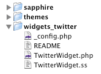

# Widgets

## Introduction

[Widgets](http://silverstripe.org/widgets) are small pieces of functionality such as showing the latest Comments or Flickr Photos. They normally display on
the sidebar of your website. To check out a what a [Widget](http://silverstripe.org/widgets) can do watch the
[Widget video](http://silverstripe.com/assets/screencasts/SilverStripe-Blog-DragDrop-Widgets.swf) and try out the
[demo site](http://demo.silverstripe.org/)

## How to Use A Widget

### Downloading and Contributing Widgets

*  To download widgets visit [Widgets section](http://silverstripe.org/widgets)
*  Upload widgets you want to share to
[http://silverstripe.org/widgets/manage/add](http://silverstripe.org/widgets/manage/add). Make sure you read the
packaging instructions at the bottom of the page about how to make your widget package.

### Installing a widget

By following the "Packaging" rules below, widgets are easily installed. 

* Install the [blog module](http://www.silverstripe.org/blog-module/) (by default only the Blog has widgets enabled)
* Download the file and unzip to the main folder of your SilverStripe website, e.g. to `/widget_<widget-name>/`. The folder
will contain a few files, which generally won't need editing or reading.
* Run `http://my-website.com/dev/build`
* Login to the CMS and go to the 'Blog' page. Choose the "widgets" tab and drag n drop the new widget to activate it.
* Your blog will now have the widget shown

### Adding widgets to other pages

As of version 2.2.1 there is a way to add widgets to other pages. In future releases we will hopefully make widgets part
of SiteTree therefore available on every page.

You have to do a couple things to get a Widget to work on a page.

First step is to add an WidgetArea to the Database to store the widget details. Then you have to edit the CMS to add a
Widget Form to manage the widgets. An example of this is below

**mysite/code/Page.php**

	:::php
	class Page extends SiteTree {
	
	...
	    static $has_one = array(
		"Sidebar" => "WidgetArea",
	    );
		
	    function getCMSFields() {
		$fields = parent::getCMSFields();
		$fields->addFieldToTab("Root.Content.Widgets", new WidgetAreaEditor("Sidebar"));
		return $fields;
	    }
	....
	}

Then in your Template you need to call $SideBar wherever you want to render the widget

For example: using the blackcandy theme I put this piece of code above the closing `
`

**themes/blackcandy/templates/Includes/Sidebar.ss**

	:::ss
	$Sidebar

## Writing your own widgets

To create a Widget you need at least three files - a php file containing the class, a template file of the same name and
a config file called *_config.php* (if you dont need any config options for the widget to work then you can make it
blank). Each widget should be in its own folder like widgets_widgetName/

After installing or creating a new widget, **make sure to run db/build?flush=1** at the end of the URL, *before*
attempting to use it.

The class should extend the Widget class, and must specify three static variables - $title, the title that will appear
in the rendered widget (eg Photos), $cmsTitle, a more descriptive title that will appear in the cms editor (eg Flickr
Photos), and $description, a short description that will appear in the cms editor (eg This widget shows photos from
Flickr). The class may also specify functions to be used in the template like a page type can.

If a Widget has configurable options, then it can specify a number of database fields to store these options in via the
static $db array, and also specify a getCMSFields function that returns a !FieldSet, much the same way as a page type
does.

An example widget is below:

**FlickrWidget.php**

	:::php
	<?php
	
	class FlickrWidget extends Widget {
	
		static $db = array(
			"User" => "Varchar",
			"Photoset" => "Varchar",
			"Tags" => "Varchar",
			"NumberToShow" => "Int"
		);
		
	
		static $defaults = array(
			"NumberToShow" => 8
		);
		
	
		static $title = "Photos";
		static $cmsTitle = "Flickr Photos";
		static $description = "Shows flickr photos.";
		
		function Photos() {
			Requirements::javascript("sapphire/thirdparty/prototype/prototype.js");
			Requirements::javascript("sapphire/thirdparty/scriptaculous/effects.js");
			Requirements::javascript("mashups/javascript/lightbox.js");
			Requirements::css("mashups/css/lightbox.css");
			
			$flickr = new FlickrService();
			if($this->Photoset == "") {
				$photos = $flickr->getPhotos($this->Tags, $this->User, $this->NumberToShow, 1);
			} else {
				$photos = $flickr->getPhotoSet($this->Photoset, $this->User, $this->NumberToShow, 1);
			}
			
			$output = new DataObjectSet();
			foreach($photos->PhotoItems as $photo) {
				$output->push(new ArrayData(array(
					"Title" => $photo->title,
					"Link" => "http://farm1.static.flickr.com/" . $photo->image_path .".jpg",
					"Image" => "http://farm1.static.flickr.com/" .$photo->image_path. "_s.jpg"
				)));
			}
			
			return $output;
		}
	
		function getCMSFields() {
			return new FieldSet(
				new TextField("User", "User"),
				new TextField("PhotoSet", "Photo Set"),
				new TextField("Tags", "Tags"),
				new NumericField("NumberToShow", "Number to Show")
			);
		}
	}
	
	?>

**FlickrWidget.ss**

	:::php
	<% control Photos %>
		
	<% end_control %>

## Extending and Customizing

### Rendering a $Widget Individually

To call a single Widget in a page - without adding a widget area in the CMS for you to add / delete the widgets, you can
define a merge variable in the Page Controller and include it in the Page Template. 

This example creates an RSSWidget with the SilverStripe blog feed.

	:::php
	<?php
		function SilverStripeFeed() {
			$widget = new RSSWidget();
			$widget->RssUrl = "http://feeds.feedburner.com/silverstripe-blog";
			return $widget->renderWith("WidgetHolder");
		}
	?>

To render the widget, simply include $SilverStripeFeed in your template:

	:::ss
	  $SilverStripeFeed

As directed in the definition of SilverStripeFeed(), the Widget will be rendered through the WidgetHolder template. This
is pre-defined at `/sapphire/templates/WidgetHolder.ss` and simply consists of: 

	:::ss
	

		<h3>$Title</h3>
		$Content
	

You can override the WidgetHolder.ss and Widget.ss templates in your theme too by adding WidgetHolder and Widget
templates to `themes/myThemeName/templates/Includes/`

### Changing the title of your widget

To change the title of your widget, you need to override the Title() method. By default, this simply returns the $title
variable. For example, to set your widgets title to 'Hello World!', you could use:

**widgets_yourWidget/YourWidgetWidget.php**

	:::php
	function Title() {
		return "Hello World!";
	}

but, you can do exactly the same by setting your $title variable.

A more common reason for overriding Title() is to allow the title to be set in the CMS. Say you had a text field in your
widget called WidgetTitle, that you wish to use as your title. If nothing is set, then you'll use your default title.
This is similar to the RSS Widget in the blog module.

	:::php
	function Title() {
		return $this->WidgetTitle ? $this->WidgetTitle : self::$title;
	}

This returns the value inputted in the CMS, if it's set or what is in the $title variable if it isn't.

### Forms within Widgets

**Requires SilverStripe 2.4 or newer**

To implement a form inside a widget, you need to implement a custom controller for your widget to return this form. Make
sure that your controller follows the usual naming conventions, and it will be automatically picked up by the
`[api:WidgetArea]` rendering in your *Page.ss* template.

**mysite/code/MyWidget.php**

	:::php
	class MyWidget extends Widget {
		static $db = array(
	    	'TestValue' => 'Text'
		);
	}
	
	class MyWidget_Controller extends Widget_Controller {
		
		function MyFormName() {
			return new Form(
				$this, 
				'MyFormName', 
				new FieldSet(
	        		new TextField('TestValue')
	      		), 
	      		new FieldSet(
	        		new FormAction('doAction')
	      		)
	    	);
	  	}
	  
		function doAction($data, $form) {
	    	// $this->widget points to the widget
	  	}
	  
	  	function Link() {
			return __CLASS__;
		}
	}

To output this form, modify your widget template.

**mysite/templates/MyWidget.ss**

	:::ss
	$Content
	$MyFormName

**Note:** The necessary controller actions are only present in subclasses of `[api:Page_Controller]`. To use
widget forms in other controller subclasses, have a look at *ContentController->handleWidget()* and
*ContentController::$url_handlers*.

See an [alternative recipe for SilverStripe 2.3 or earlier](http://doc.silverstripe.org/old/recipes/widget-forms-2.3).

## But what if I have widgets on my blog currently??

If you currently have a blog installed, the widget fields are going to double up on those pages (as the blog extends the
Page class). One way to fix this is to comment out line 30 in BlogHolder.php and remove the DB entry by running a
`http://www.mysite.com/db/build`.

**blog/code/BlogHolder.php**

	:::php
	<?php
	
	class BlogHolder extends Page {
		
	      ........
		static $has_one = array(
		//	"SideBar" => "WidgetArea", COMMENT OUT
			'Newsletter' => 'NewsletterType'
	      .......
		function getCMSFields() {
			$fields = parent::getCMSFields();
			$fields->removeFieldFromTab("Root.Content.Main","Content");
		//	$fields->addFieldToTab("Root.Content.Widgets", new WidgetAreaEditor("SideBar")); COMMENT OUT
	
		........

Then you can use the Widget area you defined on Page.php

## Releasing Your Widget

### Packaging

For a widget to be put in our official widget database they must follow this convention - If the name of your widget was
"YourName" then:

#### File Structure for your widget

You should have a folder called widget_YourName in the top level (the one with sapphire, cms..) with all your files. See
the example below. Your widget **MUST** have at least 1 Template file, 1 PHP file, the README File
[(Example)](http://open.silverstripe.com/browser/modules/widgets/twitter/trunk/README)and an _config.php file for
configuration. If you dont need any config options for the widget to work then you still need an _config.php by you can
make it blank

The decision over whether to configure a widget in _config.php or in the CMS is important:

*  If the setting is the kind of thing that a website author, familiar with common business apps such as Word and
Outlook, would understand - then make it configurable in the CMS.
*  If the setting is the kind of thing that the person setting up the website - doing the design and/or development -
would understand, then make it configurable in the _config.php file.

This way, the CMS remains an application designed for content authors, and not developers. 

*widget_name/_config.php*

	:::php
	<?php /*  */ ?>

**Example Widget Structure**

#### How to make the Package

*  Make a tar.gz file called widgets_YourName-0.1.tar.gz (where 0.1 is the version number).
     * Ensure when you "unzip" the compressed file it has everything the "widgets_YourName" folder with everything inside
it.
*  If made official, it will be given these locations at silverstripe.com:
    * SVN location: http://svn.silverstripe.com/open/modules/widgets/flickr/trunk
    * Official download: http://www.silverstripe.com/assets/downloads/widgets/widgets_flickr-0.1.1.tar.gz
