# Tutorial 1 - Building a Basic Site

## Overview

Welcome to the first in this series of tutorials on the SilverStripe Content Management System (CMS). 

These tutorials are designed to take you from an absolute beginner to being able to build large, complex websites with
SilverStripe. We assume to begin with, that you have some XHTML, CSS and PHP knowledge. This first tutorial provides an absolute
introduction to building a simple website using SilverStripe. It will also teach you how to use the content management system at a basic level.

##  What are we working towards?

We are going to create a site in which all the content can be edited in the SilverStripe CMS. It will have a two-level
navigation system, which will be generated on the fly to include all pages you add in the CMS. We will use two different
templates - one for the home page, and one for the rest of the site.

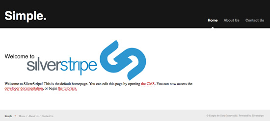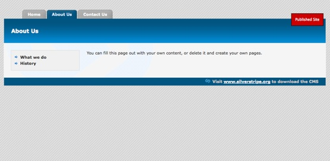

##  Installation

You need to [download the SilverStripe software](http://www.silverstripe.org/stable-download) and install it to your local
machine or to a webserver. 

For more infomation about installing and configuring a webserver read the [Installation instructions and videos](../installation). 

If you want to follow this tutorial please choose "empty template" when installing SilverStripe. If you want a fully
featured theme then select the 'BlackCandy' option.

##  Exploring the installation

After installation, open up the folder where you installed SilverStripe. If you installed on windows with WAMP, it will
likely be at *c:\wamp\wwww*. 

Let's have a look at the folder structure.

 | Directory | | Description  | 
 | --------- | | -----------  | 
 | assets/   | | Contains images and other files uploaded via the SilverStripe CMS. You can also place your own content inside it, and link to it from within the content area of the CMS. | 
 | cms/      | | Contains all the files that form the CMS area of your site. It’s structure is similiar to the mysite/ directory, so if you find something interesting, it should be easy enough to look inside and see how it was built. | 
 | sapphire/ | | The framework that builds both your own site and as the CMS that powers it. You’ll be utilizing files in this directory often, both directly and indirectly.                                                             | 
 | mysite/   | | Contains all your sites code (mainly PHP and JavaScript)  | 
 | themes/   | | Combines all images, stylesheets and templates powering your website into a reusable "theme" | 
      
When designing your site you should only need to modify the *mysite*, *themes* and *assets* folders. The rest of the folders contain files and data that are not specific to any site.

##  Using the CMS

The CMS is the area in which you can manage your site content. You can access the cms at http://localhost/admin. You
will be presented with a login screen. You can login with the details you provided at installation. After logging in you
should be greeted with the CMS, pictured below (we've entered some test content).

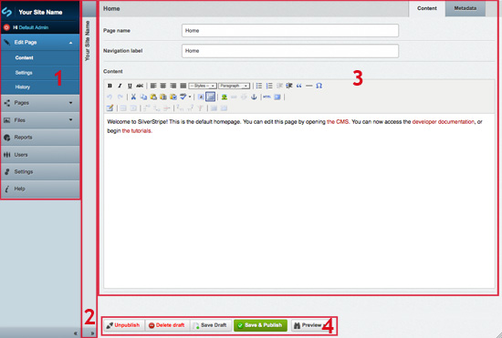

1.  These buttons allow you to move between the different sections in the CMS. There are three core sections in the CMS - Site Content, Files & Images and Security. Modules may have their own sections here as well, if any are installed. In this tutorial we will be focusing on the Site Content section.
2.  All the pages in the site are laid out in the site tree. You can add, delete and reorganize the pages using the buttons at the top. Clicking on a page will open it in the editor on the right.
3.  This section allows you to edit the content for the currently selected page, as well as changing other properties of the page such as the page name and URL. The content editor has full [WYSIWYG](http://en.wikipedia.org/wiki/WYSIWYG) abilities, allow you to change formatting and insert links, images and tables.
4.  There are two copies of each page: draft & published. These buttons allow you to save your changes to the draft copy, publish your draft copy, or revert your draft copy to the published copy. By having separate draft & published copies, we can preview draft changes in the site before publishing them to the live site.
5.  The navigator will open the current page in the CMS, the draft site, or the published site.

### Try it

There are three pages already created for you - "Home", "About Us" and "Contact Us", as well as a 404 page. Experiment
with the editor - try different formatting, tables and images. When you are done, click "Save" to save the page or "Save
& Publish" to post the content to the live site. In our screenshot we've entered some test content. 

> Don't worry that we currently have no way of navigating from page to page without using the CMS - we will build a navigation system soon.

When you create a new page, you are given a drop down that allows you to select the page type of the page. The page type
specifies the templates used to render the page, the fields that are able to be edited in the CMS, and page specific
behavior. We will explain page types in more depth as we progress; for now, make all pages of the type "Page".

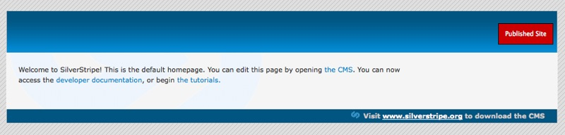

**SilverStripe's virtual URLs**

While you are on the draft or live SilverStripe site, you may notice the URLs point to files that don't exist, e.g.
http://localhost/contact. SilverStripe uses the URL field on the Meta-Data tab of the editor to look up the appropriate
page in the database.

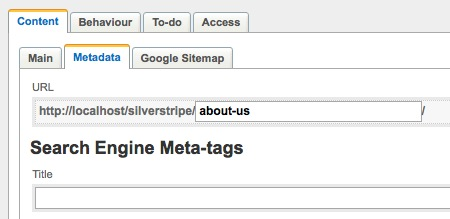

When you create a new page, SilverStripe automatically creates an appropriate URL for it. For example, *About Us* will
become *about-us*. You are able to change it yourself so that you can make long titles more usable or descriptive. For
example, *Employment Opportunities* could be shortened to *jobs*. The ability to generate easy to type, descriptive URLs
for SilverStripe pages improves accessibility for humans and search engines.

You should ensure the URL for the home page is *home*. By default, SilverStripe loads the page with the URL *home*.

## Templates

All pages on a SilverStripe site are rendered using a template. A template is an HTML file augmented with special
control codes. Because of this, you can have as much control of your site’s HTML code as you like.

Every page in your site has a **page type**. We will briefly talk about page types later, and go into much more detail
in tutorial two; right now all our pages will be of the page type *Page*. When rendering a page, SilverStripe will look
for a template file in the *tutorial/templates* folder, with the name `<PageType>`.ss - in our case *Page.ss*.

Open *themes/tutorial/templates/Page.ss*. It uses standard HTML with three exceptions: `<% base_tag %>`, *$Content* and
*$SilverStripeNavigator*. These template markers are processed by SilverStripe into HTML before being sent to your
browser.

`<% base_tag %>` is replaced with the HTML [base element](http://www.w3.org/TR/html401/struct/links.html#h-12.4). This
ensures the browser knows where to locate your site's images and css files.

*$Content* is replaced with the content of the page currently being viewed. This allows you to make all changes to
your site's content in the CMS.

*$SilverStripeNavigator* inserts the HTML for the navigator at the bottom of the page, which allows you to move
quickly between the CMS and the draft and published version of your page.

**Flushing the cache**

Whenever we edit a template file, we need to append *?flush=1* onto the end of the URL, e.g.
http://localhost/home/?flush=1. SilverStripe stores template files in a cache for quicker load times. Whenever there are
changes to the template, we must flush the cache in order for the changes to take effect.

## Inserting the page title

Let's introduce two new template variables - *$Title* and *$MetaTags*.

*$Title* is simply replaced with the name of the page ('Page name' on the 'Main' tab in the editor). 

Open *themes/tutorial/templates/Page.ss* and find the following code:

	:::ss
	

	   <h1>&nbsp;</h1>
	

and replace it with

	:::ss
	

	 <h1>$Title</h1>
	

*$MetaTags* adds meta tags for search engines, as well as the page title ('Title' on the 'Meta-data' tab in the
editor). You can define your metatags in the meta-data tab off the content editor in the CMS. 

Add *$MetaTags* to the head so that it looks like this:

	:::ss
	<head>
	   <% base_tag %>
	   $MetaTags
	   <% require themedCSS(layout) %> 
	   <% require themedCSS(typography) %> 
	   <% require themedCSS(form) %>
	</head>

> Don't forget to flush the cache each time you change a template by adding *?flush=1* onto the end of the URL.

Your page should now look something like this (with your own content of course):

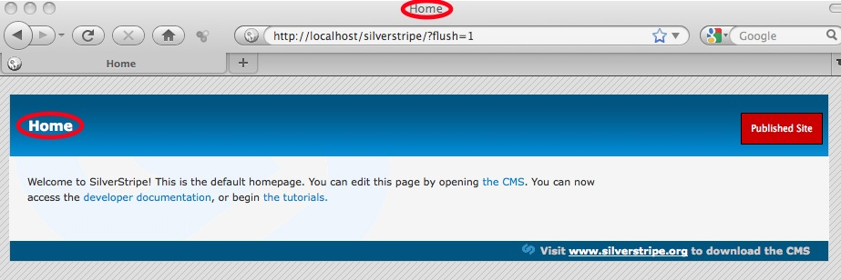

##  Making a Navigation System

So far we have made several pages, but we have no way to navigate between them. We can create a menu for our site using
a **control block**. Control blocks allow us to iterate over a data set, and render each item using a sub-template. The
**page control** *Menu(1)* returns the set of the first level menu items. We can then use the template variable
*$MenuTitle* to show the title of the page we are linking to.

Open up *themes/tutorial/templates/Page.ss*, and insert the following code inside `
`:

	:::ss
	<ul id="Menu1">
	   <% control Menu(1) %>
	      <li><a href="#">$MenuTitle</a></li>
	   <% end_control %>
	</ul>

Here we've created an unordered list called *Menu1*, which *themes/tutorial/css/layout.css* will style into the menu.
Then, using a control block over the page control *Menu(1)*, we add a link to the list for each menu item. 

All going to plan, your page should look like this:

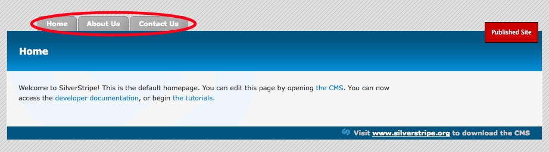

The menu isn't really very useful until each button links to the relevant page. We can get the link for the menu item in
question by using the *$Link* template variable. 

Replace the list item line with this one:

	:::ss
	<li><a href="$Link" title="Go to the &quot;{$Title}&quot; page">$MenuTitle</a></li>

> $Title refers to *Page Name* in the CMS, whereas $MenuTitle refers to (the often shorter) *Navigation label*

## Highlighting the current page

A useful feature is highlighting the current page the user is looking at. We can do this with the template variable
*$LinkingMode*. *$LinkingMode* returns one of three values:

*  *current* - This page is being visited, and should be highlighted
*  *link* - The page is not currently being visited, so shouldn't be highlighted
*  *section* - A page under this page is being visited so you probably want to highlight it.

> For example: if you were visiting a staff member such as "Home > Company > Staff > Bob Smith", you would want to highlight 'Company' to say you are in that section.

Highlighting the current page is easy, simply assign a css class based on the value of *$LinkingMode*. Then provide a different style for current/section in css, as has been provided for you in *tutorial/css/layout.css*. 

Change the list item line in *Page.ss* so it looks like this:

	:::ss
	<li class="$LinkingMode">
		<a href="$Link" title="Go to the &quot;{$Title}&quot; page">$MenuTitle</a>
	</li>

You should now have a fully functional top menu

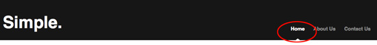

## Adding a second level

Although we have a fully functional navigation system, it is currently quite restrictive. Currently there is no way to
nest pages, we have a completely flat site. Adding a second level in SilverStripe is easy. First, let's add some pages. The "About Us" section could use some expansion. 

Select "About Us", and create two new pages "What we do" and "Our History" of the type "Page" inside. You can also create the pages elsewhere on the site tree, and use the reorganize button to drag and drop the pages into place. 

Either way, your site tree should now look something like this:

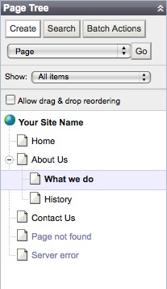

Great, we now have a hierarchical site structure, but we still have no way of getting to these second level pages.
Adding a second level menu is very similar to adding the first level menu. 

Open up our *Page.ss* template, and find the `
` tag. Underneath it, add the following code:

	:::ss
	<ul id="Menu2">
	  <% control Menu(2) %>
	    <li class="$LinkingMode"><a href="$Link" title="Go to the &quot;{$Title}&quot; page">$MenuTitle</a></li>
	  <% end_control %>
	</ul>

This should look very familiar. It is exactly the same as our first menu, except we have named our linked list *Menu2*
and we are using the control *Menu(2)* instead of *Menu(1)*. As we can see here, the *Menu* control takes a single
argument - the level of the menu we want to get. Our css file will style this linked list into the second level menu,
using our usual *$LinkingMode* technique to highlight the current page.

We now have our second level menu, but we also have a problem. The menu is displayed on every page, even those that
don't have any nested pages. We can solve this problem with an **if block**. Simply surround the menu with an if block
like this:

	:::ss
	<% if Menu(2) %>
	  <ul id="Menu2">
	    <% control Menu(2) %>
	      <li class="$LinkingMode"><a href="$Link" title="Go to the &quot;{$Title}&quot; page">$MenuTitle</a></li>
	    <% end_control %>
	  </ul>
	<% end_if %>

The if block only includes the code inside it if the condition is true. In this case, it checks for the existence of
*Menu(2)*. If it exists then the code inside will be processed and the menu will be shown. Otherwise the code will not
be processed and the menu will not be shown.

Now that we have two levels of navigation, it would also be useful to include some "breadcrumbs". 

Find *`
`* and underneath it add:

	:::ss
	

	  $Breadcrumbs
	
	

Breadcrumbs are only useful on pages that aren't in the top level. We can ensure that we only show them if we aren't in
the top level with another if statement.

	:::ss
	<% if Level(2) %>
	  

	    $Breadcrumbs
	  

	<% end_if %>

The *Level* page control allows you to get data from the page's parents, eg if you used *Level(1)*, you could use
*$Level(1).Title* to get the top level page title. In this case, we merely use it to check the existence of a second
level page; if one exists then we include the breadcrumbs.

We now have a fully functioning two level navigation system. Both menus should be updating and highlighting as you move
from page to page. They will also mirror changes done in the SilverStripe CMS, such as renaming pages or moving them
around.

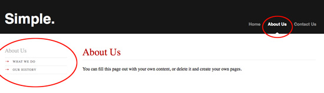

## Using a different template for the home page

So far, a single template *Page.ss* is being used for the entire site. This is useful for the purpose of this
tutorial, but in a finished website we can expect there to be several page layouts.

To illustrate how we do this, we will create a new template for the homepage. This template will have a large graphical
banner to welcome visitors.

### Creating a new page type

Earlier we stated that every page in a SilverStripe site has a **page type**, and that SilverStripe will look for a
template corresponding to the page type. Therefore, the first step to get the homepage using a different template is to
create a new page type.

Each page type is represented by two php classes: a *data object* and a *controller*. Don't worry about the details of page
types right now, we will go into much more detail in tutorial two.

Create a new file *HomePage.php* in *mysite/code*. Copy the following code into it:

	:::php
	<?php
	/**
	 * Defines the HomePage page type
	 */
	
	class HomePage extends Page {
	   static $db = array(
	   );
	   static $has_one = array(
	   );
	}
	
	class HomePage_Controller extends Page_Controller {
		
	}

Every page type also has a database table corresponding to it. Every time we modify the database, we need to rebuild it.
We can do this by going to [http://localhost/dev/build?flush=1](http://localhost/dev/build?flush=1). It may take a
moment, so be patient. This add tables and fields needed by your site, and modifies any structures that have changed. It
does this non-destructively - it will never delete your data.

As we have just created a new page type, SilverStripe will add this to the list of page types in the database.

### Changing the page type of the Home page

After building the database, we can change the page type of the homepage in the CMS. 

Under the "Behaviour" tab. Change it to *HomePage*, and click "Save Draft" and "Publish".

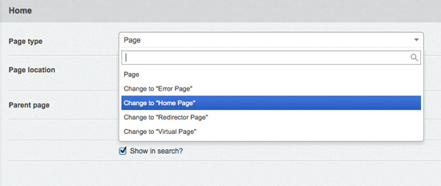

Our homepage is now of the page type *HomePage*. However, even though it is of the *HomePage* page type, it is still
rendered with the *Page* template. SilverStripe still renders the homepage using the *Page* template because when we
created the *HomePage* page type, we inherited from *Page*. So when SilverStripe cannot find a *HomePage* template, it
will use the *Page* template. SilverStripe always attempts to use the most specific template first, and then falls back
to the template of the page type's parents.

### Creating a new template

To create a new template, create a copy of *Page.ss* (found in *themes/tutorial/templates*) and call it *HomePage.ss*. If we flush the cache (*?flush=1*), SilverStripe should now be using *HomePage.ss* for the homepage, and *Page.ss* for the rest of the site. Now let's customize the *HomePage* template. 

First, remove the breadcrumbs and the secondary menu; we don't need them for the homepage. Let's replace the title with our image. Add this line above the *Content* div:

	:::ss
	

	  
	

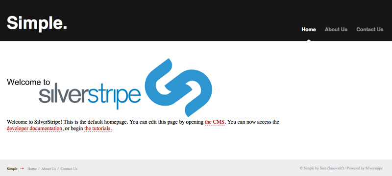

### Using a subtemplate

Having two templates is good, but we have a lot of identical code in the two templates. Rather than having two
completely separate templates, we can use subtemplates to specify only the part of the template that has changed.
If we compare *Page.ss* and *HomePage.ss*, we can see the only differences are within the *ContentContainer* div. 

Copy the contents of the *ContentContainer* div from *themes/tutorial/templates/Page.ss* to a new file
*themes/tutorial/templates/Layout/Page.ss*, and do the same from *themes/tutorial/templates/HomePage.ss* to
*themes/tutorial/templates/Layout/HomePage.ss*. 

The files should look like this:

**themes/tutorial/templates/Layout/Page.ss**

	:::ss
	<% if Menu(2) %>
	  <ul id="Menu2">
	    <% control Menu(2) %>
	      <li class="$LinkingMode"><a href="$Link" title="Go to the &quot;{$Title}&quot; page">$MenuTitle</a></li>
	    <% end_control %>
	  </ul>
	<% end_if %>
	
	

	  <% if Level(2) %>
	    

	      $Breadcrumbs
	    

	  <% end_if %>			
	  $Content
	  $Form
	

**themes/tutorial/templates/Layout/HomePage.ss**

	:::ss
	

	  
	

	

	  $Content
	

We can then delete *themes/tutorial/templates/HomePage.ss*, as it is no longer needed. 

Replace the code we just copied out of *themes/tutorial/templates/Page.ss* with *$Layout*, so it looks like this:

**themes/tutorial/templates/Page.ss**

	:::ss
	<!DOCTYPE html PUBLIC "-//W3C//DTD XHTML 1.1//EN" "http://www.w3.org/TR/xhtml11/DTD/xhtml11.dtd">
	<html xmlns="http://www.w3.org/1999/xhtml" xml:lang="en" >
	  <head>
	    <% base_tag %>
	    $MetaTags
	    <% require themedCSS(layout) %> 
	   	<% require themedCSS(typography) %> 
	   	<% require themedCSS(form) %>
	  </head>
	  <body>
	    

	      <ul id="Menu1">
	        <% control Menu(1) %>
	          <li class="$LinkingMode"><a href="$Link" title="Go to the &quot;{$Title}&quot; page">$MenuTitle</a></li>
	        <% end_control %>
	      </ul>
	      

	        <h1>$Title</h1>
	      

	      

	        $Layout
	      

	      

	        Visit <a href="http://www.silverstripe.com" title="Visit www.silverstripe.com">www.silverstripe.com</a> to download the CMS
	      

	    

	    $SilverStripeNavigator
	  </body>
	</html>

> As you have just done a few template changes, remember to add *?flush=1* in your URL to flush the cache so see your changes in the browser

SilverStripe first searches for a template in the *themes/tutorial/templates* folder. Since there is no *HomePage.ss*,
it will use the *Page.ss* for both *Page* and *HomePage* page types. When it comes across the *$Layout* tag, it will
then descend into the *themes/tutorial/templates/Layout* folder, and will use *Page.ss* for the *Page* page type, and
*HomePage.ss* for the *HomePage* page type.

## Summary

Starting from a basic template, we have introduced template variables, controls and if blocks, and we have used these
to build a basic but fully functional site. You have also been briefly introduced to page types, and seen how they
correspond to templates and subtemplates. By using these templates, you have seen how to customize the site content
according to the page type of the page you are displaying.

In the next tutorial, [Extending a Basic Site](2-extending-a-basic-site), we will explore page types on a
deeper level, and see how you can customize your own page types to extend SilverStripe to do much more interesting
things.

[Next Tutorial >>](2-extending-a-basic-site)

## Books on SilverStripe 

*  [Official book on SilverStripe in English](http://www.silverstripe.org/silverstripe-book).
*  [Official book on SilverStripe in German](http://www.silverstripe.org/das-silverstripe-buch).

