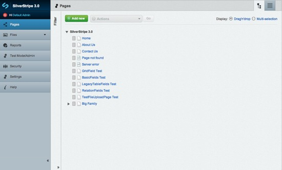
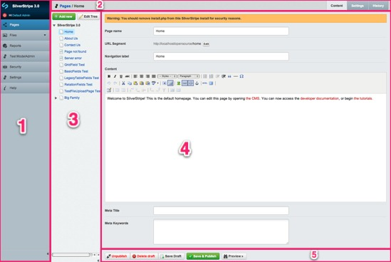
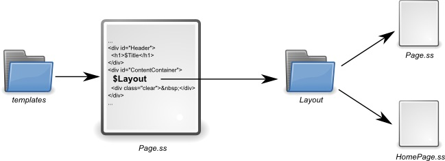

# Tutorial 1 - Building a Basic Site

## Overview

Welcome to the first in this series of tutorials on the SilverStripe Content Management System (CMS). 

These tutorials are designed to take you from an absolute beginner to being able to build large, complex websites with
SilverStripe. We assume to begin with, that you have some XHTML, CSS and PHP knowledge. This first tutorial provides an absolute
introduction to building a simple website using SilverStripe. It will also teach you how to use the content management system at a basic level.

##  What are we working towards?

We are going to create a site in which all the content can be edited in the SilverStripe CMS. It will have a two-level
navigation system, which will be generated on the fly to include all pages you add in the CMS. We will use two different
templates - one for the home page, and one for the rest of the site.

##  Installation

You need to [download the SilverStripe software](http://www.silverstripe.org/stable-download) and install it to your local
machine or to a webserver. 

For more infomation about installing and configuring a webserver read the [Installation instructions and videos](../installation). 

This tutorial uses the SilverStripe CMS default theme 'Simple' which you will find in the themes folder. We will investigate the existing template files that make up the theme as well as create some new files to build upon the theme.

##  Exploring the installation

After installation, open up the folder where you installed SilverStripe. 

If you installed on windows with WAMP, it will likely be at *c:\wamp\wwww*. On Mac OS X with MAMP, it will likely be at */Applications/MAMP/htdocs/*

Let's have a look at the folder structure.

 | Directory | | Description  | 
 | --------- | | -----------  | 
 | assets/   | | Contains images and other files uploaded via the SilverStripe CMS. You can also place your own content inside it, and link to it from within the content area of the CMS. | 
 | cms/      | | Contains all the files that form the CMS area of your site. It’s structure is similiar to the mysite/ directory, so if you find something interesting, it should be easy enough to look inside and see how it was built. | 
 | framework/ | | The framework that builds both your own site and as the CMS that powers it. You’ll be utilizing files in this directory often, both directly and indirectly.                                                             | 
 | mysite/   | | Contains all your sites code (mainly PHP and JavaScript)  | 
 | themes/   | | Combines all images, stylesheets and templates powering your website into a reusable "theme" | 
      
When designing your site you should only need to modify the *mysite*, *themes* and *assets* folders. The rest of the folders contain files and data that are not specific to any site.

##  Using the CMS

### User Interface Basics

The CMS is the area in which you can manage your site content. You can access the cms at http://localhost/admin (or http://yourdomain.com/admin if you are using you own domain name). You
will be presented with a login screen. You can login with the details you provided at installation. After logging in you
should be greeted with the CMS and a list of the pages currently in the CMS. Here you can add, delete and reorganize the pages using the buttons at the top. Clicking on a page will open it in the page editing interface pictured below (we've entered some test content).

1.  These buttons allow you to move between the different sections in the CMS. There are four core sections in the CMS - "Pages", "Files", "Users" and "Settings". Modules may have their own sections here as well, if any are installed. In this tutorial we will be focusing on the "Pages" section.
2.  While in "Pages" you can quickly move between the pages in the CMS by clicking the vertical bar between the CMS menu and the editor. This will slide out a sidebar. To hide this, click the arrow at the bottom of the sidebar.

3.  This section allows you to edit the content for the currently selected page, as well as changing other properties of the page such as the page name and URL. The content editor has full [WYSIWYG](http://en.wikipedia.org/wiki/WYSIWYG) abilities, allow you to change formatting and insert links, images and tables.
4.  These buttons allow you to save your changes to the draft copy, publish your draft copy, unpublish from the live website or remove a page from the draft website. 
The SilverStripe CMS workflow stores two copies of a page, a draft and a published one. By having separate draft & published copies, we can preview draft changes in the site before publishing them to the live website. You can quickly preview your draft pages without leaving the CMS by clicking the "Preview" button.

### Page Editor

Once you have selected a page to modify from the Pages section your page will open in the Page Editior. 

The Edit Page section has 3 main areas in which you can edit the content of the page, change the settings and track your revision history (These will be covered in more detail further on in the tutorials).

1.  *Content* - Allows you to set the title, wysiwyg content, URL and Meta data for your page.
2.  *Settings* - Here you set the type of page behavior, parent page, show in search, show in menu, and who can view or edit the page.
3.  *History* - This allow you to view previous version of your page, compare change and revert to previous version if need be.

### Try it

There are three pages already created for you - "Home", "About Us" and "Contact Us", as well as a 404 page. Experiment
with the editor - try different formatting, tables and images. When you are done, click "Save" to save the page or "Save
& Publish" to post the content to the live site. 

When you create a new page, you are given a drop down that allows you to set the structure of the page (Top level or Under another page) and the page type. 
The page type specifies the templates used to render the page, the fields that are able to be edited in the CMS, and page specific
behavior. We will explain page types in more depth as we progress; for now, make all pages of the type "Page".

**SilverStripe's friendly URLs**

While you are on the draft or live SilverStripe site, you may notice the URLs point to files that don't exist, e.g.
http://localhost/contact or http://yourdomainname.com/about-us etc. SilverStripe uses the URL field on the Meta-Data tab of the Edit Page -> Content section to look up the appropriate
page in the database.

Note that if you have sub-pages, changing the Top level URL field for a page will affect the URL for all sub-pages. For example, if we changed the URL field "/about-us/" to "/about-silverstripe/" then the sub-pages URLs would now be "/about-silverstripe/URL-of-subpage/" rather than "/about-us/URL-of-subpage/".

When you create a new page, SilverStripe automatically creates an appropriate URL for it. For example, *About Us* will
become *about-us*. You are able to change it yourself so that you can make long titles more usable or descriptive. For
example, *Employment Opportunities* could be shortened to *jobs*. The ability to generate easy to type, descriptive URLs
for SilverStripe pages improves accessibility for humans and search engines.

You should ensure the URL for the home page is *home*. By default, SilverStripe loads the page with the URL *home*.

## Templates

All pages on a SilverStripe site are rendered using a template. A template is an HTML file augmented with special
control codes. Because of this, you can have as much control of your site’s HTML code as you like.

Every page in your site has a **page type**. We will briefly talk about page types later, and go into much more detail
in tutorial two; right now all our pages will be of the page type *Page*. When rendering a page, SilverStripe will look
for a template file in the *simple/templates* folder, with the name `<PageType>`.ss - in our case *Page.ss*.

Open *themes/simple/templates/Page.ss*. It uses standard HTML apart from these exceptions: 

`<% base_tag %>` is replaced with the HTML [base element](http://www.w3.org/TR/html401/struct/links.html#h-12.4). This
ensures the browser knows where to locate your site's images and css files.

*$MetaTitle, $Title, and $SiteConfig.Title* in the html <title> tag are replaced by the title set in the Meta tags, Page Name, or Settings -> Site Title.

*$Title* is simply replaced with the name of the page ('Page name' on the 'Main' tab in the editor).

*$MetaTags* adds meta tags for search engines, as well as the page title ('Title' on the 'Meta-data' tab in the
editor). You can define your metatags in the meta-data tab off the content editor in the CMS. 

*$Layout* is replaced with the contents of a template file with the same name as the page type we are using. 

Open *themes/simple/templates/Layout/Page.ss*. You will see more HTML and more SilverStripe template replacement tags and variables.

*$Content* is replaced with the content of the page currently being viewed. This allows you to make all changes to
your site's content in the CMS.

These template markers are processed by SilverStripe into HTML before being sent to your
browser and are formatted either with a *$* at the beginning or are between the SilverStripe template tags *`<%  %>`*.

**Flushing the cache**

Whenever we edit a template file, we need to append *?flush=1* onto the end of the URL, e.g.
http://localhost/home/?flush=1. SilverStripe stores template files in a cache for quicker load times. Whenever there are
changes to the template, we must flush the cache in order for the changes to take effect.

##  The Navigation System

We are now going to look at how the navigation system is implemented in the template. 

Open up *themes/simple/templates/Includes/Navigation.ss*

Menu for our site are created using a **loop**. Loops allow us to iterate over a data set, and render each item using a sub-template. The
**loop** *Menu(1)* returns the set of the first level menu items. We can then use the template variable
*$MenuTitle* to show the title of the page we are linking to, $Link for the URL of the page and $LinkingMode to help style our menu with CSS (explained in more detail shortly).

> $Title refers to *Page Name* in the CMS, whereas $MenuTitle refers to (the often shorter) *Navigation label*

	:::ss
	<ul>
		<% loop Menu(1) %>	  
			<li class="$LinkingMode"><a href="$Link" title="$Title.XML">$MenuTitle.XML</a></li>
		<% end_loop %>
	</ul>

Here we've created an unordered list called *Menu1*, which *themes/simple/css/layout.css* will style into the menu.
Then, using a loop over the page control *Menu(1)*, we add a link to the list for each menu item. 

This creates the navigation at the top of the page:

## Highlighting the current page

A useful feature is highlighting the current page the user is looking at. We can do this with the template variable
*$LinkingMode* which we mentioned before. *$LinkingMode* returns one of three values:

*  *current* - This page is being visited, and should be highlighted
*  *link* - The page is not currently being visited, so shouldn't be highlighted
*  *section* - A page under this page is being visited so you probably want to highlight it.

> For example: if you were visiting a staff member such as "Home > Company > Staff > Bob Smith", you would want to highlight 'Company' to say you are in that section.

Highlighting the current page is easy, simply assign a css class based on the value of *$LinkingMode*. Then provide a different style for current/section in css, as has been provided for you in *simple/css/layout.css*. 

## A second level of navigation

The top navigation system is currently quite restrictive. There is no way to
nest pages, we have a completely flat site. Adding a second level in SilverStripe is easy. First (if you haven't already done so), let's add some pages. 

The "About Us" section could use some expansion. 

Select "Add New" in the Pages section, and create two new pages nested under the page "About Us" called "What we do" and "Our History" with the type "Page". 

You can also create the pages elsewhere on the site tree, and drag and drop the pages into place. 

Either way, your site tree should now look something like this:

Great, we now have a hierarchical site structure, let's now look at how this is created and displayed in our template.

Adding a second level menu is very similar to adding the first level menu. 

Open up */themes/simple/templates/Includes/Sidebar.ss* template and look at the following code:

	:::ss
	<ul>
	  <% loop Menu(2) %>
	    <li class="$LinkingMode"><a href="$Link" title="Go to the $Title.XML page">&rarr;$MenuTitle.XML</a></li>
	  <% end_loop %>
	</ul>

This should look very familiar. It is the same idea as our first menu, except the loop block now uses *Menu(2)* instead of *Menu(1)*. 
As we can see here, the *Menu* control takes a single
argument - the level of the menu we want to get. Our css file will style this linked list into the second level menu,
using our usual *$LinkingMode* technique to highlight the current page.

To make sure the menu is not displayed on every page, even those that *don't* have any nested pages. We use an **if block**. 
Look again in the *Sidebar.ss* file and you will see that the menu is surrounded with an **if block**
like this:

	:::ss
	<% if Menu(2) %>
		...
			<ul>
				<% loop Menu(2) %>
				<li class="$LinkingMode"><a href="$Link" title="Go to the $Title.XML page">&rarr;$MenuTitle.XML</a></li>
				<% end_loop %>
			</ul>
		...
	<% end_if %>  	

The if block only includes the code inside it if the condition is true. In this case, it checks for the existence of
*Menu(2)*. If it exists then the code inside will be processed and the menu will be shown. Otherwise the code will not
be processed and the menu will not be shown.

Now that we have two levels of navigation, it would also be useful to include some "breadcrumbs". 

Open up */themes/simple/templates/Includes/BreadCrumbs.ss* template and look at the following code:

	:::ss
	<% if Level(2) %>
	

	   	$Breadcrumbs
	

<% end_if %>	

Breadcrumbs are only useful on pages that aren't in the top level. We can ensure that we only show them if we aren't in
the top level with another if statement.

The *Level* page control allows you to get data from the page's parents, e.g. if you used *Level(1)*, you could use
*$Level(1).Title* to get the top level page title. In this case, we merely use it to check the existence of a second
level page; if one exists then we include the breadcrumbs.

This shows how the two level navigation system functions. Both menus should be updating and highlighting as you move
from page to page. They will also mirror changes done in the SilverStripe CMS, such as renaming pages or moving them
around.

Feel free to experiment with the if and loop blocks, for example you could create a drop down style menu from the top navigation using a combination of the if blocks, loop blocks and some CSS to style it. This uses a *Children* if and loop block which checks to see if there is any sub-pages available within each top level navigation item, you will need to come up with your own CSS to correctly style this approach.

	::ss
	<ul>
	  <% loop Menu(1) %>
	    <li class="$LinkingMode">
	      <a href="$Link" title="$Title.XML">$MenuTitle.XML</a>
	      <% if Children %>
	      <ul>
	        <% loop Children %>
	          <li class="$LinkingMode"><a href="$Link" title="Go to the $Title.XML page">&rarr;$MenuTitle.XML</a></li>
	        <% end_loop %>
	      <ul>
	      <% end_if %>
	    </li>
	  <% end_loop %>
	</ul>

## Using a different template for the home page

So far, a single template layout *Layouts/Page.ss* is being used for the entire site. This is useful for the purpose of this
tutorial, but in a finished website we can expect there to be several page layouts.

To illustrate how we do this, we will create a new template for the homepage. This template will have a large graphical
banner to welcome visitors.

### Creating a new page type

Earlier we stated that every page in a SilverStripe site has a **page type**, and that SilverStripe will look for a
template or template layout corresponding to the page type. Therefore, the first step to get the homepage using a different template is to
create a new page type.

Each page type is represented by two php classes: a *data object* and a *controller*. Don't worry about the details of page
types right now, we will go into much more detail in tutorial two.

Create a new file *HomePage.php* in *mysite/code*. Copy the following code into it:

	:::php
	<?php
	/**
	 * Defines the HomePage page type
	 */
	
	class HomePage extends Page {
	   static $db = array(
	   );
	   static $has_one = array(
	   );
	}
	
	class HomePage_Controller extends Page_Controller {
		
	}

Every page type also has a database table corresponding to it. Every time we modify the database, we need to rebuild it.
We can do this by going to [http://localhost/dev/build?flush=1](http://localhost/dev/build?flush=1) or replace *localhost* with your own domain name. 

It may take a moment, so be patient. This add tables and fields needed by your site, and modifies any structures that have changed. It
does this non-destructively - it will never delete your data.

As we have just created a new page type, SilverStripe will add this to the list of page types in the database.

### Changing the page type of the Home page

After building the database, we can change the page type of the homepage in the CMS. 

Navigate in the CMS to the "Home" page and under the "Behaviour" tab in the "Edit Page > Settings" section. Change it to *Home Page*, and click "Save & Publish".

Our homepage is now of the page type *HomePage*. However, even though it is of the *HomePage* page type, it is still
rendered with the *Page* template. SilverStripe still renders the homepage using the *Page* template because when we
created the *HomePage* page type, we inherited from *Page*. So when SilverStripe cannot find a *HomePage* template, it
will use the *Page* template. SilverStripe always attempts to use the most specific template first, and then falls back
to the template of the page type's parents.

### Creating a new template

To create a new template layout, create a copy of *Page.ss* (found in *themes/simple/templates/Layouts*) and call it *HomePage.ss*. If we flush the cache (*?flush=1*), SilverStripe should now be using *HomePage.ss* for the homepage, and *Page.ss* for the rest of the site. Now let's customize the *HomePage* template. 

First, remove the breadcrumbs and the secondary menu by removing the `<% include SideBar %>` line of code; we don't need them for the homepage. Let's replace the title with an image. Add this line above the *$Content* variable.

Now add the following to replace the `<h1>$Title</h1>` code in your template:

	:::ss
	

	  
	

Your Home page should now look like this:

SilverStripe first searches for a template in the *themes/simple/templates* folder. Since there is no *HomePage.ss*,
it will use the *Page.ss* for both *Page* and *HomePage* page types. When it comes across the *$Layout* tag, it will
then descend into the *themes/simple/templates/Layout* folder, and will use *Page.ss* for the *Page* page type, and
*HomePage.ss* for the *HomePage* page type. So while you could create a HomePage.ss in the *themes/simple/templates/* it is better to reuse the navigation and footer common to both our Home page and the rest of the pages on our website and lets you write less code to achieve the end result.

## Summary

We have introduced template variables, controls and if blocks, and we have used these
to build a basic but fully functional site. You have also been briefly introduced to page types, and seen how they
correspond to templates and sub-templates. By using these templates, you have seen how to customize the site content
according to the page type of the page you are displaying.

In the next tutorial, [Extending a Basic Site](2-extending-a-basic-site), we will explore page types on a
deeper level, and see how you can customize your own page types to extend SilverStripe to do much more interesting
things.

[Next Tutorial >>](2-extending-a-basic-site)

## Books on SilverStripe 

*  [Official book on SilverStripe in English](http://www.silverstripe.org/silverstripe-book).
*  [Official book on SilverStripe in German](http://www.silverstripe.org/das-silverstripe-buch).

