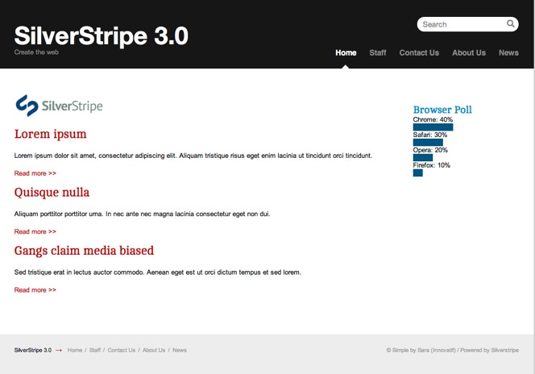
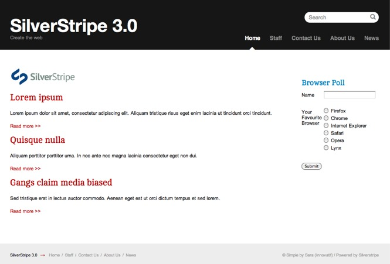
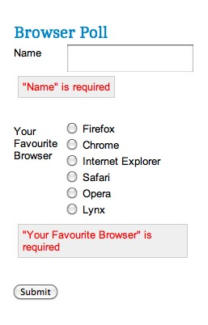

# Tutorial 3 - Forms

## Overview

This tutorial is intended to be a continuation of the first two tutorials ([first tutorial](1-building-a-basic-site), [second tutorial](2-extending-a-basic-site)). In this tutorial we will build on the site we developed in the earlier tutorials and explore forms in SilverStripe. We will look at custom coded forms: forms which need to be written in PHP.

Instead of using a custom coded form, we could use the [userforms module](http://silverstripe.org/user-forms-module). This module allows users to construct forms via the CMS. A form created this way is much quicker to implement, but also lacks the flexibility of a coded form. 

## What are we working towards?

We will create a poll on the home page that asks the user their favourite web browser, and displays a bar graph of the results.

## Creating the form

The poll we will be creating on our homepage will ask the user for their name and favourite web browser. It will then collate the results into a bar graph. We create the form in a method on *HomePage_Controller*.

**mysite/code/HomePage.php**

	:::php
	class HomePage_Controller extends Page_Controller {
		// ...
	
		public function BrowserPollForm() {
			// Create fields
			$fields = new FieldList(
				new TextField('Name'),
				new OptionsetField('Browser', 'Your Favourite Browser', array(
					'Firefox' => 'Firefox',
					'Chrome' => 'Chrome',
					'Internet Explorer' => 'Internet Explorer',
					'Safari' => 'Safari',
					'Opera' => 'Opera',
					'Lynx' => 'Lynx'
				))
			);
			
			// Create actions
			$actions = new FieldList(
				new FormAction('doBrowserPoll', 'Submit')
			);
		
			return new Form($this, 'BrowserPollForm', $fields, $actions);
		}
	
	   ...
	}
	
	...

Let's step through this code.

	:::php
	// Create fields
	$fields = new FieldList(
		new TextField('Name'),
		new OptionsetField('Browser', 'Your Favourite Browser', array(
			'Firefox' => 'Firefox',
			'Chrome' => 'Chrome',
			'Internet Explorer' => 'Internet Explorer',
			'Safari' => 'Safari',
			'Opera' => 'Opera',
			'Lynx' => 'Lynx'
		))
	);

First we create our form fields. 
We do this by creating a `[api:FieldList]` and passing our fields as arguments. 
The first field is a `[api:TextField]` with the name 'Name'.
There is a second argument when creating a field which specifies the text on the label of the field. If no second
argument is passed, as in this case, it is assumed the label is the same as the name of the field.
The second field we create is an `[api:OptionsetField]`. This is a dropdown, and takes a third argument - an
array mapping the values to the options listed in the dropdown.

	:::php
	$actions = new FieldList(
		new FormAction('doBrowserPoll', 'Submit');
	);

After creating the fields, we create the form actions. Form actions appear as buttons at the bottom of the form. 
The first argument is the name of the function to call when the button is pressed, and the second is the label of the button.
Here we create a 'Submit' button which calls the 'doBrowserPoll' method, which we will create later.
All the form actions (in this case only one) are collected into a `[api:FieldList]` object the same way we did with
the fields.

	:::php
	return new Form($this, 'BrowserPollForm', $fields, $actions);

Finally we create the `[api:Form]` object and return it.
The first argument is the controller that contains the form, in most cases '$this'. The second is the name of the method
that returns the form, which is 'BrowserPollForm' in our case. The third and fourth arguments are the
FieldLists containing the fields and form actions respectively.

After creating the form function, we need to add the form to our home page template.
Add the following code to the top of your home page template, just before `
`:

**themes/simple/templates/Layout/HomePage.ss**

	:::ss
	...
	

		<h2>Browser Poll</h2>
		$BrowserPollForm
	

	

	...

In order to make the graphs render correctly,
we need to add some CSS styling.
Add the following code to the existing `form.css` file:

**themes/simple/css/form.css**

	:::css
	/* BROWSER POLL */
	#BrowserPoll {
		float: right;
		margin: 20px 10px 0 0;
		width: 20%;
	}
		form FieldList {
			border:0;
		}
   		#BrowserPoll .message {
            float:left;
            display: block;
            color:red;
            background:#efefef;
            border:1px solid #ccc;
            padding:5px;
            margin:5px;
        }
		#BrowserPoll h2 {
			font-size: 1.5em;
			line-height:2em;
			color: #0083C8;
		}
		#BrowserPoll .field {
			padding:3px 0;
		}
		#BrowserPoll input.text {
			padding: 0;
			font-size:1em;
		}
		#BrowserPoll .Actions {
			padding:5px 0;
		}
		#BrowserPoll .bar {
			background-color: #015581;
		}

All going according to plan, if you visit [http://localhost/your_site_name/home?flush=all](http://localhost/your_site_name/home?flush=all) it should look something like this:

## Processing the form

Great! We now have a browser poll form, but it doesn't actually do anything. In order to make the form work, we have to implement the 'doBrowserPoll()' method that we told it about.

First, we need some way of saving the poll submissions to the database, so we can retrieve the results later. We can do this by creating a new object that extends from `[api:DataObject]`.
If you recall, in the [second tutorial](2-extending-a-basic-site) we said that all objects that inherit from DataObject and have their own fields are stored in tables the database. Also recall that all pages extend DataObject indirectly through `[api:SiteTree]`. Here instead of extending SiteTree (or `[api:Page]`) to create a page type, we will extend `[api:DataObject]` directly:

**mysite/code/BrowserPollSubmission.php**

	:::php
	<?php	
	class BrowserPollSubmission extends DataObject {
		static $db = array(
			'Name' => 'Text',
			'Browser' => 'Text'
		);
	}

If we then rebuild the database ([http://localhost/your_site_name/dev/build?flush=all](http://localhost/your_site_name/dev/build?flush=all)), we will see that the *BrowserPollSubmission* table is created. Now we just need to define 'doBrowserPoll' on *HomePage_Controller*:

**mysite/code/HomePage.php**

	:::php	
	class HomePage_Controller extends Page_Controller {
		// ...
		public function doBrowserPoll($data, $form) {
			$submission = new BrowserPollSubmission();
			$form->saveInto($submission);
			$submission->write();
			return $this->redirectBack();
		}
	}

A function that processes a form submission takes two arguments - the first is the data in the form, the second is the `[api:Form]` object.
In our function we create a new *BrowserPollSubmission* object. Since the name of our form fields, and the name of the database fields, are the same we can save the form directly into the data object.
We call the 'write' method to write our data to the database, and '$this->redirectBack()' will redirect the user back to the home page.

## Form validation

SilverStripe forms all have automatic validation on fields where it is logical. For example, all email fields check that they contain a valid email address. You can write your own validation by subclassing the *Validator* class.

SilverStripe provides the *RequiredFields* validator, which ensures that the fields specified are filled in before the form is submitted. To use it we create a new *RequiredFields* object with the name of the fields we wish to be required as the arguments, then pass this as a fifth argument to the Form constructor.

Change the end of the 'BrowserPollForm' function so it looks like this:

**mysite/code/HomePage.php**

	:::php
	public function BrowserPollForm() {
		// ...
		$validator = new RequiredFields('Name', 'Browser');
		return new Form($this, 'BrowserPollForm', $fields, $actions, $validator);
	}

If we then open the homepage and attempt to submit the form without filling in the required fields errors should appear.

## Showing the poll results

Now that we have a working form, we need some way of showing the results.
The first thing to do is make it so a user can only vote once per session. If the user hasn't voted, show the form, otherwise show the results.

We can do this using a session variable. The `[api:Session]` class handles all session variables in SilverStripe. First modify the 'doBrowserPoll' to set the session variable 'BrowserPollVoted' when a user votes.

**mysite/code/HomePage.php**

	:::php
	// ...
	class HomePage_Controller extends Page_Controller {
		// ...
		public function doBrowserPoll($data, $form) {
			$submission = new BrowserPollSubmission();
			$form->saveInto($submission);
			$submission->write();
			Session::set('BrowserPollVoted', true);
			return $this->redirectBack();
		}
	}

Then we simply need to check if the session variable has been set in 'BrowserPollForm()', and to not return the form if
it is.

	:::php
	// ...
	class HomePage_Controller extends Page_Controller {
		// ...
		public function BrowserPollForm() {
			if(Session::get('BrowserPollVoted')) return false;
			// ...
		}	
	}

If you visit the home page now you will see you can only vote once per session; after that the form won't be shown. You can start a new session by closing and reopening your browser,
or clearing your browsing session through your browsers preferences.

Although the form is not shown, you'll still see the 'Browser Poll' heading. We'll leave this for now: after we've built the bar graph of the results, we'll modify the template to show the graph instead of the form if the user has already voted.

Now that we're collecting data, it would be nice to show the results on the website as well. We could simply output every vote, but that's boring. Let's group the results by browser, through the SilverStripe data model.

In the [second tutorial](/tutorials/2-extending-a-basic-site), we got a collection of news articles for the home page by using the 'ArticleHolder::get()' function, which returns a `[api:DataList]`. We can get all submissions in the same fashion, through `BrowserPollSubmission::get()`. This list will be the starting point for our result aggregation.

Create the function 'BrowserPollResults' on the *HomePage_Controller* class.

**mysite/code/HomePage.php**

	:::php
	public function BrowserPollResults() {
		$submissions = new GroupedList(BrowserPollSubmission::get());
		$total = $submissions->Count();
		
		$list = new ArrayList();
		foreach($submissions->groupBy('Browser') as $browserName => $browserSubmissions) {
			$percentage = (int) ($browserSubmissions->Count() / $total * 100);
			$list->push(new ArrayData(array(
				'Browser' => $browserName,
				'Percentage' => $percentage
			)));
		}
		return $list;
	}

This code introduces a few new concepts, so let's step through it.

	:::php
	$submissions = new GroupedList(BrowserPollSubmission::get());

First we get all of the `BrowserPollSubmission` records from the database. This returns the submissions as a `[api:DataList]`.Then we wrap it inside a `[api:GroupedList]`, which adds the ability to group those records. The resulting object will behave just like the original `DataList`, though (with the addition of a `groupBy()` method). 

	:::php
	$total = $submissions->Count();

We get the total number of submissions, which is needed to calculate the percentages.

	:::php
	$list = new ArrayList();
	foreach($submissions->groupBy('Browser') as $browserName => $browserSubmissions) {
		$percentage = (int) ($browserSubmissions->Count() / $total * 100);
		$list->push(new ArrayData(array(
			'Browser' => $browserName,
			'Percentage' => $percentage
		)));
	}

Now we create an empty `[api:ArrayList]` to hold the data we'll pass to the template. Its similar to `[api:DataList]`, but can hold arbitrary objects rather than just DataObject` instances. Then we iterate over the 'Browser' submissions field. 

The `groupBy()` method splits our list by the 'Browser' field passed to it, creating new lists with submissions just for a specific browser. Each of those lists is keyed by the browser name. The aggregated result is then contained in an `[api:ArrayData]` object, which behaves much like a standard PHP array, but allows us to use it in SilverStripe templates.

The final step is to create the template to display our data. Change the 'BrowserPoll' div to the below.

**themes/simple/templates/Layout/HomePage.ss** 

	:::ss
	

		<h2>Browser Poll</h2>
		<% if BrowserPollForm %>
			$BrowserPollForm
		<% else %>
		<ul>
			<% loop BrowserPollResults %>
			<li>
				
$Browser: $Percentage%

				
&nbsp;

			</li>
			<% end_loop %>
		</ul>
		<% end_if %>
	

Here we first check if the *BrowserPollForm* is returned, and if it is display it. Otherwise the user has already voted,
and the poll results need to be displayed.

We use the normal tactic of putting the data into an unordered list and using CSS to style it, except here we use inline styles to display a bar that is sized proportionate to the number of votes the browser has received. You should now have a complete poll.

## Summary

In this tutorial we have explored custom php forms, and displayed result sets through Grouped Lists. We have briefly covered the different approaches to creating and using forms. Whether you decide to use the [userforms module](http://silverstripe.org/user-forms-module) or create a form in PHP depends on the situation and flexibility required.

[Next Tutorial >>](4-site-search)