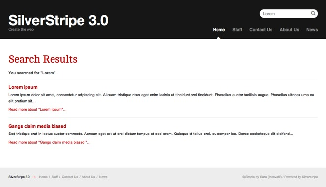

# Tutorial 4 - Site Search

## Overview

This is a short tutorial demonstrating how to add search functionality to a SilverStripe site. It is recommended that you have completed the earlier tutorials  ([Building a basic site](1-building-a-basic-site), [Extending a basic site](2-extending-a-basic-site), [Forms](3-forms)), especially the tutorial on forms, before attempting this tutorial. While this tutorial will add search functionality to the site built in the previous tutorials, it should be straight  forward to follow this tutorial on any site of your own. 

## What are we working towards?

We are going to add a search box on the top of the page. When a user types something in the box, they are taken to a results page.

## Creating the search form

To enable the search engine you need to include the following code in your `mysite/_config.php` file. 
This will enable fulltext search on page content as well as names of all files in the `/assets` folder.

	:::php
	FulltextSearchable::enable();

After including that in your `_config.php` you will need to rebuild the database by visiting [http://localhost/your_site_name/home?flush=all](http://localhost/your_site_name/home?flush=all) in your web browser (replace localhost/your_site_name with a domain if applicable). This will add fulltext search columns.

The actual search form code is already provided in FulltextSearchable so when you add the enable line above to your `_config.php` you can add your form as `$SearchForm`.

In the simple theme, the SearchForm is already added to the header. We will go through the code and explain it.

## Adding the search form

To add the search form, we can add `$SearchForm` anywhere in our templates. In the simple theme, this is in *themes/simple/templates/Includes/Header.ss*

**themes/simple/templates/Includes/Header.ss**

	:::ss
	...
	<% if SearchForm %>
		L
		

			$SearchForm
		
      
	<% end_if %>
	<% include Navigation %>

This displays as:

## Showing the results

The results function is already included in the `ContentControllerSearchExtension` which
is applied via `FulltextSearchable::enable()`

**cms/code/search/ContentControllerSearchExtension.php**

	:::php
	class ContentControllerSearchExtension extends Extension {
		...	
	
		function results($data, $form, $request) {
			$data = array(
				'Results' => $form->getResults(),
				'Query' => $form->getSearchQuery(),
				'Title' => _t('SearchForm.SearchResults', 'Search Results')
			);
			return $this->owner->customise($data)->renderWith(array('Page_results', 'Page'));
		}
	}

The code populates an array with the data we wish to pass to the template - the search results, query and title of the page. The final line is a little more complicated.

When we call a function by its url (eg http://localhost/home/results), SilverStripe will look for a template with the name `PageType_function.ss`. As we are implementing the *results* function on the *Page* page type, we create our
results page template as *Page_results.ss*. Unfortunately this doesn't work when we are using page types that are
children of the *Page* page type. For example, if someone used the search on the homepage, it would be rendered with
*Homepage.ss* rather than *Page_results.ss*. SilverStripe always looks for the template from the most specific page type
first, so in this case it would use the first template it finds in this list:

*  HomePage_results.ss
*  HomePage.ss
*  Page_results.ss
*  Page.ss

We can override this list by using the *renderWith* function. The *renderWith* function takes an array of the names of
the templates you wish to render the page with. Here we first add the data to the page by using the 'customise'
function, and then attempt to render it with *Page_results.ss*, falling back to *Page.ss* if there is no
*Page_results.ss*.

## Creating the template

Lastly we need the template for the search page. This template uses all the same techniques used in previous
tutorials. It also uses a number of pagination variables, which are provided by the `[api:PaginatedList]`
class.

*themes/simple/templates/Layout/Page_results.ss*

	:::ss
	

	    <h1>$Title</h1>
	     
	    <% if Query %>
	        
<strong>You searched for &quot;{$Query}&quot;</strong>

	    <% end_if %>
	         
	    <% if Results %>
	    <ul id="SearchResults">
	        <% loop Results %>
	        <li>
	            <a class="searchResultHeader" href="$Link">
	                <% if MenuTitle %>
	                $MenuTitle
	                <% else %>
	                $Title
	                <% end_if %>
	            </a>
	            
$Content.LimitWordCountXML

	            <a class="readMoreLink" href="$Link" 
	            	title="Read more about &quot;{$Title}&quot;"
	            	>Read more about &quot;{$Title}&quot;...</a>
	        </li>
	        <% end_loop %>
	    </ul>
	    <% else %>
	    
Sorry, your search query did not return any results.

	    <% end_if %>
	             
	    <% if Results.MoreThanOnePage %>
	    

	        <% if Results.NotLastPage %>
	        <a class="next" href="$Results.NextLink" title="View the next page">Next</a>
	        <% end_if %>
	        <% if Results.NotFirstPage %>
	        <a class="prev" href="$Results.PrevLink" title="View the previous page">Prev</a>
	        <% end_if %>
	        
	            <% loop Results.Pages %>
	                <% if CurrentBool %>
	                $PageNum
	                <% else %>
	                <a href="$Link" title="View page number $PageNum">$PageNum</a>
	                <% end_if %>
	            <% end_loop %>
	        
	        
Page $Results.CurrentPage of $Results.TotalPages

	    

	    <% end_if %>
	

Then finally add ?flush=all to the URL and you should see the new template.

## Summary

This tutorial has demonstrated how easy it is to have full text searching on your site. To add search to a SilverStripe site add a search form, a results page, and you're done!

[Next Tutorial >>](5-dataobject-relationship-management)
