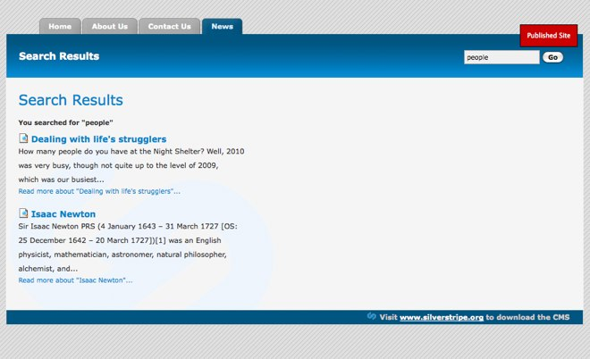

# Tutorial 4 - Site Search

## Overview

This is a short tutorial demonstrating how to add search functionality to a SilverStripe site. It is recommended that
you have completed the earlier tutorials, especially the tutorial on forms, before attempting this tutorial. While this
tutorial will add search functionality to the site built in the previous tutorials, it should be straight forward to
follow this tutorial on any site of your own. 

## What are we working towards?

We are going to add a search box on the top of the page. When a user types something in the box, they are taken to a
results page.

## Creating the search form

The Search Form functionality has been altered over time. Please use the section which applies to your SilverStripe
version.

### 2.4 and newer

SilverStripe 2.4 does not come bundled with the search engine enabled. To enable the search engine you need to include
the following code in your mysite/_config.php file

	:::php
	FulltextSearchable::enable();

After including that in your _config.php you will need to rebuild the database by visiting http://yoursite.com/dev/build
in your web browser. This will add the fulltext search columns.

The actual search form code is already provided in FulltextSearchable so when you add the enable line above to your
_config you can add your form as $SearchForm.

### 2.3

SilverStripe 2.3 came bundled with the code as well as a MySQL Search engine. If you are using the blackcandy theme you
should have everything you need already to have a search. If you are using the tutorial theme then you can simply skip
down to 'Adding the search form' as the PHP code is already provided in Page.php. If it is not then you can follow the
instructions below as well.
### 2.2

If you are using SilverStripe 2.2 or earlier then you need to define your own code. The first step in implementing
search on your site is to create a form for the user to type their query. Create a function named *SearchForm* on the
*Page_Controller* class (/mysite/code/Page.php).

	:::php
	class Page_Controller extends ContentController {
		function SearchForm() {
			$searchText = isset($this->Query) ? $this->Query : 'Search';
			
			$fields = new FieldSet(
				new TextField("Search", "", $searchText)
			);
	
			$actions = new FieldSet(
				new FormAction('results', 'Go')
			);
			
			return new SearchForm($this, "SearchForm", $fields, $actions);
		}
	}

### Custom CSS code

Add the following css code to the *themes/tutorial/css/layout.css* file. This will style the header form and search
results page.

	:::css
	#Header form {
		float:right;
		width:160px;
		margin:25px 25px 0px 25px;
	}
		#Header form * {
			display:inline !important;
		}
		#Header form div {
		}
		#Header form input.text {
			width:110px;
			color:#000;
			background:#f0f0f0;
			border:1px solid #aaa;
			padding:3px;
		}
		#Header form input.action {
			font-weight:bold;
		}

	.searchResults h2 {
		font-size:2.2em;
		font-weight:normal;
		color:#0083C8;
		margin-bottom:15px;
	}
	.searchResults p.searchQuery {
		color:#333;
		margin-bottom:10px;
	}

	.searchResults ul#SearchResults li {
		margin-bottom:20px;
	}
		ul#SearchResults p {
			font-size:1.1em;
			font-weight:normal;
			line-height:2em;
			color:#333;
		}
		ul#SearchResults a.searchResultHeader {
			font-size:1.3em;
			font-weight:bold;
			color:#0083C8;
			text-decoration:none;
			margin:20px 0 8px 0;
			padding-left:20px;
			background:url(../images/treeicons/search-file.gif) no-repeat left center;
		}
			ul#SearchResults a {
				text-decoration:none;
				color:#0083C8;
			}
			ul#SearchResults a:hover {
			border-bottom:1px dotted #0083C8;
			}

## Adding the search form

We then just need to add the search form to the template. Add *$SearchForm* to the 'Header' div in
*themes/tutorial/templates/Page.ss*.

*themes/tutorial/templates/Page.ss*

	:::ss
	

		$SearchForm
		<h1>$Title</h1>
	

## Showing the results

Next we need to create the *results* function.

*mysite/code/Page.php*

	:::php
	class Page_Controller extends ContentController {
		...	
	
		function results($data, $form){
			$data = array(
				'Results' => $form->getResults(),
				'Query' => $form->getSearchQuery(),
				'Title' => 'Search Results'
			);
			$this->Query = $form->getSearchQuery();
		
			return $this->customise($data)->renderWith(array('Page_results', 'Page'));
		}
	}

First we populate an array with the data we wish to pass to the template - the search results, query and title of the
page. The final line is a little more complicated.

When we call a function by its url (eg http://localhost/home/results), SilverStripe will look for a template with the
name `PageType_function.ss`. As we are implementing the *results* function on the *Page* page type, we create our
results page template as *Page_results.ss*. Unfortunately this doesn't work when we are using page types that are
children of the *Page* page type. For example, if someone used the search on the homepage, it would be rendered with
*Homepage.ss* rather than *Page_results.ss*. SilverStripe always looks for the template from the most specific page type
first, so in this case it would use the first template it finds in this list:

*  HomePage_results.ss
*  HomePage.ss
*  Page_results.ss
*  Page.ss

We can override this list by using the *renderWith* function. The *renderWith* function takes an array of the names of
the templates you wish to render the page with. Here we first add the data to the page by using the 'customise'
function, and then attempt to render it with *Page_results.ss*, falling back to *Page.ss* if there is no
*Page_results.ss*.

## Creating the template

Lastly we need to create the template for the search page. This template uses all the same techniques used in previous
tutorials. It also uses a number of pagination variables, which are provided by the `[api:DataObjectSet]`
class.

*themes/tutorial/templates/Layout/Page_results.ss*

	:::ss
	

		<h2>$Title</h2>
		
		<% if Query %>
			
<strong>You searched for &quot;{$Query}&quot;</strong>

		<% end_if %>
			
		<% if Results %>
		<ul id="SearchResults">
			<% control Results %>
			<li>
				<a class="searchResultHeader" href="$Link">
					<% if MenuTitle %>
					$MenuTitle
					<% else %>
					$Title
					<% end_if %>
				</a>
				
$Content.LimitWordCountXML

				<a class="readMoreLink" href="$Link" title="Read more about &quot;{$Title}&quot;">Read more about &quot;{$Title}&quot;...</a>
			</li>
			<% end_control %>
		</ul>
		<% else %>
		
Sorry, your search query did not return any results.

		<% end_if %>
				
		<% if Results.MoreThanOnePage %>
		

			<% if Results.NotLastPage %>
			<a class="next" href="$Results.NextLink" title="View the next page">Next</a>
			<% end_if %>
			<% if Results.NotFirstPage %>
			<a class="prev" href="$Results.PrevLink" title="View the previous page">Prev</a>
			<% end_if %>
			
				<% control Results.Pages %>
					<% if CurrentBool %>
					$PageNum
					<% else %>
					<a href="$Link" title="View page number $PageNum">$PageNum</a>
					<% end_if %>
				<% end_control %>
			
			
Page $Results.CurrentPage of $Results.TotalPages

		

		<% end_if %>
	

Then finally add ?flush=1 to the URL and you should see the new template.

## Summary

This tutorial has demonstrated how easy it is to have full text searching on your site. To add search to a SilverStripe
site, only a search form and a results page need to be created.

[Next Tutorial >>](5-dataobject-relationship-management)
