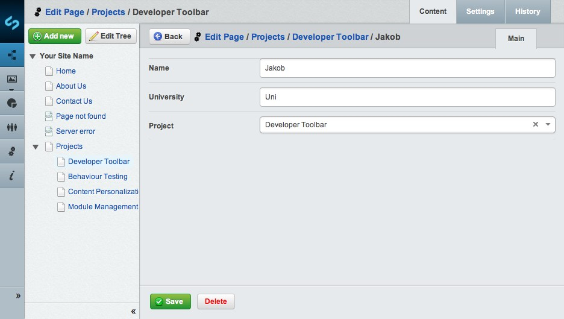
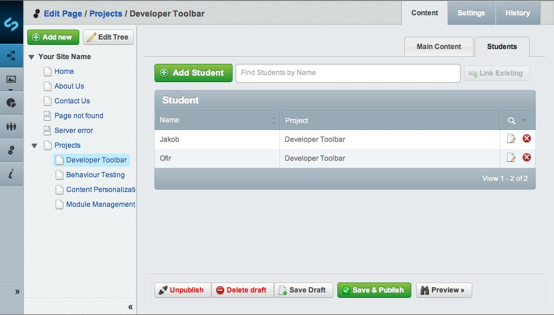
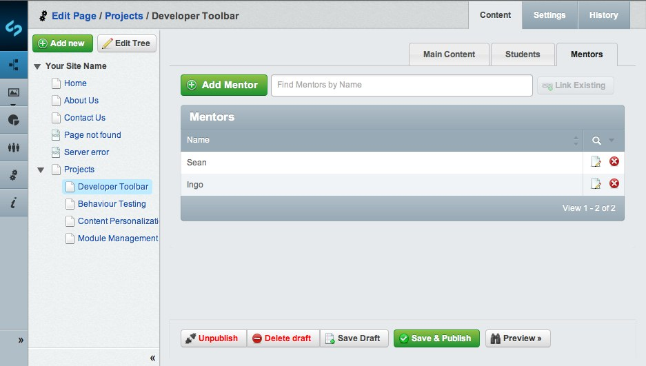
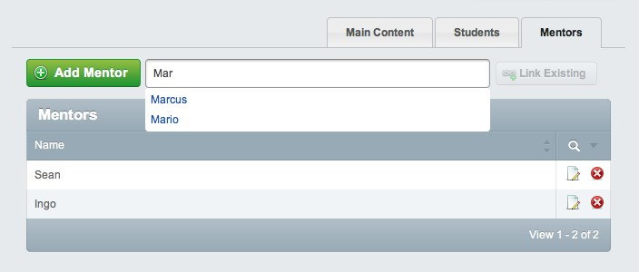

# Tutorial 5 - Dataobject Relationship Management

## Overview

 This tutorial explores the relationship and management of [DataObjects](/topics/datamodel#relations). It builds on the [second tutorial](2-extending-a-basic-site) where we learnt how to add extra fields to a page type using the *$db* array, how to add an image using the *$has_one* array, and how to create a relationship between a table and an *Image* by storing the *Image* id in the table.

## What are we working towards?

To demonstrate relationships between objects, we are going to use the example of students working on various projects.

We will use the following objects:

*  Project : Project Details
*  Student : Students involved in the project
*  Mentor : SilverStripe developer
*  Module : Module used for the project

This table shows the data we'll be using (based on SilverStripe students in GSoC 2007):
 | Project             | Student             | Mentor   	    | Modules          |                           
 | -------             | -------             | -------			|------------------                           
 | i18n Multi-Language | Bernat Foj Capell   | Ingo Schommer	| Cms, Framework, i18n, Translation              | 
 | Image Manipulation  | Mateusz Ujma        | Sam Minnee		| Cms, Framework, ImageManipulation              | 
 | Google Maps         | Ofir Picazo Navarro | Hayden Smith		| Cms, Framework, Maps                           | 
 | Mashups             | Lakshan Perera      | Matt Peel 		| Cms, Framework, MashUps                        | 
 | Multiple Databases  | Philipp Krenn       | Brian Calhoun 	| Cms, Framework, MultipleDatabases              | 
 | Reporting           | Quin Hoxie          | Sam Minnee		| Cms, Framework, Reporting                      | 
 | Security & OpenID   | Markus Lanthaler    | Hayden Smith		| Cms, Framework, auth_openid                    | 
 | SEO                 | Will Scott          | Brian Calhoun 	| Cms, Framework, googleadwords, googleanalytics | 
 | Usability           | Elijah Lofgren      | Sean Harvey 		| Cms, Framework, UsabilityElijah                | 
 | Safari 3 Support    | Meg Risen           | Sean Harvey 		| Cms, Framework, UsabilityMeg                   | 

## Project Data Structures

Before starting the relationship management, we need to create a *ProjectsHolder* class where we will save Project pages.

**mysite/code/ProjectsHolder.php**

	:::php
	<?php
	
	class ProjectsHolder extends Page {
	
		static $allowed_children = array( 'Project' );
		static $has_many = array(
			'Students' => 'Student'
		);
	
	}
	
	class ProjectsHolder_Controller extends Page_Controller {
	
	}

### Project - Student relation

**A student can have only one project.**

**A project can be done by one or more students.**

This is called a **1-to-Many** relationship.

Our first step is to create student and project objects.

**mysite/code/Student.php**

	:::php
	<?php
	
	class Student extends DataObject {
	
		static $db = array(
			'FirstName' => 'VarChar',
			'Lastname' =>'VarChar'
		);
		static $has_one = array(
		  	'Project' => 'Project'
		);	
	}

**mysite/code/Project.php**

	:::php
	<?php
	
	class Project extends Page {
	
	}
	class Project_Controller extends Page_Controller {}

The second step is to add the gridfield in the method *getCMSFields* which will allow you to manage the relation.

**mysite/code/ProjectsHolder.php**

	:::php
	class ProjectsHolder extends Page {
	
		...
	
		public function getCMSFields() {
			//Get the CMS Fields that exist in the parent. 
			$fields = parent::getCMSFields();	
			      
		    // Create a gridfield to hold the student relationship    
			$gridfield = new GridField(
				'Students',
				'Student',
				Student::get(),
			);		
			 
			//Create a tab named "Students" and add our gridfield to it.		
			$fields->addFieldToTab('Root.Students', $gridfield); 
			 			
			return $fields;
		}
	
	}

Let’s walk through the parameters of the *GridField* constructor.

1.  **'Students'** : The name of the object we want a relation to
2.  **'Student'** : The title of our relation
3.  **Student::get()** : The object we want a relation to

This creates a default gridfield, but we want to control the behaviour of our grid more precisely than this. To accomplish this, we will use the GridField constructor's fourth argument, $config. Using this we can pass a GridFieldConfig object. 

**mysite/code/ProjectsHolder.php**

	:::php
	class ProjectsHolder extends Page {
	
		...
	
		public function getCMSFields() {
			      
			$fields = parent::getCMSFields();	
			      
			//Create our config variable and fill it with our desired components 
	        $config = GridFieldConfig::create()->addComponents(
			 
	        	//Provide a header with a Title
				new GridFieldToolbarHeader(),			 
				// Provide a header row with sort controls
				new GridFieldSortableHeader(),			 
				// Provide a default set of columns
				$columns = new GridFieldDataColumns(),
				//Add a button to add students
				new GridFieldAddNewButton('after'),
				//The method that handles the add new request
				new GridFieldDetailForm(),
				//Add an edit button 
				new GridFieldEditButton()
			);		
			 
			//Set the names and data for our gridfield columns
			$columns->setDisplayFields(array(
			    'FirstName' => 'First Name',
	        	'Lastname' => 'Last Name',
	        	'Project.Title'=> 'Project'
	        ));	
			 					     
		    // Create a gridfield to hold the student relationship    
			$gridfield = new GridField(
				'Students',
				'Student',
				 Student::get(),			
				 $config			
			);	
			 
			//Create a tab named "Students" and add our gridfield to it.		
			$fields->addFieldToTab('Root.Students', $gridfield); 
			 
			return $fields;
		}
	
	}

	Don't forget to rebuild the database using *dev/build?flush=all* before you 
	proceed to the next part of this tutorial.

Now that we have created our *ProjectsHolder* and *Project* page types, and the *Student* data object, we'll add some content.

Go into the CMS and create a *ProjectsHolder* page named **GSOC Projects**. Then create one *Project* page for each project listed [above](#what-are-we-working-towards).

Select the *ProjectsHolder* page that you have created, go in the tab panel *Students* and add all the students listed [above](#what-are-we-working-towards) by clicking on the link **Add Student** of your *GridField* table.

Once you have added all the students, and selected their projects, it should look a little like this:

### Project - Module relation

**A project uses several modules.**

**A module is used by several projects.**

This relation is called a **many-to-many** relation.

The first step is to create the module object and set the relation with the *Project* page type.

**mysite/code/Module.php**

	:::php
	<?php
	    
	class Module extends DataObject {
	   static $db = array(
	      'Name' => 'VarChar'
	   );
	   static $belongs_many_many = array(
	      'Projects' => 'Project'
	   );
	}

**mysite/code/Project.php**

	:::php
	class Project extends Page {
	
	   ...
	   static $many_many = array(
	      'Modules' => 'Module'
	   );
	
	}

This code will create a relationship between the *Project* table and the *Module* table by storing the ids of the respective *Project* and *Module* in a another table named **Project_Modules**.

The second step is to add the table in the method *getCMSFields* which will allow you to manage the *many_many* relation.

**mysite/code/Project.php**

	:::php
	class Project extends Page {
	
	   ...	
		public function getCMSFields() {
			$fields = parent::getCMSFields();
			//Create our config variable and fill it with our desired components 
			$config = GridFieldConfig::create()->addComponents(
			 
				//Provide a header with a Title
				new GridFieldToolbarHeader(),			 
				// Provide a header row with sort controls
				new GridFieldSortableHeader(),			 
				// Provide a default set of columns
				$columns = new GridFieldDataColumns(),
				//Add a button to add students
				new GridFieldAddNewButton('after'),
				//The method that handles the add new request
				new GridFieldDetailForm(),
				//Add an edit button 
				new GridFieldEditButton()
			);	
			//Set the names and data for our gridfield columns
			$columns->setDisplayFields(array(
				'Name' => 'Name'
		    ));			
	      
			// Create a gridfield to hold the modules relationship    
			$gridfield = new GridField(
				'Modules',
				'Modules',
				 Module::get(),			
				 $config			
			);		      
		
		    $fields->addFieldToTab( 'Root.Modules', $gridfield );
		
		    return $fields;
		}
	
	}

	Don't forget to rebuild the database using *dev/build?flush=all* before you proceed to the next part of this tutorial.

In the CMS, open one of your *Project* pages and select the *Modules* tab. Add all the modules listed [above](#what-are-we-working-towards) by clicking on the **Add Module** button. 

To associate the modules with a project, select one the the modules, and click on the projects tab. Add all the projects a module is associated with  ( see the [list](#What_are_we_working_towards?) ), by typing the name in "Find Projects by Page name" and clicking the "Link Existing" button

You will notice, that you are able to select the same *Project* for multiple modules. This is the definition of a **many-to-many** relation.

### Student - Mentor relation

**A student can have only one Mentor.**

**A Mentor can be have one or more students.**

This is another **1-to-Many** relationship (like the Project - Student Relationship).

Our first step is to create the mentor object and set the relation with the Student data object.

**mysite/code/Mentor.php**

	:::php
	<?php
	 
	class Mentor extends Page {
	 
	    static $db = array(
	        'FirstName' => 'Text',
	        'Lastname' => 'Text'
	    );
	     
	    static $has_many = array(
	        'Students' => 'Student'
	    );
	     
	    public function getCMSFields() {
	        $fields = parent::getCMSFields();
	         
	        $fields->addFieldToTab( 'Root.Content', new TextField( 'FirstName' ) );
	        $fields->addFieldToTab( 'Root.Content', new TextField( 'Lastname' ) );        
	     
	        return $fields;
	    }
	 
	}
	class Mentor_Controller extends Page_Controller {}

**mysite/code/Student.php**

	:::php
	class Student extends DataObject {
	 
	    ...
	 
	    static $has_one = array(
		    'Project' => 'Project',
        	'Mentor' => 'Mentor'
	    );
	 
	}

This code will create a relationship between the Student table and the Mentor table by storing the id of the respective Mentor in the Student table.

The second step is to add the table in the method getCMSFields which will allow you to manage the has_many relation.

**mysite/code/Mentor.php**

	:::php
	class Mentor extends Page { 
	    ...	 
	    public function getCMSFields() {
	        $fields = parent::getCMSFields();	     
	        ...
			//Create our config variable and fill it with our desired components 
			$config = GridFieldConfig::create()->addComponents(			 
				//Provide a header with a Title
				new GridFieldToolbarHeader(),			 
				// Provide a header row with sort controls
				new GridFieldSortableHeader(),			 
				// Provide a default set of columns
				$columns = new GridFieldDataColumns(),
				//Add a button to add students
				new GridFieldAddNewButton('after'),
				//The method that handles the add new request
				new GridFieldDetailForm(),
				//Add an edit button 
				new GridFieldEditButton()
			);	
			//Set the names and data for our gridfield columns
			$columns->setDisplayFields(array(
				'FirstName'=>'FirstName',
				'LastName'=>'LastName'
		    ));			      
			// Create a gridfield to hold the student relationship    
			$gridfield = new GridField(
				'Students',
				'Students',
				 Student::get(),			
				 $config			
			);	 		     
	        $fields->addFieldToTab( 'Root.Students', $gridfield );	     
	        return $fields;
	    }
	 
	}
	class Mentor_Controller extends Page_Controller {}

	Don't forget to rebuild the database using *dev/build?flush=all* before you 
	proceed to the next part of this tutorial.

Go into the CMS and create a simple 'Page' named Mentors. Then create one 'Mentor' page for each Mentor listed above.

To join the students to our newly created mentors, open the "GSOC Projects" page in the CMS, and navigate to the "Students" tab. Select each student and add their mentor as shown in the table [above](##what-are-we-working-towards) 

## Displaying the data on your website

Now that we have created all the *Page* and *DataObject* classes necessary and the relational tables to manage the [relations](../topics/datamodel#relations) between them, we would like to see these relations on the website.

We will see in this section how to display all these relations but also how to create a template for a *DataObject*.

For every kind of *Page* or *DataObject*, you can access to their relations thanks to the **control** loop.

### 1. GSOC Projects

We'll start with creating a *ProjectsHolder* template created before. For this template, we are will display the same table as
[above](#what-are-we-working-towards).

**tutorial/templates/Layout/ProjectsHolder.ss**

	:::ss
	
	
		<article>
			<h1>$Title</h1>
			

				$Content
				<table>
			        <thead>
			            <tr>
			                <th>Project</th>
			                <th>Students</th>
			                <th>Mentors</th>
			                <th>Modules</th>
			            </tr>
			        </thead>
			        <tbody>
			          <% loop Children %>
			                <tr>
			                    <td>$Title</td>	
			                    <td>
			                        <% if Students %>
			                            <% loop Students %>	                            
			                                $FirstName $LastName<% if Last !=1 %>,<% end_if %>
			                            <% end_loop %>
			                        <% else %>
			                            No Students
			                        <% end_if %>    
			            		</td>    
			            		<td>
			                        <% if Students %>
			                            <% loop Students %>	
			                            	<% if Mentor %>
				                            	<% loop Mentor %>
				                            		$FirstName 
			                            	 		$LastName<% end_loop %><% if Last !=1 %>,
			                            	 		<% end_if %>
			                                <% else %>
			                            	No Mentor
			                        		<% end_if %>    
			                            <% end_loop %>
			                        <% end_if %>    
			            		</td>                             
			         			<td>
			                        <% if Modules %>
			                            <% loop Modules %>	                            
			                                $Name<% if Last !=1 %>,<% end_if %>
			                            <% end_loop %>
			                        <% else %>
			                            No Modules
			                        <% end_if %>    
			            		</td>
			            	</tr>
			            <% end_loop %>
			        </tbody>
			    </table>
			    $Form
				$PageComments
			

		</article>
	

	<% include SideBar %>

### 2. Project

We now know how to easily access and show [relations](../topics/datamodel#relations) between *DataObject*s in a template.

We can now do the same for every *Project* page by creating its own template.

**tutorial/templates/Layout/Project.ss**

	:::ss
	
	
	
		<article>
			<h1>$Title</h1>
			

				$Content
				<h2>Students</h2>
		        <% if Students %>
		    		<table>
		    	        <thead>
		    	            <tr>	                            
		                        <th>First Name</th>    
		                        <th>Last Name</th>                    
		    	            </tr>
		    	        </thead>
		    	        <tbody>
		                    <% loop Students %>
		                        <tr>
		                            <td>
		                                $FirstName
		                            </td>  
		                            <td>
		                                $LastName
		                            </td> 
		                        </tr>
		                    <% end_loop %> 
		    	        </tbody>
		    	    </table>     
		            <h2>Mentors</h2>
		            <table>
		                <thead>
		                    <tr>                                
		                        <th>First Name</th>    
		                        <th>Last Name</th>                    
		                    </tr>
		                </thead>
		                <tbody>           
		                <% loop Students %>                                 
		                    <% if Mentor %> 
		                        <% loop Mentor %>
		                            <tr>
		                            <td>
		                                $FirstName
		                            </td>  
		                            <td>
		                                $LastName
		                            </td> 
		                        </tr>
		                        <% end_loop %>                    
		                    <% else %>    
		                        <tr><td>Mentor unassigned</td></tr>  
		                    <% end_if %> 
		                <% end_loop %>
		            </tbody>
		            </table>   
		        <% else %>
		        No Students  
		        <% end_if %> 
			    <h2>Modules</h2>
			     <% if Modules %>
			     	<ul>
		            <% loop Modules %>
		                <li>$Name</li>
		            <% end_loop %>
		            </ul>
		        <% else %>
		            No Modules
		        <% end_if %>   
				$Form
				$PageComments
			

		</article>
	

	<% include SideBar %>

To save on repetition, we will create a special template for the **DataObject** *Student* and the **Page** *Module* to be called by a variable in the *Project* template. We can use the same template for both our Student and Mentor, because these two classes have the same fields ( FirstName and LastName ).

**tutorial/templates/Includes/Person.ss**

	:::ss
	<tr>
		<td>
		    $FirstName
		</td>  
		<td>
		    $LastName
		</td> 
	</tr>

Now the template is created, we need to establish a link between this and our *Student* and *Mentor* classes. The code below will create a control on each of our objects.

**mysite/code/Student.php, mysite/code/Mentor.php**

	:::php
	public function PersonalInfo() {
		$template = 'Person';
		return $this->renderWith( $template );
	}

We can now modify the *Project.ss* template.

	:::ss
	
	...
	
		<tbody>
	        <% loop Students %>
	            $PersonalInfo
	        <% end_loop %> 
	    </tbody>
    </table>     
    <h2>Mentors</h2>
    <table>
        <thead>
            <tr>                                
                <th>First Name</th>    
                <th>Last Name</th>                    
            </tr>
        </thead>
        <tbody>           
        <% loop Students %>                                 
            <% if Mentor %> 
                <% loop Mentor %>
                $PersonalInfo
                <% end_loop %>                    
            <% else %>    
                <tr><td>Mentor unassigned</td></tr>  
            <% end_if %> 
        <% end_loop %>
	
	...

	Remember to add `?flush=all` (or  `?flush=1`) to the url when refreshing the project page or you may not see your changes

### 3. Mentor

In this template, we are gonna to access the *Project* details from a *Student* *DataObject*.

**tutorial/templates/Layout/Mentor.ss**

	:::ss
	
	
		<article>
			<h1>$Title</h1>
			

			$Content
			<h2>Personal Details</h2>
	        
First Name: <strong>$FirstName</strong>

	        
Last Name: <strong>$LastName</strong>

	        <h2>Students</h2>
	        <% if Students %>
	            <table>
	                <thead>
	                    <tr>
	                        <th>Student</th>
	                        <th>Project</th>
	                    </tr>
	                </thead>
	                <tbody>
	                    <% loop Students %>
	                        <tr>
	                            <td>$FirstName $LastName</td>
	                            <td>
	                                <% if Project %>
	                                    <% loop Project %>
	                                        $Title
	                                    <% end_loop %>
	                                <% else %>
	                                    No Project
	                                <% end_if %>
	                            </td>
	                        </tr>
	                    <% end_loop %>
	                </tbody>
	            </table>
	        <% else %>
	            
There is no any student working with this mentor.

	        <% end_if %>  	        
			$Form
			$PageComments
		

		</article>
	

	<% include SideBar %>

## Summary

This tutorial has demonstrated how you can manage all the type of relations between *DataObject*s in the CMS, and how you can display this data on a website.

## Download the code

Download all the [code](http://doc.silverstripe.org/framework/docs/en/tutorials/_resources/tutorials.zip) for this tutorial.

