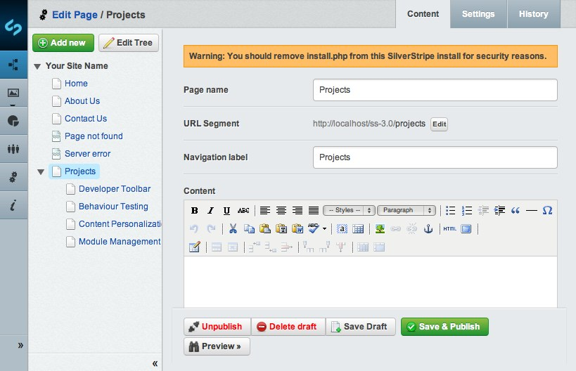
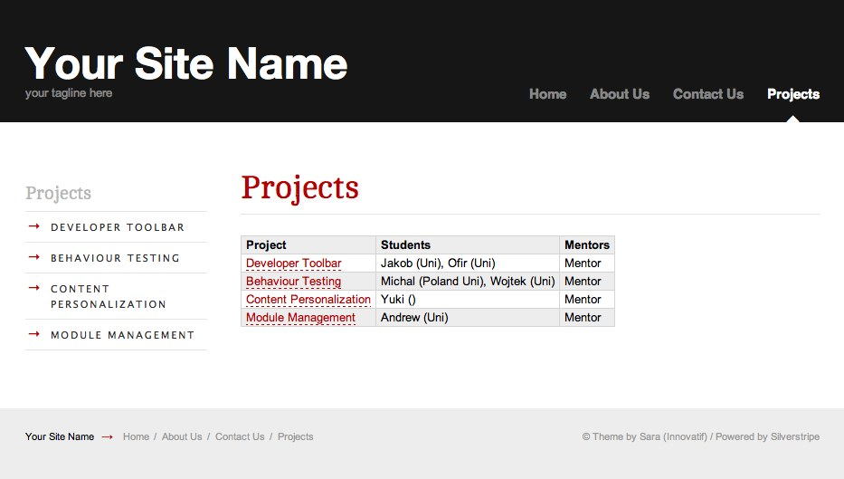
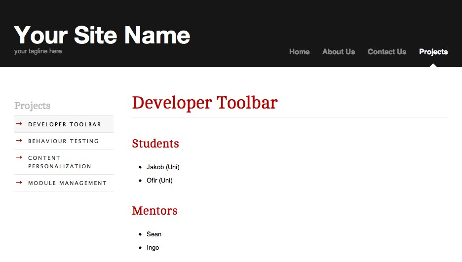

# Tutorial 5 - Dataobject Relationship Management

## Overview

This tutorial explores the relationship and management of [DataObjects](/topics/datamodel#relations). It builds on the [second tutorial](2-extending-a-basic-site) where we learnt how to define
additional fields on our models, and attach images to them.

## What are we working towards?

To demonstrate relationships between objects, 
we are going to use the example of students working on various projects.
Each student has a single project, and each project has one or more
mentors supervising their progress. We'll create these objects,
make them editable in the CMS, and render them on the website.

This table shows some example data we'll be using:

 | Project             | Student             | Mentor   	    | 
 | -------             | -------             | -------			  |
 | Developer Toolbar | Jakob,Ofir   | Mark,Sean	|
 | Behaviour Testing  | Michal,Wojtek | Ingo, Sean |
 | Content Personalization | Yuki | Philipp	| 
 | Module Management | Andrew | Marcus,Sam | 

### Has-One and Has-Many Relationships: Project and Student

A student can have only one project, it'll keep them busy enough.
But each project can be done by one or more students.
This is called a **one-to-many** relationship.
Let's create the `Student` and `Project` objects.

**mysite/code/Student.php**

	:::php
	<?php
	class Student extends DataObject {
		static $db = array(
			'Name' => 'Varchar',
			'University' => 'Varchar',
		);
		static $has_one = array(
			'Project' => 'Project'
		);	
	}

**mysite/code/Project.php**

	:::php
	<?php
	class Project extends Page {
		static $has_many = array(
			'Students' => 'Student'
		);
	}
	class Project_Controller extends Page_Controller {
	}

The relationships are defined through the `$has_one`
and `$has_many` properties on the objects.
The array keys declares the name of the relationship,
the array values contain the class name (see the ["database structure"](/reference/database-structure)
and ["datamodel"](/topics/datamodel) topics for more information).

As you can see, only the `Project` model extends `Page`,
while `Student` is a plain `DataObject` subclass.
This allows us to view projects through the standard
theme setup, just like any other page. 
It would be possible to render students separately as well,
but for now we'll assume they're just listed as part of their `Project` page.
Since `Project` inherits all properties (e.g. a title) from its parent class,
we don't need to define any additional ones for our purposes.

Now that we have our models defined in PHP code,
we need to tell the database to create the related tables. 
Trigger a rebuild through *dev/build?flush=all* before you 
proceed to the next part of this tutorial.

### Organizing pages: ProjectHolder

A `Project` is just a page, so we could create it anywhere in the CMS.
In order to list and organize them, it makes sense to collect them under a common parent page.
We'll create a new page type called `ProjectsHolder` for this purpose,
which is a common pattern in SilverStripe's page types. Holders
are useful for listing their children, and usually restrict these children to a specific class,
in our case pages of type `Project`.
The restriction is enforced through the `$allowed_children` directive.

**mysite/code/ProjectsHolder.php**

	:::php
	<?php
	class ProjectsHolder extends Page {
		static $allowed_children = array(
			'Project'
		);
	}
	class ProjectsHolder_Controller extends Page_Controller {
	}

You might have noticed that we don't specify the relationship
to a project. That's because its already inherited from the parent implementation,
as part of the normal page hierarchy in the CMS.

Now that we have created our `ProjectsHolder` and `Project` page types,  we'll add some content.
Go into the CMS and create a `ProjectsHolder` page named **Projects**. 
Then create one `Project` page for each project listed [above](#what-are-we-working-towards).

### Data Management Interface: GridField

So we have our models, and can create pages of type
`Project` through the standard CMS interface,
and collect those within a `ProjectsHolder`.
But what about creating `Student` records?

Since students are related to a single project, we will
allow editing them right the on the CMS interface in the `Project` page type.
We do this through a powerful field called `[GridField](/topics/grid-field)`.
All customization to fields for a page type are managed through a method called
`getCMSFields()`, so let's add it there:

**mysite/code/Project.php**

	:::php
	<?php
	class Project extends Page {
		// ...
		public function getCMSFields() {
			// Get the fields from the parent implementation
			$fields = parent::getCMSFields();	

			// Create a default configuration for the new GridField, allowing record editing
			$config = GridFieldConfig_RelationEditor::create();

			// Set the names and data for our gridfield columns
			$config->getComponentByType('GridFieldDataColumns')->setDisplayFields(array(
				'Name' => 'Name',
				'Project.Title'=> 'Project' // Retrieve from a has-one relationship
			));	
						
			// Create a gridfield to hold the student relationship    
			$studentsField = new GridField(
				'Students', // Field name
				'Student', // Field title
				$this->Students(), // List of all related students
				$config
			);		
			 
			// Create a tab named "Students" and add our field to it
			$fields->addFieldToTab('Root.Students', $studentsField); 
						
			return $fields;
		}
	}

This creates a tabular field, which lists related student records, one row at a time.
Its empty by default, but you can add new students as required,
or relate them to the project by typing in the box above the table.

In our case, want to manage those records, edit their details, and add new ones. 
To accomplish this, we have added a specific `[api:GridFieldConfig]`.
While we could've built the config from scratch, there's several
preconfigured instances. The `GridFieldConfig_RecordEditor` default configures
the field to edit records, rather than just viewing them.
The GridField API is composed of "components", which makes it very flexible.
One example of this is the configuration of column names on our table:
We call `setDisplayFields()` directly on the component responsible for their rendering.

	Adding a `GridField` to a page type is a popular way to manage data,
	but not the only one. If your data requires a dedicated interface
	with more sophisticated search and management logic, consider
	using the `[ModelAdmin](reference/modeladmin)` interface instead.

Select each `Project` page you have created before, 
go in the tab panel called "Students", and add all students as required,
by clicking on the link **Add Student** of your *GridField* table.

Once you have added all the students, and selected their projects, it should look a little like this:

### Many-many relationships: Mentor

Now we have a fairly good picture of how students relate to their projects.
But students generally have somebody looking them over the shoulder.
In our case, that's the "mentor". Each project can have many of them,
and each mentor can be have one or more projects. They're busy guys!
This is called a *many-many* relationship.

The first step is to create the `Mentor` object and set the relation with the `Project` page type.

**mysite/code/Mentor.php**

	:::php
	<?php
	class Mentor extends DataObject {
		static $db = array(
			'Name' => 'Varchar',
		);
		static $belongs_many_many = array(
			'Projects' => 'Project'
		);
	}

**mysite/code/Project.php**

	:::php
	class Project extends Page {
		// ...
		static $many_many = array(
			'Mentors' => 'Mentor'
		);
	}

This code will create a relationship between the `Project` table and the `Mentor` table by storing the ids of the respective `Project` and `Mentor` in a another table named "Project_Mentors"
(after you've performed a `dev/build` command, of course).

The second step is to add the table in the method `getCMSFields()`,
which will allow you to manage the *many_many* relation.
Again, GridField will come in handy here, we just have
to configure it a bit differently.

**mysite/code/Project.php**

	:::php
	class Project extends Page {
		// ...
		public function getCMSFields() {
			// ...

			// Same setup, but for mentors
			$mentorsField = new GridField(
				'Mentors',
				'Mentors',
				$this->Mentors(),
				GridFieldConfig_RelationEditor::create()
			);		      
			$fields->addFieldToTab('Root.Mentors', $mentorsField);

			return $fields;
		}
	}

The important difference to our student management UI is the usage
of `$this->Mentor()` (rather than `Mentor::get()`). It will limit
the list of records to those related through the many-many relationship.

In the CMS, open one of your `Project` pages and select the "Mentors" tab. 
Add all the mentors listed [above](#what-are-we-working-towards) 
by clicking on the **Add Mentor** button. 

To associate the mentor with a project, select one the the mentors, and click on the projects tab. Add all the projects a mentor is associated with (see the [list](#What_are_we_working_towards?)), by typing the name in "Find Projects by Page name" and clicking the "Link Existing" button.
You will notice that you are able to select the same `Project` for multiple mentors. 
This is the definition of a **many-to-many** relation.

## Website Display

Now that we have created all the *Page* and *DataObject* classes necessary and the relational tables to manage the [relations](/topics/datamodel#relations) between them, we would like to see these relations on the website. We will see in this section how to display all these relations, 
but also how to create a template for a *DataObject*.

For every kind of *Page* or *DataObject*, you can access to their relations thanks to the **control** loop.

### Projects Overview Template

We'll start by creating a `ProjectsHolder` template,
which lists all projects, and condenses their
student and mentor relationships into a single line.
You'll notice that there's no difference between
accessing a "has-many" and "many-many" relationship
in the template loops: To the template, its just
a named list of object.

**themes/simple/templates/Layout/ProjectsHolder.ss**

	:::ss
	
	
		<article>
			<h1>$Title</h1>
			

				$Content
				
				<table>
					<thead>
						<tr>
							<th>Project</th>
							<th>Students</th>
							<th>Mentors</th>
						</tr>
					</thead>
					<tbody>
					<% loop Children %>
						<tr>
							<td>
								<a href="$Link">$Title</a>
							</td>	
							<td>
								<% loop Students %>	                            
									$Name ($University)<% if Last !=1 %>,<% end_if %>
								<% end_loop %>
							</td>    
							<td>
								<% loop Mentor %>
									$Name<% if Last !=1 %>,<% end_if %>
								<% end_loop %>
							</td>
						</tr>
					<% end_loop %>
					</tbody>
					</table>
			

		</article>
	

	<% include SideBar %>

Navigate to the holder page through your website navigation,
or the "Preview" feature in the CMS. You should see a list of all projects now.
Add `?flush=all` to the page URL to force a refresh of the template cache.

To get a list of all projects, we've looped through the "Children" list,
which is a relationship we didn't define explictly.
It is provided to us by the parent implementation,
since projects are nothing other than children pages in the standard page hierarchy.

### Project Detail Template

Creating the detail view for each `Project` page works in a very similar way.
Given that we're in the context of a single project,
we can access the "Students" and "Mentors" relationships directly in the template.

**themes/simple/templates/Layout/Project.ss**

	:::ss
	
	
		<article>
			<h1>$Title</h1>
			

				$Content

				<h2>Students</h2>
				<% if Students %>
					<ul>
					<% loop Students %>
						<li>$Name ($University)</li>
					<% end_loop %>
					</ul>
				<% else %>
					
No students found

				<% end_if %>

				<h2>Mentors</h2>
				<% if Mentors %>
					<ul>
					<% loop Mentors %>
						<li>$Name</li>
					<% end_loop %>
					</ul>
				<% else %>
					
No mentors found

				<% end_if %>

			

		</article>
	

	<% include SideBar %>

Follow the link to a project detail from from your holder page,
or navigate to it through the submenu provided by the theme.

### Student Detail Template

You might have noticed that we duplicate the same template code
between both views when it comes to displaying the details
on students and mentors. We'll fix this for students,
by introducing a new template for them.

**themes/simple/templates/Includes/StudentInfo.ss**

	:::ss
	$Name ($University)

To use this template, we need to add a new method to our student class:

	:::php
	class Student extends DataObject {
		function getInfo() {
			return $this->renderWith('StudentInfo');
		}
	}

Replace the student template code in both `Project.ss`
and `ProjectHolder.ss` templates with the new placeholder, `$Info`.
That's the code enclosed in `<% loop Students %>` and `<% end_loop %>`.
With this pattern, you can increase code reuse across templates.

## Summary

This tutorial has demonstrated how you can manage data with
different types of relations between in the CMS, 
and how you can display this data on your website.
We illustrated how the powerful `Page` class can be useful to structure
your own content, and how we can correlate it to more
lightweight `DataObject` classes. The transition between
the two classes is intentionally fluent in the CMS, you can
manage them depending on your needs.
`DataObject` gives you a no-frills solution to data storage,
but `Page` allows for built-in WYSIWIG editing, versioning,
publication and hierarchical organization.

## Exercises

This is a simplified example, so there's naturally room for improvement.
In order to challenge your knowledge gained in the tutorials so far,
we suggest some excercises to make the solution more flexible:

 * Refactor the `Student` and `Mentor` classes to inherit from a common parent class `Person`,
   and avoid any duplication between the two subclasses.
 * Render mentor details in their own template
 * Change the `GridField` to list only five records per page (the default is 20).
   This configuration is stored in the `[api:GridFieldPaginator]` component