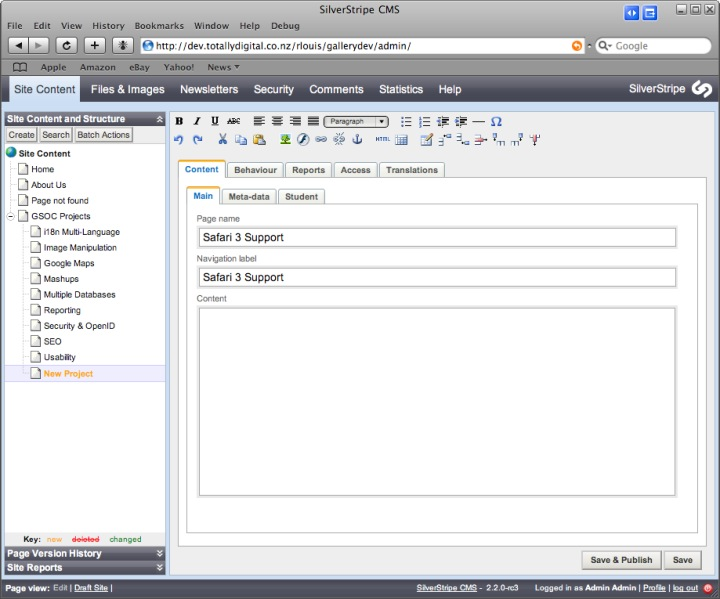
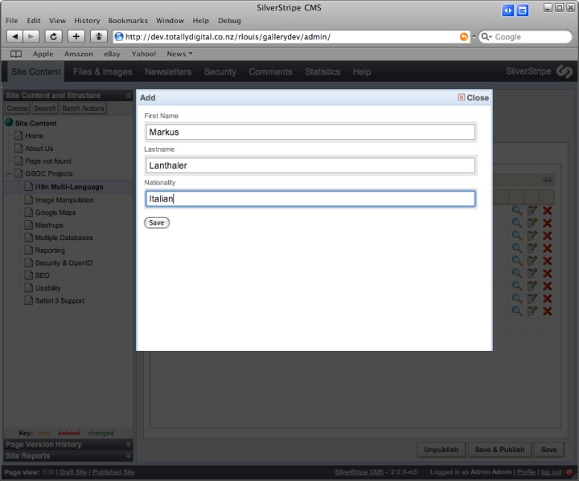
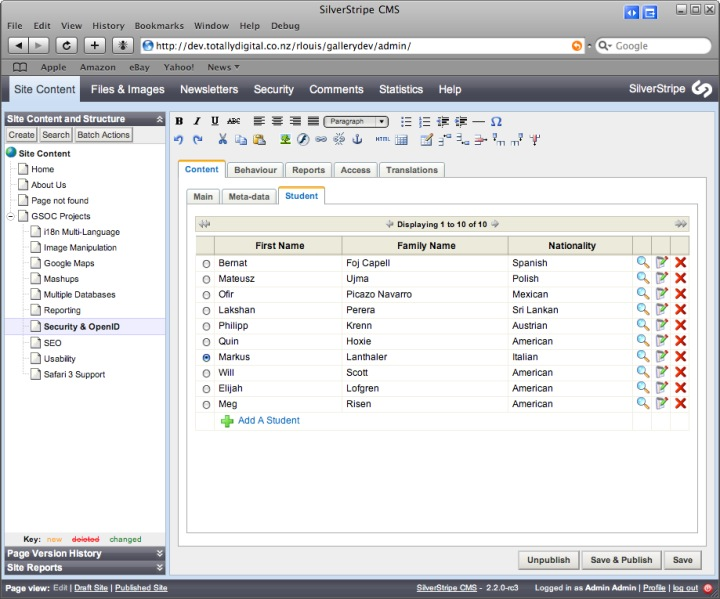
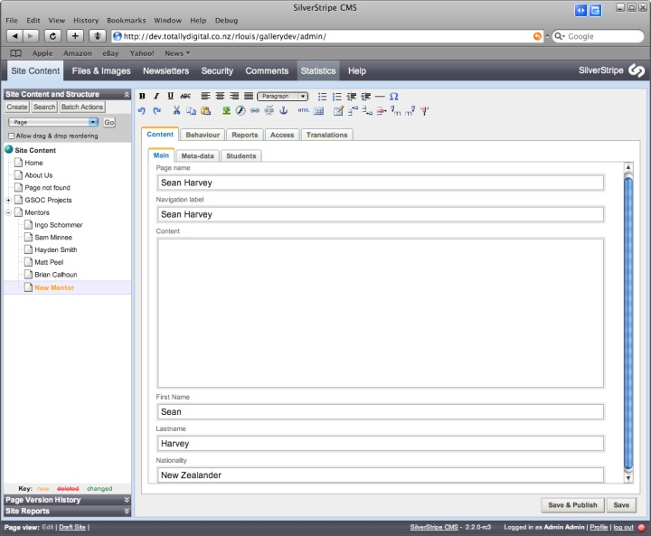
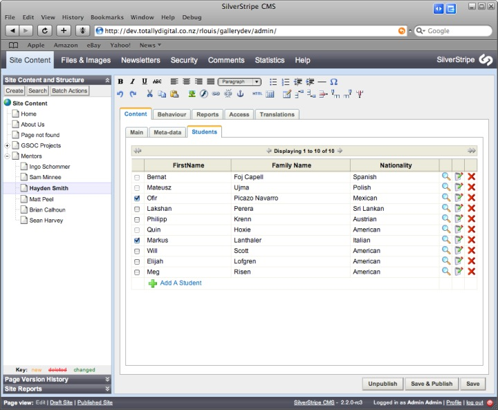
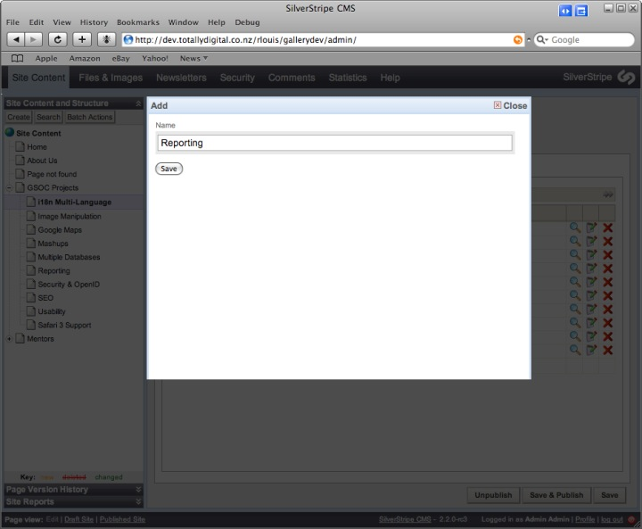
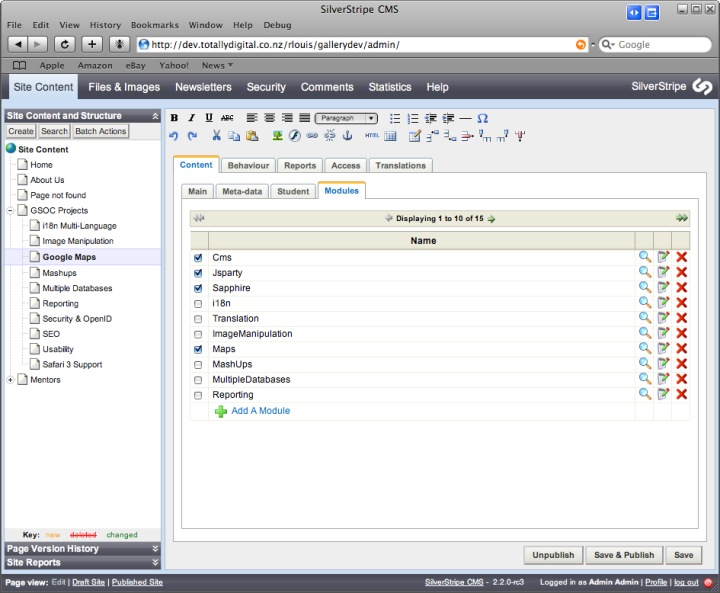
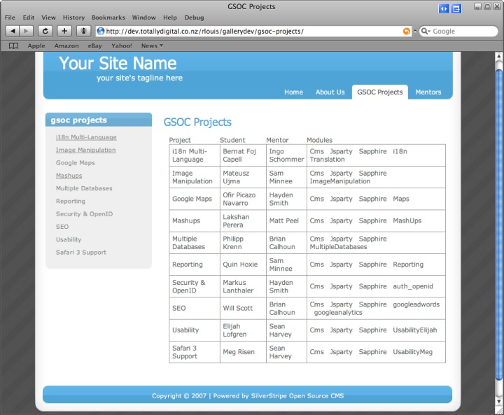
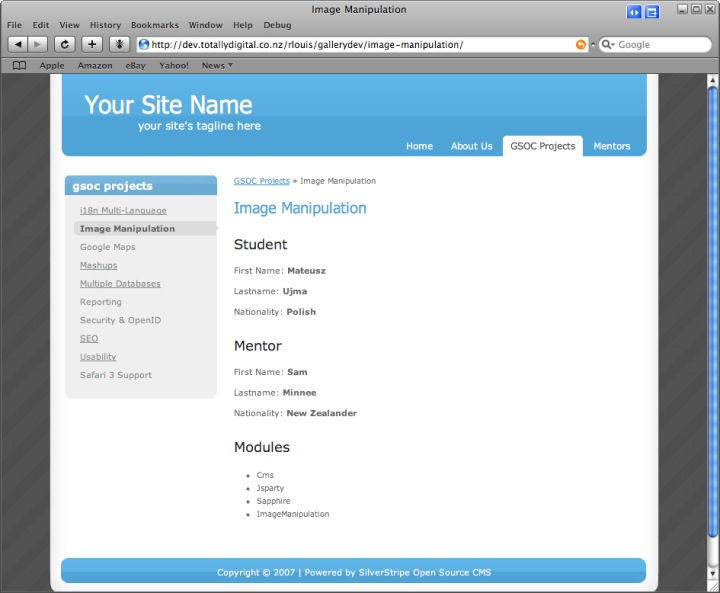
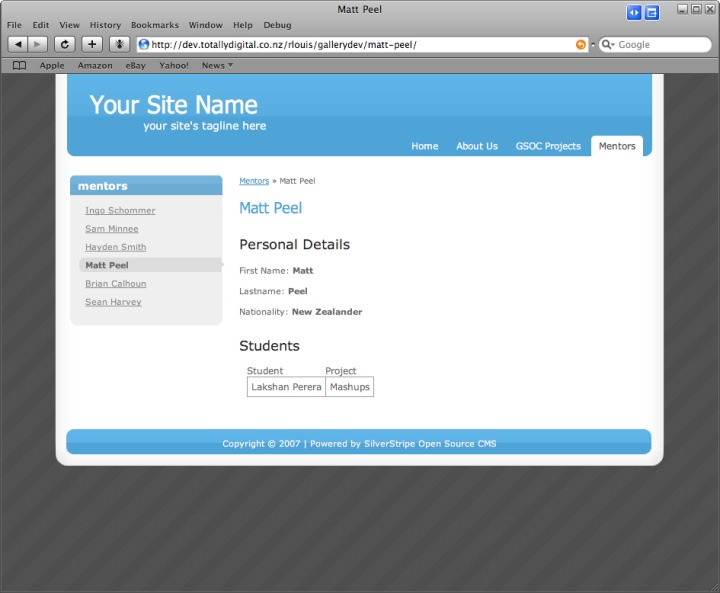

# Tutorial 5 - Dataobject Relationship Management

## Overview

In the [second tutorial](2-extending-a-basic-site) we have learned how to add extrafields to a page type thanks
to the *$db* array and how to add an image using the *$has_one* array and so create a relationship between a table and
the *Image* table by storing the id of the respective *Image* in the first table. This tutorial explores all this
relations between [DataObjects](/topics/datamodel#relations) and the way to manage them easily.

I'm using the default tutorial theme in the following examples so the templates may vary or you may need to change
the template code in this example to fit your theme

## What are we working towards?

To simulate these relations between objects, we are going to simulate the management via the CMS of the **[Google Summer
Of Code 2007](http://www.silverstripe.com/google-summer-of-code-2007-we-are-in/)** that SilverStripe was part of.

To do this, we are gonna use the following objects :

*  Project : Project on SilverStripe system for the GSOC 
*  Student : Student involved in the project
*  Mentor : SilverStripe developer
*  Module : Module used for the project

This is a table which sums up the relations between them :
 | Project             | Student             | Mentor        | Modules          |                           
 | -------             | -------             | ------        | ------------------                           
 | i18n Multi-Language | Bernat Foj Capell   | Ingo Schommer | Cms, Sapphire, i18n, Translation              | 
 | Image Manipulation  | Mateusz Ujma        | Sam Minnee    | Cms, Sapphire, ImageManipulation              | 
 | Google Maps         | Ofir Picazo Navarro | Hayden Smith  | Cms, Sapphire, Maps                           | 
 | Mashups             | Lakshan Perera      | Matt Peel     | Cms, Sapphire, MashUps                        | 
 | Multiple Databases  | Philipp Krenn       | Brian Calhoun | Cms, Sapphire, MultipleDatabases              | 
 | Reporting           | Quin Hoxie          | Sam Minnee    | Cms, Sapphire, Reporting                      | 
 | Security & OpenID   | Markus Lanthaler    | Hayden Smith  | Cms, Sapphire, auth_openid                    | 
 | SEO                 | Will Scott          | Brian Calhoun | Cms, Sapphire, googleadwords, googleanalytics | 
 | Usability           | Elijah Lofgren      | Sean Harvey   | Cms, Sapphire, UsabilityElijah                | 
 | Safari 3 Support    | Meg Risen           | Sean Harvey   | Cms, Sapphire, UsabilityMeg                   | 

## GSOC Projects

Before starting the relations management, we need to create a *ProjectsHolder* class where we will save the GSOC Project
pages.

*tutorial/code/ProjectsHolder.php*

	:::php
	<?php
	
	class ProjectsHolder extends Page {
	
		static $allowed_children = array( 'Project' );
	
	}
	
	class ProjectsHolder_Controller extends Page_Controller {
	
	}

## Project - Student relation

**A project can only be done by one student.**

**A student has only one project.**

This relation is called a **1-to-1** relation.

The first step is to create the student and project objects.

*tutorial/code/Student.php*

	:::php
	<?php
	
	class Student extends DataObject {
	
		static $db = array(
			'FirstName' => 'Text',
			'Lastname' => 'Text',
			'Nationality' => 'Text'
		);
	
		function getCMSFields_forPopup() {
			$fields = new FieldSet();
			
			$fields->push( new TextField( 'FirstName', 'First Name' ) );
			$fields->push( new TextField( 'Lastname' ) );
			$fields->push( new TextField( 'Nationality' ) );
			
			return $fields;
		}
	
	}

*tutorial/code/Project.php*

	:::php
	<?php
	
	class Project extends Page {
	
		static $has_one = array(
			'MyStudent' => 'Student'
		);
	
	}
	class Project_Controller extends Page_Controller {}

This code will create a relationship between the *Project* table and the *Student* table by storing the id of the
respective *Student* in the *Project* table.

The second step is to add the table in the method *getCMSFields* which will allow you to manage the *has_one* relation.

	:::php
	class Project extends Page {
	
		...
	
		function getCMSFields() {
			$fields = parent::getCMSFields();
			
			$tablefield = new HasOneComplexTableField(
				$this,
				'MyStudent',
				'Student',
				array(
					'FirstName' => 'First Name',
					'Lastname' => 'Family Name',
					'Nationality' => 'Nationality'
				),
				'getCMSFields_forPopup'
			);
			$tablefield->setParentClass('Project');
			
			$fields->addFieldToTab( 'Root.Content.Student', $tablefield );
			
			return $fields;
		}
	
	}

Let’s walk through the parameters of the *HasOneComplexTableField* constructor.

1.  **$this** : The first object concerned by the relation
2.  **'MyStudent'** : The name of the second object of the relation
3.  **'Student'** : The type of the second object of the relation
4.  **array(...)** : The fields of the second object which will be in the table
5.  **'getCMSFields_forPopup'** : The method which will be called to add, edit or only show a second object

You can also directly replace the last parameter by this code :

	:::php
	   new FieldSet(
	      new TextField( 'FirstName', 'First Name' ),
	      new TextField( 'Lastname' ),
	      new TextField( 'Nationality' )
	   );

	Don't forget to rebuild the database using *dev/build?flush=1* before you 
	proceed to the next part of this tutorial.

Now that we have created our *Project* page type and *Student* data object, let’s add some content.

Go into the CMS and create one *Project* page for each project listed [above](#what-are-we-working-towards) under a 
*ProjectsHolder* page named **GSOC Projects** for instance.

As you can see in the tab panel *Student*, the adding functionality is titled *Add Student*. However, if you want to
modify this title, you have to add this code in the *getCMSFields* method of the *Project* class :

	:::php
	$tablefield->setAddTitle( 'A Student' );

Select now one of the *Project* page that you have created, go in the tab panel *Student* and add all the students
listed [above](#what-are-we-working-towards) by clicking on the link **Add A Student** of your 
*HasOneComplexTableField* table.

After having added all the students, you will see that, in the tab panel *Student* of all the *Project* pages, the
*HasOneComplexTableField* tables have the same content.

For each *Project* page, you can now affect **one and only one** student to it ( see the
[list](#What_are_we_working_towards?) ).

You will also notice, that you have the possibility to **unselect** a student which will make your *Project* page
without any student affected to it.

**At the moment, the *HasOneComplexTableField* table doesn't manage totally the *1-to-1* relation because you can easily
select the same student for two ( or more ) differents *Project* pages which corresponds to a *1-to-many* relation.**

To use your *HasOneComplexTableField* table for a **1-to-1** relation, make this modification in the class *Project* :

	:::php
	class Project extends Page {
	
		...
	
		function getCMSFields() {
		
			...
			
			$tablefield->setParentClass('Project');
			
			$tablefield->setOneToOne();
			
			$fields->addFieldToTab( 'Root.Content.Student', $tablefield );
			
			return $fields;
		}
	
	}

Now, you will notice that by checking a student in a *Project* page, you will be unable to select him again in any other
*Project* page which is the definition of a **1-to-1** relation.

## Student - Mentor relation

**A student has one mentor.**

**A mentor has several students.**

This relation is called a **1-to-many** relation.

The first step is to create the mentor object and set the relation with the *Student* data object.

*tutorial/code/Mentor.php*

	:::php
	<?php
	
	class Mentor extends Page {
	
		static $db = array(
			'FirstName' => 'Text',
			'Lastname' => 'Text',
			'Nationality' => 'Text'
		);
		
		static $has_many = array(
			'Students' => 'Student'
		);
		
		function getCMSFields() {
			$fields = parent::getCMSFields();
			
			$fields->addFieldToTab( 'Root.Content.Main', new TextField( 'FirstName' ) );
			$fields->addFieldToTab( 'Root.Content.Main', new TextField( 'Lastname' ) );
			$fields->addFieldToTab( 'Root.Content.Main', new TextField( 'Nationality' ) );
		
			return $fields;
		}
	
	}
	class Mentor_Controller extends Page_Controller {}

*tutorial/code/Student.php*

	:::php
	class Student extends DataObject {
	
		...
	
		static $has_one = array(
			'MyMentor' => 'Mentor'
		);
	
	}

This code will create a relationship between the *Student* table and the *Mentor* table by storing the id of the
respective *Mentor* in the *Student* table.

The second step is to add the table in the method *getCMSFields* which will allow you to manage the *has_many* relation.

*tutorial/code/Mentor.php*

	:::php
	class Mentor extends Page {
	
		...
	
		function getCMSFields() {
			$fields = parent::getCMSFields();
		
			...
		
			$tablefield = new HasManyComplexTableField(
				$this,
				'Students',
				'Student',
				array(
					'FirstName' => 'FirstName',
					'Lastname' => 'Family Name',
					'Nationality' => 'Nationality'
				),
				'getCMSFields_forPopup'
			);
			$tablefield->setAddTitle( 'A Student' );
		
			$fields->addFieldToTab( 'Root.Content.Students', $tablefield );
		
			return $fields;
		}
	
	}
	class Mentor_Controller extends Page_Controller {}

To know more about the parameters of the *HasManyComplexTableField* constructor, [check](#project_-_student_relation)
those of the *HasOneComplexTableField* constructor.

	Don't forget to rebuild the database using *dev/build?flush=1* before you 
	proceed to the next part of this tutorial.

Now that we have created our *Mentor* page type, go into the CMS and create one *Mentor* page for each mentor listed
[above](#what-are-we-working-towards) under a simple *Page* named
**Mentors** for instance.

For each *Mentor* page, you can now affect **many** students created previously ( see the
[list](#What_are_we_working_towards?) ) by going in the tab panel *Students*.

You will also notice, that by checking a student in a *Mentor* page, you will be unable to select him again in any other
*Mentor* page which is the definition of a **1-to-many** relation.

As the *HasOneComplexTableField* table, you also have the possibility not to select any student which will make your
*Mentor* page without any student affected to it.

## Project - Module relation

**A project uses several modules.**

**A module is used by several projects.**

This relation is called a **many-to-many** relation.

The first step is to create the module object and set the relation with the *Project* page type.

*tutorial/code/Module.php*

	:::php
	<?php
	
	class Module extends DataObject {
	
	   static $db = array(
	      'Name' => 'Text'
	   );
	
	   static $belongs_many_many = array(
	      'Projects' => 'Project'
	   );
	
	   function getCMSFields_forPopup() {
	      $fields = new FieldSet();
	      $fields->push( new TextField( 'Name' ) );
	      return $fields;
	   }
	
	}

*tutorial/code/Project.php*

	:::php
	class Project extends Page {
	
	   ...
	
	   static $many_many = array(
	      'Modules' => 'Module'
	   );
	
	}

This code will create a relationship between the *Project* table and the *Module* table by storing the ids of the
respective *Project* and *Module* in a another table named **Project_Modules**.

The second step is to add the table in the method *getCMSFields* which will allow you to manage the *many_many*
relation.

	:::php
	class Project extends Page {
	
	   ...
	
	   function getCMSFields() {
	      $fields = parent::getCMSFields();
	
	      ...
	
	      $modulesTablefield = new ManyManyComplexTableField(
	         $this,
	         'Modules',
	         'Module',
	         array(
		    'Name' => 'Name'
	         ),
	         'getCMSFields_forPopup'
	      );
	      $modulesTablefield->setAddTitle( 'A Module' );
	
	      $fields->addFieldToTab( 'Root.Content.Modules', $modulesTablefield );
	
	      return $fields;
	   }
	
	}

To know more about the parameters of the *ManyManyComplexTableField* constructor,
[check](#project_-_student_relation) those of the *HasOneComplexTableField*
constructor.

	Don't forget to rebuild the database using *dev/build?flush=1* before you 
	proceed to the next part of this tutorial.

Select now one of the *Project* page, go in the tab panel *Modules* and add all the modules listed
[above](#what-are-we-working-towards) by clicking on the link **Add A
Module** of your *ManyManyComplexTableField* table.

For each *Project* page, you can now affect **many** modules created previously ( see the
[list](#What_are_we_working_towards?) ) by going in the tab panel
*Modules*.

You will also notice, that you are able to select several times a *Module* on different *Project* pages which is the
definition of a **many-to-many** relation.

As the *HasOneComplexTableField* and *HasManyComplexTableField* table, you also have the possibility not to select any
module which will make your *Project* page without any module affected to it.

## Displaying the data on your website

Now that we have created all the *Page* and *DataObject* classes necessary and the relational tables to
manage the [relations](../topics/datamodel#relations) between them, we would like to see these relations on the website.

We will see in this section how to display all these relations but also how to create a template for a *DataObject*.

For every kind of *Page* or *DataObject*, you can access to their relations thanks to the **control** loop.

**1. GSOC Projects**

Let's start with the *ProjectsHolder* page created before. For this template, we are will display the same table than
[above](#what-are-we-working-towards).

*tutorial/templates/Layout/ProjectsHolder.ss*

	:::ss
	<% include Menu2 %>

	

		<% if Level(2) %>
	        <% include BreadCrumbs %>
	    <% end_if %>

		$Content

		<table>
	        <thead>
	            <tr>
	                <th>Project</th>
	                <th>Student</th>
	                <th>Mentor</th>
	                <th>Modules</th>
	            </tr>
	        </thead>
	        <tbody>
	            <% control Children %>
	                <tr>
	                    <td>$Title</td>
	                    <td>
	                        <% if MyStudent %>
	                            <% control MyStudent %>
	                                $FirstName $Lastname
	                            <% end_control %>
	                        <% else %>
	                            No Student
	                        <% end_if %>
	                    </td>
	                    <td>
	                        <% if MyStudent %>
	                            <% control MyStudent %>
	                                <% if MyMentor %>
	                                    <% control MyMentor %>
	                                        $FirstName $Lastname
	                                    <% end_control %>
	                                <% else %>
	                                    No Mentor
	                                <% end_if %>
	                            <% end_control %>
	                        <% else %>
	                            No Mentor
	                        <% end_if %>
	                    </td>
	                    <td>
	                        <% if Modules %>
	                            <% control Modules %>
	                                $Name &nbsp;
	                            <% end_control %>
	                        <% else %>
	                            No Modules
	                        <% end_if %>
	                    </td>
	                </tr>
	            <% end_control %>
	        </tbody>
	    </table>

		$Form

	

	If you are using the blackcandy template: You might want to move the `<% include Sidebar %>`
	(tutorial/templates/Includes/SideBar.ss) include in the *tutorial/templates/Layout/Page.ss* template above
	the typography div to get rid of the bullets

**2. Project**

We know now how to easily access and show [relations](../topics/datamodel#relations) between *DataObject* in a template.

We can now do the same for every *Project* page by creating its own template.

*tutorial/templates/Layout/Project.ss*

	:::ss
	<% include Menu2 %>

	

		<% if Level(2) %>
	        <% include BreadCrumbs %>
	    <% end_if %>

		$Content

		<% if MyStudent %>
	        <% control MyStudent %>
	            
First Name: <strong>$FirstName</strong>

	            
Lastname: <strong>$Lastname</strong>

	            
Nationality: <strong>$Nationality</strong>

	            <h3>Mentor</h3>

	            <% if MyMentor %>
	                <% control MyMentor %>
	                    
First Name: <strong>$FirstName</strong>

	                    
Lastname: <strong>$Lastname</strong>

	                    
Nationality: <strong>$Nationality</strong>

	                <% end_control %>
	            <% else %>
	                
This student doesn't have any mentor.

	            <% end_if %>
	        <% end_control %>
	    <% else %>
	        
There is no any student working on this project.

	    <% end_if %>

	    <h3>Modules</h3>

	    <% if Modules %>
	        <ul>
	            <% control Modules %>
	                <li>$Name</li>
	            <% end_control %>
	        </ul>
	    <% else %>
	        
This project has not used any modules.

	    <% end_if %>

		$Form

	

What we would like now is to create a special template for the *DataObject* *Student* and the *Page* *Mentor* which will
be used when we will call directly the variable in the *Project* template. In our case, we will use the same template
because these two classes have the same fields ( FirstName, Surname and Nationality ).

*tutorial/templates/Includes/GSOCPerson.ss*

	:::ss
	
First Name: <strong>$FirstName</strong>

	
Lastname: <strong>$Lastname</strong>

	
Nationality: <strong>$Nationality</strong>

Now the template is created, we need to establish the link between the *Student* and *Mentor* classes with their common
template.

To do so, add this code in the two classes.  This will create a control on each of those objects which can be called 
from templates either within a control block or dot notation.

*tutorial/code/Student.php, tutorial/code/Mentor.php*

	:::php
	function PersonalInfo() {
		$template = 'GSOCPerson';
		return $this->renderWith( $template );
	}

We can now modify the *Project.ss* template.

	:::ss
	
	...
	
	<% if MyStudent %>
		$MyStudent.PersonalInfo
	
		<h3>Mentor</h3>
		
		<% control MyStudent %>
			<% if MyMentor %>
				$MyMentor.PersonalInfo
			<% else %>
				
This student doesn't have any mentor.

			<% end_if %>
		<% end_control %>
	<% else %>
		
There is no any student working on this project.

	<% end_if %>
	
	...

	Remember to add `?flush=1` to the url when refreshing the project page or otherwise you will get a template error

In the *Project* template, it has been really easy to display the **1-to-1** relation with a *Student* object just by
calling the variable **$MyStudent**. This has been made possible thanks to the code below present in the *Project*
class.

	:::php
	static $has_one = array(
	    'MyStudent' => 'Student'
	);

However, in the *Student* class, there is no any code relating to the **1-to-1** relation with a *Project* *Page*. So
how to access it from a *Student* *DataObject* ?

**3. Mentor**

In this template, we are gonna try to access the *Project* details from a *Student* *DataObject*.

What we want to do is to access to the *Project* page in the same way than we have done for the other relations
**without modifying the relations between *Page* and *DataObject* and the database structure**.

To do so, we have to create a function in the *Student* class which will return the *Project* linked with it. Let's call
it *MyProject* for instance.

	:::php
	class Student extends DataObject {
	
		...
	
		function MyProject() {
			return DataObject::get( 'Project', "`MyStudentID` = '{$this->ID}'" );
		}
	
	}

We can now use this value in the same way that we have used the other relations.
That's how we can use this function in the *Mentor* template.

*tutorial/templates/Layout/Mentor.ss*

	:::ss
	<% include Menu2 %>

	

		<% include Breadcrumbs %>
		$Content

	    <h3>Personal Details</h3>

	    
First Name: <strong>$FirstName</strong>

	    
Lastname: <strong>$Lastname</strong>

	    
Nationality: <strong>$Nationality</strong>

	    <h3>Students</h3>

	    <% if Students %>
	        <table>
	            <thead>
	                <tr>
	                    <th>Student</th>
	                    <th>Project</th>
	                </tr>
	            </thead>
	            <tbody>
	                <% control Students %>
	                    <tr>
	                        <td>$FirstName $Lastname</td>
	                        <td>
	                            <% if MyProject %>
	                                <% control MyProject %>
	                                    $Title
	                                <% end_control %>
	                            <% else %>
	                                No Project
	                            <% end_if %>
	                        </td>
	                    </tr>
	                <% end_control %>
	            </tbody>
	        </table>
	    <% else %>
	        
There is no any student working with this mentor.

	    <% end_if %>

	    $Form
	

## Summary

This tutorial has demonstrated how easy it is to manage all the type of relations between *DataObject* objects in the
CMS and how to display them on the website.

## Download the code

Download all the [code](_images/tutorial5-completecode.zip) for this tutorial.

You can also download the [code](_images/tutorial5-completecode-blackcandy.zip) for use in the blackcandy template.