# Tutorial 2 - Extending a basic site

## Overview

In the [first tutorial](1-building-a-basic-site) we learned how to create a basic site using SilverStripe. This
tutorial builds on what you have learned in [the first tutorial](1-building-a-basic-site), so it is recommended
that you complete it first. 

In this tutorial you will explore extending SilverStripe by creating your own page types. In doing this you will get a
good overview of how SilverStripe works.

## What are we working towards?

Throughout this tutorial we are going to work on adding two new sections to the site we built in the first tutorial. The
first is a news section, with a recent news listing on the homepage and an RSS feed. The second is a staff section,
which demonstrates more complex database structures by associating an image with each staff member.

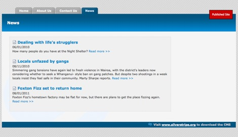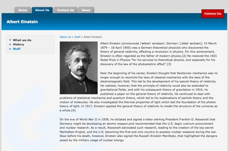

## The SilverStripe data model

A large part of designing complex SilverStripe sites is the creation of your own page types. Before we progress any
further, it is important to understand what a page type is, and how the SilverStripe data model works.

SilverStripe is based on the **"Model-View-Controller"** design pattern. This means that SilverStripe attempts to separate
data, logic and presentation as much as possible. Every page has three separate parts which are combined to give you the
final page. Lets look at each one individually:

### Model

All content on your site is stored in a database. There is a table in the database corresponding for every class that is
a child of the `[api:DataObject]` class. Every object of that class corresponds to a row in that table -
this is your "data object", the **"model"** of Model-View-Controller. A page type has a data object that represents all the data for your page - rather than inheriting 
directly from data object it inherits from `[api:SiteTree]`.  We generally create a "Page" data object, and subclass this for 
the rest of the page types. This allows us to define behavior that is consistent across all pages in our site.

### View

The **"view"** is the presentation of your site. As we have already seen, the templates SilverStripe uses to render a page
is dependent on the page type. Using both your templates and css, you are able to have full control over the
presentation of your site.

### Controller

A page type also has a **"controller"**. A controller contains all the code used to manipulate your data before it is
rendered. For example, suppose you were making an auction site, and you only wanted to display the auctions closing in
the next ten minutes. You would implement this in the controller. The controller for a page should inherit from
`[api:ContentController]`. Just as we create a "Page" data object and subclass it for the rest of the
site, we also create a "Page_Controller" that is subclassed.

Creating a new page type simply requires creating these three things. You can then have full control over presentation,
the database, which fields can be edited in the CMS, and can use code to make our pages do much more clever things. 

A more in-depth introduction of Model-View-Controller can be found
[here](http://www.slash7.com/articles/2005/02/22/mvc-the-most-vexing-conundrum).

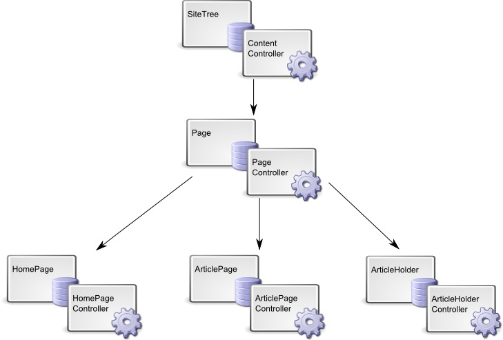

## Creating the news section page types

Let's make our news section. We'll need two new page types for this. The first one is obvious: we need an *ArticlePage*
page type. The second is a little less obvious: we need an *ArticleHolder* page type that contains our articles.

We'll start with the *ArticlePage* page type. First we create the model, a class called "ArticlePage". We put the
*ArticlePage* class into a file called "ArticlePage.php" inside *mysite/code*. We also put the controller,
*ArticlePage_Controller*, in here. Any other classes that are related to *ArticlePage* – for example, the class
*ArticlePage_AnythingElse* - will also go into "ArticlePage.php".

**mysite/code/ArticlePage.php**

	:::php
	<?php
	/**
	 * Defines the ArticlePage page type
	 */
	class ArticlePage extends Page {
		static $db = array(
		);
		static $has_one = array(
		);
	}
	
	class ArticlePage_Controller extends Page_Controller {
		
	}
	 
	?>

Here we've created our data object/controller pair, but we haven't actually extended them at all. Don't worry about the
*$db* and *$has_one* arrays just yet, we'll explain them soon, as well as other ways in which you can extend your page
types. SilverStripe will use the template for the *Page* page type as explained in the first tutorial, so we don't need
to specifically create the view for this page type.

Let's create the *ArticleHolder* page type.

**mysite/code/ArticleHolder.php**

	:::php
	<?php
	/**
	 * Defines the ArticleHolder page type
	 */
	class ArticleHolder extends Page {
		static $db = array(
		);
		static $has_one = array(
		);
	   
		static $allowed_children = array('ArticlePage');
	}
	 
	class ArticleHolder_Controller extends Page_Controller {
		
	}
	 
	?>

Here we have done something interesting: the *$allowed_children* field. This is one of a number of static fields we can
define to change the properties of a page type. The *$allowed_children* field is an array of page types that are allowed
to be children of the page in the site tree. As we only want news articles in the news section, we only want
*ArticlePage* pages for children. We can enforce this in the CMS by setting the *$allowed_children* field.

We will be introducing other fields like this as we progress; there is a full list in the documentation for
`[api:SiteTree]`.

Now that we have created our page types, we need to let SilverStripe rebuild the database. If we rebuild the database by 
going to [http://localhost/dev/build?flush=1](http://localhost/dev/build?flush=1), SilverStripe will detect that there are two
new page types and add them to the list of page types in the database.

> It is SilverStripe convention to suffix general page types with "Page", and page types that hold other page types with
> "Holder". This is to ensure that we don't have URLs with the same name as a page type; if we named our *ArticleHolder*
> page type "News", it would conflict with the page name also called "News".

## Adding date and author fields

Now that we have an *ArticlePage* page type, let's make it a little more useful. Remember the *$db* array? We can use
this array to add extra fields to the database. It would be nice to know when each article was posted, and who posted
it. Change the *$db* array in the *ArticlePage* class so it looks like this:

	:::php
	<?php
	class ArticlePage extends Page {
		static $db = array(
			'Date' => 'Date',
			'Author' => 'Text'
		);
	
		// .....
	}

Every entry in the array is a key-value pair. The key is the name of the field, and the value is the type. We have a
`[api:Date]` for a complete list of different data types.

> Note: The names chosen for the fields you add must not already be used. Be careful using field names such as Title,
> Content etc. as these may already be defined in the page types your new page is extending from.

If we rebuild the database, we will see that now the *ArticlePage* table is created. Even though we had an *ArticlePage*
page type before, the table was not created because we had no fields that were unique to the article page type. We now
have the extra fields in the database, but still no way of changing them. To add these fields to the CMS we have to
override the *getCMSFields()* method, which is called by the CMS when it creates the form to edit a page. Add the
method to the *ArticlePage* class.

	:::php
	<?php
	class ArticlePage extends Page {
		// ...
		
		function getCMSFields() {
			$fields = parent::getCMSFields();
			
			$fields->addFieldToTab('Root.Content.Main', new DateField('Date'), 'Content');
			$fields->addFieldToTab('Root.Content.Main', new TextField('Author'), 'Content');
			
			return $fields;
		}
	}
	
	// ...

Let's walk through this method.

	:::php
	$fields = parent::getCMSFields();

Firstly, we get the fields from the parent class; we want to add fields, not replace them. The *$fields* variable
returned is a `[api:FieldSet]` object.

	:::php
	$fields->addFieldToTab('Root.Content.Main', new DateField('Date'), 'Content');
	$fields->addFieldToTab('Root.Content.Main', new TextField('Author'), 'Content');

We can then add our new fields with *addFieldToTab*. The first argument is the tab on which we want to add the field to:
"Root.Content.Main" is the tab which the content editor is on. The second argument is the field to add; this is not a
database field, but a `[api:FormField]` documentation for more details.

	:::php
	return $fields;

Finally, we return the fields to the CMS. If we flush the cache (by adding ?flush=1 at the end of the URL), we will be able
to edit the fields in the CMS.

Now that we have created our page types, let's add some content. Go into the CMS and create an *ArticleHolder* page
named "News", and create some *ArticlePage*s inside it.

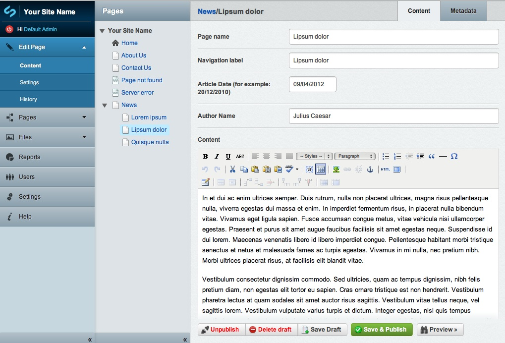

##  Modifing the date field

**Please note:** As of version 2.4, the DateField type no longer automatically adds a javascript datepicker. Your date field will look just like a text field. 
This makes it confusing and doesn't give the user much help when adding a date. 

To make the date field a bit more user friendly, you can add a dropdown calendar, set the date format and add better title.

	:::php
	<?php
	
	class ArticlePage extends Page {
	
	// .....
	
	function getCMSFields() {
		$fields = parent::getCMSFields();
		
		$fields->addFieldToTab('Root.Content.Main', $dateField = new DateField('Date','Article Date (for example: 20/12/2010)'), 'Content');
		$dateField->setConfig('showcalendar', true);
		$dateField->setConfig('dateformat', 'dd/MM/YYYY');
		
		$fields->addFieldToTab('Root.Content.Main', new TextField('Author','Author Name'), 'Content');
		
		return $fields;
	}

Let's walk through these changes.

	:::php
	$fields->addFieldToTab('Root.Content.Main', $dateField = new DateField('Date','Article Date (for example: 20/12/2010)'), 'Content');

*$dateField* is added only to the DateField in order to change the configuration.

	:::php
	$dateField->setConfig('showCalendar', true);

Set *showCalendar* to true to have a calendar appear underneath the Date field when you click on the field. 

	:::php
	$dateField->setConfig('dateformat', 'dd/MM/YYYY');

*dateFormat* allows you to specify how you wish the date to be entered and displayed in the CMS field.

	:::php
	$fields->addFieldToTab('Root.Content.Main', new TextField('Author','Author Name'), 'Content');

By default the first argument *'Date'* or *'Author'* is shown as the title, however this might not be that helpful so to change the title,
add the new title as the second argument. See the `[api:DateField]` documentation for more details.

##  Creating the templates

We can already look at the content of news pages on our site, because the article holder page and the article pages
inherit their templates from Page. But we're not getting the author and date fields displayed in either case.

So let's create a template for each of our new page types. We'll put these in *themes/tutorial/templates/Layout* so we
only have to define the page specific parts: SilverStripe will use *themes/tutorial/templates/Page.ss* for the basic
page layout.

First, the template for displaying a single article:

**themes/tutorial/templates/Layout/ArticlePage.ss**

	:::ss
	<% if Menu(2) %>
		<ul id="Menu2">
			<% control Menu(2) %>
				<li class="$LinkingMode"><a href="$Link" title="Go to the $Title page">$MenuTitle</a></li>
			<% end_control %>
		</ul>
	<% end_if %>
	
	

		<% if Level(2) %>
			

				$Breadcrumbs
			

		<% end_if %>
				
		<h1>$Title</h1>
		$Content
		

			Posted on $Date.Nice by $Author
		

	

The first block of code is our regular second level menu; we also have our regular breadcrumbs code here. We will see
how to remove these blocks of repetitive code in a bit.

We use *$Date* and *$Author* to access the new fields. In fact, all template variables and page controls come from
either the data object or the controller for the page being displayed. The *$Breadcrumbs* variable comes from the
*Breadcrumbs()* method of the `[api:SiteTree]` class. *$Date* and *$Author* come from the *Article* table through
your data object. *$Content* comes from the *SiteTree* table through the same data object. The data for your page is
spread across several tables in the database matched by id - e.g. *Content* is in the *SiteTree* table, and *Date* and
*Author* are in the *Article* table. SilverStripe matches these records by their ids and collates them into the single
data object.

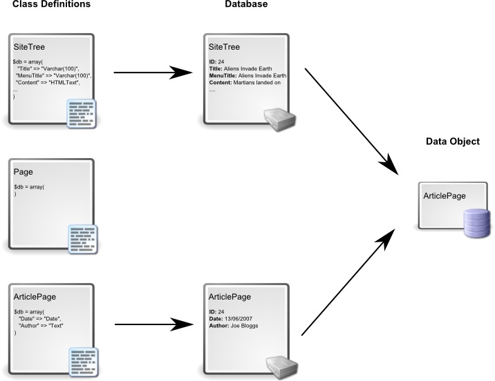

Rather than using *$Date* directly, we use *$Date.Nice*. If we look in the `[api:Date]` documentation, we can see
that the *Nice* function returns the date in *dd/mm/yyyy* format, rather than the *yyyy-mm-dd* format stored in the
database.

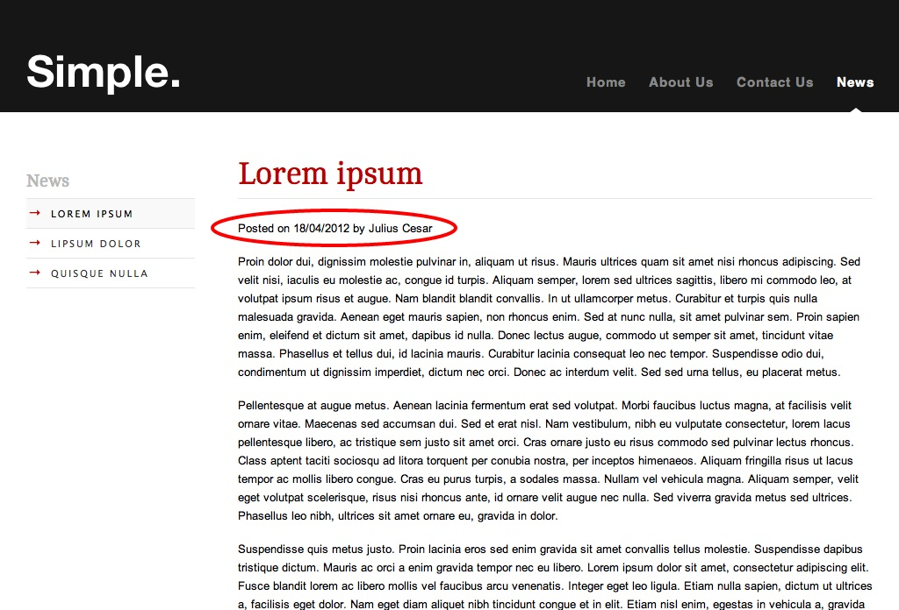

Now we'll create a template for the article holder: we want our news section to show a list of news items, each with a
summary.

**themes/tutorial/templates/Layout/ArticleHolder.ss**

	:::ss
	
		
		$Content
		<ul id="NewsList">
			<% control Children %>
				<li class="newsDateTitle"><a href="$Link" title="Read more on &quot;{$Title}&quot;">$Title</a></li>
				<li class="newsDateTitle">$Date.Nice</li>
				<li class="newsSummary">$Content.FirstParagraph <a href="$Link" title="Read more on &quot;{$Title}&quot;">Read more &gt;&gt;</a></li>
			<% end_control %>
		</ul>
	

Here we use the page control *Children*. As the name suggests, this control allows you to iterate over the children of a
page, which in this case is our news articles. The *$Link* variable will give the address of the article which we can
use to create a link, and the *FirstParagraph* function of the `[api:HTMLText]` field gives us a nice summary of the
article.

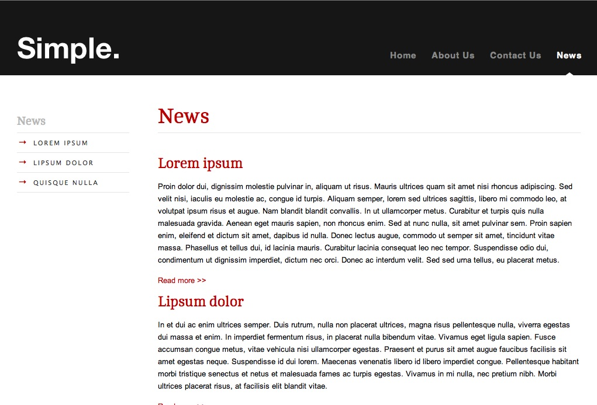

Remember that the visual styles are not part of the CMS, they are defined in the tutorial CSS file.

### Using include files in templates

The second level menu is something we want in most, but not all, pages so we can't put it in the base template. By
putting it in a separate file in the *tutorial/templates/Includes* folder, we can use `<% include templatename %>` to
include it in our other templates. Separate the second level menu into a new file *themes/tutorial/templates/Includes/Menu2.ss*.

**themes/tutorial/templates/Includes/Menu2.ss**

	:::ss
	<% if Menu(2) %>
		<ul id="Menu2">
			<% control Menu(2) %>
				<li class="$LinkingMode"><a href="$Link" title="Go to the $Title page">$MenuTitle</a></li>
			<% end_control %>
		</ul>
	<% end_if %>

And then replace the second level menu with `<% include Menu2 %>` in *Page.ss* and *ArticlePage.ss* like so:

**themes/tutorial/templates/Layout/Page.ss**, **themes/tutorial/templates/Layout/ArticlePage.ss**

	:::ss
	<% include Menu2 %>
	 
	

	...

Do the same with the breadcrumbs:

**themes/tutorial/templates/Includes/Breadcrumbs.ss**

	:::ss
	<% if Level(2) %>
	

		$Breadcrumbs
	

	<% end_if %>

**themes/tutorial/templates/Layout/Page.ss**, **themes/tutorial/templates/Layout/ArticlePage.ss**

	:::ss
	...
	

		<% include Breadcrumbs %>
	...

You can make your templates more modular and easier to maintain by separating commonly-used pieces into include files.

### Changing the icons of pages in the CMS

Let's now make a purely cosmetic change that nevertheless helps to make the information presented in the CMS clearer.
Add the following field to the *ArticleHolder* and *ArticlePage* classes:

	:::php
	static $icon = "themes/tutorial/images/treeicons/news";

And this one to the *HomePage* class:

	:::php
	static $icon = "themes/tutorial/images/treeicons/home";

This will change the icons for the pages in the CMS.  

> Note: that the corresponding filename to the path given for $icon will end with **-file.gif**, 
> e.g. when you specify **news** above, the filename will be **news-file.gif**.

### Allowing comments on news articles

A handy feature built into SilverStripe is the ability for guests to your site to leave comments on pages. We can turn
this on for an article simply by ticking the box in the behaviour tab of a page in the CMS. Enable this for all your
*ArticlePage*s.

We then need to include *$PageComments* in our template, which will insert the comment form as well as all comments left
on the page.

**themes/tutorial/templates/Layout/ArticlePage.ss**

	:::html
	...
	

		Posted on $Date.Nice by $Author
	

	$PageComments
	...

You should also prepare the *Page* template in the same manner, so comments can be enabled at a later point on any page.

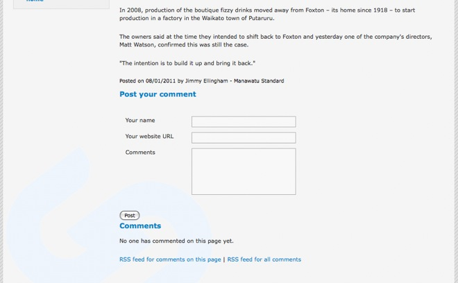

It would be nice to have comments on for all articles by default. We can do this with the *$defaults* array. Add this to
the *ArticlePage* class:

	:::php
	static $defaults = array(
		'ProvideComments' => true
	);

You can set defaults for any of the fields in your data object. *ProvideComments* is defined in *SiteTree*, so it is
part of our *ArticlePage* data object.

## Showing the latest news on the homepage

It would be nice to greet page visitors with a summary of the latest news when they visit the homepage. This requires a
little more code though - the news articles are not direct children of the homepage, so we can't use the *Children*
control. We can get the data for the news articles by implementing our own function in *HomePage_Controller*.

**mysite/code/HomePage.php**

	:::php
	...
	function LatestNews($num=5) {
		$news = DataObject::get_one("ArticleHolder");
		return ($news) ? DataObject::get("ArticlePage", "ParentID = $news->ID", "Date DESC", "", $num) : false;
	}
	...

This function simply runs a database query that gets the latest news articles from the database. By default, this is
five, but you can change it by passing a number to the function. See the `[api:DataObject]` documentation for
details. We can reference this function as a page control in our *HomePage* template:

**themes/tutorial/templates/Layout/Homepage.ss**

	:::ss
	...
	$Content
	<ul id="NewsList">
		<% control LatestNews %>
			<li class="newsDateTitle"><a href="$Link" title="Read more on &quot;{$Title}&quot;">$Title</a></li>
			<li class="newsDateTitle">$Date.Nice</li>
			<li class="newsSummary">$Content.FirstParagraph<a href="$Link" title="Read more on &quot;{$Title}&quot;">Read more &gt;&gt;</a></li>
		<% end_control %>
	</ul>
	...

When SilverStripe comes across a variable or page control it doesn't recognize, it first passes control to the
controller. If the controller doesn't have a function for the variable or page control, it then passes control to the
data object. If it has no matching functions, it then searches its database fields. Failing that it will return nothing.

The controller for a page is only created when page is actually visited, while the data object is available when the
page is referenced in other pages, e.g. by page controls. A good rule of thumb is to put all functions specific to the
page currently being viewed in the controller; only if a function needs to be used in another page should you put it in
the data object.

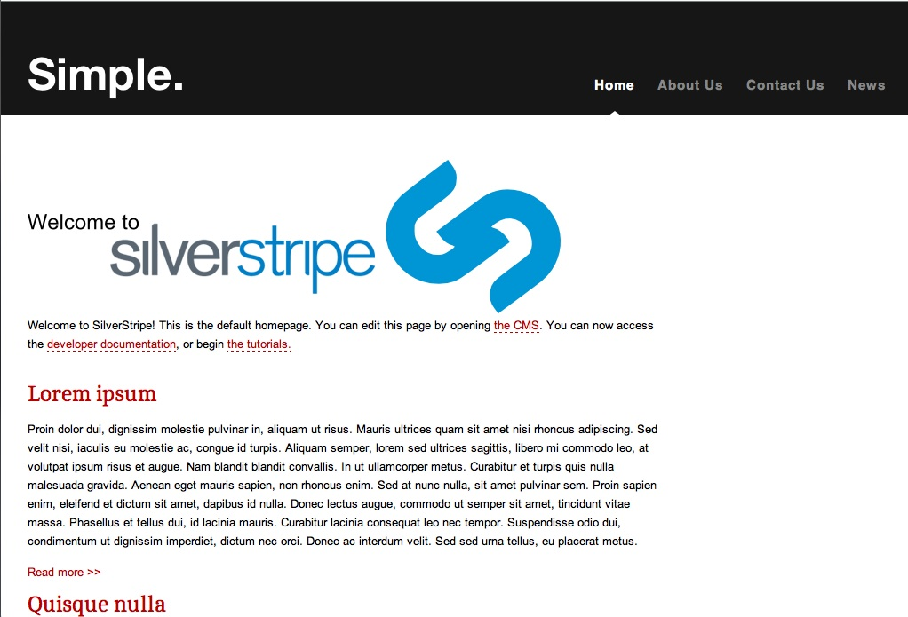

## Creating a RSS feed

An RSS feed is something that no news section should be without. SilverStripe makes it easy to create RSS feeds by
providing an `[api:RSSFeed]` class to do all the hard work for you. Create the following function in the
*ArticleHolder_Controller*:

	:::php
	function rss() {
		$rss = new RSSFeed($this->Children(), $this->Link(), "The coolest news around");
		$rss->outputToBrowser();
	}

This function simply creates an RSS feed of all the news articles, and outputs it to the browser. If you go to
[http://localhost/news/rss](http://localhost/news/rss) you will see our RSS feed. What happens here is that
when there is more to a URL after the page's base URL - "rss" in this case - SilverStripe will call the function with
that name on the controller if it exists.

Depending on your browser, you should see something like the picture below. If your browser doesn't support RSS, you
will most likely see the XML output instead.

Now all we need is to let the user know that our RSS feed exists. The `[api:RSSFeed]` in your controller, it will be
called when the page is requested. Add this function to *ArticleHolder_Controller*:

	:::php
	function init() {
		RSSFeed::linkToFeed($this->Link() . "rss");	
		parent::init();
	}

This automatically generates a link-tag in the header of our template. The *init* function is then called on the parent
class to ensure any initialization the parent would have done if we hadn't overridden the *init* function is still
called. In Firefox you can see the RSS feed link in the address bar:

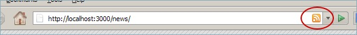

## Adding a staff section

Now that we have a complete news section, let's move on to the staff section. We need to create *StaffHolder* and
*StaffPage* page types, for an overview on all staff members and a detail-view for a single member. First let's start
with the *StaffHolder* page type.

**mysite/code/StaffHolder.php**

	:::php
	<?php
	
	class StaffHolder extends Page {
		static $db = array(
		);
		static $has_one = array(
		);
		
		static $allowed_children = array('StaffPage');
	}
	
	class StaffHolder_Controller extends Page_Controller {
		
	}

Nothing here should be new. The *StaffPage* page type is more interesting though. Each staff member has a portrait
image. We want to make a permanent connection between this image and the specific *StaffPage* (otherwise we could simply
insert an image in the *$Content* field).

**mysite/code/StaffPage.php**

	:::php
	<?php
	
	class StaffPage extends Page {
		static $db = array(
		);
		static $has_one = array(
			'Photo' => 'Image'
		);
		
		function getCMSFields() {
			$fields = parent::getCMSFields();
			
			$fields->addFieldToTab("Root.Content.Images", new ImageField('Photo'));
			
			return $fields;
		}
	}
	
	class StaffPage_Controller extends Page_Controller {
		
	}

Instead of adding our *Image* as a field in *$db*, we have used the *$has_one* array. This is because an *Image* is not
a simple database field like all the fields we have seen so far, but has its own database table. By using the *$has_one*
array, we create a relationship between the *StaffPage* table and the *Image* table by storing the id of the respective
*Image* in the *StaffPage* table.

We then add an *ImageField* in the *getCMSFields* function to the tab "Root.Content.Images". Since this tab doesn't exist,
the *addFieldToTab* function will create it for us. The *ImageField* allows us to select an image or upload a new one in
the CMS.

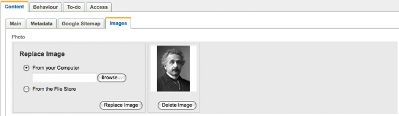

Rebuild the database ([http://localhost/dev/build?flush=1](http://localhost/dev/build?flush=1)) and open the CMS. Create
a new *StaffHolder* called "Staff" in the "About Us" section, and create some *StaffPage*s in it.

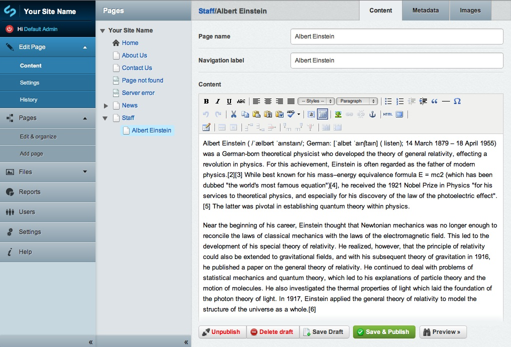

### Creating the staff section templates

The staff section templates aren't too difficult to create, thanks to the utility methods provided by the `[api:Image]` class.

**themes/tutorial/templates/Layout/StaffHolder.ss**

	:::ss
	<% include Menu2 %>
	
	

		<% include Breadcrumbs %>
		$Content
		
		<ul id="StaffList">
			<% control Children %>
			<li>
				
<a href="$Link">$Title</a>

				
$Photo.SetWidth(50)

				

$Content.FirstSentence

			</li>
			<% end_control %>
		</ul>
	

This template is very similar to the *ArticleHolder* template. The *SetWidth* method of the `[api:Image]` class
will resize the image before sending it to the browser. The resized image is cached, so the server doesn't have to
resize the image every time the page is viewed.

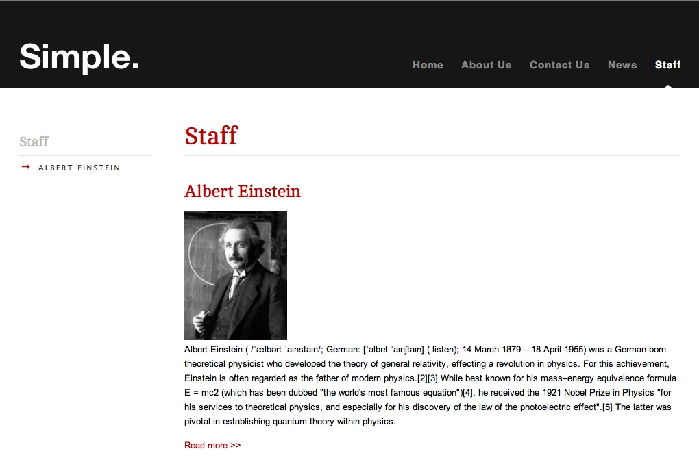

The *StaffPage* template is also very straight forward.

**themes/tutorial/templates/Layout/StaffPage.ss**

	:::ss
	<% include Menu2 %>
	
	

		<% include Breadcrumbs %>
		
		

			$Photo.SetWidth(150)
		

		
		$Content
	

Here we also use the *SetWidth* function to get a different sized image from the same source image. You should now have
a complete staff section.

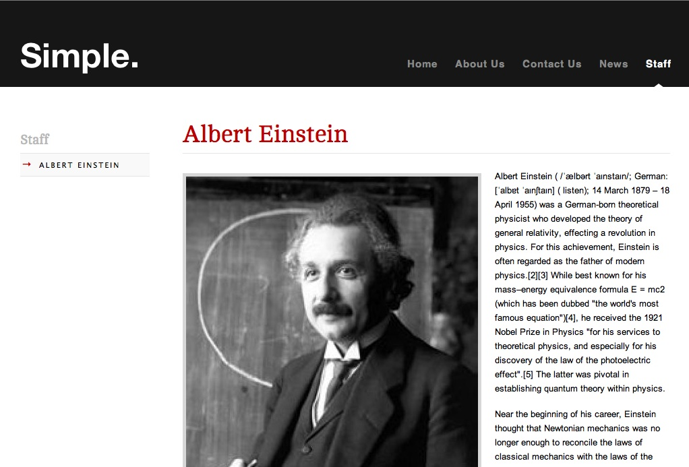

## Summary

In this tutorial we have explored the concept of page types. In the process of creating and extending page types you
have been introduced to many of the concepts required to build a site with SilverStripe.

[Next Tutorial >>](3-forms)
