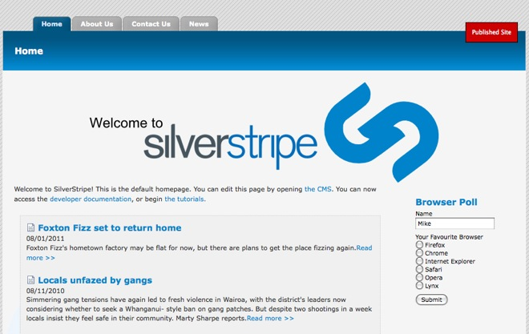
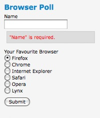
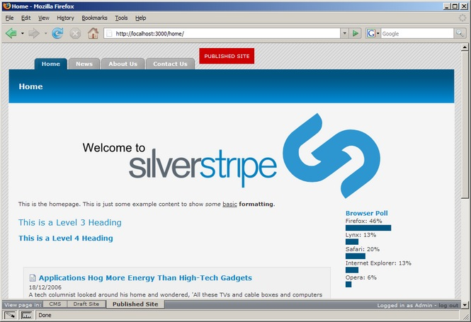

# Tutorial 3 - Forms

## Overview

This tutorial is intended to be a continuation of the first two tutorials, and will build on the site produced in those
two tutorials.

This tutorial explores forms in SilverStripe. It will look at coded forms. Forms which need to be written in PHP.

Another method which allows you to construct forms via the CMS is by using the [userforms module](http://silverstripe.org/user-forms-module). 
A UserDefinedForm is much quicker to implement, but lacks the flexibility of a coded form. 

## What are we working towards?

We will create a poll on the home page that asks the user their favourite web browser, and displays a bar graph of the
results.

## Creating the form

We will be creating a form for a poll on the home page.

The poll will ask the user's name and favourite web browser, and then collate the results into a bar graph. We create
the form in a method on *HomePage_Controller*.

*mysite/code/HomePage.php*

	:::php
	class HomePage_Controller extends Page_Controller {
		static $allowed_actions = array('BrowserPollForm');

		// ...
	
		function BrowserPollForm() {
			// Create fields
			$fields = new FieldSet(
				new TextField('Name'),
				new OptionsetField('Browser', 'Your Favourite Browser', array(
					'Firefox' => 'Firefox',
					'Chrome' => 'Chrome',
					'Internet Explorer' => 'Internet Explorer',
					'Safari' => 'Safari',
					'Opera' => 'Opera',
					'Lynx' => 'Lynx'
				))
			);
			
			// Create actions
			$actions = new FieldSet(
				new FormAction('doBrowserPoll', 'Submit')
			);
		
			return new Form($this, 'BrowserPollForm', $fields, $actions);
		}
	
	   ...
	}
	
	...

Let's step through this code.

	:::php
	// Create fields
		$fields = new FieldSet(
			new TextField('Name'),
			new OptionsetField('Browser', 'Your Favourite Browser', array(
				'Firefox' => 'Firefox',
				'Chrome' => 'Chrome',
				'Internet Explorer' => 'Internet Explorer',
				'Safari' => 'Safari',
				'Opera' => 'Opera',
				'Lynx' => 'Lynx'
			))
		);

First we create our form fields.

We do this by creating a `[api:FieldSet]` and passing our fields as arguments. The first field is a new
`[api:TextField]` with the name 'Name'.

There is a second argument when creating a field which specifies the text on the label of the field. If no second
argument is passed, as in this case, it is assumed the label is the same as the name of the field.

The second field we create is an `[api:OptionsetField]`. This is a dropdown, and takes a third argument - an
array mapping the values to the options listed in the dropdown.

	:::php
	$actions = new FieldSet(
		new FormAction('doBrowserPoll', 'Submit')
	);

After creating the fields, we create the form actions. Form actions appear as buttons at the bottom of the form.

The first argument is the name of the function to call when the button is pressed, and the second is the label of the
button.

Here we create a 'Submit' button which calls the 'doBrowserPoll' method, which we will create later.

All the form actions (in this case only one) are collected into a `[api:FieldSet]` object the same way we did with
the fields.

	:::php
	return new Form($this, 'BrowserPollForm', $fields, $actions);

Finally we create the `[api:Form]` object and return it.

The first argument is the controller that contains the form, in most cases '$this'. The second is the name of the method
that returns the form, which is 'BrowserPollForm' in our case. The third and fourth arguments are the
FieldSets containing the fields and form actions respectively.

After creating the form function, we need to add the form to our home page template.

Add the following code to the home page template, just before the Content `
`:

*themes/tutorial/templates/Layout/HomePage.ss*

	:::ss
	...
	

		<h2>Browser Poll</h2>
		$BrowserPollForm
	

	

	...

Add the following code to the form style sheet:

*themes/tutorial/css/form.css*

	:::css
	/* BROWSER POLL */
	#BrowserPoll {
		float: right;
		margin: 20px 10px 0 0;
		width: 20%;
	}
		form fieldset {
			border:0;
		}
		#BrowserPoll .message {
			display: block;
			color:red;
			background:#ddd;
			border:1px solid #ccc;
			padding:5px;
			margin:5px;
		}
		#BrowserPoll h2 {
			font-size: 1.5em;
			color: #0083C8;
		}
		#BrowserPoll .field {
			padding:3px 0;
		}
		#BrowserPoll .Actions {
			padding:5px 0;
		}
		#BrowserPoll .bar {
			background-color: #015581;
		}

This CSS code will ensure that the form is formatted and positioned correctly. All going according to plan, if you visit
[http://localhost/home?flush=1](http://localhost/home?flush=1) it should look something like below.

## Processing the form

Great! We now have a browser poll form, but it doesn't actually do anything. In order to make the form work, we have to
implement the 'doBrowserPoll' method that we told it about.

First, we need some way of saving the poll submissions to the database, so we can retrieve the results later. We can do
this by creating a new object that extends from `[api:DataObject]`.

If you recall, in tutorial two we said that all objects that inherit from DataObject and that add fields are stored in
the database. Also recall that all pages extend DataObject indirectly through `[api:SiteTree]`. Here instead of
extending SiteTree (or `[api:Page]`) to create a page type, we extend DataObject directly.

*mysite/code/BrowserPollSubmission.php*

	:::php
	<?php	
	class BrowserPollSubmission extends DataObject {
		static $db = array(
			'Name' => 'Text',
			'Browser' => 'Text'
		);
	}

If we then rebuild the database ([http://localhost/db/build?flush=1](http://localhost/db/build?flush=1)), we will see
that the *BrowserPollSubmission* table is created. Now we just need to define 'doBrowserPoll' on *HomePage_Controller*.

*mysite/code/HomePage.php*

	:::php	
	class HomePage_Controller extends Page_Controller {
		// ...
		function doBrowserPoll($data, $form) {
			$submission = new BrowserPollSubmission();
			$form->saveInto($submission);
			$submission->write();
			Director::redirectBack();
		}
	}

A function that processes a form submission takes two arguments - the first is the data in the form, the second is the
`[api:Form]` object.

In our function we create a new *BrowserPollSubmission* object. Since the name of our form fields and the name of the
database fields are the same we can save the form directly into the data object.

We call the 'write' method to write our data to the database, and 'Director::redirectBack()' will redirect the user back
to the home page.

## Form validation

SilverStripe forms all have automatic validation on fields where it is logical. For example, all email fields check that
they contain a valid email address. You can write your own validation by subclassing the *Validator* class.

SilverStripe provides the *RequiredFields* validator, which ensures that the fields specified are filled in before the
form is submitted. To use it we create a new *RequiredFields* object with the name of the fields we wish to be required
as the arguments, then pass this as a fifth argument to the Form constructor.

Change the end of the 'BrowserPollForm' function so it looks like this:

** mysite/code/HomePage.php **

	:::php
	function BrowserPollForm() {
		...
	
		// Create validator
		$validator = new RequiredFields('Name', 'Browser');
		
		return new Form($this, 'BrowserPollForm', $fields, $actions, $validator);
	}

If we then open the homepage and attempt to submit the form without filling in the required fields an error will be
shown.

## Showing the poll results

Now that we have a working form, we need some way of showing the results.

The first thing to do is make it so a user can only vote once per session. If the user hasn't voted, show the form,
otherwise show the results.

We can do this using a session variable. The `[api:Session]` class handles all session variables in SilverStripe.
First modify the 'doBrowserPoll' to set the session variable 'BrowserPollVoted' when a user votes.

*mysite/code/HomePage.php*

	:::php
	...
	
	HomePage_Controller extends Page_Controller {
		...
		
		function doBrowserPoll($data, $form) {
			$submission = new BrowserPollSubmission();
			$form->saveInto($submission);
			$submission->write();
			
			Session::set('BrowserPollVoted', true);
			
			Director::redirectBack();
		}
		
		...
	}

Then we simply need to check if the session variable has been set in 'BrowserPollForm()', and to not return the form if
it is.

	:::php
	function BrowserPollForm() {
		if(Session::get('BrowserPollVoted')) {
			return false;
		}
		
		...

If you visit the home page now you will see you can only vote once per session; after that the form won't be shown. You
can start a new session by closing and reopening your browser (or if you're using Firefox and have installed the [Web
Developer](http://chrispederick.com/work/web-developer/) extension, you can use its Clear Session Cookies command).

Although the form is not shown, you'll still see the 'Browser Poll' heading. We'll leave this for now: after we've built
the bar graph of the results, we'll modify the template to show the graph instead of the form if the user has already
voted.

We now need some way of getting the data from the database into the template.

In the second tutorial we got the latest news articles for the home page by using the 'DataObject::get' function. We
can't use the 'DataObject::get' function here directly as we wish to count the total number of votes for each browser.
By looking at the documentation for 'DataObject::get', we can see that it returns a `[api:DataObjectSet]`
object. In fact, all data that can be iterated over in a template with a page control is contained in a DataObjectSet.

A `[api:DataObjectSet]` is a set of not just DataObjects, but of ViewableData, which the majority of
SilverStripe's classes (including DataObject) inherit from. We can create a DataObjectSet, fill it with our data, and
then create our graph using a page control in the template. Create the function 'BrowserPollResults' on the
*HomePage_Controller* class.

** mysite/code/HomePage.php **

	:::php
	function BrowserPollResults() {
		$submissions = DataObject::get('BrowserPollSubmission');
		$total = $submissions->Count();
		
		$doSet = new DataObjectSet();
		foreach($submissions->groupBy('Browser') as $browser => $data) {
			$percentage = (int) ($data->Count() / $total * 100);
			$record = array(
				'Browser' => $browser,
				'Percentage' => $percentage
			);
			$doSet->push(new ArrayData($record));
		}
		
		return $doSet;
	}

This introduces a few new concepts, so let's step through it.

	:::php
	$submissions = DataObject::get('BrowserPollSubmission');

First we get all of the *BrowserPollSubmission*s from the database. This returns the submissions as a
DataObjectSet, which contains the submissions as *BrowserPollSubmission* objects.

	:::php
	$total = $submissions->Count();

We get the total number of submissions, which is needed to calculate the percentages.

	:::php
	$doSet = new DataObjectSet();
	foreach($submissions->groupBy('Browser') as $browser => $data) {
		$percentage = (int) ($data->Count() / $total * 100);
		$record = array(
			'Browser' => $browser,
			'Percentage' => $percentage
		);
		$doSet->push(new ArrayData($record));
	}

Now we create an empty DataObjectSet to hold our data and then iterate over the 'Browser' submissions field. The 'groupBy' 
method of DataObjectSet splits our DataObjectSet by the 'Browser' field passed to it. The percentage of submissions for each 
browser is calculated using the size of the DataObjectSet. It puts these new DataObjectSets into an array indexed 
by the value of the field. The `[api:ArrayData]` class wraps an array into a ViewableData object, so we finally create a new 
ArrayData object, which we can add to our *$doSet* DataObjectSet of results.

	:::php
	return $doSet;

After we have iterated through all the browsers, the DataObjectSet contains all the results, which is then
returned.

The final step is to create the template to display our data. Change the 'BrowserPoll' div in
*themes/tutorial/templates/Layout/HomePage.ss* to the below.

	:::ss
	

		<h2>Browser Poll</h2>
		<% if BrowserPollForm %>
			$BrowserPollForm
		<% else %>
		<ul>
			<% control BrowserPollResults %>
			<li>
				
$Browser: $Percentage%

				
&nbsp;

			</li>
			<% end_control %>
		</ul>
		<% end_if %>
	

Here we first check if the *BrowserPollForm* is returned, and if it is display it. Otherwise the user has already voted,
and the poll results need to be displayed.

We use the normal tactic of putting the data into an unordered list and using CSS to style it, except here we use inline
styles to display a bar that is sized proportionate to the number of votes the browser has received. You should now have
a complete poll.

## Summary

In this tutorial we have explored forms, and seen the different approaches to creating and using forms. Whether you
decide to use the [userforms module](http://silverstripe.org/user-forms-module) or create a form in PHP depends on the situation and flexibility
required.

[Next Tutorial >>](4-site-search)
